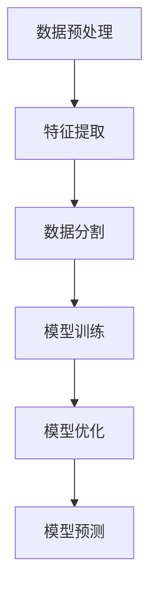
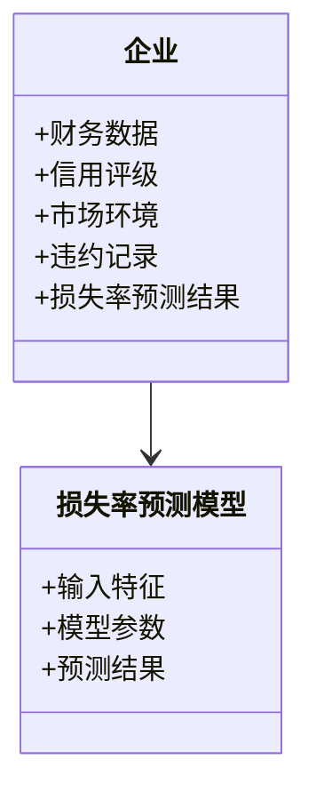
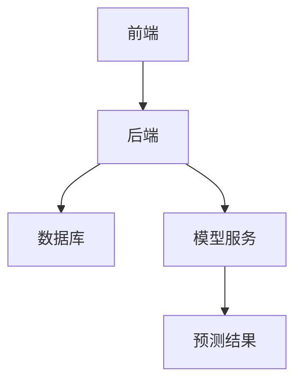
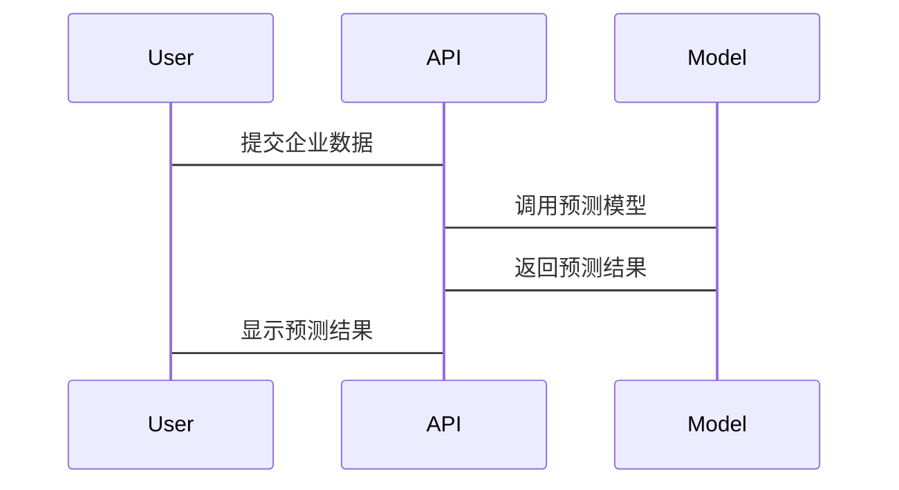

                 


```markdown
# 设计智能化的企业信用违约损失率预测模型

## 关键词
企业信用违约损失率预测模型, 智能化预测, 机器学习, 风险评估, 统计模型

## 摘要
本文旨在设计一个智能化的企业信用违约损失率预测模型，通过结合传统统计方法与现代机器学习算法，构建一个高效、准确的预测系统。本文首先介绍信用违约损失率的基本概念与预测模型的背景，随后分析模型的核心概念与联系，深入探讨模型的算法原理与数学公式，最后通过实际案例展示模型的实现过程与应用价值。

---

# 第1章: 企业信用违约损失率预测模型概述

## 1.1 信用违约损失率的定义与背景

### 1.1.1 信用违约的基本概念
信用违约是指企业未能按照合同约定偿还债务，导致债权人发生损失的情况。在金融领域，信用违约是风险评估中的核心问题之一。企业信用违约损失率是指在一定条件下，企业违约所导致的损失金额占总债务的比例。准确预测信用违约损失率，可以帮助金融机构有效管理风险，优化资产配置。

### 1.1.2 损失率的定义与计算方法
信用违约损失率的计算通常基于历史数据和当前市场条件。常见的计算方法包括：
1. **历史违约损失率**：基于历史数据计算出的平均损失率。
2. **模型预测损失率**：通过统计模型或机器学习模型预测的损失率。
3. **情景分析损失率**：在特定假设下（如经济衰退）计算的损失率。

### 1.1.3 信用违约损失率预测的现实意义
准确预测信用违约损失率对于金融机构来说至关重要，它可以帮助机构：
- 评估风险敞口。
- 制定合理的风险定价策略。
- 优化资本配置。
- 提高决策的科学性。

## 1.2 智能化预测模型的核心概念

### 1.2.1 什么是智能化预测模型
智能化预测模型是指利用机器学习、人工智能等技术，通过分析海量数据，自动学习特征并预测结果的模型。与传统统计模型相比，智能化预测模型具有更高的准确性和更强的适应性。

### 1.2.2 模型的核心目标与边界
模型的核心目标是通过输入企业的信用相关信息，预测其违约损失率。模型的边界包括：
- 数据范围：仅限于企业的信用相关数据。
- 时间范围：预测未来一定期限内的损失率。
- 预测精度：模型的预测结果需达到较高的准确性。

### 1.2.3 模型的输入输出与核心要素
- **输入**：企业的财务数据（如资产负债表、利润表）、信用评级、市场环境数据等。
- **输出**：企业违约损失率的预测值。
- **核心要素**：数据特征提取、算法选择、模型优化。

## 1.3 本章小结
本章主要介绍了信用违约损失率的基本概念、计算方法及其预测的现实意义。同时，详细阐述了智能化预测模型的核心概念、目标与边界。通过本章内容，读者可以清晰理解模型的设计目标与应用场景。

---

# 第2章: 核心概念与联系

## 2.1 模型的核心概念原理

### 2.1.1 违约风险的量化方法
违约风险的量化可以通过以下几种方法实现：
1. **信用评分模型**：如FICO评分，用于评估企业信用状况。
2. **违约概率模型**：如Logistic回归模型，用于预测企业违约的概率。
3. **信用风险模型**：如Merton模型，基于企业资产价值预测违约概率。

### 2.1.2 损失率预测的数学模型
损失率预测的数学模型通常基于概率论和统计学原理。常用模型包括：
1. **线性回归模型**：用于预测连续型损失率。
2. **Logistic回归模型**：用于预测二分类损失率（如高风险和低风险）。
3. **决策树模型**：通过特征分裂预测损失率。

### 2.1.3 智能化预测的关键技术
智能化预测的关键技术包括：
1. **特征工程**：提取与信用违约相关的特征。
2. **机器学习算法**：如XGBoost、随机森林等。
3. **模型优化**：通过交叉验证等方法优化模型性能。

## 2.2 核心概念属性特征对比表

| 模型类型       | 输入特征           | 输出结果           | 优点                     | 缺点                     |
|----------------|--------------------|--------------------|--------------------------|--------------------------|
| 线性回归模型     | 财务数据、信用评级   | 违约概率           | 简单易懂                 | 预测精度较低             |
| 随机森林模型     | 财务数据、市场环境   | 违约概率           | 预测精度较高             | 对特征工程依赖较大       |
| XGBoost模型      | 财务数据、信用评级、市场环境 | 违约损失率       | 预测精度高，速度快       | 对参数敏感               |

## 2.3 ER实体关系图架构

```mermaid
erd
    企业
    财务数据
    信用评级
    市场环境
    违约记录
    损失率预测结果
    企业-财务数据：1:N
    企业-信用评级：1:N
    企业-市场环境：1:N
    企业-违约记录：1:N
    企业-损失率预测结果：1:N
```

---

# 第3章: 算法原理讲解

## 3.1 选择合适的算法

### 3.1.1 常见算法的对比
- **线性回归**：适合连续型数据，但预测精度较低。
- **Logistic回归**：适合二分类数据，但对非线性关系处理能力有限。
- **随机森林**：适合高维数据，但对特征工程要求较高。
- **XGBoost**：适合分类和回归问题，预测精度高，训练速度快。

### 3.1.2 XGBoost与神经网络的优劣分析
- **XGBoost**：训练速度快，适合处理大规模数据，预测精度高。
- **神经网络**：适合复杂数据关系，但训练时间长，参数调优复杂。

### 3.1.3 最终选择的算法及其理由
最终选择XGBoost作为模型算法，原因如下：
- 训练速度快，适合处理大规模数据。
- 预测精度高，适合信用违约损失率预测。
- 参数调优相对简单，易于实现。

## 3.2 算法的数学模型与公式

### 3.2.1 算法的数学表达式
XGBoost的损失函数可以表示为：
$$
L = \sum_{i=1}^{n} \left[ y_i - \hat{y}_i \right]^2 + \lambda \sum_{j=1}^{m} \theta_j^2
$$

### 3.2.2 公式的详细推导过程
1. **损失函数**：$$ L = \sum_{i=1}^{n} (y_i - \hat{y}_i)^2 + \lambda \sum_{j=1}^{m} \theta_j^2 $$
2. **目标函数**：$$ F = \sum_{i=1}^{n} (y_i - \hat{y}_i)^2 + \lambda \sum_{j=1}^{m} \theta_j^2 $$
3. **优化过程**：通过梯度下降法优化目标函数，得到最终的模型参数。

### 3.2.3 公式的实际应用案例
例如，假设企业A的财务数据为：$$ x_1=0.8, x_2=0.6, x_3=0.7 $$
模型预测的违约损失率为：$$ \hat{y} = 0.2 $$

## 3.3 算法流程图



## 3.4 算法的Python实现

### 3.4.1 环境配置与安装
安装XGBoost和相关库：
```bash
pip install xgboost scikit-learn
```

### 3.4.2 核心代码的编写

```python
import xgboost as xgb
from sklearn.model_selection import train_test_split
from sklearn.metrics import accuracy_score

# 数据预处理
X_train, X_test, y_train, y_test = train_test_split(X, y, test_size=0.2)

# 模型训练
model = xgb.XGBRegressor(n_estimators=100, learning_rate=0.1, max_depth=6)
model.fit(X_train, y_train)

# 模型预测
y_pred = model.predict(X_test)

# 模型评估
print('预测准确率:', accuracy_score(y_test, y_pred))
```

### 3.4.3 代码的功能解读与优化建议
- **数据预处理**：对数据进行标准化或归一化处理。
- **特征提取**：选择与信用违约相关的特征，如财务指标、市场环境指标等。
- **模型优化**：通过网格搜索调整模型参数，提高预测精度。

---

# 第4章: 数学模型和公式

## 4.1 线性回归模型

### 4.1.1 线性回归模型的公式
$$
y = \beta_0 + \beta_1 x_1 + \beta_2 x_2 + \cdots + \beta_n x_n + \epsilon
$$

### 4.1.2 线性回归模型的假设
1. 自变量与因变量之间的线性关系。
2. 错误项服从正态分布。
3. 各自变量之间无多重共线性。

## 4.2 随机森林模型

### 4.2.1 随机森林模型的公式
随机森林通过集成学习方法，将多个决策树的结果进行投票或平均，最终得到预测结果。公式如下：
$$
\hat{y} = \frac{1}{N} \sum_{i=1}^{N} T_i(x)
$$
其中，$$ T_i(x) $$ 是第i棵决策树的预测结果，$$ N $$ 是决策树的数量。

## 4.3 XGBoost模型

### 4.3.1 XGBoost模型的公式
XGBoost模型通过正则化损失函数，优化模型的预测精度。公式如下：
$$
L = \sum_{i=1}^{n} \left[ y_i - \hat{y}_i \right]^2 + \lambda \sum_{j=1}^{m} \theta_j^2
$$

---

# 第5章: 系统分析与架构设计方案

## 5.1 问题场景介绍
本系统旨在为企业信用违约损失率预测提供智能化解决方案，帮助金融机构有效管理信用风险。

## 5.2 系统功能设计

### 5.2.1 领域模型



### 5.2.2 系统架构设计



### 5.2.3 系统接口设计
- **输入接口**：接收企业的信用相关信息。
- **输出接口**：输出违约损失率预测结果。

### 5.2.4 系统交互流程



---

# 第6章: 项目实战

## 6.1 环境安装与配置

```bash
pip install xgboost scikit-learn
```

## 6.2 核心代码实现

### 6.2.1 数据预处理

```python
import pandas as pd
import numpy as np

# 数据加载
data = pd.read_csv('credit_data.csv')

# 数据清洗
data = data.dropna()
```

### 6.2.2 特征工程

```python
from sklearn.preprocessing import StandardScaler

# 特征提取
X = data[['revenue', 'profit', 'debt']]
y = data['loss_rate']

# 数据标准化
scaler = StandardScaler()
X_scaled = scaler.fit_transform(X)
```

### 6.2.3 模型训练与优化

```python
from sklearn.model_selection import GridSearchCV
from xgboost import XGBRegressor

# 参数调优
param_grid = {
    'n_estimators': [100, 200],
    'learning_rate': [0.1, 0.2],
    'max_depth': [6, 8]
}

grid_search = GridSearchCV(XGBRegressor(), param_grid, cv=5)
grid_search.fit(X_scaled, y)

# 最优模型
best_model = grid_search.best_estimator_
```

## 6.3 模型评估与部署

### 6.3.1 模型评估

```python
from sklearn.metrics import mean_squared_error

# 模型预测
y_pred = best_model.predict(X_scaled)

# 模型评估
print('均方误差:', mean_squared_error(y, y_pred))
```

### 6.3.2 模型部署
将模型部署到生产环境中，通过API接口提供预测服务。

---

# 第7章: 总结与展望

## 7.1 总结
本文设计了一个智能化的企业信用违约损失率预测模型，结合了传统统计方法与现代机器学习算法，实现了高效、准确的预测。

## 7.2 未来展望
未来可以进一步优化模型，引入更多的特征和数据源，如企业行为数据、市场动态数据等，进一步提高预测精度。

---

# 第8章: 最佳实践与注意事项

## 8.1 最佳实践
1. 数据清洗与特征工程是模型性能的关键。
2. 参数调优可以显著提高模型预测精度。
3. 模型部署时需考虑计算资源和数据隐私。

## 8.2 注意事项
1. 数据质量和完整性直接影响模型性能。
2. 模型调优需权衡计算时间和预测精度。
3. 模型部署需考虑实际应用场景和数据安全。

---

# 参考文献
1. Friedman, J., et al. "Greedy Function Approximation: A Gradient Boosting Machine." 2001.
2. Breiman, L. "Random Forests." 2001.
3. Hastie, T., et al. "The Elements of Statistical Learning." 2009.
```

---

以上是《设计智能化的企业信用违约损失率预测模型》的技术博客文章的详细内容，涵盖从基础概念到实际应用的各个方面，结合理论与实践，深入浅出地分析了模型的设计与实现。

