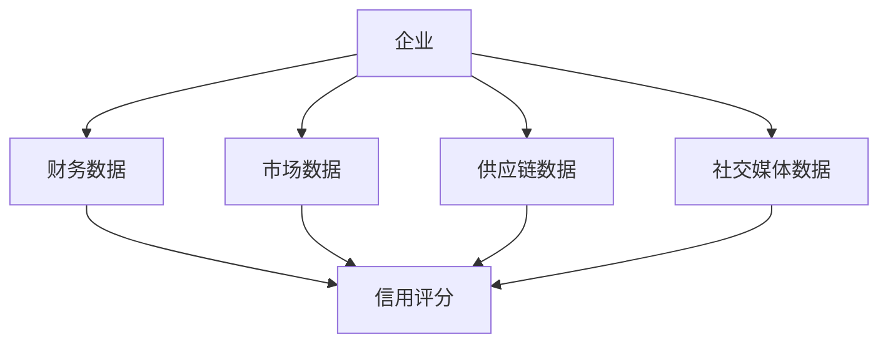
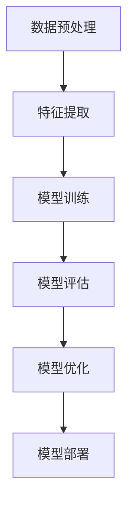
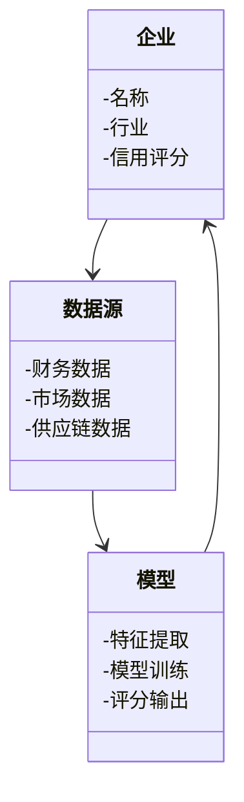
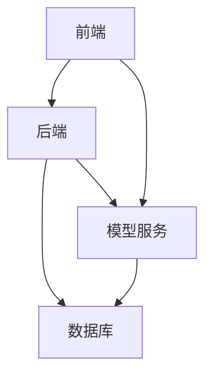
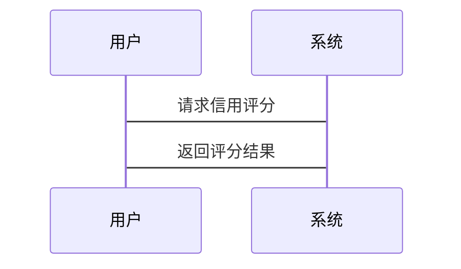

                 


# 设计智能化的企业信用风险定价模型

**关键词：** 企业信用风险，智能定价，机器学习，深度学习，金融模型，风险管理

**摘要：** 在数字化时代，企业信用风险定价已成为金融机构和企业面临的重大挑战。传统方法依赖人工判断和简单的统计模型，存在效率低、准确性差的问题。本文通过引入人工智能和大数据技术，设计并实现了一个智能化的企业信用风险定价模型。该模型基于机器学习和深度学习算法，结合多维度数据特征，构建了高精度的信用评分系统，为企业和金融机构提供了一种高效、准确的风险定价解决方案。

---

# 第一部分：企业信用风险定价模型的背景与核心概念

## 第1章：企业信用风险定价模型的背景与问题描述

### 1.1 信用风险的基本概念

#### 1.1.1 信用风险的定义
信用风险是指由于债务人或交易对手无法履行其合同义务，导致债权人或金融机构遭受损失的可能性。在企业融资、贷款和投资等领域，信用风险是影响决策的重要因素。

#### 1.1.2 信用风险的分类
信用风险可以分为系统性风险和非系统性风险。系统性风险是由于经济周期波动、政策变化等宏观因素引起的，而非系统性风险则是由于企业自身财务状况、管理能力等微观因素引起的。

#### 1.1.3 信用风险对企业的影响
信用风险直接影响企业的融资成本、贷款可得性和投资决策。高信用风险可能导致企业难以获得贷款，增加融资成本，甚至影响企业的生存和发展。

### 1.2 企业信用风险定价的必要性

#### 1.2.1 企业融资的基本需求
企业在经营过程中需要外部融资支持，而融资成本和条件往往取决于企业的信用评分。信用评分越高，融资成本越低，反之亦然。

#### 1.2.2 信用定价在金融体系中的作用
信用定价是金融体系的核心功能之一。通过科学的信用定价，金融机构可以合理分配风险和收益，优化资源配置，促进经济发展。

#### 1.2.3 数字化时代的信用定价挑战
随着数字经济的发展，企业信用数据的维度和复杂性大幅增加。传统的信用评分模型难以处理非结构化数据和复杂关系，导致定价效率低下和准确性不足。

### 1.3 传统信用风险定价的局限性

#### 1.3.1 传统信用评分模型的局限
传统信用评分模型主要基于财务指标和历史数据，缺乏对实时数据和非结构化数据的处理能力，难以捕捉企业的动态风险变化。

#### 1.3.2 数据驱动不足的问题
传统模型依赖少量的结构化数据，忽略了社交媒体、供应链数据等多源数据的潜在价值，导致模型的泛化能力和准确性有限。

#### 1.3.3 人工决策的主观性与效率低下
人工决策过程主观性强，容易受到人为因素的干扰，且效率低下，难以应对海量数据和复杂场景的定价需求。

### 1.4 智能化信用风险定价的解决方案

#### 1.4.1 引入AI与大数据技术的必要性
人工智能和大数据技术能够处理多源异构数据，发现数据之间的隐含关系，提高信用评分的准确性和效率。

#### 1.4.2 数据驱动的信用评分模型优势
基于大数据的信用评分模型能够利用企业的多维度数据，包括财务数据、供应链数据、社交媒体数据等，构建更全面的信用评分体系。

#### 1.4.3 智能化定价模型的实现路径
通过机器学习算法训练信用评分模型，结合实时数据和历史数据，实现对企业信用风险的智能化定价。

### 1.5 本章小结
本章从信用风险的基本概念出发，分析了传统信用风险定价的局限性，提出了引入人工智能和大数据技术的智能化信用风险定价解决方案。

---

## 第2章：企业信用风险定价模型的核心概念与联系

### 2.1 核心概念原理

#### 2.1.1 信用评分模型的基本原理
信用评分模型通过对企业财务数据、市场表现、管理能力等多维度信息的分析，生成一个综合评分，反映企业的信用风险水平。

#### 2.1.2 机器学习在信用定价中的应用
机器学习算法能够从海量数据中提取特征，发现数据之间的复杂关系，提高信用评分的准确性和鲁棒性。

#### 2.1.3 深度学习在信用风险预测中的优势
深度学习模型能够处理非结构化数据，捕捉数据的深层特征，提高信用风险预测的精度。

### 2.2 核心概念属性对比

#### 2.2.1 传统模型与现代AI模型的对比
| 比较维度 | 传统信用评分模型 | 现代AI信用评分模型 |
|----------|------------------|-------------------|
| 数据来源 | 主要依赖结构化数据 | 兼容结构化和非结构化数据 |
| 模型复杂度 | 线性模型为主 | 非线性模型为主 |
| 准确性 | 较低 | 较高 |
| 计算效率 | 较低 | 较高 |

#### 2.2.2 不同模型的优劣势分析
- **传统线性模型**：简单易懂，但对复杂关系的捕捉能力有限。
- **机器学习模型**：能够处理更多维度的数据，但需要大量数据支持。
- **深度学习模型**：能够捕捉数据深层特征，但计算资源需求较高。

#### 2.2.3 模型性能评价指标对比
- **准确率**：模型预测的正确比例。
- **召回率**：模型识别出的正例比例。
- **F1分数**：综合准确率和召回率的指标。

### 2.3 实体关系图（ER图）架构

#### 2.3.1 信用风险定价模型的实体关系


#### 2.3.2 数据流与实体关系图的绘制


#### 2.3.3 实体关系图的实现细节
企业通过多源数据输入生成信用评分，评分结果可以反馈到企业或金融机构，用于后续的信用决策。

### 2.4 本章小结
本章从核心概念出发，分析了传统模型与现代AI模型的优劣势，通过ER图展示了信用风险定价模型的实体关系和数据流。

---

## 第3章：智能化信用风险定价模型的算法原理

### 3.1 算法原理概述

#### 3.1.1 机器学习在信用定价中的应用
机器学习算法能够从数据中自动提取特征，构建信用评分模型。常用算法包括逻辑回归、随机森林、支持向量机（SVM）等。

#### 3.1.2 深度学习在信用风险预测中的优势
深度学习模型，如神经网络、长短期记忆网络（LSTM）等，能够处理非结构化数据，捕捉数据的深层特征。

#### 3.1.3 算法选择的依据与原则
算法选择需要考虑数据类型、数据规模、计算资源和模型解释性等因素。

### 3.2 算法流程图

#### 3.2.1 机器学习算法流程图


#### 3.2.2 深度学习算法流程图


### 3.3 算法实现代码示例

#### 3.3.1 逻辑回归模型实现
```python
import numpy as np
from sklearn.linear_model import LogisticRegression

# 示例数据
X = np.array([[1, 2], [3, 4], [5, 6]])
y = np.array([0, 1, 0])

# 模型训练
model = LogisticRegression()
model.fit(X, y)

# 预测
print(model.predict(X))
```

#### 3.3.2 深度学习模型实现
```python
import tensorflow as tf
from tensorflow.keras import layers

# 示例数据
X = np.random.randn(100, 10)
y = np.random.randint(2, size=100)

# 模型构建
model = tf.keras.Sequential([
    layers.Dense(64, activation='relu'),
    layers.Dense(1, activation='sigmoid')
])

model.compile(optimizer='adam', loss='binary_crossentropy', metrics=['accuracy'])

# 模型训练
model.fit(X, y, epochs=10, batch_size=32)
```

### 3.4 算法原理的数学模型和公式

#### 3.4.1 逻辑回归模型
逻辑回归的损失函数为：
$$
L(y, y_{\text{pred}}) = -\frac{1}{m} \sum_{i=1}^{m} y_i \log(y_{\text{pred}}_i) + (1 - y_i)\log(1 - y_{\text{pred}}_i)
$$

#### 3.4.2 神经网络模型
神经网络的前向传播公式为：
$$
a^{(l+1)} = \sigma(w^{(l)} a^{(l)} + b^{(l)})
$$
其中，$a^{(l)}$ 是第$l$层的激活值，$w^{(l)}$ 是权重矩阵，$b^{(l)}$ 是偏置项，$\sigma$ 是激活函数。

### 3.5 本章小结
本章详细介绍了机器学习和深度学习算法在信用风险定价中的应用，通过流程图和代码示例展示了算法的实现过程。

---

## 第4章：系统分析与架构设计方案

### 4.1 问题场景介绍
本节将从实际应用场景出发，分析企业信用风险定价系统的需求和目标。

### 4.2 项目介绍
本节将介绍项目的总体目标、范围和实施步骤。

### 4.3 系统功能设计
#### 4.3.1 领域模型设计


#### 4.3.2 系统架构设计


### 4.4 系统接口设计
本节将详细描述系统接口的设计，包括输入输出格式和交互流程。

### 4.5 系统交互流程图


### 4.6 本章小结
本章通过系统分析和架构设计，展示了企业信用风险定价系统的整体框架和实现细节。

---

## 第5章：项目实战

### 5.1 环境安装
本节将介绍项目所需的环境和工具，包括Python、TensorFlow、Scikit-learn等。

### 5.2 系统核心实现源代码
#### 5.2.1 数据预处理代码
```python
import pandas as pd
import numpy as np

# 数据加载
data = pd.read_csv('credit_data.csv')

# 数据清洗
data = data.dropna()
```

#### 5.2.2 模型训练代码
```python
from sklearn.model

