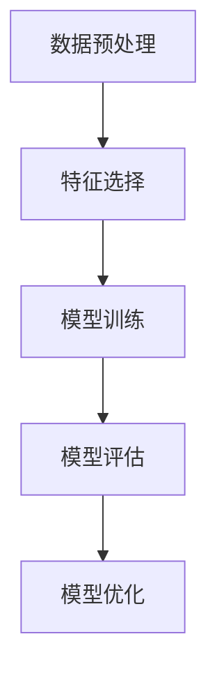

                 


# 设计智能化的企业并购协同效应实现度量与预测模型

## 关键词：企业并购，协同效应，预测模型，机器学习，大数据分析

## 摘要：  
企业并购是企业战略发展的重要手段之一，而协同效应的实现程度是决定并购成功与否的关键因素。然而，协同效应的度量与预测具有复杂性和不确定性，传统方法难以满足智能化需求。本文通过构建智能化的企业并购协同效应实现度量与预测模型，利用大数据分析和机器学习技术，实现协同效应的量化评估和精准预测。文章详细阐述了模型的设计思路、算法原理、系统架构，并通过实际案例展示了模型的应用效果，为企业并购决策提供科学依据。

---

## 第1章: 企业并购协同效应概述

### 1.1 企业并购的基本概念
#### 1.1.1 企业并购的定义  
企业并购是指一家企业通过购买或合并其他企业，以实现资源整合、扩大规模或增强竞争力的行为。并购可以是全资并购、部分并购或股权置换等多种形式。

#### 1.1.2 并购的类型与特点  
- **横向并购**：同一行业内的并购，旨在扩大市场份额或消除竞争。  
- **纵向并购**：产业链上下游的并购，以优化供应链或控制成本。  
- **混合并购**：跨行业并购，以多元化经营或开拓新市场。  

#### 1.1.3 协同效应的定义与分类  
协同效应是指并购后企业通过资源整合、协同作业所实现的效率提升或价值增加。常见的协同效应包括：  
- **成本协同效应**：通过资源共享降低运营成本。  
- **收入协同效应**：通过市场扩展或产品互补增加收入。  
- **创新协同效应**：通过技术或知识共享提升创新能力。  

---

### 1.2 协同效应的重要性  
#### 1.2.1 协同效应对企业价值的影响  
协同效应能够显著提升企业价值，降低并购后的整合风险，是决定并购成功的重要因素。  

#### 1.2.2 协同效应在企业并购中的作用  
- 协同效应是企业并购的核心驱动力。  
- 协同效应的实现能够优化资源配置，提升企业竞争力。  

#### 1.2.3 智能化协同效应实现的必要性  
传统协同效应的度量方法存在主观性强、缺乏数据支撑等问题。通过智能化模型，可以实现协同效应的量化评估和动态预测。

---

## 第2章: 协同效应的度量与影响因素

### 2.1 协同效应的度量指标  
#### 2.1.1 财务指标  
- 净利润增长率  
- 投资回报率（ROI）  
- 股东权益增长率  

#### 2.1.2 经营指标  
- 销售额增长率  
- 成本节约率  
- 市场占有率  

#### 2.1.3 战略指标  
- 企业战略契合度  
- 企业文化兼容性  
- 人力资源整合度  

### 2.2 协同效应的影响因素  
#### 2.2.1 企业战略匹配度  
- 战略一致性  
- 长期目标契合度  

#### 2.2.2 企业文化与组织整合难度  
- 企业文化差异性  
- 组织结构复杂性  

#### 2.2.3 资源共享与协同效率  
- 资源互补性  
- 信息共享效率  

---

## 第3章: 协同效应预测模型的核心概念

### 3.1 协同效应预测模型的定义  
协同效应预测模型是基于历史数据和机器学习算法，预测并购后协同效应实现程度的数学模型。

#### 3.1.1 模型的输入变量  
- 企业规模  
- 产业结构  
- 并购动机  

#### 3.1.2 模型的输出结果  
- 协同效应实现度（0-1评分）  
- 协同效应的实现时间  

#### 3.1.3 模型的构建目标  
- 精准预测协同效应  
- 量化协同效应的不确定性  

### 3.2 智能化预测的核心技术  
#### 3.2.1 机器学习算法  
- 线性回归  
- 随机森林  
- 支持向量机  

#### 3.2.2 数据挖掘技术  
- 数据清洗  
- 特征提取  
- 模型优化  

#### 3.2.3 自然语言处理技术  
- 文本挖掘  
- 情感分析  

### 3.3 模型构建的关键要素  
#### 3.3.1 数据质量与特征选择  
- 数据完整性  
- 特征相关性  

#### 3.3.2 模型的可解释性  
- 解释模型预测结果的能力  

#### 3.3.3 模型的泛化能力  
- 模型在不同数据集上的表现  

---

## 第4章: 协同效应预测模型的算法原理

### 4.1 机器学习算法选择  
#### 4.1.1 线性回归  
线性回归用于预测连续型输出变量，适用于协同效应的量化预测。  

#### 4.1.2 随机森林  
随机森林是一种基于决策树的集成学习算法，适用于高维数据的分类和回归问题。  

#### 4.1.3 神经网络  
神经网络能够处理复杂的非线性关系，适用于协同效应的动态预测。  

### 4.2 算法流程图  


### 4.3 算法实现代码示例  
```python
import pandas as pd
from sklearn.ensemble import RandomForestRegressor
from sklearn.metrics import mean_squared_error

# 数据加载与预处理
data = pd.read_csv('merger_data.csv')
X = data[['revenue', 'cost', 'market_share']]
y = data['synergy']

# 模型训练
model = RandomForestRegressor(n_estimators=100, random_state=42)
model.fit(X, y)

# 模型预测
y_pred = model.predict(X)
print('预测协同效应:', y_pred)
print('均方误差:', mean_squared_error(y, y_pred))
```

### 4.4 数学模型与公式推导  
协同效应预测模型的数学公式如下：  
$$ y = \beta_0 + \beta_1x_1 + \beta_2x_2 + \ldots + \beta_nx_n + \epsilon $$  
其中，$y$ 表示协同效应，$x_i$ 表示输入特征，$\beta_i$ 表示回归系数，$\epsilon$ 表示误差项。  

---

## 第5章: 系统分析与架构设计方案

### 5.1 问题场景介绍  
企业并购协同效应预测系统需要解决以下问题：  
- 如何高效采集和处理企业并购数据？  
- 如何构建动态预测模型？  

### 5.2 系统功能设计  
#### 5.2.1 数据采集模块  
- 支持多种数据源（CSV、Excel）  
- 数据清洗与特征提取  

#### 5.2.2 模型训练模块  
- 特征选择与模型调优  
- 模型保存与部署  

#### 5.2.3 结果展示模块  
- 可视化协同效应预测结果  
- 生成预测报告  

### 5.3 系统架构设计  


---

## 第6章: 项目实战

### 6.1 环境安装  
安装必要的库：  
```bash
pip install pandas scikit-learn mermaid
```

### 6.2 核心实现代码  
```python
import pandas as pd
from sklearn.ensemble import RandomForestRegressor
from sklearn.metrics import mean_squared_error

# 数据加载与预处理
data = pd.read_csv('merger_data.csv')
X = data[['revenue', 'cost', 'market_share']]
y = data['synergy']

# 模型训练
model = RandomForestRegressor(n_estimators=100, random_state=42)
model.fit(X, y)

# 模型预测
y_pred = model.predict(X)
print('预测协同效应:', y_pred)
print('均方误差:', mean_squared_error(y, y_pred))
```

### 6.3 案例分析  
通过实际案例分析，验证模型的预测效果，并优化模型参数，提升预测精度。

---

## 第7章: 最佳实践与注意事项

### 7.1 最佳实践  
- 数据清洗与特征工程是模型优化的关键。  
- 选择合适的算法，并进行交叉验证。  

### 7.2 小结  
本文通过构建智能化的企业并购协同效应实现度量与预测模型，为企业并购决策提供了科学依据。  

### 7.3 注意事项  
- 数据质量和特征选择直接影响模型性能。  
- 模型的泛化能力需要通过测试数据验证。  

### 7.4 拓展阅读  
推荐阅读相关书籍：  
- 《企业并购与协同效应》  
- 《机器学习实战》  

---

## 结语  
设计智能化的企业并购协同效应实现度量与预测模型，不仅是技术的创新，更是企业战略决策的重要工具。通过本文的系统阐述和实际案例分析，读者可以更好地理解和应用这一模型，为企业的可持续发展提供有力支持。

