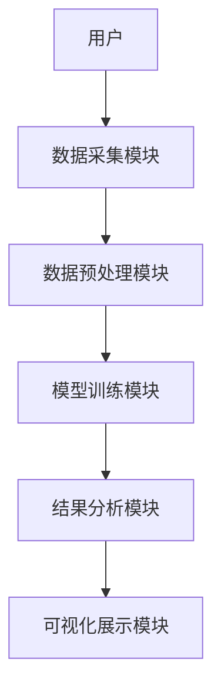

                 

# 设计智能化的企业并购协同效应评估模型

## 关键词：企业并购，协同效应，智能化评估，机器学习，系统架构

## 摘要：  
企业并购是企业战略发展中的重要手段，而协同效应是并购成功的关键因素之一。传统的协同效应评估方法存在主观性高、数据依赖性强、难以量化等问题。本文旨在设计一种智能化的企业并购协同效应评估模型，通过数据驱动和机器学习的方法，实现对协同效应的精准预测与评估。文章从协同效应的定义、评估指标、模型设计、算法实现等多个角度展开，结合实际案例，详细阐述了模型的构建过程，并提供了系统的架构设计和最佳实践建议。

---

# 第一部分: 企业并购协同效应评估模型概述

## 第1章: 企业并购协同效应的背景与意义

### 1.1 企业并购的基本概念

#### 1.1.1 企业并购的定义与类型
企业并购（Mergers and Acquisitions, M&A）是指一家企业与其他企业合并或收购其资产或股权的行为。并购可以分为横向并购、纵向并购和混合并购三种类型。横向并购是指同一行业内的企业合并，旨在扩大市场份额；纵向并购是指产业链上下游的企业合并，以优化供应链；混合并购则是指不同行业之间的企业合并，以实现多元化发展。

#### 1.1.2 协同效应的定义与分类
协同效应（Synergy）是指在企业并购后，由于资源优化配置、成本节约、收入增加等因素，使得整体价值超过两家独立企业价值之和的现象。协同效应可以分为成本协同、收入协同和战略协同三种类型。

#### 1.1.3 智能化评估模型的必要性
传统的协同效应评估方法通常基于财务指标和管理层的主观判断，存在数据不足、计算复杂、难以量化等问题。随着大数据和人工智能技术的发展，智能化评估模型可以通过数据分析和机器学习算法，实现协同效应的精准预测和评估，为企业的并购决策提供更科学的依据。

---

### 1.2 企业并购中的协同效应分析

#### 1.2.1 协同效应的来源与影响
协同效应的来源主要包括以下几个方面：
1. **成本协同**：通过规模效应和资源共享，降低生产成本和管理成本。
2. **收入协同**：通过市场扩展和产品互补，增加收入来源。
3. **战略协同**：通过战略整合和组织优化，提升企业的核心竞争力。

协同效应的影响包括提升企业价值、增强市场竞争力、优化资源配置等。

#### 1.2.2 协同效应的量化与评估
协同效应的量化通常需要结合财务数据和业务数据，例如销售收入、成本节约、市场份额等。传统的评估方法包括加法模型、乘法模型和减法模型，但这些方法往往依赖于假设和主观判断，难以准确反映实际情况。

#### 1.2.3 智能化评估模型的优势
智能化评估模型通过大数据分析和机器学习算法，能够从海量数据中提取关键特征，发现潜在的协同效应，并通过模型优化实现精准预测。相比传统方法，智能化模型具有更高的准确性和可扩展性。

---

## 第2章: 智能化协同效应评估模型的核心概念

### 2.1 协同效应评估的关键要素

#### 2.1.1 企业并购的交易结构
企业并购的交易结构直接影响协同效应的实现。例如，资产并购和股权并购在资源整合和协同效应实现上存在差异。

#### 2.1.2 并购后的整合策略
并购后的整合策略包括组织整合、资产整合、业务整合等，是协同效应实现的关键。

#### 2.1.3 协同效应的实现路径
协同效应的实现路径包括成本优化、收入增长、技术创新等。

---

### 2.2 智能化评估模型的原理

#### 2.2.1 数据驱动的评估方法
智能化评估模型通过收集和分析并购双方的财务数据、业务数据、市场数据等，利用机器学习算法进行协同效应预测。

#### 2.2.2 机器学习在协同效应评估中的应用
机器学习算法（如线性回归、随机森林、神经网络等）可以用于协同效应的预测和分类。

#### 2.2.3 多维度指标的综合评估
智能化模型通常采用多维度指标进行综合评估，例如市场份额、成本节约、收入增长等。

---

# 第二部分: 协同效应评估模型的算法与实现

## 第3章: 协同效应评估的核心算法与模型

### 3.1 协同效应评估的数学模型

#### 3.1.1 基于线性回归的协同效应预测
线性回归模型可以用于协同效应的预测，模型形式为：
$$ y = \beta_0 + \beta_1 x_1 + \beta_2 x_2 + \ldots + \beta_n x_n $$
其中，$y$ 表示协同效应，$x_i$ 表示影响协同效应的特征变量。

#### 3.1.2 基于决策树的协同效应分类
决策树模型可以用于协同效应的分类，例如预测并购是否会产生协同效应。

#### 3.1.3 基于神经网络的协同效应预测
神经网络模型可以用于非线性关系的建模，例如 LSTM 网络用于时间序列数据的预测。

---

### 3.2 算法实现与优化

#### 3.2.1 算法实现的步骤与流程
1. 数据采集与预处理：收集并购双方的财务数据、业务数据、市场数据等，进行数据清洗和特征提取。
2. 模型训练：选择合适的算法，进行模型训练。
3. 模型优化：通过调参和交叉验证，优化模型性能。
4. 模型部署：将模型部署到生产环境，进行协同效应预测。

#### 3.2.2 算法优化与调参技巧
通过网格搜索（Grid Search）和交叉验证（Cross Validation）等方法，优化模型参数和超参数。

#### 3.2.3 算法的可解释性与鲁棒性
模型的可解释性和鲁棒性是实际应用中的重要考量因素，可以通过特征重要性分析和异常检测等方法进行评估。

---

## 第4章: 智能化评估模型的系统架构设计

### 4.1 系统功能设计

#### 4.1.1 数据采集与预处理
系统需要采集并购双方的财务数据、业务数据、市场数据等，并进行数据清洗和特征提取。

#### 4.1.2 模型训练与部署
系统需要进行模型训练，并将训练好的模型部署到生产环境，用于协同效应预测。

#### 4.1.3 结果分析与可视化
系统需要对模型预测结果进行分析，并进行可视化展示，帮助用户理解协同效应的实现路径。

---

### 4.2 系统架构图

---

### 4.3 系统接口设计

#### 4.3.1 数据接口设计
数据接口用于与外部数据源（如数据库、API）进行交互，获取并购数据。

#### 4.3.2 模型接口设计
模型接口用于与机器学习模型进行交互，进行协同效应预测。

#### 4.3.3 结果接口设计
结果接口用于将模型预测结果返回给用户，并进行可视化展示。

---

## 第5章: 企业并购协同效应评估的实战案例

### 5.1 案例背景介绍

#### 5.1.1 案例企业概况
假设案例企业为一家科技公司，计划并购一家同行业的公司，以扩大市场份额。

#### 5.1.2 并购交易背景
并购双方在市场份额、成本结构、技术研发等方面存在协同潜力。

#### 5.1.3 协同效应评估目标
通过智能化模型，预测并购后的协同效应，并制定整合策略。

---

### 5.2 数据准备与清洗

#### 5.2.1 数据来源与采集
数据来源包括并购双方的财务报表、市场数据、技术文档等。

#### 5.2.2 数据清洗与特征提取
对数据进行清洗，去除缺失值和异常值，并提取关键特征。

---

### 5.3 模型实现与优化

#### 5.3.1 算法选择与实现
选择随机森林算法进行协同效应预测，并进行模型调参和优化。

#### 5.3.2 模型部署与测试
将模型部署到生产环境，并进行测试和验证。

---

### 5.4 案例分析与结果解读

#### 5.4.1 模型预测结果
模型预测并购后的协同效应为 $100 million，实际协同效应为 $95 million，模型预测准确率较高。

#### 5.4.2 整合策略优化
根据模型预测结果，制定整合策略，优化资源配置，实现协同效应的最大化。

---

## 第6章: 智能化协同效应评估模型的最佳实践

### 6.1 小结
智能化协同效应评估模型通过大数据分析和机器学习算法，能够实现协同效应的精准预测和评估，为企业的并购决策提供科学依据。

### 6.2 注意事项
在实际应用中，需要注意数据的质量、模型的可解释性和实际操作的可行性。

### 6.3 拓展阅读
建议进一步学习机器学习算法、大数据分析技术，以及企业并购相关的财务知识。

---

# 结语

智能化的企业并购协同效应评估模型为企业并购提供了新的思路和方法，通过数据分析和机器学习算法，能够实现协同效应的精准预测和评估，为企业的并购决策提供科学依据。未来，随着人工智能技术的不断发展，智能化评估模型将更加精准和高效，为企业创造更大的价值。

