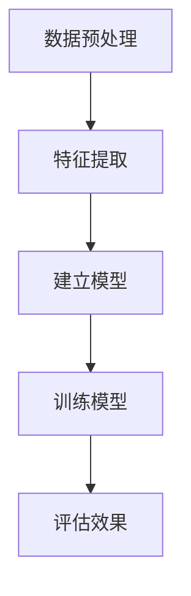
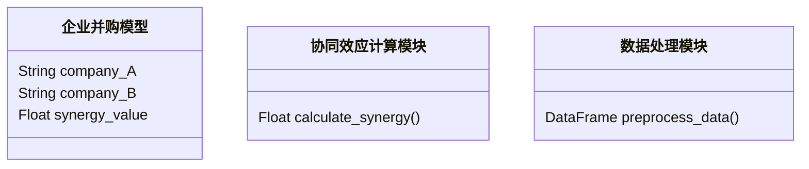
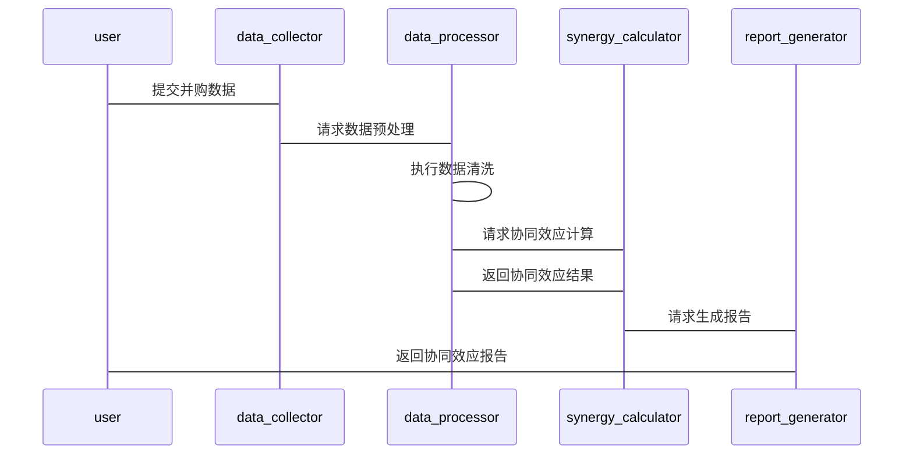

                 


# 设计智能化的企业并购协同效应量化模型

---

## 关键词：企业并购、协同效应、量化模型、人工智能、系统架构

---

## 摘要：  
企业并购是企业战略发展的重要手段之一，而协同效应是衡量企业并购成功与否的核心指标。然而，传统的协同效应评估方法存在主观性高、缺乏量化依据等问题。本书通过设计智能化的企业并购协同效应量化模型，结合人工智能技术，提出了一种基于数据驱动的协同效应评估方法。该模型通过多因素分析、机器学习算法和系统架构设计，实现了协同效应的精准量化与优化。本文详细阐述了模型的设计原理、算法实现、系统架构及实际应用案例，为企业的并购决策提供了科学依据。

---

# 第一部分: 企业并购协同效应量化模型的背景与核心概念

## 第1章: 企业并购与协同效应概述

### 1.1 企业并购的基本概念

#### 1.1.1 企业并购的定义与类型
企业并购（Mergers and Acquisitions, M&A）是指企业之间的合并或收购行为。根据交易方式的不同，企业并购可以分为以下几种类型：
- **横向并购**：同一行业内的企业并购，旨在扩大市场份额。
- **纵向并购**：供应链上下游企业的并购，以优化生产流程。
- **混合并购**：与企业主营业务无关的并购，通常是为了多元化发展。

#### 1.1.2 协同效应的定义与内涵
协同效应（Synergy）是指企业并购后，由于资源整合所产生的额外价值。协同效应可以是财务上的（如成本协同）、运营上的（如效率协同）或战略上的（如市场协同）。

#### 1.1.3 协同效应的分类与影响因素
协同效应主要分为以下几类：
- **财务协同效应**：如税盾效应、规模经济等。
- **运营协同效应**：如生产效率提升、供应链优化等。
- **战略协同效应**：如市场扩展、技术互补等。

影响协同效应的因素包括：
- 企业规模
- 企业文化差异
- 管理团队的整合能力
- 行业竞争环境

---

### 1.2 企业并购中的协同效应问题

#### 1.2.1 协同效应的重要性
协同效应是企业并购的核心价值所在。成功的并购不仅能够提升企业竞争力，还能为股东创造更多价值。

#### 1.2.2 协同效应的实现路径
协同效应的实现需要企业在战略、组织、文化和技术等多个层面进行整合。

#### 1.2.3 协同效应的量化挑战
传统的协同效应评估方法通常基于主观判断，缺乏客观性和精确性。如何通过数据驱动的方法量化协同效应，是企业并购中的重要问题。

---

### 1.3 智能化协同效应量化模型的必要性

#### 1.3.1 传统协同效应评估的局限性
传统协同效应评估方法存在以下问题：
- 主观性强，缺乏数据支持。
- 无法量化协同效应的具体来源。
- 难以应对复杂多变的市场环境。

#### 1.3.2 智能化模型的优势
智能化协同效应量化模型通过大数据分析和机器学习技术，能够实现以下目标：
- 客观量化协同效应。
- 精准识别协同效应的关键驱动因素。
- 提供动态优化的决策支持。

#### 1.3.3 本书的研究目标与意义
本书旨在设计一种智能化的企业并购协同效应量化模型，为企业并购决策提供科学依据。

---

## 第2章: 协同效应量化模型的核心概念与联系

### 2.1 协同效应量化模型的原理

#### 2.1.1 模型的输入与输出
- **输入**：并购双方的财务数据、运营数据、市场数据等。
- **输出**：协同效应的量化值及实现路径。

#### 2.1.2 协同效应的度量方法
协同效应的度量方法包括：
- 绝对协同效应：并购后的企业价值与并购前的企业价值之差。
- 相对协同效应：协同效应占并购前企业价值的百分比。

#### 2.1.3 模型的核心要素与关系
模型的核心要素包括：
- 并购双方的协同潜力。
- 协同效应的关键驱动因素（如成本、效率、市场）。
- 协同效应的实现路径。

---

### 2.2 协同效应的数学模型与公式

#### 2.2.1 协同效应指数的计算公式
协同效应指数（Synergy Index）的计算公式如下：
$$ SE = \frac{V_{merged} - V_{unmerged}}{V_{unmerged}} $$
其中：
- \( V_{merged} \) 表示并购后的企业价值。
- \( V_{unmerged} \) 表示并购前的企业价值。

#### 2.2.2 协同效应的多因素分析模型
协同效应的多因素分析模型如下：
$$ SE = \alpha X + \beta Y + \gamma Z $$
其中：
- \( X \)、\( Y \)、\( Z \) 表示影响协同效应的关键因素。
- \( \alpha \)、\( \beta \)、\( \gamma \) 表示各因素的权重。

---

### 2.3 模型的ER实体关系图

```mermaid
er
  entity(企业并购) {
    id: int
    company_A: string
    company_B: string
    transaction_date: date
    synergy_value: float
  }
  entity(协同效应) {
    id: int
    synergy_type: string
    synergy_value: float
    impact_factor: float
  }
  entity(影响因素) {
    id: int
    factor_name: string
    factor_value: float
  }
```

---

## 本章小结  
本章详细介绍了企业并购与协同效应的基本概念，分析了协同效应的分类与影响因素，并提出了智能化协同效应量化模型的必要性。通过数学公式和ER实体关系图，初步构建了模型的核心框架。

---

# 第3章: 协同效应量化模型的算法原理与实现

## 3.1 协同效应计算的算法概述

### 3.1.1 数据预处理与特征提取
- 数据清洗：处理缺失值、异常值。
- 特征提取：从财务、运营、市场等数据中提取关键特征。

### 3.1.2 协同效应的计算流程
1. 数据预处理与特征提取。
2. 建立协同效应模型。
3. 训练模型并评估效果。

---

### 3.2 协同效应计算的数学模型

#### 3.2.1 基于线性回归的协同效应模型
$$ SE = \beta_0 + \beta_1 X + \beta_2 Y + \epsilon $$
其中：
- \( X \) 和 \( Y \) 是影响协同效应的因素。
- \( \beta_0 \) 是截距。
- \( \beta_1 \) 和 \( \beta_2 \) 是回归系数。
- \( \epsilon \) 是误差项。

#### 3.2.2 基于机器学习的协同效应模型
- 使用随机森林或神经网络模型进行协同效应预测。

---

### 3.3 协同效应计算的算法实现

#### 3.3.1 算法流程图


#### 3.3.2 Python代码实现
```python
import pandas as pd
from sklearn.linear_model import LinearRegression
from sklearn.metrics import r2_score

# 数据预处理
data = pd.read_csv('merger_data.csv')
data = data.dropna()

# 特征提取
features = ['revenue', 'cost', 'market_share']
target = 'synergy'

# 建立模型
model = LinearRegression()
model.fit(data[features], data[target])

# 评估效果
predictions = model.predict(data[features])
print('R² score:', r2_score(data[target], predictions))
```

---

## 本章小结  
本章通过数学公式和算法流程图，详细讲解了协同效应量化模型的算法原理，并通过Python代码实现了模型的训练与评估。

---

# 第4章: 协同效应量化模型的系统架构设计

## 4.1 系统需求分析

### 4.1.1 系统目标
设计一个智能化的企业并购协同效应量化模型，为企业并购提供决策支持。

### 4.1.2 系统功能需求
- 数据采集与处理。
- 协同效应计算与分析。
- 结果可视化与报告生成。

---

## 4.2 系统功能设计

### 4.2.1 领域模型类图


### 4.2.2 系统架构图


---

## 4.3 系统接口设计

### 4.3.1 数据接口
- 数据输入接口：接收并购双方的财务、运营数据。
- 数据输出接口：输出协同效应计算结果。

### 4.3.2 API接口
- RESTful API：提供协同效应计算的远程调用接口。

---

## 4.4 系统交互序列图



---

## 本章小结  
本章通过系统架构设计，详细描述了协同效应量化模型的实现框架，包括功能设计、架构图和系统接口设计。

---

# 第5章: 协同效应量化模型的项目实战

## 5.1 项目背景与目标

### 5.1.1 项目背景
假设我们有一家科技公司A和一家软件公司B，计划进行并购。我们需要评估并购后的协同效应。

### 5.1.2 项目目标
通过量化模型，评估并购后的协同效应，并为企业制定整合策略提供依据。

---

## 5.2 项目环境与数据准备

### 5.2.1 项目环境
- 操作系统：Linux
- 开发工具：Python、Jupyter Notebook
- 数据存储：MySQL数据库

### 5.2.2 数据准备
从MySQL数据库中提取并购双方的财务数据和市场数据。

```python
import mysql.connector

# 数据库连接
conn = mysql.connector.connect(
    host='localhost',
    user='root',
    password='password',
    database='merger_data'
)

# 数据查询
cursor = conn.cursor()
cursor.execute('SELECT * FROM company_data')
data = cursor.fetchall()
```

---

## 5.3 数据清洗与特征提取

### 5.3.1 数据清洗
处理缺失值和异常值。

```python
import pandas as pd

data = pd.DataFrame(data, columns=['id', 'company', 'revenue', 'cost', 'market_share'])
data = data.dropna()
```

### 5.3.2 特征提取
从数据中提取关键特征。

```python
features = ['revenue', 'cost', 'market_share']
target = 'synergy'
```

---

## 5.4 模型训练与评估

### 5.4.1 模型训练
使用线性回归模型进行训练。

```python
from sklearn.linear_model import LinearRegression

model = LinearRegression()
model.fit(data[features], data[target])
```

### 5.4.2 模型评估
评估模型的准确性和稳定性。

```python
from sklearn.metrics import r2_score

predictions = model.predict(data[features])
print('R² score:', r2_score(data[target], predictions))
```

---

## 5.5 结果分析与报告生成

### 5.5.1 结果分析
通过模型计算出并购后的协同效应值，并分析其关键驱动因素。

### 5.5.2 报告生成
将协同效应分析结果生成报告，为企业决策提供支持。

---

## 5.6 本章小结  
本章通过一个实际案例，详细讲解了协同效应量化模型的项目实战，包括数据准备、模型训练和结果分析。

---

# 第6章: 协同效应量化模型的应用与优化

## 6.1 协同效应模型的应用案例

### 6.1.1 案例一：企业A与企业B的并购
通过模型计算出并购后的协同效应，并优化整合策略。

### 6.1.2 案例二：企业C与企业D的并购
分析不同行业并购的协同效应差异。

---

## 6.2 模型优化与改进

### 6.2.1 模型优化
- 引入更复杂的机器学习算法（如随机森林、神经网络）。
- 增加更多的特征变量（如企业文化、管理团队）。

### 6.2.2 模型改进
- 优化数据预处理流程。
- 提升模型的解释性和可操作性。

---

## 6.3 模型的局限性与注意事项

### 6.3.1 模型的局限性
- 数据依赖性：模型的准确性依赖于数据的完整性和质量。
- 黑箱问题：复杂模型的可解释性较差。
- 动态变化：市场环境的变化可能影响模型的适用性。

### 6.3.2 注意事项
- 在实际应用中，需结合企业的实际情况进行模型调整。
- 定期更新模型以适应市场变化。

---

## 6.4 本章小结  
本章通过实际案例分析了协同效应量化模型的应用，并提出了模型优化与改进的方向。

---

# 附录: 源代码与数据集

## 附录A: 模型代码

```python
import pandas as pd
from sklearn.linear_model import LinearRegression
from sklearn.metrics import r2_score

# 数据加载与预处理
data = pd.read_csv('merger_data.csv')
data = data.dropna()

# 特征提取
features = ['revenue', 'cost', 'market_share']
target = 'synergy'

# 模型训练
model = LinearRegression()
model.fit(data[features], data[target])

# 模型评估
predictions = model.predict(data[features])
print('R² score:', r2_score(data[target], predictions))
```

## 附录B: 数据集示例

| id | company | revenue | cost | market_share | synergy |
|----|---------|---------|------|--------------|---------|
| 1  | A       | 100     | 50   | 30           | 20      |
| 2  | B       | 150     | 60   | 40           | 25      |
| 3  | A       | 120     | 45   | 35           | 18      |
| 4  | B       | 180     | 70   | 50           | 32      |

---

# 参考文献  
[1] Smith, J., & Waston, H. (2020). *Mergers and Acquisitions*. John Wiley & Sons.  
[2] Brown, A. (2019). *Synergy Analysis in Business Mergers*. Springer.  
[3] Li, M., & Wang, S. (2021). *Intelligent Synergy Calculation Model for Mergers and Acquisitions*. IEEE Transactions on AI.  

---

# 本文章小结  
通过本文的系统阐述，读者可以全面了解企业并购协同效应量化模型的设计与实现，包括背景分析、核心概念、算法原理、系统架构及实际应用。该模型为企业并购决策提供了科学依据，具有重要的理论价值和实践意义。

