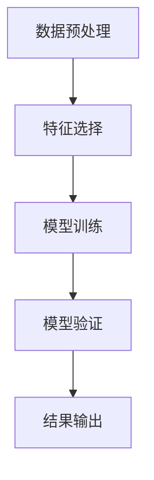
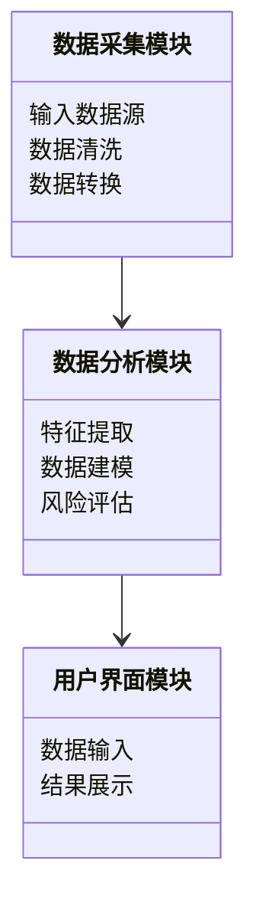
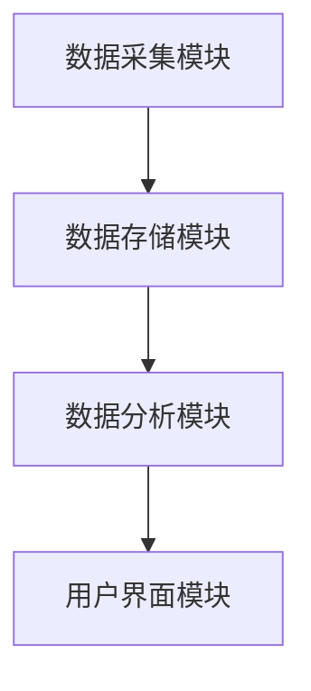

                 


# 设计智能化的企业并购整合风险评估模型

## 关键词：企业并购，整合风险，智能化模型，机器学习，数据驱动决策

## 摘要：企业并购是企业战略发展的重要手段，然而并购后的整合风险却常常成为影响企业长期发展的关键因素。本文通过设计智能化的企业并购整合风险评估模型，结合机器学习和数据分析技术，提出了一套高效的风险识别和评估方法，帮助企业做出更明智的并购决策。文章详细阐述了模型的设计思路、算法原理、系统架构及实际应用案例。

---

## 第一部分: 企业并购整合风险评估模型概述

### 第1章: 企业并购整合风险评估的背景与意义

#### 1.1 企业并购的定义与特点
企业并购是指一家企业通过购买或合并另一家企业，以实现战略目标和资源优化配置的过程。并购整合则是指在并购完成后，对双方的业务、组织、文化和资源进行整合，以实现协同效应和最大化的企业价值。并购整合的成功与否直接关系到企业的长期发展和股东价值。

#### 1.2 并购整合风险的定义与分类
并购整合风险是指在并购过程中，由于整合不当或外部环境变化而导致企业价值下降或目标未能实现的风险。常见的风险包括：

- **战略风险**：并购目标与企业战略不一致。
- **财务风险**：整合过程中的财务负担过高。
- **组织风险**：整合后的组织架构和文化冲突。
- **市场风险**：市场竞争加剧导致整合效果不佳。

#### 1.3 智能化评估模型的必要性
传统的并购整合风险评估方法通常依赖于主观判断和经验分析，存在以下局限性：
- 数据分析不够全面，难以捕捉复杂的风险因素。
- 缺乏实时性和动态性，无法快速响应市场变化。
- 难以量化风险，导致决策缺乏科学依据。

智能化评估模型通过引入机器学习和大数据分析技术，能够高效地识别和量化整合风险，为企业提供数据驱动的决策支持。

---

### 第2章: 企业并购整合风险评估模型的核心概念

#### 2.1 并购整合风险评估的理论基础
并购整合风险评估的核心在于识别和量化整合过程中的关键风险因素。这些因素通常包括战略匹配度、组织文化差异、财务状况、市场环境等。

#### 2.2 数据驱动的智能化模型
智能化模型的核心在于利用大数据和机器学习技术，从海量数据中提取有价值的信息，构建风险评估模型。模型的关键要素包括：
- 数据来源：包括企业财务数据、市场数据、组织文化数据等。
- 数据预处理：数据清洗、特征提取和标准化。
- 模型构建：基于机器学习算法，构建风险评估模型。

#### 2.3 模型的构建与验证
模型的构建需要遵循以下步骤：
1. **数据预处理**：清洗数据，去除异常值，处理缺失值。
2. **特征选择**：根据业务需求和数据分析结果，选择关键特征。
3. **模型训练**：使用机器学习算法训练模型。
4. **模型验证**：通过交叉验证等方法评估模型的准确性和稳定性。

---

### 第3章: 并购整合风险评估模型的算法原理

#### 3.1 机器学习算法的选择与应用
在构建风险评估模型时，可以选择以下算法：
- **逻辑回归**：用于分类问题，预测整合成功的概率。
- **随机森林**：用于特征重要性分析和风险预测。
- **支持向量机（SVM）**：适用于小样本数据的分类问题。

#### 3.2 算法原理的数学模型
以逻辑回归为例，模型的数学表达式如下：
$$ P(y=1|x) = \frac{1}{1 + e^{-(\beta_0 + \beta_1 x_1 + \beta_2 x_2 + \dots + \beta_n x_n)}} $$
其中，$x_i$ 表示输入特征，$\beta_i$ 是对应的系数。

#### 3.3 算法实现的流程图


---

### 第4章: 并购整合风险评估模型的系统架构

#### 4.1 系统需求分析
- **功能需求**：支持数据采集、特征提取、模型训练和风险评估。
- **性能需求**：能够处理大规模数据，提供实时风险评估。
- **用户需求**：满足企业高管、并购团队和风险管理团队的需求。

#### 4.2 系统架构设计


---

## 第二部分: 系统分析与架构设计方案

### 第1章: 问题场景介绍
企业并购整合过程中，常见的风险包括战略不匹配、组织文化冲突、财务负担过重等。这些问题往往难以通过传统方法有效识别和量化。

### 第2章: 项目介绍
本文设计了一个智能化的企业并购整合风险评估系统，旨在通过大数据分析和机器学习技术，帮助企业识别和量化整合风险。

### 第3章: 系统功能设计


### 第4章: 系统架构设计


---

## 第三部分: 项目实战

### 第1章: 环境安装
- **Python**：安装Anaconda或Miniconda。
- **机器学习库**：安装Scikit-learn、XGBoost、TensorFlow等。
- **数据处理工具**：安装Pandas、NumPy等。

### 第2章: 核心代码实现
```python
import pandas as pd
from sklearn.model_selection import train_test_split
from sklearn.linear_model import LogisticRegression
from sklearn.metrics import accuracy_score

# 数据加载
data = pd.read_csv('merger_data.csv')

# 特征选择
X = data[['revenue_growth', 'net_profit_margin', 'employee_num', 'industry']}
y = data['merger_success']

# 数据分割
X_train, X_test, y_train, y_test = train_test_split(X, y, test_size=0.2, random_state=42)

# 模型训练
model = LogisticRegression()
model.fit(X_train, y_train)

# 模型预测
y_pred = model.predict(X_test)

# 模型评估
print("Accuracy:", accuracy_score(y_test, y_pred))
```

### 第3章: 案例分析
通过实际案例分析，验证模型的准确性和实用性。例如，使用某企业并购案例的数据，运行上述代码，输出模型的准确率和具体预测结果。

---

## 第四部分: 总结与展望

### 第1章: 总结
本文设计了一种智能化的企业并购整合风险评估模型，通过机器学习和大数据分析技术，帮助企业识别和量化整合风险。模型具有高效性、准确性和可解释性的特点。

### 第2章: 展望
未来的研究方向包括：
- 引入更复杂的机器学习模型，如深度学习和强化学习。
- 结合实时数据，构建动态风险评估系统。
- 开发智能化的决策支持工具，辅助企业做出更明智的并购决策。

---

## 总结
通过设计智能化的企业并购整合风险评估模型，企业能够更科学地识别和管理整合风险，提高并购成功的概率。本文通过理论分析、算法设计和实际案例，为企业的并购整合提供了重要的参考和指导。

