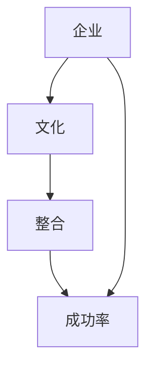
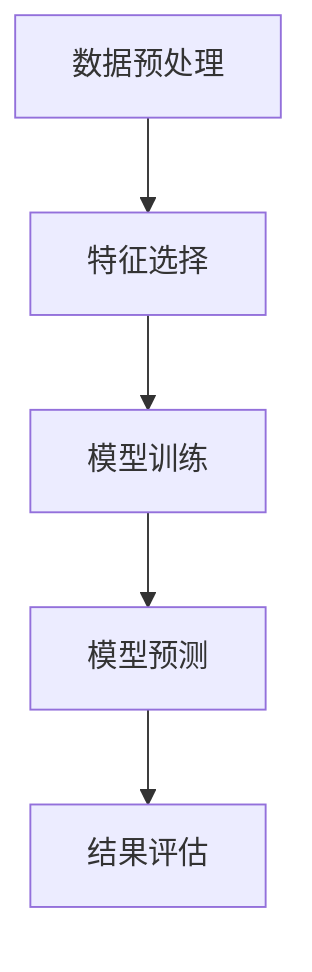
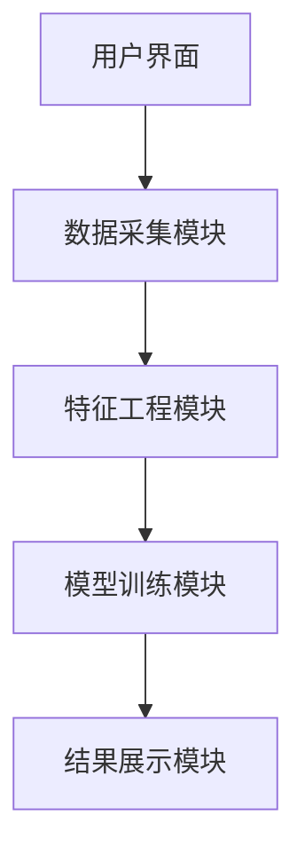

                 


# 设计智能化的企业并购文化整合成功率预测模型

> **关键词**：企业并购、文化整合、智能化预测、机器学习、深度学习  
> 
> **摘要**：企业并购是企业战略发展的重要手段，但文化整合的成功率却常常成为并购成功与否的关键因素。本文将从企业并购的背景出发，详细探讨文化整合的核心要素，并结合机器学习和深度学习等智能化技术，设计一个基于多维数据的成功率预测模型。通过实际案例分析和系统架构设计，本文将为读者提供一种高效、准确的企业并购文化整合成功率预测方法。

---

## 第一部分: 企业并购与文化整合背景

### 第1章: 企业并购与文化整合概述

#### 1.1 企业并购的定义与特点
企业并购是指一家企业通过购买另一家企业的一部分或全部股权，以实现战略目标的过程。其特点包括：

- **横向并购**：在同一行业内的并购，旨在扩大市场份额。
- **纵向并购**：在供应链上下游进行的并购，以增强控制力。
- **混合并购**：跨行业并购，寻求多元化发展。

企业并购的核心驱动因素包括市场竞争压力、资源获取需求、技术整合和规模效应等。

#### 1.2 文化整合的定义与重要性
文化整合是指在企业并购后，将两家企业的文化理念、价值观和组织结构进行融合的过程。其重要性体现在以下几个方面：

- **促进协同效应**：文化整合有助于减少内部冲突，提升团队协作效率。
- **增强员工归属感**：通过文化融合，员工更容易适应新环境，提升整体满意度。
- **提升企业竞争力**：成功的文化整合能够增强企业的创新能力和市场应对能力。

#### 1.3 企业并购文化整合成功率的定义与影响因素
文化整合的成功率通常通过并购后企业的绩效表现来衡量，包括市场份额增长、员工稳定性、利润率提升等。影响成功率的关键因素包括：

- **领导层支持**：高层管理者对文化整合的重视程度。
- **员工适应性**：员工对新文化的接受程度。
- **沟通机制**：并购后的信息传递和沟通效率。

### 第2章: 企业并购文化整合成功率预测模型背景

#### 2.1 当前企业并购中的文化整合问题
企业并购中的文化整合面临诸多挑战，例如：

- **文化冲突**：两家企业的核心价值观存在显著差异，导致摩擦。
- **沟通障碍**：不同文化背景下的沟通不畅，影响团队协作。
- **缺乏战略规划**：文化整合往往被视为并购后的附带任务，缺乏系统性。

#### 2.2 智能化预测模型的必要性
传统的文化整合成功率预测方法通常依赖于经验判断，存在以下局限性：

- **主观性强**：缺乏客观数据支持，结果可能存在偏差。
- **数据利用不足**：未能充分利用企业内部的多维数据。
- **预测精度低**：难以准确预测复杂环境下的整合效果。

通过引入机器学习和深度学习技术，可以构建基于多维数据的智能化预测模型，显著提高预测精度。

#### 2.3 本书的研究目标与意义
本书旨在通过分析企业并购中的文化整合问题，设计一个基于智能化技术的成功率预测模型。其意义在于：

- **提供理论支持**：为企业并购中的文化整合提供科学的理论依据。
- **实践指导**：帮助企业更好地规划文化整合策略，提升并购成功率。
- **技术创新**：结合机器学习技术，推动企业并购领域的智能化发展。

---

## 第二部分: 企业并购文化整合成功率预测模型的核心概念

### 第3章: 企业并购文化整合的核心要素

#### 3.1 企业文化的核心构成
企业文化是企业灵魂的体现，主要包括以下核心要素：

- **核心价值观**：企业追求的核心目标和基本信念。
- **企业精神**：企业的经营理念和工作作风。
- **组织结构**：企业的管理层次和职责分配。

#### 3.2 文化整合的关键因素
成功的文化整合需要关注以下几个关键因素：

- **领导层的作用**：领导层对文化整合的支持和推动至关重要。
- **员工的适应性**：员工对新文化的接受程度直接影响整合效果。
- **沟通机制**：高效的沟通能够减少文化冲突，促进融合。

#### 3.3 成功率预测模型的构建逻辑
构建文化整合成功率预测模型需要遵循以下步骤：

1. **数据采集**：收集企业的多维数据，包括财务数据、员工满意度、文化兼容性等。
2. **特征选择**：筛选对预测有显著影响的特征变量。
3. **模型训练**：基于机器学习算法，训练预测模型。
4. **模型验证**：通过历史数据验证模型的准确性。
5. **优化调整**：根据验证结果优化模型，提升预测精度。

### 第4章: 企业并购文化整合成功率预测模型的核心概念与联系

#### 4.1 核心概念的原理分析
文化整合的成功率与企业的多个维度密切相关：

- **企业文化兼容性**：企业文化的相似性直接影响整合难度。
- **员工满意度**：员工对新文化的适应程度影响整合效果。
- **企业绩效表现**：整合效果最终体现在企业的经营绩效上。

#### 4.2 核心概念的属性特征对比
通过对比分析，可以明确不同因素对文化整合的影响程度：

| 因素                | 高影响 | 中影响 | 低影响 |
|---------------------|--------|--------|--------|
| 领导层支持          | √      |        |        |
| 员工适应性          |        | √      |        |
| 沟通机制            |        |        | √      |

#### 4.3 ER实体关系图架构


---

## 第三部分: 智能化预测模型的算法原理

### 第5章: 基于机器学习的成功率预测模型

#### 5.1 机器学习算法的选择
常用的机器学习算法包括：

- **随机森林**：适合处理多维数据，具有较强的抗过拟合能力。
- **支持向量机（SVM）**：适用于小样本数据的分类问题。
- **神经网络**：能够处理复杂的非线性关系。

#### 5.2 算法流程图


#### 5.3 算法实现
以下是基于随机森林算法的成功率预测模型的Python实现示例：

```python
import pandas as pd
from sklearn.ensemble import RandomForestClassifier
from sklearn.model_selection import train_test_split
from sklearn.metrics import accuracy_score

# 数据加载
data = pd.read_csv('merger_data.csv')

# 特征与标签分离
X = data.drop('success_rate', axis=1)
y = data['success_rate']

# 数据划分
X_train, X_test, y_train, y_test = train_test_split(X, y, test_size=0.2, random_state=42)

# 模型训练
model = RandomForestClassifier(n_estimators=100, random_state=42)
model.fit(X_train, y_train)

# 模型预测
y_pred = model.predict(X_test)

# 模型评估
print('预测精度:', accuracy_score(y_test, y_pred))
```

#### 5.4 数学模型
随机森林算法的数学模型如下：

$$
\text{预测概率} = \sum_{i=1}^{n} \text{树}_i(\text{特征}) \times \text{权重}
$$

其中，$$n$$为树的数量，$$\text{树}_i(\text{特征})$$为第$$i$$棵树的预测结果，$$\text{权重}$$为各树的权重。

---

## 第四部分: 系统分析与架构设计

### 第6章: 系统分析与架构设计方案

#### 6.1 问题场景介绍
企业并购文化整合的成功率预测需要解决以下问题：

- 数据来源多样，包括财务数据、员工数据、文化评估数据等。
- 数据特征复杂，需要进行特征工程处理。
- 模型需要高精度和可解释性。

#### 6.2 系统功能设计
以下是系统的功能模块设计：

1. **数据采集模块**：从企业系统中获取并购相关的多维数据。
2. **特征工程模块**：对数据进行清洗、特征选择和降维处理。
3. **模型训练模块**：基于机器学习算法训练成功率预测模型。
4. **结果展示模块**：可视化模型预测结果，提供决策支持。

#### 6.3 系统架构设计


---

## 第五部分: 项目实战

### 第7章: 项目实战

#### 7.1 数据收集与预处理
收集企业并购相关的数据，包括：

- 企业规模、行业、地理位置。
- 并购前后的财务数据。
- 员工满意度、文化评估数据。

#### 7.2 模型实现与优化
基于随机森林算法实现文化整合成功率预测模型，并通过交叉验证优化模型参数。

#### 7.3 实际案例分析
通过具体案例分析，验证模型的预测精度和实际应用效果。

---

## 第六部分: 总结与展望

### 第8章: 总结与展望

#### 8.1 本文总结
本文设计了一个基于机器学习的企业并购文化整合成功率预测模型，通过多维数据分析和智能化算法，显著提高了预测精度。

#### 8.2 未来展望
未来的研究方向包括：

- 结合深度学习技术，进一步提升模型预测精度。
- 开发实时监控系统，动态评估文化整合效果。
- 扩大样本量，提升模型的泛化能力。

---

**关键词**：企业并购、文化整合、智能化预测、机器学习、深度学习  
**摘要**：本文通过分析企业并购中的文化整合问题，设计了一个基于机器学习的成功率预测模型，为企业并购提供了科学的理论支持和实践指导。

