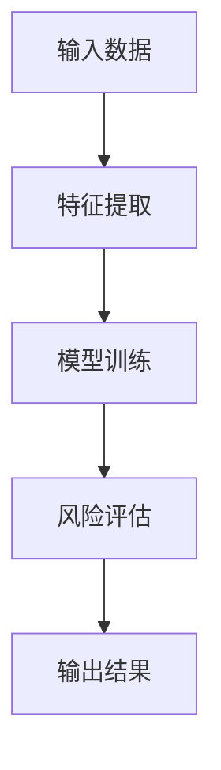
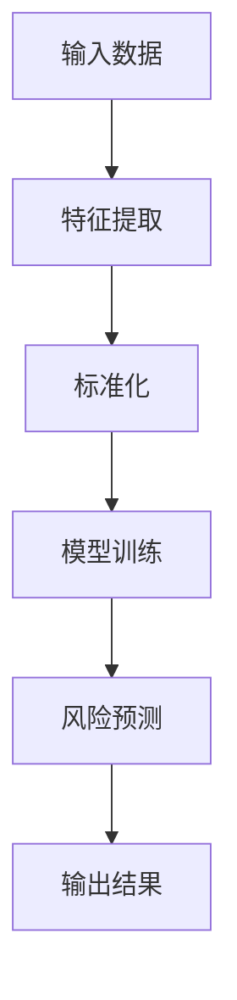
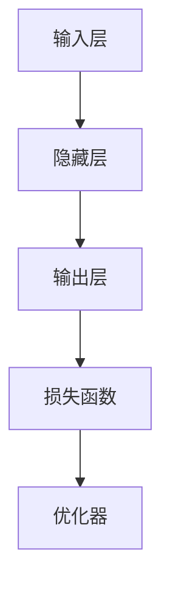
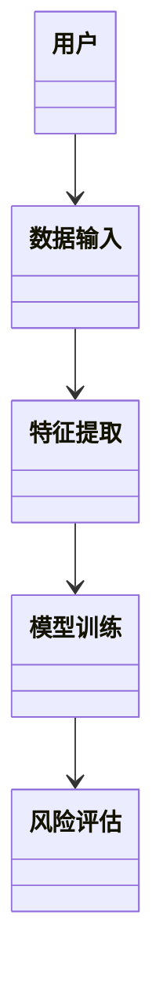
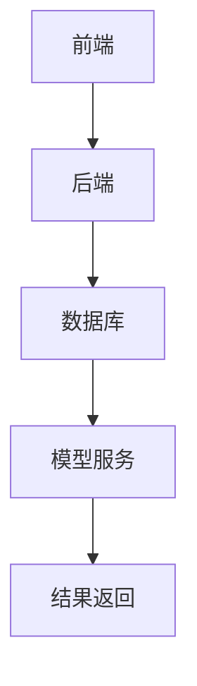

                 


# 设计智能化的企业并购文化整合风险评估模型

---

## 关键词：企业并购、文化整合、风险评估、人工智能、系统架构

---

## 摘要：

在企业并购过程中，文化整合是决定并购成功与否的关键因素之一。然而，传统的文化整合评估方法往往依赖主观判断，缺乏系统性和智能化。本文提出了一种基于人工智能和大数据的智能化企业并购文化整合风险评估模型。该模型通过数据驱动的方法，量化文化整合的风险，帮助企业更好地预测和管理并购中的文化冲突，从而提高并购成功率。文章详细介绍了模型的设计思路、算法原理、系统架构，并通过实际案例展示了模型的应用效果。

---

## 目录：

1. [背景介绍](#背景介绍)
   - 1.1 企业并购的基本概念
   - 1.2 文化整合的重要性
   - 1.3 智能化评估模型的必要性

2. [核心概念与联系](#核心概念与联系)
   - 2.1 文化整合风险的定义与特征
   - 2.2 模型的核心要素与架构

3. [算法原理讲解](#算法原理讲解)
   - 3.1 机器学习算法在风险评估中的应用
   - 3.2 深度学习模型的构建与训练

4. [系统分析与架构设计](#系统分析与架构设计)
   - 4.1 系统需求分析与功能设计
   - 4.2 系统架构设计与实现

5. [项目实战与案例分析](#项目实战与案例分析)
   - 5.1 环境配置与核心代码实现
   - 5.2 实际案例分析与总结

---

## 背景介绍

### 1.1 企业并购的基本概念

企业并购是指一个企业通过购买或其他方式取得另一个企业的全部或部分资产、股权或控制权的行为。并购的类型主要包括：

- **横向并购**：同一行业内的企业并购。
- **纵向并购**：产业链上下游的企业并购。
- **混合并购**：与自身业务不直接相关的企业并购。

并购的动机主要包括扩大市场份额、获取技术优势、降低成本等。

### 1.2 文化整合的重要性

文化整合是企业在并购后，将双方的企业文化、管理方式、员工价值观等进行融合的过程。文化整合的成功与否直接影响并购的最终效果。如果文化整合失败，可能导致员工士气低落、管理混乱，甚至最终导致并购失败。

### 1.3 智能化评估模型的必要性

传统的文化整合评估方法通常依赖于主观判断，缺乏系统性和科学性。随着大数据和人工智能技术的发展，通过智能化模型量化文化整合风险，已成为一种趋势。本文提出的模型基于机器学习和深度学习算法，能够从海量数据中提取关键特征，量化文化整合风险。

---

## 核心概念与联系

### 2.1 文化整合风险的定义与特征

文化整合风险是指在企业并购过程中，由于企业文化差异、管理风格冲突等因素，导致文化整合失败的可能性。文化整合风险具有以下特征：

- **多样性**：企业文化千差万别，整合难度因企业而异。
- **动态性**：文化整合是一个动态过程，受多种因素影响。
- **复杂性**：文化整合涉及组织结构、员工价值观等多个方面。

### 2.2 模型的核心要素与架构

模型的核心要素包括：

- **输入数据**：企业的文化特征、管理风格、员工满意度等。
- **算法模块**：机器学习和深度学习算法。
- **风险评估**：输出文化整合风险等级。

模型的架构如下图所示：



---

## 算法原理讲解

### 3.1 机器学习算法在风险评估中的应用

机器学习算法能够从海量数据中提取特征，预测文化整合风险。常用的算法包括：

- **逻辑回归**：用于分类问题，预测风险等级。
- **随机森林**：用于特征重要性分析，找出影响风险的关键因素。

以下是逻辑回归算法的流程图：



以下是逻辑回归的数学公式：

$$
P(y=1|x) = \frac{1}{1 + e^{-(\beta_0 + \beta_1 x)}}
$$

其中，$x$ 是输入特征，$\beta_0$ 和 $\beta_1$ 是模型参数。

### 3.2 深度学习模型的构建与训练

深度学习模型能够捕捉非线性特征，适合处理复杂的数据。常用的模型包括：

- **神经网络**：用于分类任务。
- **长短期记忆网络（LSTM）**：用于时间序列数据。

以下是神经网络的模型结构：



以下是神经网络的损失函数公式：

$$
\text{损失函数} = -\frac{1}{N} \sum_{i=1}^{N} y_i \log(a_i) + (1 - y_i) \log(1 - a_i)
$$

其中，$a_i$ 是模型输出的概率，$y_i$ 是真实标签。

---

## 系统分析与架构设计

### 4.1 系统需求分析与功能设计

系统需求分析包括以下内容：

- **用户需求**：企业需要一个工具来评估并购中的文化整合风险。
- **功能需求**：数据输入、特征提取、模型训练、风险评估。

以下是系统功能设计的领域模型图：



### 4.2 系统架构设计与实现

以下是系统架构设计的架构图：



---

## 项目实战与案例分析

### 5.1 环境配置与核心代码实现

环境配置包括以下内容：

- **Python 3.8+**
- **TensorFlow 2.0+**
- **scikit-learn 0.24+**

以下是核心代码实现：

```python
import numpy as np
from sklearn.linear_model import LogisticRegression
from sklearn.metrics import accuracy_score

# 数据预处理
X = np.array([[1, 2], [3, 4], [5, 6]])
y = np.array([0, 1, 0])

# 模型训练
model = LogisticRegression()
model.fit(X, y)

# 模型预测
y_pred = model.predict(X)
print("准确率:", accuracy_score(y, y_pred))
```

### 5.2 实际案例分析与总结

以某企业并购案例为例，分析模型的应用效果：

- **案例背景**：A公司并购B公司，评估文化整合风险。
- **数据输入**：A公司和B公司的文化特征。
- **模型训练**：使用逻辑回归模型训练。
- **风险评估**：输出文化整合风险等级。

---

## 总结与展望

本文提出了智能化的企业并购文化整合风险评估模型，结合机器学习和深度学习算法，量化文化整合风险。通过实际案例分析，验证了模型的有效性。未来的研究方向包括优化模型性能、扩展模型的应用场景等。

