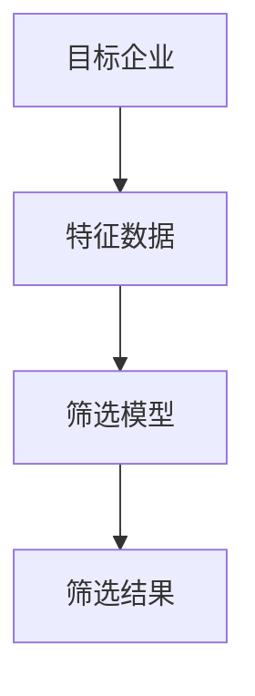
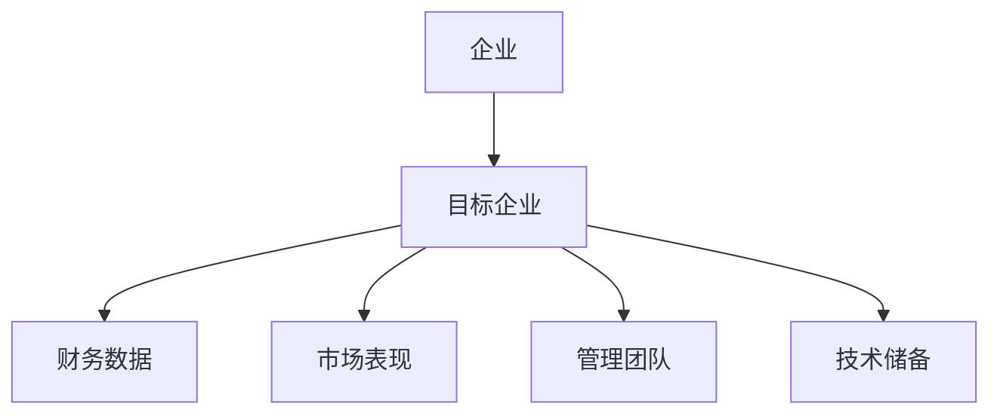

                 

# 设计智能化的企业并购目标筛选模型

## 关键词：
企业并购、目标筛选、智能化模型、机器学习、数据驱动

## 摘要：
企业并购是企业战略发展的重要手段，然而传统的目标筛选过程存在效率低、精准度不足等问题。本文提出了一种基于数据驱动的智能化企业并购目标筛选模型，结合机器学习算法和多维度数据分析，构建高效的筛选机制，帮助企业快速、精准地找到合适的并购目标。

---

# 第1章: 企业并购目标筛选模型的背景介绍

## 1.1 问题背景

### 1.1.1 传统企业并购的挑战与痛点
- **信息不对称**：企业并购涉及大量非公开信息，传统筛选依赖经验判断，存在较大不确定性。
- **效率低下**：传统筛选过程耗时长，依赖人工分析，效率难以提升。
- **精准度不足**：传统方法难以全面考虑企业财务、市场、管理等多维度因素，筛选结果可能偏差较大。

### 1.1.2 智能化筛选的必要性
- **数据驱动决策**：通过大数据分析和机器学习，实现更精准的目标筛选。
- **提高效率**：自动化处理海量数据，缩短筛选周期。
- **降低风险**：通过模型预测潜在风险，辅助决策。

### 1.1.3 当前企业并购中的主要问题
- **目标企业识别困难**：海量企业中如何快速定位潜在目标。
- **多维度因素综合评估不足**：传统方法难以全面考虑财务、市场、管理等因素。
- **动态变化难以捕捉**：企业经营环境动态变化，传统静态分析难以适应。

## 1.2 问题描述

### 1.2.1 并购目标筛选的核心问题
- 如何从海量企业中快速识别潜在并购目标。
- 如何综合评估目标企业的财务、市场、管理等多维度因素。
- 如何构建动态评估模型，捕捉企业经营环境的变化。

### 1.2.2 数据驱动的筛选方式
- 利用企业公开数据（如财务报表、市场数据等）进行特征提取。
- 通过机器学习算法对目标企业进行分类或评分。

### 1.2.3 智能化模型的优势
- **高效性**：自动化处理数据，缩短筛选时间。
- **精准性**：基于多维度数据，提高筛选结果的准确性。
- **动态性**：模型可以根据实时数据进行更新，捕捉企业变化。

## 1.3 问题解决

### 1.3.1 数据驱动的解决方案
- 构建数据驱动的筛选框架，整合企业内外部数据。
- 利用机器学习算法对目标企业进行分类或评分。

### 1.3.2 智能化模型的设计思路
- **数据采集**：收集目标企业的多维度数据。
- **特征提取**：对数据进行清洗和特征工程。
- **模型训练**：基于特征数据训练分类或回归模型。
- **结果分析**：根据模型输出结果进行目标筛选。

### 1.3.3 核心目标与实现路径
- **核心目标**：快速、精准地识别潜在并购目标。
- **实现路径**：数据驱动、算法优化、模型部署。

## 1.4 边界与外延

### 1.4.1 模型的适用范围
- 适用于公开数据充足的行业。
- 适用于中短期目标筛选。

### 1.4.2 模型的局限性
- 依赖公开数据，难以捕捉非公开信息。
- 模型结果仅供参考，需结合人工判断。

### 1.4.3 与其他筛选方法的对比
| 特征维度 | 传统筛选方法 | 数据驱动筛选方法 |
|----------|---------------|-------------------|
| 数据来源 | 依赖经验判断 | 基于公开数据 |
| 筛选效率 | 低效 | 高效 |
| 精准度 | 依赖人工判断 | 数据驱动，精准 |

## 1.5 概念结构与核心要素

### 1.5.1 模型的核心要素
- **目标企业**：待筛选的企业。
- **特征数据**：企业的多维度数据。
- **筛选模型**：基于特征数据的分类或回归模型。
- **筛选结果**：模型输出的目标企业评分或分类结果。

### 1.5.2 要素之间的关系

### 1.5.3 模型的输入与输出
- **输入**：目标企业的特征数据。
- **输出**：目标企业的评分或分类结果。

## 1.6 本章小结
本章介绍了企业并购目标筛选模型的背景，分析了传统筛选方法的挑战与痛点，并提出了智能化筛选的必要性。通过对比传统方法与数据驱动方法的差异，明确了智能化模型的优势和实现路径。

---

# 第2章: 核心概念与联系

## 2.1 核心概念原理

### 2.1.1 数据驱动的筛选原理
- 通过收集和分析目标企业的多维度数据，提取关键特征。
- 基于特征数据训练机器学习模型，输出筛选结果。

### 2.1.2 智能化模型的算法基础
- **监督学习**：分类或回归模型。
- **无监督学习**：聚类分析。

### 2.1.3 多维度特征分析
- **财务特征**：收入、利润、资产负债率等。
- **市场特征**：市场份额、行业排名、竞争对手分析。
- **管理特征**：管理团队稳定性、高管背景等。

## 2.2 核心概念属性特征对比

| 特征维度 | 传统筛选方法 | 数据驱动筛选方法 |
|----------|---------------|-------------------|
| 数据来源 | 依赖经验判断 | 基于公开数据 |
| 筛选效率 | 低效 | 高效 |
| 精准度 | 依赖人工判断 | 数据驱动，精准 |

## 2.3 ER实体关系图

---

# 总结

通过以上章节的详细分析，我们构建了一个基于数据驱动的智能化企业并购目标筛选模型。该模型结合了机器学习算法和多维度数据分析，能够高效、精准地识别潜在并购目标。未来，随着技术的发展，模型将更加智能化和动态化，为企业并购提供更有力的支持。

---

**声明**：本文内容版权归作者所有，转载请注明出处。

