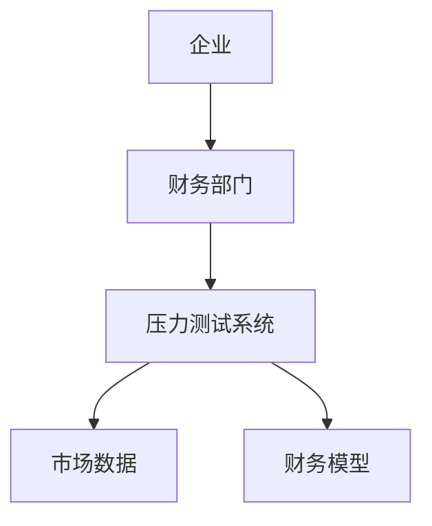
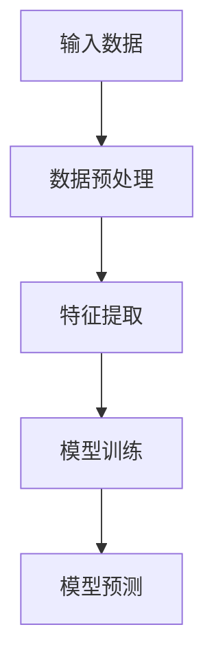
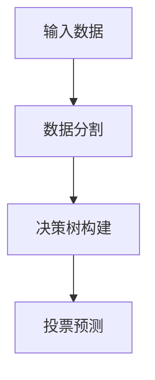
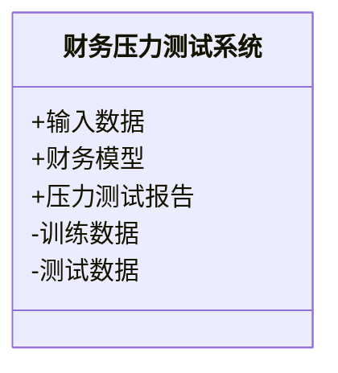
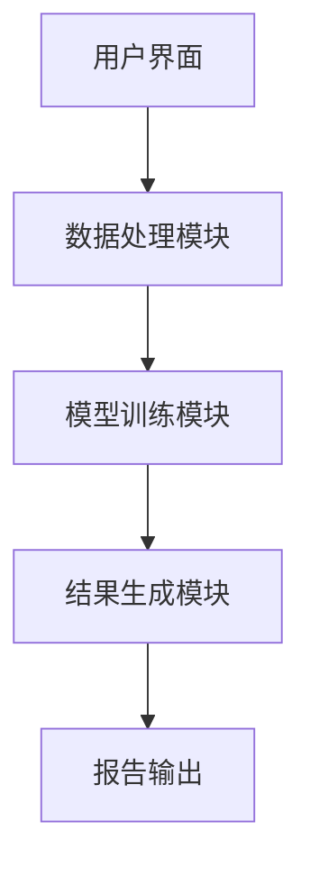
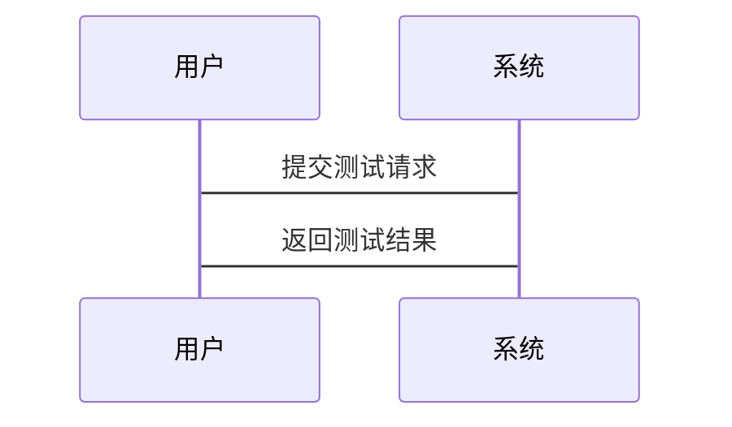

                 


# 设计智能化的企业财务压力测试系统

## 关键词：财务压力测试，智能化系统，机器学习，支持向量机，随机森林，系统架构设计

## 摘要：  
本文将详细探讨如何设计智能化的企业财务压力测试系统，从背景介绍到系统架构设计，从算法原理到项目实战，层层剖析。通过结合支持向量机和随机森林等机器学习算法，构建高效、准确的压力测试模型，实现对企业财务风险的智能化预测与评估。

---

# 第1章: 企业财务压力测试系统概述

## 1.1 问题背景与描述
### 1.1.1 企业财务压力测试的定义  
企业财务压力测试是指在特定假设情景下（如经济衰退、市场波动等），评估企业在面临这些极端条件时的财务健康状况和承受能力。传统的压力测试依赖人工分析和固定模型，存在效率低、覆盖范围有限的问题。

### 1.1.2 问题描述  
随着经济环境的复杂化，企业面临的财务风险日益增加。传统的压力测试方法难以应对多变的市场环境和复杂的财务数据，容易导致测试结果的片面性和滞后性。

### 1.1.3 问题解决  
通过引入机器学习算法，智能化财务压力测试系统能够快速处理海量数据，自动优化模型，提供实时、精准的测试结果。

### 1.1.4 边界与外延  
- **边界**：系统专注于财务数据的处理和分析，不涉及企业的实际运营决策。  
- **外延**：系统支持多维度数据输入，能够扩展至其他领域的压力测试（如供应链压力测试）。  

### 1.1.5 核心要素  
- 数据来源：财务报表、市场数据、企业运营数据。  
- 核心算法：支持向量机、随机森林。  
- 输出结果：压力测试报告、风险预警。  

## 1.2 核心概念与联系  
### 1.2.1 概念属性对比  
| 概念 | 特性 |  
|------|------|  
| 数据来源 | 财务报表、市场数据 |  
| 模型类型 | 支持向量机、随机森林 |  
| 输出结果 | 压力测试报告、风险预警 |  

### 1.2.2 实体关系图  


## 1.3 本章小结  
本章从背景、定义、问题解决等方面介绍了智能化财务压力测试系统的核心概念，并通过表格和实体关系图展示了系统的组成与联系。

---

# 第2章: 支持向量机与随机森林算法原理

## 2.1 支持向量机原理  
### 2.1.1 算法原理  
支持向量机（Support Vector Machine，SVM）是一种监督学习算法，适用于分类和回归问题。其核心思想是通过构建超平面将数据点分成不同类别。  

**步骤流程图**  


### 2.1.2 数学模型  
支持向量机的目标函数如下：  
$$\text{目标函数} = \sum_{i=1}^{n} \xi_i + \frac{1}{2}\lambda \sum_{i=1}^{m} \omega_i^2$$  
其中，$\xi_i$ 是松弛变量，$\lambda$ 是正则化参数，$\omega_i$ 是权重向量。

### 2.1.3 代码实现  
```python
from sklearn import svm
# 初始化模型
model = svm.SVC(kernel='rbf', gamma='auto')
# 训练模型
model.fit(X_train, y_train)
# 预测结果
y_pred = model.predict(X_test)
```

## 2.2 随机森林原理  
### 2.2.1 算法原理  
随机森林（Random Forest）是一种基于决策树的集成学习算法。通过构建多棵决策树并进行投票或平均，提高模型的准确性和鲁棒性。  

**步骤流程图**  


### 2.2.2 数学模型  
随机森林的预测结果为：  
$$\text{预测值} = \sum_{i=1}^{k} \frac{1}{k} \text{单棵决策树预测结果}$$  
其中，$k$ 是决策树的数量。

### 2.2.3 代码实现  
```python
from sklearn.ensemble import RandomForestClassifier
# 初始化模型
model = RandomForestClassifier(n_estimators=100, max_depth=5, random_state=42)
# 训练模型
model.fit(X_train, y_train)
# 预测结果
y_pred = model.predict(X_test)
```

## 2.3 本章小结  
本章详细介绍了支持向量机和随机森林的算法原理，并通过代码示例展示了如何实现这些算法。这些算法为后续的压力测试系统提供了理论基础和技术支持。

---

# 第3章: 系统分析与架构设计

## 3.1 系统需求分析  
- **功能需求**：支持多维度数据输入、多种算法模型、实时压力测试报告生成。  
- **性能需求**：高效处理海量数据，快速生成测试结果。  

## 3.2 系统功能设计  
### 3.2.1 领域模型  


### 3.2.2 系统架构设计  


### 3.2.3 接口设计  
- **输入接口**：接收财务数据和测试参数。  
- **输出接口**：输出压力测试报告和风险预警。  

### 3.2.4 交互流程  


## 3.3 本章小结  
本章通过系统需求分析和功能设计，明确了智能化财务压力测试系统的架构和交互流程，为后续实现奠定了基础。

---

# 第4章: 项目实战

## 4.1 环境安装与配置  
- **安装Python**：推荐使用Anaconda。  
- **安装依赖库**：`scikit-learn`, `pandas`, `numpy`, `mermaid`。  

## 4.2 核心代码实现  
### 4.2.1 数据预处理  
```python
import pandas as pd
import numpy as np

# 读取数据
data = pd.read_csv('financial_data.csv')

# 数据清洗
data = data.dropna()
data = pd.get_dummies(data)
```

### 4.2.2 模型训练与预测  
```python
from sklearn.model_selection import train_test_split
from sklearn.svm import SVC
from sklearn.ensemble import RandomForestClassifier

# 划分数据集
X_train, X_test, y_train, y_test = train_test_split(data.drop('label', axis=1), data['label'], test_size=0.2)

# 训练支持向量机模型
svm_model = SVC().fit(X_train, y_train)
svm_pred = svm_model.predict(X_test)

# 训练随机森林模型
rf_model = RandomForestClassifier().fit(X_train, y_train)
rf_pred = rf_model.predict(X_test)
```

## 4.3 实际案例分析  
以某企业为例，分析其在经济衰退情景下的财务压力测试结果。通过模型预测，生成压力测试报告，并提出相应的风险控制建议。

## 4.4 本章小结  
本章通过实际案例分析，展示了如何利用支持向量机和随机森林算法实现智能化财务压力测试系统。

---

# 第5章: 总结与展望

## 5.1 全文总结  
本文详细探讨了智能化财务压力测试系统的构建过程，从算法原理到系统架构设计，再到项目实战，为企业的风险管理提供了新的思路。

## 5.2 未来展望  
未来，随着人工智能技术的不断发展，智能化财务压力测试系统将更加智能化、自动化。可以进一步研究如何结合自然语言处理技术，实现对非结构化数据的分析。

## 5.3 最佳实践 tips  
- 数据预处理是关键，确保数据的准确性和完整性。  
- 选择合适的算法模型，结合业务需求进行优化。  
- 定期更新模型，确保测试结果的实时性和准确性。  

## 5.4 小结  
智能化财务压力测试系统将帮助企业更好地应对复杂多变的市场环境，提升企业的风险控制能力。

---

# 结语  
通过本文的详细讲解，读者可以全面掌握智能化财务压力测试系统的设计与实现方法。希望本文能够为企业的财务风险管理提供有价值的参考和指导。

--- 

# END

