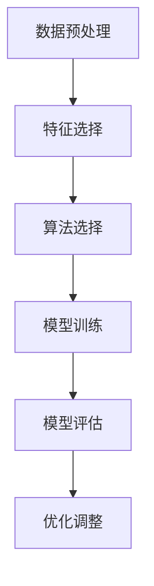
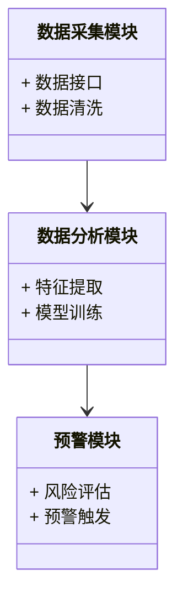
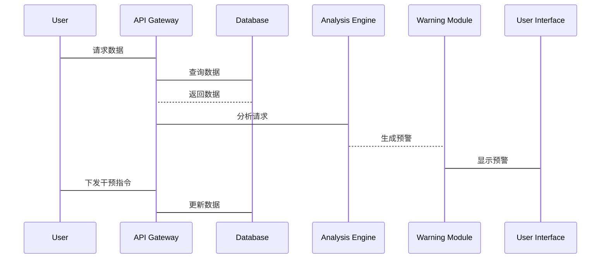

                 


# 设计智能化的企业财务压力预警系统

## 关键词：企业财务压力、预警系统、算法原理、系统架构、风险管理、Python实现

## 摘要：  
本文详细探讨了设计智能化的企业财务压力预警系统的各个方面。从背景介绍到核心概念，从算法原理到系统架构，从项目实战到最佳实践，系统性地分析了如何构建一个高效、准确的财务压力预警系统。文章结合实际案例，通过数学模型和具体代码实现，深入浅出地展示了如何利用技术手段帮助企业识别和应对财务风险。

---

# 第一部分: 企业财务压力预警系统背景与核心概念

## # 第1章: 企业财务压力预警系统概述

### ## 1.1 问题背景与描述

#### ### 1.1.1 企业财务压力的定义与表现  
企业财务压力是指企业在经营过程中由于内外部因素的影响，导致其财务状况恶化，可能出现偿债困难、现金流断裂等问题。其表现包括：  
- 财务报表数据异常（如应收账款 overdue、存货周转率下降等）；  
- 资金链紧张，难以支付日常运营费用；  
- 股东和投资者信心下降，企业价值受损。  

#### ### 1.1.2 企业财务风险的来源与影响  
企业财务压力的来源可以分为内部和外部两方面：  
- **内部因素**：管理不善、成本超支、库存积压等；  
- **外部因素**：经济波动、行业竞争加剧、政策变化等。  

财务压力的影响包括：  
- 企业信用评级下降；  
- 资金获取难度增加；  
- 企业倒闭或重组风险上升。  

#### ### 1.1.3 财务压力预警的必要性与意义  
财务压力预警系统能够帮助企业提前识别潜在风险，采取有效措施进行干预，从而降低损失。其意义在于：  
- 提高企业风险管理能力；  
- 优化资源配置，降低经营成本；  
- 增强企业抗风险能力，保障可持续发展。  

---

### ## 1.2 问题解决与边界

#### ### 1.2.1 财务压力预警的目标与范围  
- **目标**：通过实时监控和分析财务数据，提前预警潜在风险。  
- **范围**：涵盖企业财务数据的全生命周期，包括数据采集、分析、预警和干预。  

#### ### 1.2.2 系统边界与外延  
- 系统边界：仅关注财务数据，不涉及企业非财务信息（如人力资源、生产数据）。  
- 外延：可与企业ERP系统、CRM系统等集成，提供更全面的分析能力。  

#### ### 1.2.3 核心问题与解决方案  
- 核心问题：如何准确识别财务压力的早期信号。  
- 解决方案：结合机器学习算法，构建风险评估模型，实现智能化预警。  

---

### ## 1.3 核心概念与结构

#### ### 1.3.1 系统组成与核心要素  
智能化的财务压力预警系统通常包括以下核心要素：  
1. **数据采集模块**：实时采集企业的财务数据（如应收账款、应付账款、现金流等）。  
2. **数据分析模块**：对数据进行清洗、特征提取和建模分析。  
3. **预警模块**：根据模型结果，生成风险预警信号。  
4. **干预模块**：提供风险缓解建议，如调整资金分配、优化供应链等。  

#### ### 1.3.2 系统架构与功能模块  
- **功能模块**：数据采集、数据分析、预警触发、干预建议。  
- **架构**：采用分层架构，包括数据层、业务逻辑层和用户界面层。  

#### ### 1.3.3 核心概念之间的关系  
- 数据是系统的输入，模型是核心，预警是输出，干预是反馈。  

---

## # 第2章: 核心概念与联系

### ## 2.1 压力预警系统的核心概念

#### ### 2.1.1 财务压力的多维度分析  
- 财务压力可以从流动性、偿债能力、营运能力等多个维度进行分析。  

#### ### 2.1.2 压力源的分类与特征  
- **流动性压力**：现金流不足，难以支付短期债务。  
- **偿债压力**：长期债务负担过重。  
- **营运压力**：应收账款回收困难，影响日常运营。  

#### ### 2.1.3 风险评估与预警机制  
- 风险评估：基于财务指标的量化分析。  
- 预警机制：根据风险程度，分级触发预警信号。  

---

### ## 2.2 核心概念的属性对比

| 比较维度 | 企业规模 | 行业特点 | 时间维度 |
|----------|----------|----------|----------|
| 财务压力表现 | 大企业更复杂，小企业更敏感 | 行业特性明显，如制造企业重视库存周转 | 短期波动大，长期趋势显著 |
| 预警指标 | 需要考虑更多复杂因素 | 需要针对行业特点选择指标 | 需要长期数据分析支持 |
| 预警频率 | 更高频次 | 根据行业特点定制 | 更注重长期趋势分析 |

---

### ## 2.3 ER实体关系图

```mermaid
erDiagram
    customer[CUSTOMER] {
        +int customer_id
        +string name
        +string email
    }
    transaction[TRANSACTION] {
        +int transaction_id
        +float amount
        +date transaction_date
    }
    payment[PAYMENT] {
        +int payment_id
        +float amount
        +date payment_date
    }
    CUSTOMER --> TRANSPORT: customer makes transaction
    TRANSPORT --> PAYMENT: transaction requires payment
```

---

## # 第3章: 算法原理与数学模型

### ## 3.1 数据预处理与特征选择

#### ### 3.1.1 数据清洗与标准化  
- 数据清洗：去除缺失值、异常值。  
- 数据标准化：将数据归一化，便于模型训练。  

#### ### 3.1.2 特征提取与降维方法  
- 特征提取：从财务数据中提取关键指标（如流动比率、速动比率等）。  
- 降维方法：使用主成分分析（PCA）减少特征维度。  

---

### ## 3.2 模型训练与评估

#### ### 3.2.1 算法选择与优化  
- 算法选择：逻辑回归、随机森林等。  
- 模型优化：调整超参数，如学习率、树深等。  

#### ### 3.2.2 模型训练流程图  



#### ### 3.2.3 模型评估指标与优化策略  
- 评估指标：准确率、召回率、F1分数。  
- 优化策略：交叉验证、网格搜索。  

---

### ## 3.3 数学模型与公式

#### ### 3.3.1 风险评估模型  
风险评分公式：  
$$ \text{风险评分} = \alpha \times \text{流动比率} + \beta \times \text{速动比率} + \gamma \times \text{应收账款周转率} $$  

其中，$\alpha$、$\beta$、$\gamma$为权重系数，可通过训练数据确定。  

#### ### 3.3.2 模型优化与验证  
- 模型验证：使用测试数据集进行验证，计算准确率和召回率。  
- 模型优化：通过网格搜索调整模型参数，提升性能。  

---

## # 第4章: 系统分析与架构设计

### ## 4.1 问题场景

- **场景1**：企业应收账款逾期率上升，现金流紧张。  
- **场景2**：原材料价格上涨，导致成本超支。  

---

### ## 4.2 功能设计

#### ### 4.2.1 系统功能模块  



---

### ## 4.3 系统架构设计

#### ### 4.3.1 系统架构  

```mermaid
graph TD
    API Gateway --> Database
    Database --> Analysis Engine
    Analysis Engine --> Warning Module
    Warning Module --> User Interface
```

---

### ## 4.4 接口设计和交互

#### ### 4.4.1 API接口  

- 数据接口：用于数据采集模块与数据库交互。  
- 分析接口：用于前端调用分析结果。  

#### ### 4.4.2 交互流程  



---

## # 第5章: 项目实战

### ## 5.1 环境安装

- **工具安装**：Python、Jupyter Notebook、Pandas、Scikit-learn、Mermaid。  
- **库安装**：`pip install pandas scikit-learn mermaid4jupyter`  

---

### ## 5.2 核心代码实现

#### ### 5.2.1 数据采集模块  

```python
import pandas as pd

# 数据采集
def fetch_financial_data(company_id):
    # 数据采集逻辑
    pass

# 数据清洗
def clean_data(df):
    df.dropna(inplace=True)
    df.drop_duplicates(inplace=True)
    return df

# 特征提取
def extract_features(df):
    features = ['流动资产', '流动负债', '应收账款']
    df_features = df[features]
    return df_features

# 模型训练
from sklearn.model

