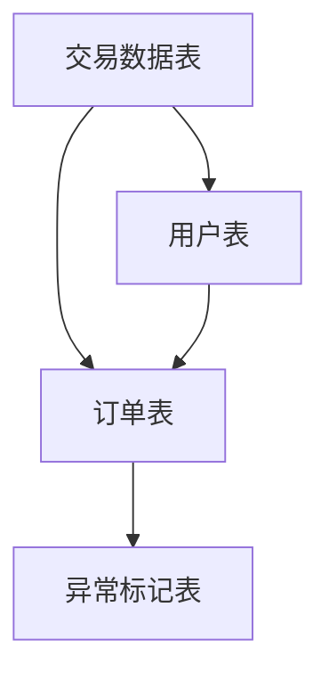
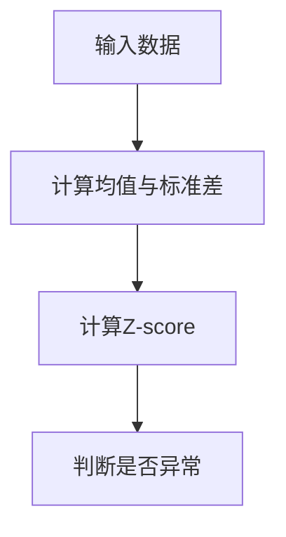
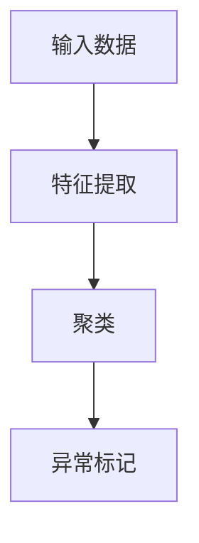
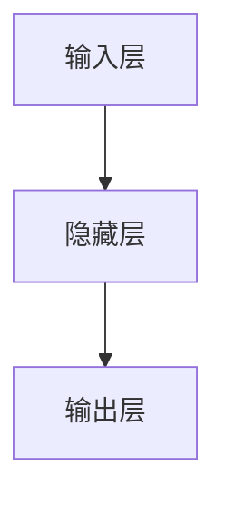
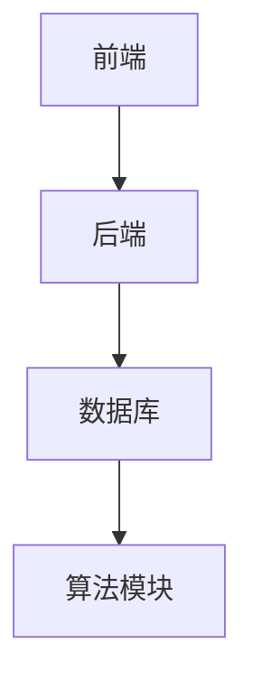

                 


# 设计智能化的企业财务异常交易检测系统

> 关键词：企业财务异常交易检测系统、智能化检测、机器学习、异常检测算法、系统架构设计

> 摘要：本文详细探讨了设计智能化企业财务异常交易检测系统的各个方面，从背景与意义、核心概念与原理、系统架构与实现、项目实战到扩展阅读与未来展望。文章首先介绍了财务异常交易检测的重要性，分析了智能化检测的必要性，随后详细阐述了系统的核心概念、算法原理和系统架构设计，并通过实际案例展示了系统的实现过程。最后，文章总结了最佳实践，并展望了未来的发展方向。

---

# 第1章: 财务异常交易检测的背景与意义

## 1.1 企业财务异常交易的定义与背景
### 1.1.1 财务异常交易的定义
财务异常交易是指在企业财务活动中，由于人为操作、系统漏洞或外部因素导致的不符合常规的交易行为。这些交易可能涉及欺诈、舞弊、错误记录或其他违规行为，通常会对企业的财务健康状况造成负面影响。

### 1.1.2 财务异常交易的常见类型
- **欺诈性交易**：如虚假发票、虚增收入、虚减支出等。
- **错误性交易**：如数据录入错误、会计处理失误等。
- **异常性交易**：如突然增加的关联交易、异常大额交易等。

### 1.1.3 财务异常交易对企业的影响
- 财务数据失真，影响决策。
- 损害企业声誉，影响市场信任。
- 可能导致法律风险和财务损失。

## 1.2 智能化检测的必要性
### 1.2.1 传统财务检测的局限性
传统财务检测方法依赖人工审核，效率低、覆盖面有限，难以应对日益复杂的交易环境。

### 1.2.2 智能化检测的优势
- **高效性**：通过自动化技术快速分析海量数据。
- **准确性**：利用机器学习算法提高异常检测的准确性。
- **实时性**：能够实时监控交易，及时发现异常行为。

### 1.2.3 企业智能化转型的趋势
随着人工智能和大数据技术的发展，企业逐步向智能化方向转型，智能化检测成为必然选择。

## 1.3 本章小结
本章介绍了财务异常交易的定义、常见类型及其对企业的影响，分析了传统检测方法的局限性，并强调了智能化检测的必要性和优势。

---

# 第2章: 智能化检测系统的核心概念

## 2.1 系统组成与功能模块
### 2.1.1 数据采集模块
负责从企业财务系统中获取交易数据，包括订单、发票、账单等。

### 2.1.2 数据处理模块
对采集到的数据进行清洗、转换和标准化处理，确保数据质量。

### 2.1.3 异常检测算法模块
应用统计分析、机器学习等算法对数据进行分析，识别异常交易。

### 2.1.4 结果分析与报告模块
对检测结果进行分析，生成报告并提供改进建议。

## 2.2 核心概念属性对比表
| 概念 | 属性 | 描述 |
|------|------|------|
| 数据源 | 类型 | 财务数据、交易记录 |
| 异常检测 | 方法 | 统计分析、机器学习 |
| 系统架构 | 层次 | 前端、后端、数据库 |

## 2.3 实体关系图（ER图）


## 2.4 本章小结
本章详细介绍了智能化检测系统的组成与功能模块，通过对比表和ER图展示了系统的核心概念及其关系。

---

# 第3章: 异常检测算法原理

## 3.1 基于统计的异常检测算法
### 3.1.1 Z-score方法
$$ z = \frac{x - \mu}{\sigma} $$
其中，$\mu$ 是均值，$\sigma$ 是标准差，$x$ 是待检测的值。

### 3.1.2 算法流程图


## 3.2 基于机器学习的异常检测算法
### 3.2.1 聚类分析


## 3.3 神经网络异常检测
### 3.3.1 网络结构


## 3.4 本章小结
本章介绍了几种常用的异常检测算法，包括基于统计的Z-score方法和基于机器学习的聚类分析、神经网络方法，并通过流程图展示了算法的实现步骤。

---

# 第4章: 系统架构设计

## 4.1 系统功能模块设计
### 4.1.1 数据采集模块
从企业财务系统中实时采集交易数据。

### 4.1.2 数据预处理模块
对数据进行清洗、转换和标准化处理。

### 4.1.3 异常检测模块
应用机器学习算法对数据进行分析，识别异常交易。

### 4.1.4 结果展示模块
将检测结果以可视化形式展示，方便用户查看。

## 4.2 系统架构图


## 4.3 接口设计
### 4.3.1 数据接口
负责与企业财务系统的数据对接。

### 4.3.2 算法接口
负责与异常检测算法的交互。

## 4.4 本章小结
本章详细设计了智能化检测系统的架构，包括功能模块、架构图和接口设计。

---

# 第5章: 项目实战

## 5.1 环境安装
需要安装Python、机器学习库（如Scikit-learn、TensorFlow）和数据处理工具（如Pandas、NumPy）。

## 5.2 系统核心实现源代码
```python
import pandas as pd
from sklearn.ensemble import IsolationForest

# 数据加载
data = pd.read_csv('transactions.csv')

# 数据预处理
data_processed = data[['amount', 'time', 'user_id']]

# 模型训练
model = IsolationForest(n_estimators=100, random_state=42)
model.fit(data_processed)

# 异常检测
预测结果 = model.predict(data_processed)
异常交易 = data_processed[预测结果 == -1]
```

## 5.3 实际案例分析
通过一个实际案例，展示了如何利用Isolation Forest算法检测异常交易。

## 5.4 本章小结
本章通过实际项目展示了智能化检测系统的实现过程，包括环境安装、代码实现和案例分析。

---

# 第6章: 扩展阅读与未来展望

## 6.1 扩展阅读
推荐阅读相关领域的书籍和论文，如《异常检测算法综述》和《机器学习在金融领域的应用》。

## 6.2 未来展望
随着人工智能和大数据技术的不断发展，智能化检测系统将更加智能化和高效化，未来可能在更多领域得到广泛应用。

## 6.3 本章小结
本章总结了文章的主要内容，并展望了未来的发展方向。

---

# 附录: 常见问题解答

## A.1 系统如何处理数据隐私问题？
通过数据加密和访问控制确保数据隐私。

## A.2 系统如何保证实时性？
通过分布式架构和流数据处理技术实现实时检测。

## A.3 系统如何进行模型更新？
定期采集新数据，重新训练模型以保持检测准确性。

---

通过以上章节的详细阐述，本文全面探讨了设计智能化企业财务异常交易检测系统的核心概念、算法原理和实现方法，为读者提供了丰富的理论和实践指导。

