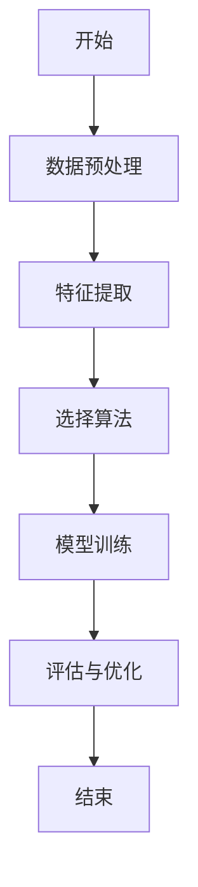

                 


# 设计智能化的企业财务异常检测模型

> 关键词：企业财务异常检测，人工智能，机器学习，深度学习，模型设计，系统架构

> 摘要：本文旨在设计一种智能化的企业财务异常检测模型，通过结合财务数据的特征分析和先进的AI技术，提出一种高效、准确的异常检测方法。文章详细介绍了模型的设计思路、实现过程以及实际应用中的注意事项，为读者提供一个全面的解决方案。

---

## 目录大纲

### 第一章：企业财务异常检测模型的背景与问题描述

#### 1.1 问题背景
- 1.1.1 企业财务异常的定义与特征
- 1.1.2 财务异常对企业的影响
- 1.1.3 传统财务检测的局限性

#### 1.2 问题描述
- 1.2.1 财务异常检测的核心目标
- 1.2.2 数据来源与处理挑战
- 1.2.3 智能化检测的必要性

#### 1.3 模型边界与外延
- 1.3.1 检测范围与应用场景
- 1.3.2 模型的适用性与局限性
- 1.3.3 检测结果的法律与伦理问题

### 第二章：核心概念与联系

#### 2.1 财务异常检测模型的核心原理
- 2.1.1 数据预处理与特征工程
- 2.1.2 异常检测算法的分类
- 2.1.3 模型训练与调优

#### 2.2 核心概念对比表
| 概念       | 数据特征 | 检测算法 | 模型评估 |
|------------|----------|----------|----------|
| 特征1      | 数量     | 精度     | 准确率   |
| 特征2      | 类型     | 计算复杂度 | 召回率   |
| 特征3      | 时间性   | 可解释性 | F1分数   |

#### 2.3 ER实体关系图
```mermaid
erDiagram
    customer[CUSTOMER] {
        code : string
        name : string
        transactions : array
    }
    transaction[TRANSACTION] {
        id : integer
        amount : float
        date : date
        type : string
    }
    CUSTOMER --> TRANSACTIONS : has
```

### 第三章：异常检测算法原理

#### 3.1 常见异常检测算法
- 3.1.1 聚类算法（K-Means, DBSCAN）
- 3.1.2 神经网络（Autoencoder, CNN）
- 3.1.3 统计方法（Z-Score, IQR）

#### 3.2 算法流程图


#### 3.3 算法实现代码
```python
import numpy as np
from sklearn.cluster import DBSCAN

# 示例数据
X = np.array([[1, 2], [2, 3], [3, 4], [4, 5], [5, 6]])

# 使用DBSCAN进行异常检测
clustering = DBSCAN(eps=1.5, min_samples=2).fit(X)
print(clustering.labels_)
```

### 第四章：系统架构设计

#### 4.1 系统功能设计
- 4.1.1 数据采集模块
- 4.1.2 数据处理模块
- 4.1.3 模型服务模块
- 4.1.4 用户界面模块

#### 4.2 系统架构图


#### 4.3 接口设计与交互流程
- 数据接口：API设计与调用
- 模型接口：预测结果输出
- 用户交互：异常报告展示

### 第五章：项目实战

#### 5.1 环境安装与数据准备
- 安装Python环境与相关库
- 数据集获取与预处理

#### 5.2 核心代码实现
```python
import pandas as pd
from sklearn.ensemble import IsolationForest

# 数据加载
df = pd.read_csv('financial_data.csv')
X = df.values

# 模型训练
model = IsolationForest(contamination=0.05)
model.fit(X)

# 预测异常点
y_pred = model.predict(X)
print(y_pred)
```

#### 5.3 实际案例分析
- 数据特征分析
- 模型训练与调优
- 结果分析与解释

### 第六章：最佳实践与小结

#### 6.1 实践经验总结
- 数据预处理的重要性
- 模型选择与调优的注意事项
- 结果解释与应用

#### 6.2 小结与展望
- 当前模型的局限性
- 未来研究方向
- 技术发展趋势

### 第七章：附录

#### 7.1 数据集说明
- 数据来源与格式
- 数据字段描述

#### 7.2 工具安装指南
- Python环境搭建
- 库的安装与配置

#### 7.3 参考文献
- 相关书籍与论文推荐
- 在线资源与社区支持

---

通过以上目录大纲，文章将系统地介绍企业财务异常检测模型的设计与实现，从理论到实践，帮助读者全面掌握相关知识。

