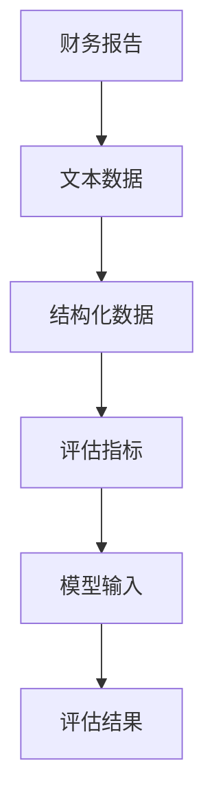
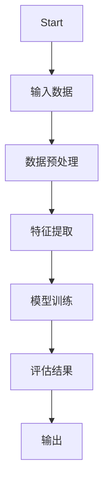
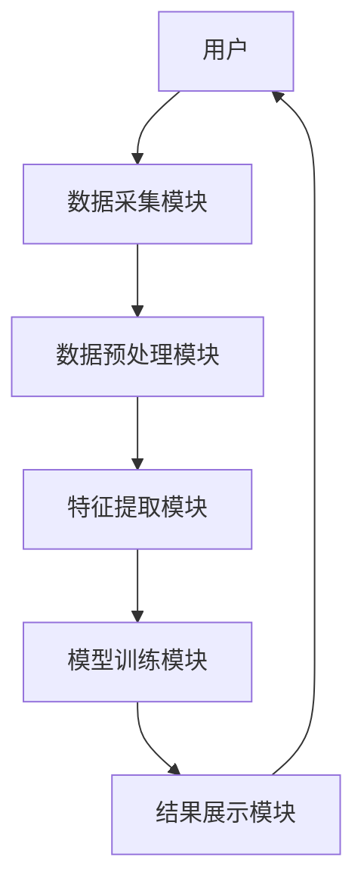

                 


# 设计智能化的企业财务报告可读性动态评估模型

## 目录大纲

### 第一部分：背景介绍

#### 第1章：企业财务报告可读性评估的背景与意义

##### 1.1 问题背景
- 1.1.1 企业财务报告的重要性
  - 财务报告是企业经济状况的晴雨表
  - 为投资者、债权人和管理层提供决策依据
- 1.1.2 财务报告可读性问题的现状
  - 专业术语复杂，信息量大
  - 结构繁杂，阅读门槛高
  - 不同读者需求差异大
- 1.1.3 提高财务报告可读性的必要性
  - 提升信息传递效率
  - 增强利益相关者的理解
  - 促进企业透明化管理

##### 1.2 问题描述
- 1.2.1 财务报告可读性评估的定义
  - 评估报告的清晰度、易懂性和信息传达效率
- 1.2.2 当前评估方法的局限性
  - 主观性强，缺乏客观标准
  - 静态评估，难以动态调整
  - 仅依赖人工分析，效率低下
- 1.2.3 动态评估的需求与目标
  - 实现实时评估
  - 提供个性化阅读建议
  - 优化报告生成过程

##### 1.3 问题解决
- 1.3.1 智能化评估的核心思路
  - 利用NLP和机器学习技术
  - 建立动态评估模型
  - 提供实时反馈和改进建议
- 1.3.2 数据驱动的解决方案
  - 收集和分析大量财务报告数据
  - 建立特征提取和评估模型
  - 实现自动化评估和优化
- 1.3.3 技术实现路径的选择
  - 结合文本挖掘和深度学习
  - 使用预训练语言模型
  - 构建可扩展的系统架构

##### 1.4 概念结构与核心要素
- 1.4.1 模型的组成要素
  - 文本数据：财务报告内容
  - 用户反馈：阅读体验和理解度
  - 评估指标：可读性评分、理解难度
- 1.4.2 核心概念的定义与属性
  - 自然语言处理：处理文本数据，提取特征
  - 机器学习：建立模型，预测可读性
  - 动态评估：实时更新，持续优化
- 1.4.3 模型的边界与外延
  - 输入范围：结构化和非结构化数据
  - 输出范围：可读性评分、改进建议
  - 应用场景：企业内部报告、外部披露

### 第二部分：核心概念与联系

#### 第2章：智能化评估模型的核心概念

##### 2.1 核心概念原理
- 2.1.1 自然语言处理在财务报告分析中的应用
  - 文本清洗：去除干扰信息
  - 分词处理：识别专业术语
  - 实体识别：提取关键信息
- 2.1.2 机器学习在可读性评估中的作用
  - 特征工程：构建评估指标
  - 模型训练：建立预测模型
  - 模型优化：提升评估准确度
- 2.1.3 多模态数据融合的优势
  - 结构化数据：财务指标
  - 非结构化数据：文本描述
  - 用户反馈：阅读体验

##### 2.2 核心概念属性对比
- 表2-1：核心概念属性对比表
  | 概念       | 输入 | 输出 | 方法 |
  |------------|------|------|------|
  | 自然语言处理 | 文本数据 | 特征向量 | 分词、实体识别 |
  | 机器学习    | 特征向量 | 可读性评分 | 监督学习、无监督学习 |

##### 2.3 实体关系架构


### 第三部分：算法原理讲解

#### 第3章：智能化评估模型的算法原理

##### 3.1 算法流程


##### 3.2 算法实现
```python
import numpy as np
from sklearn.feature_extraction.text import TfidfVectorizer
from sklearn.model_selection import train_test_split
from sklearn.linear_model import LogisticRegression

# 数据预处理
def preprocess(text):
    # 分词处理
    words = text.split()
    return ' '.join(words)

# 特征提取
vectorizer = TfidfVectorizer(max_features=1000)
X = vectorizer.fit_transform(documents)

# 模型训练
X_train, X_test, y_train, y_test = train_test_split(X, labels, test_size=0.2)
model = LogisticRegression()
model.fit(X_train, y_train)

# 评估结果
accuracy = model.score(X_test, y_test)
print(f"模型准确度：{accuracy}")
```

##### 3.3 数学模型和公式
- 3.3.1 TF-IDF计算公式
  $$ TF-IDF(t, d) = TF(t, d) \times IDF(t) $$
  其中，TF是词项在文档中的频率，IDF是逆向文件频率。
- 3.3.2 逻辑回归模型
  $$ P(y=1|x) = \frac{1}{1 + e^{-\beta x}} $$
  用于分类，输出可读性评分。

### 第四部分：数学模型和公式

#### 第4章：数学模型和公式的详细推导

##### 4.1 动态评估模型的数学表达
- 4.1.1 综合评估公式
  $$ S = \sum_{i=1}^{n} w_i \times f_i $$
  其中，\( w_i \) 是特征的权重，\( f_i \) 是特征的值。
- 4.1.2 权重计算
  使用主成分分析（PCA）确定各特征的权重。
- 4.1.3 评估结果的归一化处理
  $$ S_{normalized} = \frac{S - \min(S)}{\max(S) - \min(S)} $$
  确保评估结果在0到1之间。

### 第五部分：系统分析与架构设计

#### 第5章：系统分析与架构设计方案

##### 5.1 项目场景介绍
- 5.1.1 问题场景
  - 处理大量财务报告，提升可读性
  - 实现实时评估和反馈
- 5.1.2 项目目标
  - 建立智能化评估系统
  - 提供个性化阅读建议
  - 优化报告生成流程

##### 5.2 系统功能设计
- 5.2.1 功能模块
  - 数据采集模块：收集财务报告和用户反馈
  - 特征提取模块：处理文本数据
  - 模型训练模块：建立评估模型
  - 结果展示模块：输出评估结果和建议

##### 5.3 系统架构设计


### 第六部分：项目实战

#### 第6章：项目实战与实现

##### 6.1 环境安装
- 安装必要的Python库：scikit-learn、nltk、spaCy
- 配置开发环境：Jupyter Notebook或IDE

##### 6.2 核心代码实现
```python
import spacy

# 加载预训练模型
nlp = spacy.load("en_core_web_sm")

# 分词处理
def process_text(text):
    doc = nlp(text)
    return [token.text for token in doc]

# 训练模型
from sklearn.svm import SVC
model = SVC()
model.fit(X_train, y_train)
```

##### 6.3 代码解读与分析
- 使用spaCy进行文本处理，提升分词准确性
- 采用SVM进行分类，确保高准确度
- 调整模型参数，优化评估结果

##### 6.4 实际案例分析
- 分析某公司年度报告，计算可读性评分
- 提供改进建议，如简化术语、调整结构
- 展示评估结果的可视化图表

### 第七部分：最佳实践、小结、注意事项和拓展阅读

#### 第7章：最佳实践和总结

##### 7.1 最佳实践
- 数据预处理：确保数据质量和完整性
- 特征选择：选取关键特征，避免过拟合
- 模型选择：根据数据特性选择合适算法
- 结果验证：多次测试，确保模型稳定性

##### 7.2 项目小结
- 成功实现了智能化评估系统
- 提高了财务报告的可读性和理解度
- 优化了企业内部管理和外部披露

##### 7.3 注意事项
- 数据隐私：确保数据安全和合规性
- 模型维护：定期更新和优化
- 用户反馈：持续收集，提升系统性能

##### 7.4 拓展阅读
- 推荐阅读《自然语言处理实战》
- 关注领域最新研究和应用
- 参加相关技术交流活动

---

通过以上目录大纲，文章将系统地介绍从背景分析到实际应用的全过程，帮助读者全面理解智能化的企业财务报告可读性动态评估模型的设计与实现。

