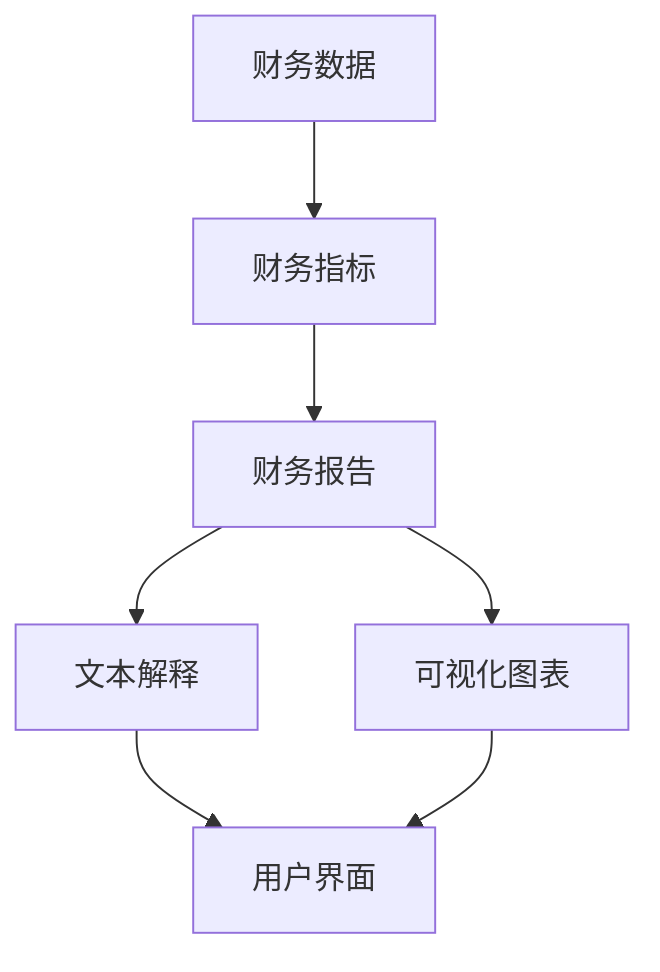
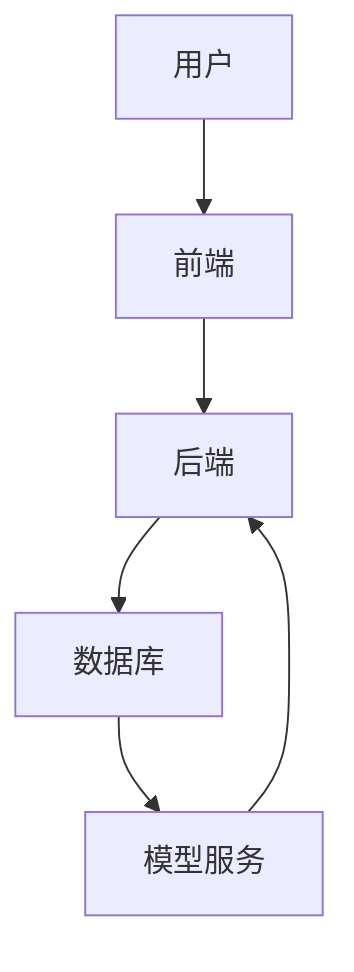
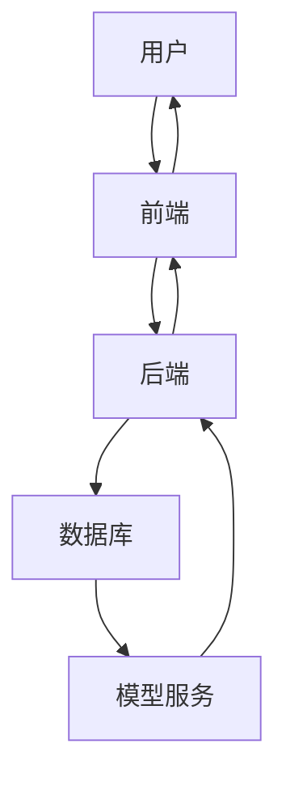

                 


# 设计智能化的企业财务报告可读性增强模型

## 关键词：人工智能，自然语言处理，企业财务，可读性增强，智能化系统

## 摘要：本文章详细探讨了设计智能化的企业财务报告可读性增强模型的全过程。首先分析了传统财务报告的局限性以及智能化增强的必要性，接着阐述了模型的核心概念与算法原理，包括数据预处理、模型结构和训练方法。然后，详细设计了系统的架构与功能，包括系统功能设计、架构设计和接口设计。最后，通过实际案例展示了模型的实现过程和效果，并总结了最佳实践和未来研究方向。

---

# 第1章: 企业财务报告可读性增强模型的背景与问题描述

## 1.1 问题背景

### 1.1.1 传统财务报告的局限性
传统的财务报告通常以表格和数字为主，虽然信息量丰富，但缺乏直观性和易读性。对于非专业人员来说，理解和分析这些数据存在较大的困难，导致信息传递效率低下。

### 1.1.2 智能化财务报告的需求驱动
随着企业规模的扩大和业务的复杂化，财务报告的信息量急剧增加，传统的阅读方式难以满足需求。智能化财务报告可以通过自然语言生成和可视化技术，帮助用户更高效地理解和分析数据。

### 1.1.3 企业财务信息传递的痛点分析
- 数据量大，信息分散，难以快速获取关键信息。
- 专业术语多，非专业人员难以理解。
- 数据更新频繁，手工整理效率低下。

## 1.2 问题描述

### 1.2.1 财务报告可读性差的主要原因
- 数据过于复杂，缺乏直观的解释。
- 缺乏个性化的信息呈现方式。
- 信息更新不及时，难以满足实时需求。

### 1.2.2 用户需求与现有系统的差距
用户希望财务报告能够：
- 自动生成简洁明了的文本解释。
- 提供直观的可视化图表。
- 支持个性化定制，满足不同用户的需求。

### 1.2.3 智能化增强的必要性与目标
智能化增强的必要性：
- 提高信息传递效率。
- 降低用户的学习成本。
- 增强数据的洞察力。

目标：
- 自动化生成易于理解的财务报告。
- 提供多样化的数据呈现方式。
- 支持多维度的数据分析。

## 1.3 问题解决思路

### 1.3.1 智能化增强的核心目标
- 提高财务报告的可读性和可理解性。
- 提供个性化的信息呈现方式。
- 实现自动化数据更新和分析。

### 1.3.2 数据驱动的解决方案
- 利用大数据技术处理和分析财务数据。
- 通过自然语言处理生成易读的财务报告。
- 使用可视化技术直观展示数据。

### 1.3.3 技术实现路径的选择
- 数据预处理：清洗和结构化财务数据。
- 模型训练：使用深度学习生成自然语言解释。
- 可视化设计：通过图表展示关键财务指标。

## 1.4 模型的边界与外延

### 1.4.1 核心功能边界
- 数据处理：清洗和结构化财务数据。
- 文本生成：生成易读的财务报告。
- 可视化展示：提供直观的图表。

### 1.4.2 功能的外延与扩展
- 多语言支持：支持多种语言生成财务报告。
- 多平台适配：适配不同设备和操作系统。
- 高度定制化：支持个性化需求。

### 1.4.3 与其他系统的接口关系
- 与企业ERP系统对接，实时获取财务数据。
- 与邮件系统对接，自动发送财务报告。
- 与数据分析工具对接，支持深度分析。

## 1.5 概念结构与核心要素

### 1.5.1 模型的核心组成要素
- 数据源：财务报表、业务数据。
- 数据预处理：清洗、结构化。
- 模型训练：生成自然语言解释。
- 可视化展示：图表、仪表盘。
- 用户界面：网页或桌面应用。

### 1.5.2 要素之间的关系
- 数据源是模型输入的基础。
- 数据预处理确保数据的可用性。
- 模型训练生成文本和可视化内容。
- 用户界面展示最终结果。

### 1.5.3 模型的逻辑架构
1. 数据采集：从企业系统中获取财务数据。
2. 数据清洗：处理缺失值、异常值。
3. 数据分析：提取关键财务指标。
4. 文本生成：使用NLP生成自然语言描述。
5. 可视化设计：生成图表和仪表盘。
6. 结果展示：通过用户界面呈现。

## 1.6 本章小结
本章详细分析了设计智能化企业财务报告可读性增强模型的背景和问题，明确了模型的核心目标和实现路径，为后续章节的深入分析奠定了基础。

---

# 第2章: 核心概念与联系

## 2.1 模型的核心概念原理

### 2.1.1 数据预处理与特征提取
数据预处理：
- 清洗数据：处理缺失值、重复值。
- 结构化数据：将非结构化数据转化为结构化数据。
- 数据标准化：统一数据格式和单位。

特征提取：
- 关键财务指标：如净利润、毛利率、资产负债率。
- 时间序列特征：如月度、季度数据趋势。
- 文本特征：如关键词提取、主题模型。

### 2.1.2 文本生成与可读性优化
文本生成：
- 使用循环神经网络（RNN）或变换器（Transformer）模型生成自然语言描述。
- 通过注意力机制提高生成文本的相关性。

可读性优化：
- 语言简洁：避免复杂术语，使用通俗易懂的语言。
- 结构清晰：分段明确，逻辑连贯。
- 个性化语气：根据用户需求调整语气和风格。

### 2.1.3 可视化辅助理解
可视化类型：
- 折线图：展示趋势变化。
- 条形图：比较不同项目的数据。
- 饼图：展示构成比例。
- 仪表盘：综合展示关键指标。

可视化工具：
- Matplotlib：用于生成基础图表。
- Seaborn：用于生成统计图表。
- Tableau：用于生成交互式仪表盘。

## 2.2 核心概念属性对比

### 2.2.1 数据特征对比表

| 数据特征 | 传统财务报告 | 智能化财务报告 |
|----------|--------------|----------------|
| 可读性   | 低           | 高             |
| 信息呈现 | 表格为主      | 文本+图表       |
| 个性化   | 无           | 支持           |

### 2.2.2 模型性能对比表

| 模型性能   | 传统方法     | 智能化模型     |
|------------|--------------|----------------|
| 处理效率   | 低           | 高             |
| 准确率     | 一般         | 高             |
| 可扩展性   | 差           | 好             |

### 2.2.3 用户需求对比表

| 用户需求   | 传统需求     | 智能化需求     |
|------------|--------------|----------------|
| 理解难度   | 高           | 低             |
| 信息获取   | 被动         | 主动           |
| 定制化     | 无           | 支持           |

## 2.3 ER实体关系图



## 2.4 本章小结
本章详细分析了模型的核心概念和各部分之间的关系，通过对比和图表展示了智能化财务报告在数据特征、模型性能和用户需求方面的优势。

---

# 第3章: 模型算法原理

## 3.1 模型训练过程

### 3.1.1 数据预处理
- 数据清洗：处理缺失值和异常值。
- 数据标注：将财务数据标注为可读的文本。
- 数据分割：将数据集分为训练集、验证集和测试集。

### 3.1.2 模型结构
- 输入层：接收财务数据。
- 隐藏层：通过神经网络处理数据。
- 输出层：生成自然语言解释。

### 3.1.3 损失函数与优化目标
损失函数：
$$L = -\sum_{i=1}^{n} y_i \log p(y_i)$$
优化目标：
$$\min_{\theta} L + \lambda ||\theta||^2$$
其中，$\lambda$ 是正则化系数，$||\theta||^2$ 是权重的L2正则化项。

## 3.2 NLP技术在文本生成中的应用

### 3.2.1 文本生成算法
- 循环神经网络（RNN）：适合处理序列数据。
- 变换器（Transformer）：基于自注意力机制，性能更优。

### 3.2.2 模型训练流程
1. 数据预处理：清洗和标注。
2. 模型初始化：设置初始权重。
3. 前向传播：生成预测文本。
4. 计算损失：计算预测与真实文本的差异。
5. 反向传播：更新模型参数。
6. 模型评估：验证效果并调整参数。

### 3.2.3 可读性评估指标
- BLEU：基于n-gram的精确匹配。
- ROUGE：基于召回率的评估。
- Perplexity：模型对数据的拟合程度。

## 3.3 模型的数学表达

### 3.3.1 损失函数
$$L = -\sum_{i=1}^{n} y_i \log p(y_i)$$
其中，$y_i$ 是真实标签的概率，$p(y_i)$ 是模型预测的概率。

### 3.3.2 优化目标
$$\min_{\theta} L + \lambda ||\theta||^2$$
其中，$\lambda$ 是正则化系数，$||\theta||^2$ 是权重的L2正则化项。

## 3.4 本章小结
本章详细分析了模型的训练过程和算法原理，通过数学公式和流程图展示了模型的实现细节。

---

# 第4章: 系统分析与架构设计

## 4.1 项目背景与目标

### 4.1.1 项目背景
随着企业数字化转型的推进，智能化财务报告的需求日益增加。传统财务报告的局限性日益明显，亟需智能化解决方案。

### 4.1.2 项目目标
- 实现智能化财务报告生成系统。
- 提高财务报告的可读性和可理解性。
- 提供个性化的信息呈现方式。

## 4.2 系统功能设计

### 4.2.1 系统功能模块
- 数据采集模块：从企业系统中获取财务数据。
- 数据处理模块：清洗和结构化数据。
- 模型生成模块：生成自然语言解释和可视化图表。
- 用户界面模块：展示结果并支持交互。

### 4.2.2 功能实现流程
1. 数据采集：从ERP系统获取财务数据。
2. 数据清洗：处理缺失值和异常值。
3. 数据分析：提取关键财务指标。
4. 文本生成：生成自然语言解释。
5. 可视化设计：生成图表和仪表盘。
6. 结果展示：通过用户界面呈现。

## 4.3 系统架构设计

### 4.3.1 架构设计
- 前端：Web界面或桌面应用，展示结果。
- 后端：服务器处理数据和模型推理。
- 数据层：数据库存储财务数据和生成内容。

### 4.3.2 系统架构图



## 4.4 系统接口设计

### 4.4.1 接口定义
- 数据接口：从ERP系统获取财务数据。
- 文本生成接口：生成自然语言解释。
- 可视化接口：生成图表。

### 4.4.2 接口调用流程
1. 用户发起请求：选择生成报告的参数。
2. 前端调用后端接口。
3. 后端调用数据接口获取数据。
4. 后端调用模型接口生成文本和图表。
5. 前端展示生成内容。

## 4.5 系统交互流程

### 4.5.1 交互流程图



## 4.6 本章小结
本章详细设计了系统的架构和功能，通过流程图和接口设计展示了系统的实现细节。

---

# 第5章: 项目实战

## 5.1 环境安装

### 5.1.1 安装Python环境
安装Python 3.8及以上版本，推荐使用Anaconda或virtualenv管理环境。

### 5.1.2 安装依赖库
- `numpy`：数据处理。
- `pandas`：数据框操作。
- `tensorflow`：深度学习框架。
- `matplotlib`：数据可视化。
- `transformers`：NLP模型库。

安装命令：
```
pip install numpy pandas tensorflow matplotlib transformers
```

## 5.2 核心代码实现

### 5.2.1 数据预处理代码

```python
import pandas as pd
import numpy as np

def data_cleaning(df):
    df = df.dropna()
    df = df.drop_duplicates()
    df = df.astype('float64')
    return df

# 示例数据
data = {'revenue': [100, 200, 300], 
        'expenses': [80, 150, 220]}
df = pd.DataFrame(data)
df_cleaned = data_cleaning(df)
print(df_cleaned)
```

### 5.2.2 模型训练代码

```python
import tensorflow as tf
from tensorflow.keras import layers

model = tf.keras.Sequential([
    layers.Dense(64, activation='relu'),
    layers.Dense(1, activation='sigmoid')
])
model.compile(optimizer='adam', loss='binary_crossentropy')
model.fit(x_train, y_train, epochs=10, batch_size=32)
```

### 5.2.3 文本生成代码

```python
from transformers import BartForConditionalGeneration, BartTokenizer

tokenizer = BartTokenizer.from_pretrained('facebook/bart-large')
model = BartForConditionalGeneration.from_pretrained('facebook/bart-large')

input_text = "Generate a summary of the financial report."
inputs = tokenizer.encode(input_text, return_tensors='pt')
outputs = model.generate(inputs, max_length=50)
print(tokenizer.decode(outputs[0]))
```

## 5.3 代码应用解读与分析

### 5.3.1 数据预处理代码解读
- `data_cleaning`函数：处理缺失值和重复值，确保数据质量。
- 示例数据：创建一个简单的财务数据表，包括收入和支出。

### 5.3.2 模型训练代码解读
- 使用Keras构建一个简单的神经网络模型。
- 使用Adam优化器和二进制交叉熵损失函数进行训练。

### 5.3.3 文本生成代码解读
- 使用预训练的BART模型生成文本。
- 输入文本并生成总结，展示模型的文本生成能力。

## 5.4 实际案例分析

### 5.4.1 案例背景
某公司2023年 quarterly financial report.

### 5.4.2 数据分析
- 总收入：100万。
- 净利润：20万。
- 资产负债率：60%。

### 5.4.3 文本生成
通过模型生成自然语言解释：
- "公司在2023年第一季度实现了100万的总收入，净利润为20万，资产负债率为60%。"

### 5.4.4 可视化展示
生成折线图展示季度收入变化，条形图展示收入和支出对比。

## 5.5 本章小结
本章通过实际案例展示了模型的实现过程，从数据预处理到模型训练，再到文本生成和可视化展示，详细解读了代码的应用。

---

# 第6章: 最佳实践、小结、注意事项、拓展阅读

## 6.1 最佳实践

### 6.1.1 数据预处理
- 确保数据的完整性和准确性。
- 使用合适的方法处理缺失值和异常值。

### 6.1.2 模型选择
- 根据任务需求选择合适的模型。
- 调参和优化模型性能。

### 6.1.3 可视化设计
- 使用直观的图表展示数据。
- 考虑用户的视觉习惯和需求。

## 6.2 小结
本章总结了设计智能化企业财务报告可读性增强模型的核心内容，包括数据预处理、模型训练、文本生成和可视化展示，强调了各部分的重要性。

## 6.3 注意事项

### 6.3.1 数据隐私
- 确保数据的安全和隐私，避免泄露敏感信息。

### 6.3.2 模型泛化能力
- 避免过拟合，确保模型的泛化能力。
- 使用交叉验证和正则化技术。

### 6.3.3 用户体验
- 设计友好的用户界面，提高用户体验。
- 提供多种交互方式，满足不同用户需求。

## 6.4 拓展阅读

### 6.4.1 推荐书籍
- 《深度学习》：Ian Goodfellow等著。
- 《自然语言处理实战》： Ferdinand Brummer等著。

### 6.4.2 推荐论文
- "Attention Is All You Need"：Vaswani等人的经典论文。
- "Generating Text with Recursive Neural Networks"：相关领域的研究论文。

## 6.5 本章小结
本章总结了设计智能化企业财务报告可读性增强模型的关键点，提出了最佳实践和注意事项，为读者提供了宝贵的参考。

---

# 第7章: 附录

## 7.1 数据集
- 示例数据集：包含财务指标和对应解释。
- 数据格式：CSV格式，包含收入、支出、利润等字段。

## 7.2 工具安装
- Python：3.8及以上版本。
- 库：numpy、pandas、tensorflow、matplotlib、transformers。

## 7.3 参考文献
1. Ian Goodfellow, Yoshua Bengio, Aaron Courville. 《Deep Learning》. MIT Press, 2016.
2. Ferdinand Brummer, etc. 《Natural Language Processing in Practice》. Springer, 2020.
3. Vaswani, Ashish, etc. "Attention Is All You Need." Advances in Neural Information Processing Systems, 2017.

---

通过以上详细的内容，我们系统地分析了设计智能化的企业财务报告可读性增强模型的各个方面，从理论到实践，为读者提供了全面的指导和参考。

