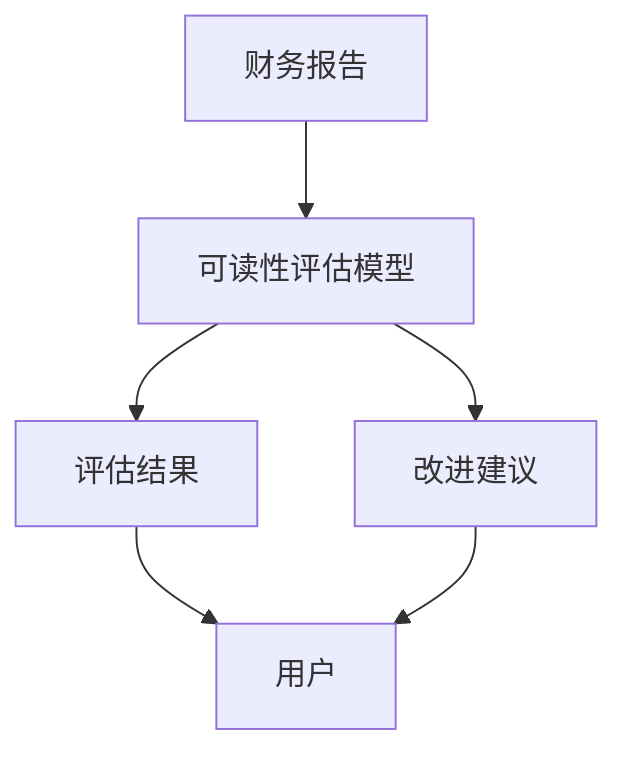
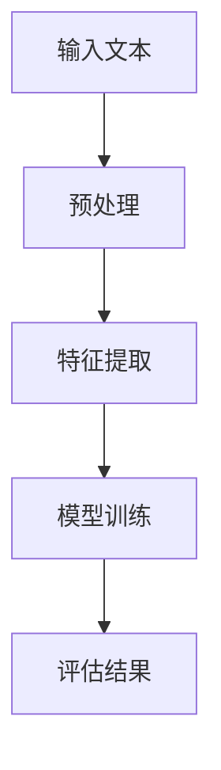
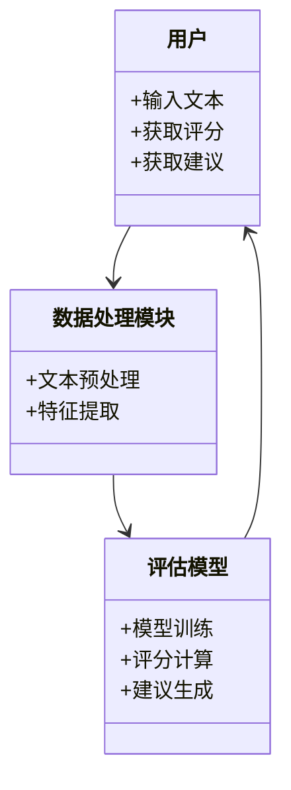
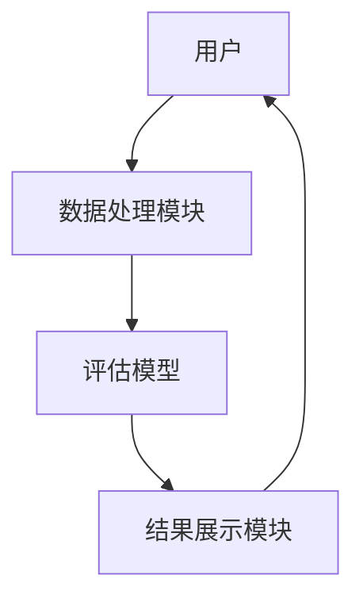
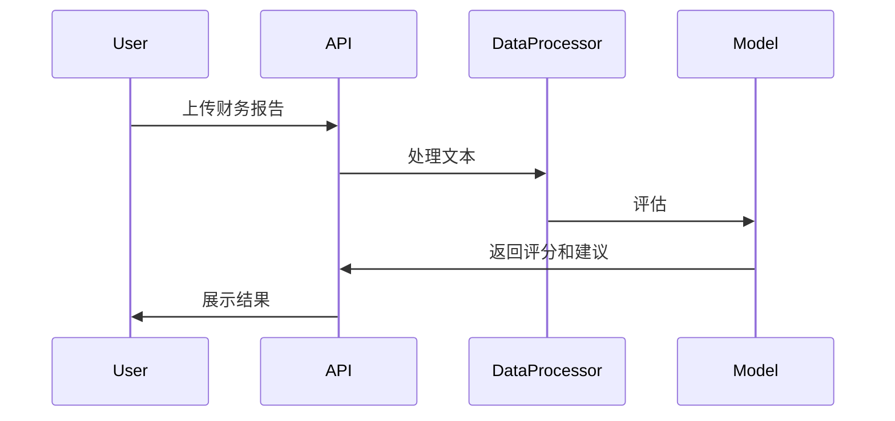

                 


# 设计智能化的企业财务报告可读性评估模型

> 关键词：企业财务报告，可读性评估，人工智能，自然语言处理，智能化

> 摘要：本文详细探讨了设计智能化的企业财务报告可读性评估模型的全过程，包括问题背景分析、核心概念讲解、算法原理、系统架构设计、项目实战以及最佳实践。通过自然语言处理和机器学习技术，构建一个能够自动评估财务报告可读性的智能系统，从而提高企业财务透明度和决策效率。

---

## 第一部分：背景介绍

### 第1章：问题背景与描述

#### 1.1 问题背景
企业财务报告是反映企业经营状况的重要文件，其可读性直接影响利益相关者的理解能力和决策效率。然而，当前财务报告的可读性评估主要依赖人工审查，存在效率低、主观性强、成本高等问题。随着人工智能技术的快速发展，利用智能化方法提升财务报告可读性评估的效率和准确性成为可能。

#### 1.2 问题描述
- **可读性定义**：财务报告的可读性通常指报告内容的清晰度、逻辑性和表达的准确性。然而，现有评估方法多为主观判断，缺乏客观标准。
- **现有问题**：人工评估耗时且成本高，难以满足企业对高效、精准评估的需求。此外，不同评估者可能对同一份报告的可读性评分存在显著差异。
- **需求分析**：智能化评估系统能够快速、客观地分析财务报告的可读性，提供改进建议，帮助提升报告的质量。

#### 1.3 解决方案
通过引入自然语言处理（NLP）和机器学习技术，构建一个智能化的财务报告可读性评估模型。该模型能够自动提取报告中的关键信息，分析其结构和语言的清晰度，从而给出客观的评分和改进建议。

---

## 第二部分：核心概念与联系

### 第2章：模型核心概念

#### 2.1 核心原理
财务报告的可读性评估涉及多个维度，包括文本的结构清晰度、语言复杂度、信息冗余度等。通过自然语言处理技术，可以将这些维度转化为可量化的特征，进而训练模型进行评估。

#### 2.2 概念属性对比
以下是财务报告可读性评估的核心指标及其属性特征对比：

| 指标维度       | 特征描述                                                                 |
|----------------|--------------------------------------------------------------------------|
| 文本结构        | 分段合理性、标题清晰度、段落逻辑性                                               |
| 语言复杂度      | 句子长度、词汇多样性、专业术语使用频率                                             |
| 信息冗余度      | 重复信息量、信息完整性、信息相关性                                                 |
| 逻辑一致性      | 逻辑连贯性、事实准确性、数据一致性                                                 |
| 表达清晰度      | 用词准确度、语法正确性、排版规范性                                                 |

#### 2.3 实体关系图
以下是模型的核心实体关系图：



---

## 第三部分：算法原理

### 第3章：算法详解

#### 3.1 模型结构
模型采用基于Transformer的自然语言处理架构，主要包含以下几个步骤：

1. **文本预处理**：包括分词、去除停用词、词干提取等。
2. **特征提取**：通过词嵌入（如Word2Vec或BERT）提取文本的语义特征。
3. **模型训练**：使用深度学习模型（如LSTM或Transformer）进行特征学习和分类。
4. **评估与优化**：通过交叉验证和超参数调优提升模型性能。

以下是模型的处理流程图：



#### 3.2 代码实现

以下是核心代码实现：

```python
# 文本预处理
def preprocess(text):
    # 分词
    words = word_tokenize(text)
    # 去除停用词
    filtered_words = [word for word in words if word not in STOP_WORDS]
    return filtered_words

# 特征提取（使用Word2Vec）
def extract_features(texts):
    model = Word2Vec(vector_size=100, window=5, min_count=1, workers=4)
    model.build_vocab([preprocess(text) for text in texts])
    model.train([preprocess(text) for text in texts], total_examples=model.corpus_count, epochs=10)
    return model

# 模型训练（使用LSTM）
class LSTMModel(nn.Module):
    def __init__(self, input_size, hidden_size, output_size):
        super(LSTMModel, self).__init__()
        self.lstm = nn.LSTM(input_size, hidden_size, batch_first=True)
        self.fc = nn.Linear(hidden_size, output_size)
    
    def forward(self, x):
        out, _ = self.lstm(x)
        out = self.fc(out[:, -1, :])
        return out

# 训练过程
def train_model(model, criterion, optimizer, texts, labels):
    for epoch in range(num_epochs):
        for i, (text, label) in enumerate(zip(texts, labels)):
            inputs = preprocess(text)
            outputs = model(inputs)
            loss = criterion(outputs, label)
            optimizer.zero_grad()
            loss.backward()
            optimizer.step()
```

#### 3.3 数学模型
模型的最终输出是一个可读性评分，公式如下：

$$ S = \sum_{i=1}^{n} w_i x_i $$

其中，$w_i$ 是第i个特征的权重，$x_i$ 是第i个特征的值。权重通过训练数据进行优化。

---

## 第四部分：系统架构设计

### 第4章：系统分析与架构

#### 4.1 问题场景
系统需要处理大量的财务报告文本，快速生成可读性评分，并提供改进建议。应用场景包括企业内部审计、财务部门自检等。

#### 4.2 功能设计
以下是系统的主要功能模块：



#### 4.3 系统架构
以下是系统的整体架构图：



#### 4.4 接口设计
系统提供以下API接口：

- `/api/upload`：上传财务报告
- `/api/evaluate`：获取可读性评分
- `/api/suggestions`：获取改进建议

#### 4.5 交互设计
以下是用户与系统之间的交互流程图：



---

## 第五部分：项目实战

### 第5章：环境与实现

#### 5.1 环境搭建
需要安装以下库：

```bash
pip install numpy pandas sklearn word2vec torch
```

#### 5.2 核心代码实现

以下是核心代码实现：

```python
import torch
import torch.nn as nn
from torch.utils.data import Dataset, DataLoader

class FinancialReportDataset(Dataset):
    def __init__(self, texts, labels):
        self.texts = texts
        self.labels = labels
    
    def __len__(self):
        return len(self.texts)
    
    def __getitem__(self, idx):
        return self.texts[idx], self.labels[idx]

# 定义模型
class ReadabilityModel(nn.Module):
    def __init__(self, input_size, hidden_size, output_size):
        super(ReadabilityModel, self).__init__()
        self.lstm = nn.LSTM(input_size, hidden_size, batch_first=True)
        self.fc = nn.Linear(hidden_size, output_size)
    
    def forward(self, x):
        out, _ = self.lstm(x)
        out = self.fc(out[:, -1, :])
        return out

# 训练过程
def train(model, criterion, optimizer, dataloader, epochs):
    for epoch in range(epochs):
        for batch_idx, (texts, labels) in enumerate(dataloader):
            outputs = model(texts)
            loss = criterion(outputs, labels)
            optimizer.zero_grad()
            loss.backward()
            optimizer.step()

# 使用BERT进行特征提取
from transformers import BertTokenizer, BertModel

tokenizer = BertTokenizer.from_pretrained('bert-base-uncased')
model = BertModel.from_pretrained('bert-base-uncased')

def extract_bert_features(text):
    inputs = tokenizer(text, return_tensors='pt')
    outputs = model(**inputs)
    return outputs.last_hidden_state[:, 0, :]
```

#### 5.3 案例分析
以某企业的财务报告为例，输入模型后，系统返回可读性评分为85，并给出以下改进建议：

- 建议减少专业术语的使用频率。
- 建议优化报告的段落结构，使逻辑更加清晰。

---

## 第六部分：最佳实践与小结

### 第6章：总结与建议

#### 6.1 小结
本文详细介绍了设计智能化的企业财务报告可读性评估模型的全过程，包括背景分析、核心概念、算法原理、系统架构设计以及项目实战。通过引入自然语言处理和机器学习技术，模型能够高效、客观地评估财务报告的可读性。

#### 6.2 注意事项
- 数据质量对模型性能影响重大，需确保数据的多样性和代表性。
- 在实际应用中，需根据具体需求调整模型参数和评估指标。

#### 6.3 拓展阅读
建议读者进一步学习自然语言处理和深度学习的相关知识，特别是BERT等预训练模型在文本分析中的应用。

---

以上是《设计智能化的企业财务报告可读性评估模型》的完整内容，希望对您有所帮助！

