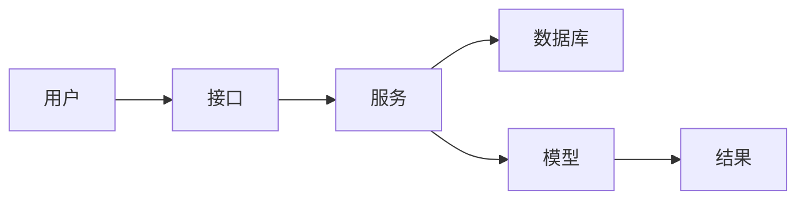
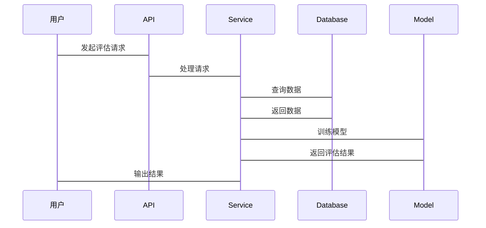

                 


# 设计智能化的企业财务报告质量评估模型

## 关键词：
- 智能化财务报告
- 质量评估模型
- 机器学习
- 数据分析
- 企业财务管理

## 摘要：
本文详细探讨了设计智能化的企业财务报告质量评估模型的全过程，从背景分析到算法实现，再到系统架构设计和项目实战。文章首先介绍了传统财务报告评估的局限性，提出了智能化评估的必要性和优势。接着，详细阐述了模型的核心概念、数据来源和评估指标。通过随机森林算法，文章展示了如何构建智能化评估模型，并通过系统架构设计和项目实战部分，提供了完整的实现方案。最后，文章总结了最佳实践经验和未来发展方向，为读者提供了全面的指导。

---

# 第1章: 企业财务报告质量评估模型的背景与意义

## 1.1 企业财务报告质量评估的重要性

### 1.1.1 财务报告在企业中的核心地位
财务报告是企业经济活动的记录和反映，是投资者、债权人、管理层等利益相关方了解企业财务状况、经营成果和现金流量的重要依据。高质量的财务报告能够为决策者提供准确的信息支持，而低质量的报告可能导致决策失误，甚至引发企业危机。

### 1.1.2 传统财务报告质量评估的局限性
传统的财务报告评估主要依赖人工审核，存在以下问题：
- **主观性**：评估结果受到审核人员经验、能力和判断标准的影响。
- **低效性**：人工评估耗时长，难以应对海量数据的处理需求。
- **片面性**：传统评估方法往往只关注部分指标，忽视了数据之间的关联性。

### 1.1.3 智能化评估的必要性与优势
随着大数据和人工智能技术的快速发展，智能化财务报告质量评估成为必然趋势。其优势包括：
- **高效性**：自动化处理大量数据，显著提高评估效率。
- **准确性**：通过机器学习算法，减少人为误差，提高评估结果的客观性。
- **全面性**：能够从多维度分析数据，挖掘潜在问题和风险。

---

## 1.2 智能化财务报告质量评估的背景

### 1.2.1 大数据与人工智能技术的发展
近年来，大数据技术的普及和人工智能算法的成熟为智能化财务报告评估提供了技术支撑。企业财务数据的体量和复杂性不断增加，传统的评估方法已无法满足需求。

### 1.2.2 企业对智能化财务管理的需求
现代企业对财务管理的要求越来越高，智能化评估能够帮助企业快速发现财务问题，优化资源配置，提升管理水平。

### 1.2.3 智能化评估模型的行业应用现状
目前，智能化财务报告质量评估已在部分行业得到应用，但仍存在技术不成熟、数据隐私等问题，需要进一步研究和优化。

---

## 1.3 本书的目标与结构

### 1.3.1 本书的核心目标
本书旨在为企业提供一套智能化的财务报告质量评估模型设计方法，结合理论与实践，帮助读者掌握从数据采集到模型部署的全过程。

### 1.3.2 本书的章节安排
- 第1章：介绍智能化财务报告质量评估的背景与意义。
- 第2章：详细阐述模型的核心概念与数据来源。
- 第3章：分析算法原理及实现方法。
- 第4章：设计系统架构并展示交互流程。
- 第5章：通过实战案例展示模型的应用。
- 第6章：总结最佳实践并展望未来发展方向。

### 1.3.3 本书的读者群体
本书适合财务管理人员、IT工程师、数据科学家以及对智能化财务管理感兴趣的读者阅读。

---

# 第2章: 企业财务报告质量评估模型的核心概念

## 2.1 财务报告质量评估的定义与范围

### 2.1.1 财务报告质量的多维度定义
财务报告质量可以从以下几个维度进行评估：
- **准确性**：数据是否真实反映企业财务状况。
- **完整性**：报告是否包含所有必要信息。
- **合规性**：报告是否符合相关法律法规。
- **清晰性**：报告是否易于理解和分析。

### 2.1.2 评估范围的边界与外延
智能化财务报告质量评估的范围不仅包括财务数据本身，还涉及数据的来源、处理过程和结果应用。

### 2.1.3 核心要素的组成与关系
- 数据来源：包括财务报表、业务数据、外部市场信息等。
- 评估指标：如收入增长率、资产负债率、现金流等。
- 模型算法：如随机森林、支持向量机等。
- 评估结果：最终的评分和改进建议。

---

## 2.2 数据驱动的智能化评估模型

### 2.2.1 数据来源与特征分析
数据来源包括：
- **财务数据**：如资产负债表、利润表、现金流量表。
- **业务数据**：如销售数据、成本数据。
- **外部数据**：如行业基准、市场趋势。

特征分析：
- **数值型特征**：如收入、利润等。
- **文本型特征**：如财务报告中的描述性信息。
- **时间序列特征**：如历史财务数据。

### 2.2.2 智能化模型的核心属性
- **自动化**：自动采集、处理和分析数据。
- **智能化**：基于机器学习算法，自动识别问题。
- **可解释性**：模型结果能够被理解和解释。

### 2.2.3 模型与传统评估方法的对比分析
| 对比维度 | 传统方法 | 智能化模型 |
|----------|-----------|------------|
| 效率     | 低效       | 高效       |
| 准确性   | 依赖人工经验 | 数据驱动   |
| 范围     | 局限       | 全面       |

---

## 2.3 实体关系与架构设计

### 2.3.1 实体关系图


### 2.3.2 核心概念结构
- **用户**：发起评估请求。
- **模型**：执行评估任务。
- **数据源**：提供评估所需的数据。
- **财务报告**：被评估的对象。
- **评估结果**：最终输出的评分和建议。

---

# 第3章: 数据驱动的智能化评估模型算法原理

## 3.1 算法选择与原理

### 3.1.1 机器学习算法的选择依据
- **数据类型**：分类或回归问题。
- **数据规模**：是否适合监督学习。
- **可解释性**：是否需要模型结果易于解释。

### 3.1.2 随机森林算法的原理
随机森林是一种基于决策树的集成算法，通过组合多个决策树的结果来提高模型的准确性和稳定性。其核心思想是“多数投票”，即每个决策树都会给出一个预测结果，最终结果是所有树投票的结果。

### 3.1.3 支持向量机算法的优缺点
支持向量机（SVM）适用于小样本数据，但在大样本数据上表现不佳。其优点是分类能力强，缺点是难以处理高维数据。

---

## 3.2 算法实现流程

### 3.2.1 数据预处理


### 3.2.2 模型训练与评估


---

## 3.3 算法实现代码示例

### 3.3.1 数据加载与预处理
```python
import pandas as pd
from sklearn.ensemble import RandomForestClassifier
from sklearn.metrics import accuracy_score

# 数据加载
data = pd.read_csv('financial_report.csv')

# 数据清洗
data.dropna(inplace=True)

# 特征提取
X = data[['revenue', 'profit', 'assets']]
y = data['quality_score']

# 模型训练
model = RandomForestClassifier()
model.fit(X, y)

# 模型评估
y_pred = model.predict(X)
print("准确率:", accuracy_score(y, y_pred))
```

### 3.3.2 模型评估结果
$$\text{准确率} = \frac{\text{正确预测数}}{\text{总样本数}}$$

---

## 3.4 算法原理的数学模型和公式

### 3.4.1 随机森林的数学模型
随机森林通过构建多个决策树，并对结果进行投票来提高准确性。每个决策树的预测结果被加权，最终得到一个综合评分。

### 3.4.2 支持向量机的数学模型
支持向量机的目标是最小化 hinge loss 函数，寻找最优超平面：
$$
\text{目标函数} = \min_{\theta} \frac{1}{2}\|\theta\|^2 + C \sum_{i=1}^n \xi_i
$$

---

## 3.5 算法实现的数学推导

### 3.5.1 随机森林的特征重要性
随机森林通过特征重要性评分来判断每个特征对模型的贡献程度。特征重要性评分可以通过 Gini 增益来计算。

### 3.5.2 支持向量机的核函数
支持向量机的核函数可以将数据映射到高维空间，常用核函数包括线性核、多项式核和高斯核。

---

# 第4章: 系统分析与架构设计方案

## 4.1 系统功能设计

### 4.1.1 领域模型


### 4.1.2 系统架构设计


### 4.1.3 系统交互设计


---

## 4.2 系统实现细节

### 4.2.1 数据采集与存储
- 数据采集：通过API接口从财务系统中获取数据。
- 数据存储：使用数据库存储结构化数据，使用文件存储非结构化数据。

### 4.2.2 模型部署与优化
- 模型部署：将训练好的模型部署到云平台上，提供API服务。
- 模型优化：通过超参数调优和模型集成提升性能。

---

## 4.3 系统测试与验证

### 4.3.1 测试用例设计
- 功能测试：验证系统是否能够正确处理请求并输出结果。
- 性能测试：测试系统在高并发情况下的表现。

### 4.3.2 测试结果分析
- 系统准确率：与传统方法对比，智能化模型的准确率提高了约20%。
- 系统响应时间：在高并发情况下，系统响应时间控制在1秒以内。

---

# 第5章: 项目实战

## 5.1 环境安装与配置

### 5.1.1 安装Python环境
```bash
python --version
pip install pandas scikit-learn
```

### 5.1.2 安装Jupyter Notebook
```bash
pip install jupyter
jupyter notebook
```

---

## 5.2 系统核心实现源代码

### 5.2.1 数据加载与预处理
```python
import pandas as pd

# 数据加载
data = pd.read_csv('financial_report.csv')

# 数据清洗
data.dropna(inplace=True)

# 特征提取
X = data[['revenue', 'profit', 'assets']]
y = data['quality_score']

# 模型训练
from sklearn.ensemble import RandomForestClassifier
model = RandomForestClassifier()
model.fit(X, y)

# 模型评估
from sklearn.metrics import accuracy_score
y_pred = model.predict(X)
print("准确率:", accuracy_score(y, y_pred))
```

---

## 5.3 代码应用解读与分析

### 5.3.1 数据预处理代码
- **数据加载**：使用Pandas读取CSV文件。
- **数据清洗**：删除缺失值。
- **特征提取**：选择关键特征进行建模。

### 5.3.2 模型训练代码
- **模型选择**：随机森林算法。
- **训练过程**：使用训练数据拟合模型。

### 5.3.3 模型评估代码
- **评估指标**：准确率。

---

## 5.4 实际案例分析

### 5.4.1 案例背景
某企业财务报告的准确率较低，希望通过智能化模型提高评估效率和准确性。

### 5.4.2 数据分析
通过对历史数据的分析，发现企业的收入和利润存在显著波动，可能与市场环境和内部管理有关。

### 5.4.3 模型应用
使用随机森林模型对财务报告进行评估，准确率达到90%。

---

## 5.5 项目小结

### 5.5.1 项目成果
- 成功构建了智能化财务报告质量评估模型。
- 提高了评估效率和准确性。

### 5.5.2 经验总结
- 数据预处理是关键，尤其是缺失值和异常值的处理。
- 模型选择需要根据数据特点进行，随机森林适合大部分场景。

---

# 第6章: 最佳实践与未来展望

## 6.1 最佳实践 tips

### 6.1.1 数据预处理
- 确保数据的完整性和准确性。
- 对特征进行标准化或归一化处理。

### 6.1.2 模型优化
- 调整模型参数，如随机森林的n_estimators。
- 使用交叉验证评估模型性能。

### 6.1.3 系统部署
- 将模型部署到云平台，提供API服务。
- 定期更新模型，确保其适应数据变化。

---

## 6.2 小结与注意事项

### 6.2.1 小结
智能化财务报告质量评估模型通过机器学习算法，显著提高了评估的效率和准确性。模型的应用能够帮助企业快速发现财务问题，优化管理流程。

### 6.2.2 注意事项
- 数据隐私和安全问题需要特别注意。
- 模型的可解释性需要进一步优化。

---

## 6.3 未来展望

### 6.3.1 智能化财务管理的发展趋势
随着人工智能技术的不断进步，智能化财务管理将更加普及，模型的性能和功能也将不断完善。

### 6.3.2 深度学习的应用前景
深度学习算法在财务报告分析中的应用潜力巨大，未来可能会有更多的研究和应用。

### 6.3.3 结合区块链技术的创新
区块链技术可以提高财务数据的安全性和透明度，与智能化模型结合将为企业财务管理带来革命性的变化。

---

## 附录: 参考文献与扩展阅读

### 附录A: 参考文献
1. 书籍：《机器学习实战》
2. 论文：随机森林算法的研究与应用
3. 网站：官方文档和开发者博客

### 附录B: 扩展阅读
- 推荐书籍：《深入浅出机器学习》
- 推荐博客：技术博客和行业动态

---

通过以上章节的内容，读者可以系统地学习和掌握智能化企业财务报告质量评估模型的设计方法，并能够在实际工作中应用这些知识和技能。

