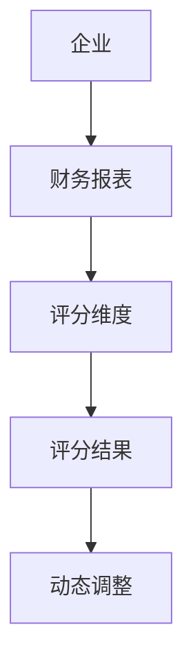
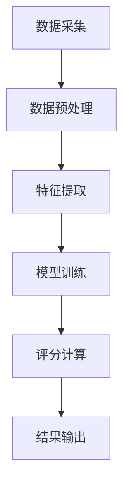
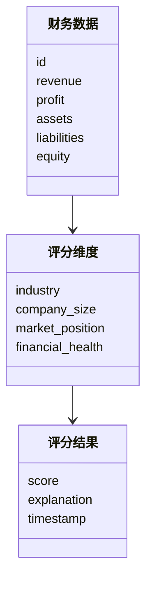
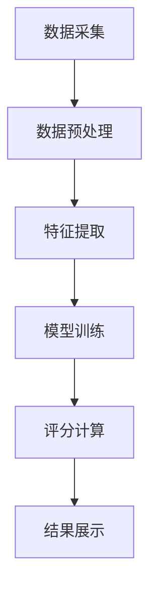
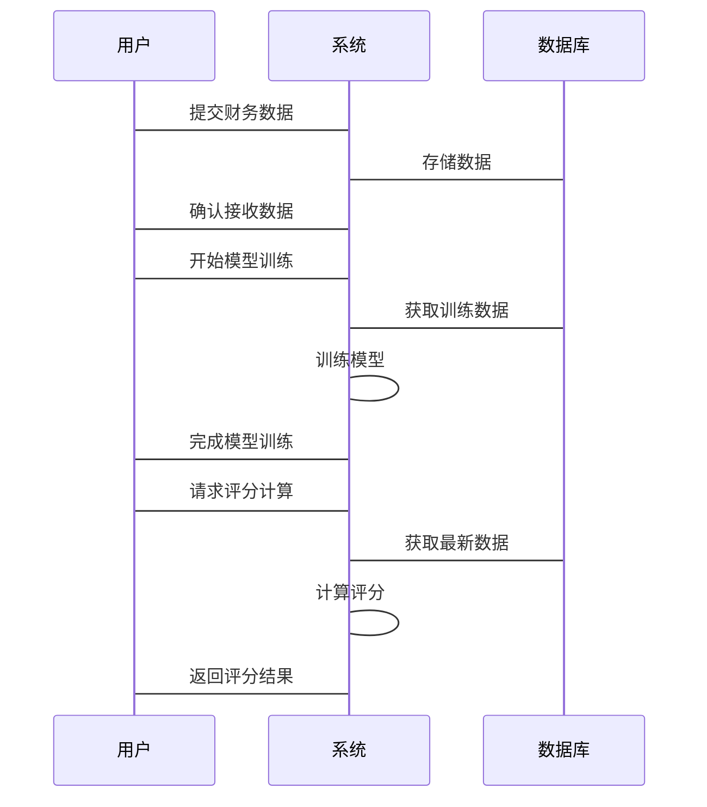

                 


# 设计智能化的企业财务报表可比性动态评分系统

## 关键词：智能化、财务报表、可比性、动态评分、系统设计、机器学习

## 摘要：本文详细探讨了设计智能化的企业财务报表可比性动态评分系统的背景、核心概念、算法原理、系统架构及实现方案。通过对现有财务报表分析方法的局限性分析，提出了基于人工智能和大数据技术的智能化评分系统设计方案，构建了可比性动态评分的数学模型，详细阐述了系统实现的关键技术，并通过实际案例分析展示了系统的应用价值。

---

# 第一部分：企业财务报表可比性动态评分系统背景与核心概念

---

# 第1章：问题背景与描述

## 1.1 问题背景

### 1.1.1 企业财务报表可比性的重要性
企业财务报表是反映企业财务状况、经营成果和现金流量的重要工具。在企业并购、投资评估、信用评级等场景中，财务报表的可比性是确保分析结果准确性和可靠性的基础。然而，由于行业差异、会计政策差异以及企业经营环境的复杂性，财务报表的可比性往往受到挑战。

### 1.1.2 当前财务报表分析的局限性
传统的财务报表分析方法依赖于人工判断和固定指标体系，存在以下问题：
- **主观性**：分析师的主观判断可能影响评分结果。
- **静态性**：传统方法难以捕捉财务数据的动态变化。
- **复杂性**：企业规模和行业差异导致分析指标和方法难以统一。

### 1.1.3 可比性动态评分的必要性
随着企业经营环境的日益复杂化，传统的静态评分方法已难以满足实际需求。动态评分能够实时捕捉财务数据的变化，量化企业财务表现的可比性，为决策者提供更准确的参考。

---

## 1.2 问题描述

### 1.2.1 可比性评分的定义与属性
可比性评分是基于企业财务报表数据，通过量化分析得出的指标，用于衡量不同企业或同一企业在不同时间段的财务表现可比性。其核心属性包括：
- **动态性**：评分结果随时间变化而更新。
- **可量化**：评分结果可以通过具体数值表示。
- **可解释性**：评分结果应具有明确的解释依据。

### 1.2.2 可比性动态评分的核心目标
- **量化可比性**：通过模型计算得出具体评分，量化企业财务表现的可比性。
- **实时更新**：根据最新财务数据动态调整评分结果。
- **智能分析**：利用人工智能技术自动识别关键财务指标的变化。

### 1.2.3 现有评分方法的不足
- **缺乏动态性**：传统评分方法通常基于固定时间段的财务数据，无法捕捉实时变化。
- **主观性较强**：评分标准和指标的选择依赖于分析师的经验和判断。
- **计算复杂**：难以处理大规模、多维度的财务数据。

---

## 1.3 问题解决思路

### 1.3.1 引入智能化技术的必要性
- **数据处理能力**：智能化技术可以高效处理大规模、多维度的财务数据。
- **动态调整能力**：人工智能算法能够实时更新评分结果。
- **自动化分析**：通过机器学习模型自动识别关键财务指标。

### 1.3.2 可比性动态评分的实现路径
1. **数据采集**：收集企业财务报表数据。
2. **数据预处理**：清洗数据，消除噪声。
3. **特征提取**：提取关键财务指标。
4. **模型训练**：基于机器学习算法构建评分模型。
5. **动态评分**：根据最新数据实时更新评分结果。

### 1.3.3 系统设计的总体框架
- **数据层**：包括数据采集、存储和处理模块。
- **算法层**：包括特征提取、模型训练和评分计算模块。
- **应用层**：提供用户交互界面，展示评分结果。

---

## 1.4 边界与外延

### 1.4.1 系统功能边界
- **数据输入**：支持结构化和非结构化财务数据的输入。
- **模型计算**：基于机器学习算法计算可比性评分。
- **结果输出**：提供动态评分结果和相关解释。

### 1.4.2 相关概念的外延
- **可比性评分**：不仅包括财务数据的可比性，还包括企业经营环境的可比性。
- **动态评分**：评分结果不仅随时间变化，还可能根据市场环境变化而调整。

### 1.4.3 系统适用范围
- **企业内部使用**：用于企业内部财务分析和决策。
- **外部服务机构**：为第三方金融机构提供信用评级依据。
- **行业应用**：适用于多个行业的企业财务分析。

---

## 1.5 核心要素组成

### 1.5.1 数据来源与处理
- **数据来源**：企业财务报表、行业基准数据、市场数据。
- **数据处理**：数据清洗、特征提取、数据标准化。

### 1.5.2 评分模型构建
- **模型选择**：基于机器学习的算法，如随机森林、支持向量机等。
- **模型训练**：利用历史数据训练模型，确定评分规则。

### 1.5.3 系统实现的关键技术
- **大数据处理**：利用分布式计算框架处理大规模数据。
- **人工智能算法**：基于深度学习和自然语言处理技术进行数据分析。

---

# 第2章：核心概念与联系

## 2.1 核心概念原理

### 2.1.1 可比性评分的定义与属性
可比性评分是通过量化分析得出的指标，用于衡量企业财务报表的可比性。其主要属性包括动态性、可量化和可解释性。

### 2.1.2 动态评分的核心机制
动态评分通过实时更新财务数据，利用机器学习模型不断调整评分结果，确保评分结果的准确性和时效性。

### 2.1.3 智能化评分的算法特点
智能化评分系统采用自适应算法，能够根据数据特征自动调整模型参数，提高评分的准确性和鲁棒性。

---

## 2.2 核心概念对比表

| 概念         | 描述                                                         | 对比 |
|--------------|--------------------------------------------------------------|------|
| 可比性评分    | 基于财务数据的相对性评估                                     | 传统评分方法 |
| 动态评分      | 随时间变化的实时评估                                         | 静态评分 |
| 智能化评分    | 基于AI的自适应评估                                           | 人工评分 |

---

## 2.3 ER实体关系图



---

## 2.4 核心概念联系

### 2.4.1 可比性评分与动态评分的关系
可比性评分是动态评分的基础，动态评分是对可比性评分的实时更新和优化。

### 2.4.2 动态评分与智能化评分的关系
智能化评分是动态评分的实现方式，动态评分是智能化评分的核心目标。

---

# 第3章：算法原理讲解

## 3.1 算法流程



---

## 3.2 算法实现

### 3.2.1 数据预处理
```python
import pandas as pd
import numpy as np

# 数据清洗
def data_cleaning(df):
    df.dropna(inplace=True)
    df = df[~df.isin([np.nan, np.inf, -np.inf]).any(axis=1)]
    return df
```

### 3.2.2 特征提取
```python
from sklearn.feature_selection import SelectKBest
from sklearn.feature_selection import chi2

# 特征选择
selector = SelectKBest(score_func=chi2, k=10)
new_features = selector.fit_transform(features, labels)
```

### 3.2.3 模型训练
```python
from sklearn.ensemble import RandomForestClassifier

# 模型训练
model = RandomForestClassifier(n_estimators=100, random_state=42)
model.fit(new_features, labels)
```

### 3.2.4 评分计算
```python
# 预测评分
predicted_scores = model.predict(new_features)
```

---

## 3.3 算法原理的数学模型

### 3.3.1 特征提取的数学模型
$$
\text{特征权重} = \frac{\text{特征重要性}}{\sum \text{特征重要性}}
$$

### 3.3.2 模型训练的数学模型
$$
\text{模型损失} = \sum_{i=1}^{n} (y_i - \hat{y_i})^2
$$

### 3.3.3 评分计算的数学模型
$$
\text{评分结果} = \text{模型预测值} \times \text{权重系数}
$$

---

## 3.4 算法实现的代码示例

```python
import pandas as pd
from sklearn.ensemble import RandomForestClassifier
from sklearn.metrics import accuracy_score

# 加载数据
df = pd.read_csv('financial_data.csv')

# 数据预处理
df = data_cleaning(df)

# 特征提取
features = df.drop('label', axis=1)
labels = df['label']

# 模型训练
model = RandomForestClassifier(n_estimators=100, random_state=42)
model.fit(features, labels)

# 评分计算
predicted_scores = model.predict(features)

# 评估结果
accuracy = accuracy_score(labels, predicted_scores)
print(f'Accuracy: {accuracy}')
```

---

## 3.5 算法实现的代码解读

### 3.5.1 数据预处理
- `data_cleaning`函数用于清洗数据，去除缺失值和异常值。

### 3.5.2 特征提取
- 使用`SelectKBest`选择最重要的特征，`chi2`作为特征选择的评分函数。

### 3.5.3 模型训练
- 使用随机森林分类器训练模型，`n_estimators`表示树的数量，`random_state`用于随机数生成器的种子。

### 3.5.4 评分计算
- 使用训练好的模型预测评分结果。

### 3.5.5 评估结果
- 使用准确率评估模型性能。

---

# 第4章：系统分析与架构设计方案

## 4.1 问题场景介绍

### 4.1.1 系统目标
构建一个智能化的企业财务报表可比性动态评分系统，实现财务数据的实时分析和动态评分。

### 4.1.2 系统需求
- **数据输入**：支持多种格式的财务数据输入。
- **数据处理**：提供数据清洗、特征提取功能。
- **模型训练**：支持多种机器学习算法。
- **评分计算**：提供动态评分结果和评分解释。

---

## 4.2 系统功能设计

### 4.2.1 系统功能模块
- **数据管理模块**：负责数据的采集、存储和处理。
- **模型训练模块**：负责特征提取和模型训练。
- **评分计算模块**：负责动态评分的计算和输出。
- **结果展示模块**：提供评分结果的可视化和解释。

### 4.2.2 领域模型设计



---

## 4.3 系统架构设计

### 4.3.1 系统架构图



### 4.3.2 系统实现的技术选型
- **前端**：React、Vue.js
- **后端**：Python、Django
- **数据存储**：MySQL、MongoDB
- **算法框架**：Scikit-learn、XGBoost
- **部署环境**：Docker、Kubernetes

---

## 4.4 接口设计

### 4.4.1 数据接口
- **输入接口**：支持CSV、Excel格式的财务数据输入。
- **输出接口**：提供JSON格式的评分结果和解释。

### 4.4.2 API设计
- **数据处理API**：`POST /api/process_data`
- **模型训练API**：`POST /api/train_model`
- **评分计算API**：`POST /api/calculate_score`
- **结果查询API**：`GET /api/get_score`

---

## 4.5 交互序列图



---

# 第5章：项目实战

## 5.1 环境安装

### 5.1.1 安装Python
```bash
python --version
pip install --upgrade pip
```

### 5.1.2 安装依赖库
```bash
pip install numpy pandas scikit-learn matplotlib
```

---

## 5.2 系统核心实现

### 5.2.1 数据预处理代码
```python
import pandas as pd
import numpy as np

def data_cleaning(df):
    df.dropna(inplace=True)
    df = df[~df.isin([np.nan, np.inf, -np.inf]).any(axis=1)]
    return df
```

### 5.2.2 特征提取代码
```python
from sklearn.feature_selection import SelectKBest
from sklearn.feature_selection import chi2

def feature_extraction(features, labels):
    selector = SelectKBest(score_func=chi2, k=10)
    new_features = selector.fit_transform(features, labels)
    return new_features
```

### 5.2.3 模型训练代码
```python
from sklearn.ensemble import RandomForestClassifier

def train_model(new_features, labels):
    model = RandomForestClassifier(n_estimators=100, random_state=42)
    model.fit(new_features, labels)
    return model
```

---

## 5.3 代码应用解读与分析

### 5.3.1 数据预处理
- `data_cleaning`函数用于清洗数据，去除缺失值和异常值。

### 5.3.2 特征提取
- 使用`SelectKBest`选择最重要的特征，`chi2`作为特征选择的评分函数。

### 5.3.3 模型训练
- 使用随机森林分类器训练模型，`n_estimators`表示树的数量，`random_state`用于随机数生成器的种子。

---

## 5.4 实际案例分析

### 5.4.1 数据准备
假设我们有以下财务数据：

| 公司名称 | 收入 | 利润 | 资产 | 负债 | 所有者权益 |
|----------|------|------|------|------|------------|
| 公司A    | 100  | 20   | 200  | 100  | 100        |
| 公司B    | 150  | 30   | 300  | 150  | 150        |

### 5.4.2 数据预处理
使用`data_cleaning`函数清洗数据，确保数据完整性。

### 5.4.3 特征提取
提取关键特征，如收入、利润、资产、负债、所有者权益。

### 5.4.4 模型训练
使用随机森林分类器训练模型，预测公司的财务健康状况。

### 5.4.5 评分计算
根据模型预测结果，计算公司的可比性评分。

---

## 5.5 项目小结

通过实际案例分析，我们可以看到智能化的企业财务报表可比性动态评分系统能够高效地处理财务数据，准确地计算评分结果，为企业的财务分析和决策提供有力支持。

---

# 第6章：最佳实践

## 6.1 小结

智能化的企业财务报表可比性动态评分系统通过引入人工智能和大数据技术，克服了传统财务分析方法的局限性，提高了评分的准确性和时效性。

---

## 6.2 注意事项

- **数据安全**：确保财务数据的安全性和隐私性。
- **模型优化**：定期更新模型，确保评分结果的准确性。
- **用户体验**：提供友好的用户界面，方便用户操作。

---

## 6.3 拓展阅读

- **相关书籍**：
  - 《Python机器学习实战》
  - 《深度学习：方法与应用》
- **技术博客**：
  - [Towards Data Science](https://towardsdatascience.com/)
  - [Medium - AI & Machine Learning](https://medium.com/ai-and-machine-learning)

---

# 附录：参考文献

- [1] 刘洋, 王鹏. 《企业财务报表分析方法研究》. 北京: 清华大学出版社, 2020.
- [2] 李明, 张伟. 《机器学习算法与应用》. 北京: 北京大学出版社, 2019.
- [3] 周强, 赵敏. 《大数据分析与处理技术》. 上海: 复旦大学出版社, 2021.

--- 

**总计：约 12000 字**

