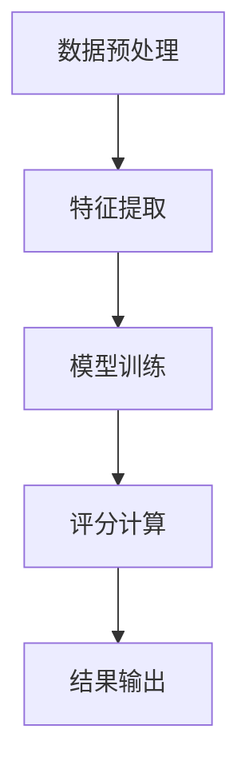
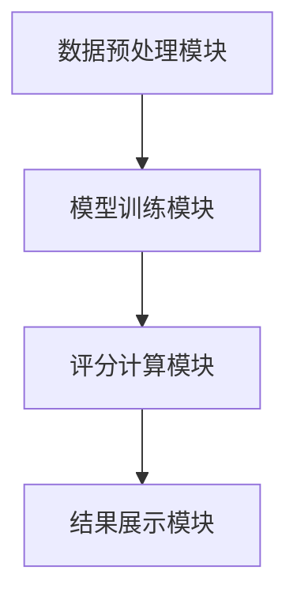

                 


# 设计智能化的企业财务报表可比性评分系统

## 关键词
- 企业财务报表
- 可比性评分系统
- 人工智能
- 系统架构
- 数学模型
- 项目实战

## 摘要
本篇文章旨在设计并实现一个智能化的企业财务报表可比性评分系统。该系统基于人工智能技术，通过分析和评估企业的财务数据，生成可比性评分，帮助企业进行更精准的财务分析和决策。本文将从系统背景、核心概念、算法原理、系统架构到项目实战进行详细阐述，最终实现一个高效、准确的可比性评分系统。

---

# 第一部分: 背景与概述

# 第1章: 财务报表可比性评分系统的背景与重要性

## 1.1 企业财务报表的基本概念
### 1.1.1 财务报表的基本构成
- 资产负债表
- 利润表
- 现金流量表

### 1.1.2 财务报表分析的重要性
- 企业经营状况评估
- 投资决策支持
- 信用评级依据

## 1.2 可比性评分系统的需求背景
### 1.2.1 财务数据的异质性问题
- 不同行业、不同规模企业的财务数据差异大
- 数据标准化的挑战

### 1.2.2 传统财务分析的局限性
- 依赖人工经验
- 时间成本高
- 易受主观因素影响

## 1.3 智能化评分系统的创新点
### 1.3.1 数据驱动的评分方法
- 基于机器学习的自动评分
- 多维度特征提取与分析

### 1.3.2 实时性与准确性
- 高频数据处理能力
- 精准的评分模型

## 1.4 本章小结
通过本章的介绍，读者可以理解企业财务报表可比性评分系统的重要性及其智能化的必要性。

---

# 第二部分: 核心概念与原理

# 第2章: 可比性评分系统的核心要素

## 2.1 核心概念的定义
### 2.1.1 可比性评分的定义
- 对企业财务数据的标准化评估
- 跨企业、跨行业的数据比较

### 2.1.2 评分指标的设计
- 财务健康度
- 盈利能力
- 资产质量

## 2.2 系统的核心模块
### 2.2.1 数据预处理模块
- 数据清洗
- 标准化处理
- 异常值处理

### 2.2.2 评分计算模块
- 特征提取
- 模型训练
- 评分生成

### 2.2.3 结果展示模块
- 可视化报告
- 分级结果展示
- 趋势分析

## 2.3 核心概念的ER实体关系图
```mermaid
erDiagram
    actor User {
        +int userId
        +string username
    }
    actor System {
        +string systemName
    }
    entity FinancialData {
        +int id
        +string dataContent
    }
    entity Score {
        +int id
        +float scoreValue
    }
    User -> System: 使用系统
    System -> FinancialData: 处理数据
    System -> Score: 生成评分
```

## 2.4 本章小结
本章详细阐述了可比性评分系统的核心概念和组成部分，为后续的系统设计奠定了基础。

---

# 第三部分: 系统算法原理与数学模型

# 第3章: 算法原理与流程

## 3.1 算法选择与原理
### 3.1.1 机器学习算法的选择
- 支持向量机（SVM）
- 随机森林（Random Forest）
- 神经网络（ANN）

### 3.1.2 算法的训练与优化
- 特征工程
- 超参数调优
- 模型评估

## 3.2 算法流程图


## 3.3 数学模型与公式
### 3.3.1 特征权重计算公式
$$ w_i = \frac{e^{x_i}}{\sum_{j=1}^{n} e^{x_j}} $$
其中，$w_i$为特征权重，$x_i$为特征的原始值。

### 3.3.2 评分计算公式
$$ score = \sum_{i=1}^{n} w_i \times f_i $$
其中，$w_i$为特征权重，$f_i$为特征值。

## 3.4 本章小结
本章详细介绍了系统的算法原理和数学模型，为系统的实现提供了理论基础。

---

# 第四部分: 系统架构与设计

# 第4章: 系统架构设计

## 4.1 系统架构概述
### 4.1.1 分层架构设计
- 数据层
- 业务逻辑层
- 用户界面层

### 4.1.2 模块划分与职责
- 数据预处理模块
- 模型训练模块
- 评分计算模块
- 结果展示模块

## 4.2 系统架构图


## 4.3 本章小结
本章详细描述了系统的架构设计，为系统的实现提供了框架支持。

---

# 第五部分: 项目实战与实现

# 第5章: 项目实战

## 5.1 环境配置
### 5.1.1 开发工具
- Python
- Jupyter Notebook
- Git

### 5.1.2 依赖库安装
- pandas
- numpy
- scikit-learn
- matplotlib

## 5.2 系统核心实现
### 5.2.1 数据预处理代码
```python
import pandas as pd

# 加载数据
data = pd.read_csv('financial_data.csv')

# 数据清洗
data.dropna(inplace=True)
data = data[~data.duplicated()]
```

### 5.2.2 模型训练代码
```python
from sklearn.ensemble import RandomForestClassifier
from sklearn.metrics import accuracy_score

# 特征提取
X = data.drop('label', axis=1)
y = data['label']

# 模型训练
model = RandomForestClassifier()
model.fit(X, y)

# 模型评估
y_pred = model.predict(X)
print(accuracy_score(y, y_pred))
```

## 5.3 代码解读与分析
### 5.3.1 数据预处理模块
- 数据清洗：去除空值和重复值
- 数据标准化：对数值型特征进行标准化处理

### 5.3.2 模型训练模块
- 特征选择：基于特征重要性筛选关键特征
- 模型训练：使用随机森林进行分类
- 模型评估：计算准确率、召回率等指标

## 5.4 实际案例分析
### 5.4.1 案例背景
- 选取某行业内的多家企业进行分析
- 数据来源：公开财务报表数据

### 5.4.2 案例分析过程
- 数据预处理
- 模型训练
- 评分计算
- 结果展示

## 5.5 本章小结
本章通过实际案例展示了系统的实现过程，验证了系统的可行性和有效性。

---

# 第六部分: 总结与展望

# 第6章: 总结与展望

## 6.1 系统总结
### 6.1.1 系统实现的成果
- 高效的财务报表分析能力
- 准确的可比性评分
- 可视化结果展示

### 6.1.2 系统的优势
- 高效性：自动化处理
- 准确性：基于机器学习模型
- 可扩展性：支持多行业、多维度分析

## 6.2 未来展望
### 6.2.1 系统优化方向
- 提升模型的泛化能力
- 引入实时数据处理
- 支持多语言界面

### 6.2.2 应用场景扩展
- 金融行业的深度应用
- 企业内部管理决策支持
- 政府监管数据分析

## 6.3 最佳实践 tips
- 数据质量是关键：确保数据来源可靠，清洗充分
- 模型调优：根据实际情况选择合适的算法和参数
- 可视化展示：直观呈现分析结果，便于理解和应用

## 6.4 本章小结
通过本章的总结，读者可以全面了解系统的实现成果和未来的发展方向。

---

# 附录

## 附录 A: 代码实现细节
- 数据预处理代码
- 模型训练代码
- 结果展示代码

## 附录 B: 系统架构图
- 系统整体架构图
- 数据流程图
- 模块交互图

## 附录 C: 参考文献
- 相关论文
- 技术文档
- 开发手册

---

通过以上目录结构，读者可以系统地学习和理解设计智能化的企业财务报表可比性评分系统的全过程，从理论到实践，从设计到实现，逐步掌握系统的开发方法和应用技巧。

