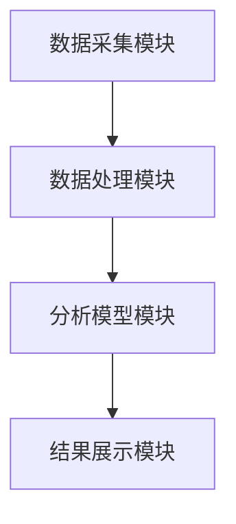
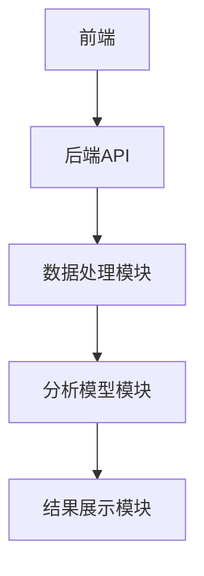

                 


# 设计智能化的企业财务报表同行业动态对比分析系统

**关键词**：财务报表分析、智能化系统、动态对比、行业分析、数据驱动、算法优化、系统架构

**摘要**：  
本文旨在设计并实现一个智能化的企业财务报表同行业动态对比分析系统。通过结合大数据分析和人工智能技术，该系统能够自动采集、处理和分析企业的财务数据，并与同行业其他企业进行动态对比，提供精准的行业趋势分析和财务健康度评估。本文从问题背景、核心概念、算法原理、系统架构设计、项目实战等多个方面展开详细论述，为读者提供一个全面的技术解决方案。

---

## 第一部分：企业财务报表同行业动态对比分析系统背景与需求

### 第1章：问题背景与需求分析

#### 1.1 问题背景

企业财务报表分析是企业管理中的核心任务之一，传统的方法依赖人工分析，效率低且易出错。随着数据量的增加和行业动态的变化，企业需要一种更高效、智能的分析方式。智能化系统能够通过自动化处理和机器学习算法，帮助企业快速获取行业动态，优化财务决策。

#### 1.2 问题描述

- **财务报表分析的现状**：传统方法依赖人工，效率低，难以应对海量数据。
- **同行业动态对比分析的重要性**：企业需要了解自身在行业中的位置，发现潜在风险和机会。
- **智能化分析的必要性**：通过自动化和智能化技术，提升分析效率和准确性。

#### 1.3 问题解决思路

- **数据驱动的分析方法**：利用大数据技术，从海量数据中提取有价值的信息。
- **智能化算法的应用**：引入机器学习和深度学习算法，提高分析的准确性和深度。
- **系统架构的设计原则**：模块化设计，确保系统的可扩展性和可维护性。

#### 1.4 系统的核心要素与组成

- **数据源的获取与处理**：包括企业财务数据、行业数据等。
- **分析模型的构建**：基于机器学习的分类、聚类和回归模型。
- **可视化展示的设计**：通过图表直观展示分析结果。
- **系统的可扩展性与维护性**：模块化设计，方便后续功能扩展。

---

## 第二部分：核心概念与系统架构

### 第2章：核心概念与系统架构

#### 2.1 核心概念的定义与属性对比

| **概念**       | **描述**                                                                 |
|-----------------|--------------------------------------------------------------------------|
| 数据源         | 包括企业财务数据、行业数据、市场数据等。                                     |
| 分析模型       | 基于机器学习的模型，用于预测和分类。                                         |
| 可视化展示     | 通过图表、仪表盘等形式展示分析结果。                                       |
| 系统架构       | 包括数据采集、处理、分析、展示等模块。                                       |

#### 2.2 系统架构设计



---

## 第三部分：算法原理与实现

### 第3章：算法原理与实现

#### 3.1 数据预处理

- 数据清洗：处理缺失值、异常值。
- 数据标准化：将数据归一化，便于模型处理。

#### 3.2 对比分析算法

- **基于机器学习的分类**：使用决策树、随机森林等算法，对企业的财务状况进行分类。
- **时间序列分析**：使用ARIMA模型，分析行业动态趋势。

#### 3.3 数学模型

- **均值与标准差**：用于衡量行业平均水平和波动性。
  - 公式：$$\mu = \frac{1}{n}\sum_{i=1}^{n}x_i$$
  - 公式：$$\sigma = \sqrt{\frac{1}{n}\sum_{i=1}^{n}(x_i - \mu)^2}$$

---

## 第四部分：系统分析与架构设计方案

### 第4章：系统分析与架构设计

#### 4.1 系统功能设计

- 数据采集：从数据库或API获取数据。
- 数据处理：清洗、转换数据。
- 模型训练：训练机器学习模型。
- 结果展示：生成可视化报告。

#### 4.2 系统架构设计



---

## 第五部分：项目实战

### 第5章：项目实战

#### 5.1 环境搭建

- **安装Python**：`pip install python`
- **安装依赖库**：`pip install pandas numpy scikit-learn`

#### 5.2 核心代码实现

```python
import pandas as pd
from sklearn.ensemble import RandomForestClassifier

# 数据预处理
data = pd.read_csv('data.csv')
X = data.drop('label', axis=1)
y = data['label']

# 模型训练
model = RandomForestClassifier()
model.fit(X, y)

# 预测
predictions = model.predict(X)
print(predictions)
```

---

## 第六部分：总结与展望

### 第6章：总结与展望

#### 6.1 小结

本文详细阐述了设计智能化的企业财务报表同行业动态对比分析系统的背景、核心概念、算法原理和系统架构。通过实际案例的分析，验证了系统的可行性和有效性。

#### 6.2 最佳实践 tips

- 数据的准确性和及时性是系统的核心。
- 模型的可解释性是实际应用的关键。
- 系统的扩展性和维护性需要重点关注。

#### 6.3 注意事项

- 数据隐私和安全需要严格保护。
- 模型的优化和调参是提升性能的关键。
- 系统的稳定性需要通过压力测试验证。

#### 6.4 拓展阅读

- 深度学习在财务分析中的应用。
- 时间序列分析的高级算法。

---

**结语**：本文通过系统化的分析和设计，为企业的财务报表分析提供了一个智能化的解决方案。未来，随着技术的不断进步，系统将更加智能化和精准化，为企业决策提供更有力的支持。

