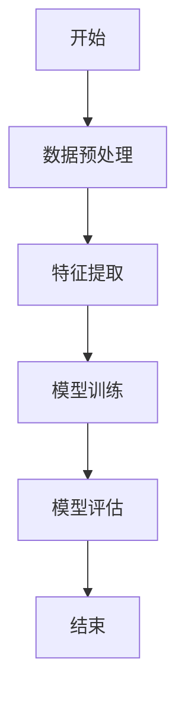
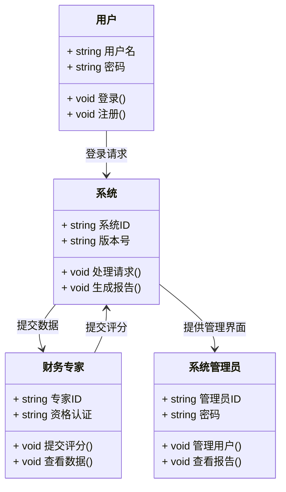
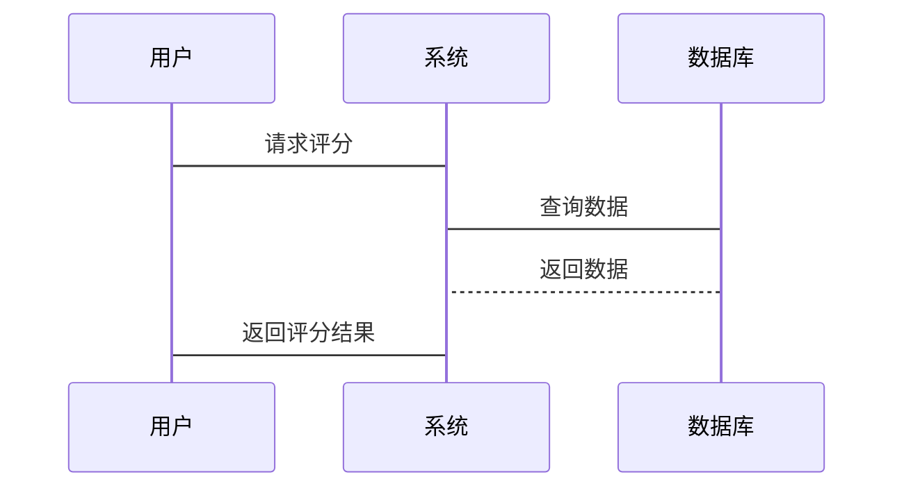

                 


# 设计智能化的企业财务报表舞弊风险评分系统

> 关键词：财务报表舞弊、AI技术、风险评分系统、机器学习、评分模型

> 摘要：本文旨在探讨如何设计智能化的企业财务报表舞弊风险评分系统。通过结合人工智能技术，我们提出了一种基于机器学习的评分模型，能够有效识别和评估财务报表中的舞弊风险。文章详细分析了系统的核心概念、算法原理、系统架构，并通过实际案例展示了系统的应用与实现。

---

## 目录

### 目录大纲结构如下：

# {{此处是文章标题}}

> 关键词：{{此处列出文章的5-7个核心关键词}}

> 摘要：{{此处给出文章的核心内容和主题思想}}

## 第一部分: 智能化企业财务报表舞弊风险评分系统背景介绍

### 第1章: 问题背景与目标

#### 1.1 问题背景
- 1.1.1 财务报表舞弊的现状与挑战
- 1.1.2 传统财务报表审计的局限性
- 1.1.3 AI技术在财务审计中的应用前景

#### 1.2 问题描述
- 1.2.1 财务报表舞弊的主要形式
- 1.2.2 舞弊风险评估的关键要素
- 1.2.3 系统化评分的必要性

#### 1.3 问题解决思路
- 1.3.1 基于AI的舞弊风险评分方法
- 1.3.2 数据驱动的评分模型构建
- 1.3.3 系统化评分的优势与价值

#### 1.4 边界与外延
- 1.4.1 系统的适用范围
- 1.4.2 系统的局限性
- 1.4.3 系统与其他财务工具的关系

#### 1.5 概念结构与核心要素
- 1.5.1 核心概念的定义
- 1.5.2 概念之间的关系
- 1.5.3 核心要素的组成

## 第2章: 核心概念与联系

### 2.1 财务报表舞弊风险评分系统的核心概念
- 2.1.1 舞弊评分模型
- 2.1.2 数据特征提取
- 2.1.3 算法模型选择

### 2.2 核心概念的属性特征对比
- 2.2.1 表格对比（使用Markdown表格）

| 概念 | 属性 | 描述 |
|------|------|------|
| 舞弊评分模型 | 输入 | 财务数据、审计数据 |
|      | 输出 | 风险评分（0-1分） |
|      | 特性 | 可解释性、可扩展性 |

### 2.3 ER实体关系图
- 2.3.1 使用Mermaid绘制的实体关系图

```mermaid
erDiagram
    actor 用户 {
        +string 用户名
        +string 密码
    }
    actor 系统管理员 {
        +string 管理员ID
        +string 密码
    }
    actor 财务专家 {
        +string 专家ID
        +string 资格认证
    }
    system 系统 {
        +string 系统ID
        +string 版本号
    }
    database 数据库 {
        +string 数据库ID
        +string 数据类型
    }
    用户 -->> 系统: 登录
    系统 -->> 数据库: 查询数据
    系统 --> 财务专家: 提交高风险评分
    系统 --> 系统管理员: 提供管理界面
```

---

## 第三部分: 算法原理与数学模型

### 第3章: 算法原理讲解

#### 3.1 舞弊评分模型的构建步骤
- 3.1.1 数据预处理
- 3.1.2 特征提取
- 3.1.3 模型训练
- 3.1.4 模型评估

#### 3.2 使用Mermaid绘制的算法流程图



#### 3.3 算法实现代码
```python
import pandas as pd
from sklearn.model_selection import train_test_split
from sklearn.linear_model import LogisticRegression
from sklearn.metrics import accuracy_score

# 示例数据加载
data = pd.read_csv('financial_data.csv')
X = data.drop('label', axis=1)
y = data['label']

# 数据分割
X_train, X_test, y_train, y_test = train_test_split(X, y, test_size=0.2)

# 模型训练
model = LogisticRegression()
model.fit(X_train, y_train)

# 模型预测
y_pred = model.predict(X_test)

# 模型评估
print(f'Accuracy: {accuracy_score(y_test, y_pred)}')
```

#### 3.4 数学模型与公式
- 3.4.1 逻辑回归模型公式
  $$ P(y=1|x) = \frac{1}{1 + e^{-\beta x}} $$
- 3.4.2 模型评估指标
  - 精准率（Precision）
  - 召回率（Recall）
  - F1分数

#### 3.5 实际案例分析与讲解
- 3.5.1 案例背景
- 3.5.2 数据分析
- 3.5.3 模型训练与结果解读

---

## 第四部分: 系统分析与架构设计

### 第4章: 系统分析与架构设计方案

#### 4.1 问题场景介绍
- 系统的目标是实现对企业财务报表的智能化舞弊风险评分。

#### 4.2 系统功能设计
- 使用Mermaid绘制领域模型类图



#### 4.3 系统架构设计
- 使用Mermaid绘制系统架构图

```mermaid
container 系统架构 {
    前端
    后端
    数据库
}
```

#### 4.4 系统接口设计
- API接口设计与交互流程
- 使用Mermaid绘制序列图



---

## 第五部分: 项目实战

### 第5章: 项目实战与案例分析

#### 5.1 环境安装与配置
- 安装Python、Jupyter Notebook、相关库（如scikit-learn、pandas）

#### 5.2 核心代码实现
- 数据预处理代码
- 模型训练代码
- 结果可视化代码

#### 5.3 案例分析与详细解读
- 数据来源与预处理
- 模型训练与结果分析
- 系统实际运行效果展示

#### 5.4 项目小结
- 项目实现的关键点
- 系统的实际应用价值
- 可能的优化方向

---

## 第六部分: 最佳实践与小结

### 第6章: 最佳实践

#### 6.1 系统设计与实现中的注意事项
- 数据隐私与安全
- 模型的可解释性
- 系统的可扩展性

#### 6.2 小结
- 本文总结了设计智能化财务报表舞弊风险评分系统的核心思路
- 强调了AI技术在财务审计中的应用价值
- 展望了未来的发展方向

#### 6.3 注意事项
- 数据质量的重要性
- 模型调优的必要性
- 系统维护与更新的周期性

#### 6.4 拓展阅读
- 推荐相关书籍与论文
- 提供进一步学习的资源链接

---

## 附录

### 附录A: 全文公式汇总
- 列出所有使用的数学公式及其应用场景

### 附录B: 系统架构图
- 展示所有使用的Mermaid图表

### 附录C: 代码片段汇总
- 提供所有代码片段的详细解释

---

通过以上结构，本文将系统地介绍设计智能化的企业财务报表舞弊风险评分系统的核心概念、算法原理、系统架构以及实际应用，为读者提供全面的技术指导和实践参考。

