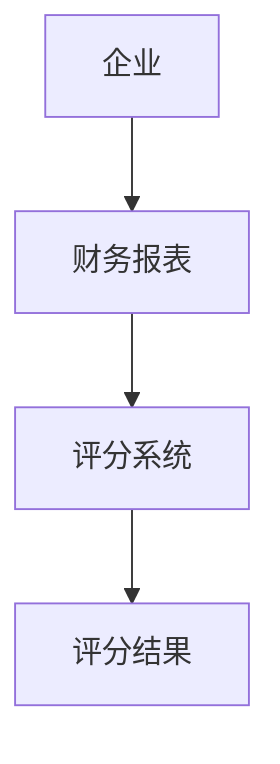
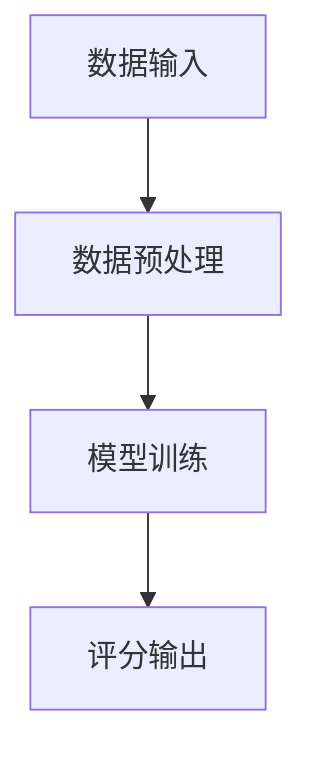
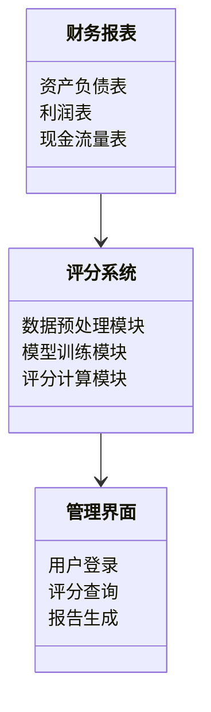
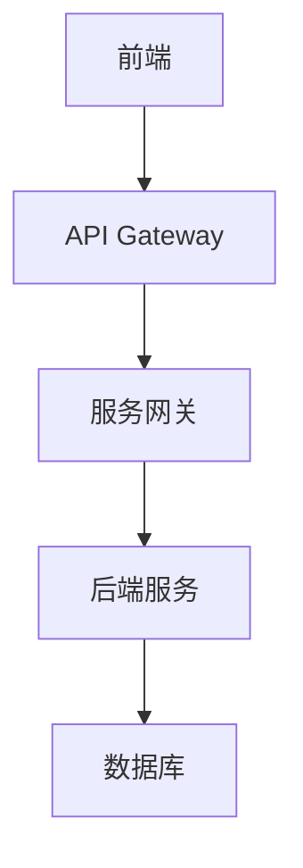
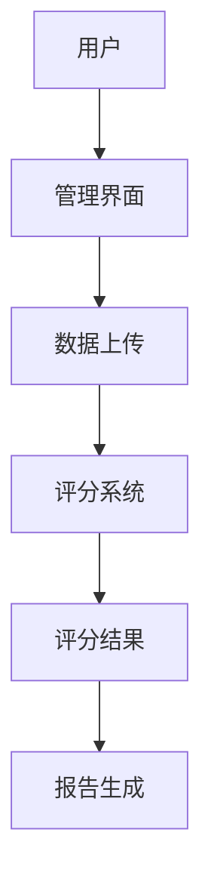

                 


# 设计智能化的企业财务报表质量评分系统

> 关键词：企业财务报表，质量评分，人工智能，大数据分析，系统设计

> 摘要：本文详细探讨了设计智能化的企业财务报表质量评分系统的各个方面，从核心概念到系统架构，再到算法实现和项目实战。文章旨在为企业管理者和技术开发者提供一套高效的解决方案，以提升财务数据的准确性和可靠性。

---

# 第一部分: 企业财务报表质量评分系统背景与基础

## 第1章: 财务报表质量评分系统概述

### 1.1 财务报表质量评分的核心概念

#### 1.1.1 财务报表质量评分的定义
企业财务报表质量评分系统是一种利用人工智能和大数据技术，对企业的财务报表进行自动化评估和评分的系统。该系统通过分析财务数据的合理性、完整性以及准确性，为企业提供客观的质量评分，帮助管理层快速识别潜在问题。

#### 1.1.2 财务报表质量评分的必要性
传统的财务报表审核方法依赖于人工检查，耗时且容易出错。随着企业规模的扩大和数据量的增加，传统的审核方法已经无法满足高效、准确的需求。引入智能化的财务报表质量评分系统，可以显著提高审核效率和准确性。

#### 1.1.3 智能化评分系统的优势
- **高效性**：自动化处理大量数据，缩短审核时间。
- **准确性**：基于机器学习算法，减少人为错误。
- **可扩展性**：能够处理不同类型和规模的企业数据。

### 1.2 企业财务报表质量评分的背景与现状

#### 1.2.1 传统财务报表评分方法的局限性
传统方法主要依赖人工审核，存在以下问题：
- 审核周期长。
- 人为判断误差大。
- 难以处理大量数据。

#### 1.2.2 智能化评分系统的兴起
随着人工智能和大数据技术的发展，智能化评分系统逐渐成为企业财务管理的重要工具。通过机器学习算法，系统能够快速分析财务数据，识别异常值和潜在风险。

#### 1.2.3 当前市场中的解决方案对比
目前市场上有多种解决方案，包括基于规则的系统和基于机器学习的系统。基于机器学习的系统在准确性和适应性方面更具优势。

### 1.3 本章小结
本章介绍了财务报表质量评分系统的核心概念和必要性，分析了传统方法的局限性和智能化系统的优势。

---

# 第二部分: 智能化财务报表评分系统的核心概念与联系

## 第2章: 核心概念与联系

### 2.1 数据预处理与特征提取

#### 2.1.1 数据清洗与标准化
在进行评分之前，需要对财务数据进行清洗，包括处理缺失值、异常值和重复值。同时，对数据进行标准化处理，确保不同数据源的统一性。

#### 2.1.2 特征工程与选择
从财务数据中提取关键特征，如收入增长率、利润率、资产负债率等。特征选择的过程需要结合业务知识和统计方法。

### 2.2 智能化评分算法原理

#### 2.2.1 算法原理概述
智能化评分系统通常采用监督学习算法，如支持向量机（SVM）、随机森林（Random Forest）和神经网络（NN）。这些算法能够通过训练数据学习财务数据的模式，从而进行预测和评分。

#### 2.2.2 算法选择与对比
不同的算法有不同的优缺点。例如，SVM适用于小规模数据，而神经网络适用于大规模数据。选择合适的算法需要考虑数据规模、计算能力和业务需求。

### 2.3 系统架构与模块划分

#### 2.3.1 系统整体架构
智能化财务报表评分系统通常包括以下几个模块：
1. 数据采集模块：从财务系统中获取数据。
2. 数据预处理模块：清洗和标准化数据。
3. 特征提取模块：提取关键特征。
4. 模型训练模块：训练机器学习模型。
5. 评分计算模块：对财务报表进行评分。
6. 结果展示模块：输出评分结果和分析报告。

#### 2.3.2 各模块功能与交互
- 数据采集模块将财务数据传输到预处理模块。
- 预处理模块将清洗后的数据传输到特征提取模块。
- 特征提取模块将特征向量传输到模型训练模块。
- 训练好的模型对输入的财务数据进行评分，并将结果传输到结果展示模块。

### 2.4 核心概念的ER实体关系图



### 2.5 本章小结
本章详细介绍了智能化财务报表评分系统的核心概念，包括数据预处理、算法选择和系统架构。

---

# 第三部分: 智能化财务报表评分系统算法与模型

## 第3章: 算法原理与实现

### 3.1 数据预处理流程

#### 3.1.1 数据清洗步骤
- 删除重复数据。
- 处理缺失值（如均值填充、删除缺失值）。
- 处理异常值（如使用Z-score方法）。

#### 3.1.2 数据标准化方法
- 标准差标准化：将数据标准化为均值为0，标准差为1。
- 最小-最大标准化：将数据缩放到0-1范围。

#### 3.1.3 数据特征提取
- 使用主成分分析（PCA）提取特征。
- 选择相关性高的特征。

### 3.2 智能化评分算法实现

#### 3.2.1 算法流程图



#### 3.2.2 算法实现代码示例

```python
import pandas as pd
from sklearn.model_selection import train_test_split
from sklearn.ensemble import RandomForestClassifier
from sklearn.metrics import accuracy_score

# 数据预处理
data = pd.read_csv('financial_data.csv')
X = data.drop('target', axis=1)
y = data['target']

# 划分训练集和测试集
X_train, X_test, y_train, y_test = train_test_split(X, y, test_size=0.2, random_state=42)

# 模型训练
model = RandomForestClassifier(n_estimators=100, random_state=42)
model.fit(X_train, y_train)

# 模型预测
y_pred = model.predict(X_test)

# 模型评估
print("准确率:", accuracy_score(y_test, y_pred))
```

### 3.3 算法数学模型与公式

#### 3.3.1 线性回归模型
$$ y = \beta_0 + \beta_1x + \epsilon $$

#### 3.3.2 支持向量机模型
$$ \text{max} \frac{1}{2}\|w\|^2 + C\sum_{i=1}^n \xi_i $$

#### 3.3.3 神经网络模型
$$ a^{(l+1)} = \sigma(wa^{(l)} + b) $$

### 3.4 本章小结
本章详细介绍了智能化财务报表评分系统的算法实现，包括数据预处理、算法选择和代码实现。

---

# 第四部分: 智能化财务报表评分系统的系统分析与架构设计

## 第4章: 系统分析与架构设计方案

### 4.1 问题场景介绍
企业财务部门需要快速评估财务报表的质量，以便及时发现和纠正问题。传统的人工审核方法效率低下，容易出错。

### 4.2 项目介绍
本项目旨在设计一个智能化的财务报表质量评分系统，利用机器学习技术提高审核效率和准确性。

### 4.3 系统功能设计

#### 4.3.1 领域模型设计


### 4.4 系统架构设计

#### 4.4.1 系统架构图


#### 4.4.2 系统接口设计
- API接口：提供数据上传、评分查询等功能。
- 数据格式：采用JSON格式进行数据传输。

### 4.5 系统交互设计

#### 4.5.1 系统交互流程图


### 4.6 本章小结
本章详细介绍了智能化财务报表评分系统的系统架构设计，包括功能模块、架构图和交互流程。

---

# 第五部分: 项目实战

## 第5章: 项目实战

### 5.1 环境安装与配置

#### 5.1.1 安装Python环境
- 使用Anaconda安装Python 3.8及以上版本。

#### 5.1.2 安装依赖库
```bash
pip install pandas numpy scikit-learn matplotlib
```

### 5.2 系统核心实现源代码

#### 5.2.1 数据预处理代码
```python
import pandas as pd
import numpy as np

# 数据加载
data = pd.read_csv('financial_data.csv')

# 删除重复数据
data = data.drop_duplicates()

# 处理缺失值
data = data.dropna()

# 标准化处理
from sklearn.preprocessing import StandardScaler
scaler = StandardScaler()
data_scaled = scaler.fit_transform(data)
```

#### 5.2.2 模型训练代码
```python
from sklearn.ensemble import RandomForestClassifier
from sklearn.metrics import accuracy_score

# 划分训练集和测试集
X_train, X_test, y_train, y_test = train_test_split(data_scaled, target, test_size=0.2, random_state=42)

# 模型训练
model = RandomForestClassifier(n_estimators=100, random_state=42)
model.fit(X_train, y_train)

# 模型预测
y_pred = model.predict(X_test)

# 模型评估
print("准确率:", accuracy_score(y_test, y_pred))
```

### 5.3 案例分析与详细讲解

#### 5.3.1 案例分析
以某企业2022年的财务报表为例，通过系统进行评分，发现资产负债率异常，可能存在财务风险。

#### 5.3.2 详细讲解
系统通过对财务数据的分析，识别出潜在的风险点，并生成详细的报告，帮助企业及时采取措施。

### 5.4 项目小结
本章通过实际案例展示了智能化财务报表评分系统的实现过程，包括环境配置、代码实现和案例分析。

---

# 第六部分: 最佳实践与总结

## 第6章: 最佳实践与总结

### 6.1 最佳实践 tips

#### 6.1.1 数据质量的重要性
确保数据的准确性和完整性是系统运行的关键。

#### 6.1.2 模型调优的技巧
通过交叉验证和网格搜索优化模型参数。

#### 6.1.3 系统维护的注意事项
定期更新模型，确保系统的稳定性和准确性。

### 6.2 本章总结
智能化财务报表质量评分系统通过机器学习技术，显著提高了财务审核的效率和准确性。系统的设计和实现为企业财务管理提供了有力的支持。

### 6.3 展望
未来，随着人工智能和大数据技术的进一步发展，智能化财务报表评分系统将更加智能化和自动化，为企业创造更大的价值。

---

# 结语

设计智能化的企业财务报表质量评分系统是一项复杂但极具挑战性的任务。通过本文的详细讲解，读者可以全面了解系统的构建过程和实现方法。希望本文能够为企业管理者和技术开发者提供有价值的参考和启发。

---

# 参考文献

（此处列出相关的书籍、论文和技术文档）

