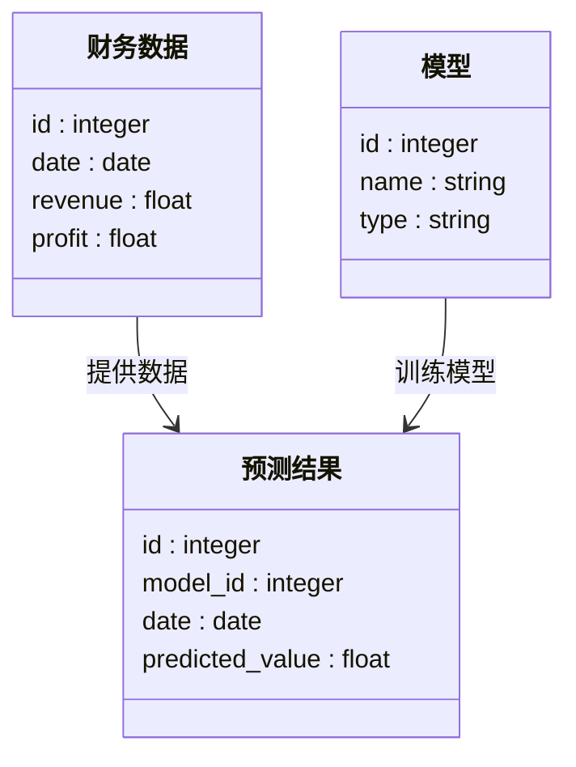
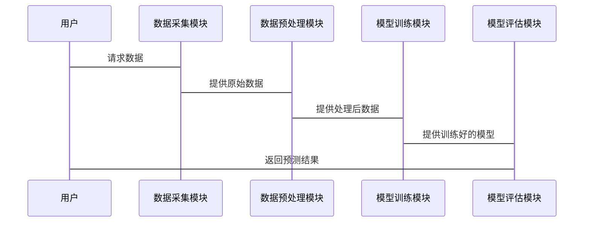

                 


# 设计智能化的企业财务报表预测模型

## 关键词
企业财务报表预测模型、智能化预测、机器学习、深度学习、财务数据分析

## 摘要
本文详细探讨了设计智能化企业财务报表预测模型的关键步骤与方法。从问题背景、核心概念、算法原理、系统架构到项目实战，系统性地分析了如何利用机器学习和深度学习技术构建高效准确的财务预测模型。文章通过实际案例分析和代码实现，展示了从数据预处理到模型部署的完整流程，并提供了最佳实践建议。

---

# 第一部分: 企业财务报表预测模型的背景与核心概念

## 第1章: 问题背景与描述

### 1.1 问题背景
#### 1.1.1 传统财务预测的局限性
传统财务预测方法依赖人工经验，存在以下问题：
- 数据处理复杂，人工计算容易出错；
- 预测范围有限，难以覆盖多维度数据；
- 分析效率低，难以应对海量数据。

#### 1.1.2 智能化预测的需求与趋势
随着企业数字化转型的推进，智能化财务预测的需求日益增长：
- 数据量激增，需要自动化处理工具；
- 预测维度扩展，要求模型具备多任务处理能力；
- 对预测精度要求提高，需要更复杂的算法支持。

#### 1.1.3 企业财务报表预测的核心价值
智能化财务预测能够：
- 提高预测效率，降低人工成本；
- 提升预测精度，辅助决策制定；
- 实现数据驱动的财务分析，优化企业运营。

### 1.2 问题描述
#### 1.2.1 财务报表预测的目标与范围
- **目标**: 预测企业未来的财务状况，如收入、利润、资产负债等。
- **范围**: 包括收入预测、成本预测、利润预测、现金流预测等。

#### 1.2.2 数据来源与特征分析
- **数据来源**: 企业历史财务数据、市场数据、行业数据、宏观经济数据等。
- **特征分析**: 销售收入、成本、利润、资产、负债、现金流、行业趋势等。

#### 1.2.3 预测模型的输入输出关系
- **输入**: 历史财务数据、市场数据、宏观经济指标。
- **输出**: 预测的财务指标及其置信区间。

### 1.3 问题解决思路
#### 1.3.1 数据驱动的预测方法
- 数据预处理：清洗、特征提取、数据转换。
- 特征工程：选择关键特征，构建特征组合。
- 模型训练：使用机器学习算法进行训练。

#### 1.3.2 智能化预测的技术路线
- 数据采集与预处理：清洗、标准化、特征提取。
- 模型训练：选择合适的算法，训练预测模型。
- 模型优化：调参、模型融合、结果解释。

#### 1.3.3 多模型融合的优化策略
- 使用多种算法（如线性回归、随机森林、神经网络）进行预测。
- 通过投票、加权等方式融合多模型结果，提升预测精度。

## 第2章: 核心概念与联系

### 2.1 智能化预测模型的基本原理
#### 2.1.1 数据预处理与特征提取
- 数据清洗：处理缺失值、异常值。
- 特征提取：从原始数据中提取有用特征，如移动平均、增长率等。
- 数据标准化：将数据归一化处理，便于模型训练。

#### 2.1.2 模型训练与调优
- 使用训练数据训练模型，调整模型参数。
- 通过交叉验证评估模型性能，选择最优模型。

#### 2.1.3 结果解释与反馈优化
- 解释模型预测结果，分析预测误差。
- 根据反馈优化模型，提升预测精度。

### 2.2 核心概念对比分析
#### 2.2.1 不同预测模型的特征对比
| 模型类型 | 优势 | 劣势 |
|--------|------|------|
| 线性回归 | 简单易懂，计算速度快 | 无法处理非线性关系 |
| 随机森林 | 鲁棒性强，抗过拟合 | 解释性较差 |
| 神经网络 | 能处理复杂非线性关系 | 计算复杂，需要大量数据 |

#### 2.2.2 数据驱动与规则驱动的对比
| 方法 | 数据驱动 | 规则驱动 |
|------|----------|----------|
| 特点 | 基于数据统计规律 | 基于专家经验规则 |
| 优势 | 高度自动化，适应性强 | 解释性强，易于理解 |
| 劣势 | 需大量数据，易受噪声影响 | 易受主观因素影响 |

#### 2.2.3 单模型与多模型的优劣势分析
| 方法 | 优势 | 劣势 |
|------|------|------|
| 单模型 | 简单，计算速度快 | 易受模型假设限制 |
| 多模型 | 高精度，鲁棒性好 | 计算复杂，难于解释 |

### 2.3 实体关系图与流程图
#### 2.3.1 实体关系图（ER图）
```mermaid
erDiagram
    customer {
        id : integer
        name : string
        revenue : float
        profit : float
    }
    model {
        id : integer
        name : string
        type : string
    }
    training_data {
        id : integer
        model_id : integer
        date : date
        accuracy : float
    }
    customer --> training_data : 提供数据
    model --> training_data : 训练数据
```

#### 2.3.2 流程图


## 第3章: 算法原理与数学模型

### 3.1 算法原理
#### 3.1.1 线性回归模型
- 线性回归用于预测连续型变量，假设特征与目标变量之间存在线性关系。
- 适用于简单场景，但难以处理复杂非线性关系。

#### 3.1.2 支持向量机（SVM）
- 适用于分类和回归问题，能够处理高维数据。
- 通过构建超平面将数据分为不同类别。

#### 3.1.3 随机森林与梯度提升树
- 随机森林通过组合多个决策树提升模型鲁棒性。
- 梯度提升树通过不断优化损失函数，逐步逼近目标函数。

#### 3.1.4 神经网络与深度学习
- 神经网络能够处理复杂非线性关系，适合处理海量数据。
- 深度学习通过多层网络结构提取高阶特征，提升预测精度。

### 3.2 数学模型与公式
#### 3.2.1 线性回归模型
$$ y = \beta_0 + \beta_1x_1 + \beta_2x_2 + ... + \beta_nx_n + \epsilon $$

#### 3.2.2 神经网络模型
$$ a^{(l+1)} = \sigma(w^{(l)} a^{(l)} + b^{(l)}) $$

#### 3.2.3 LSTM网络
$$ 
\text{LSTM单元} = \text{输入} \oplus \text{隐藏状态} 
$$

### 3.3 代码实现与解释
```python
import numpy as np
from sklearn.linear_model import LinearRegression
from sklearn.ensemble import RandomForestRegressor
from sklearn.neural_network import MLPRegressor

# 示例数据
X = np.array([[1, 2], [3, 4], [5, 6]])
y = np.array([7, 8, 9])

# 线性回归模型
lr_model = LinearRegression()
lr_model.fit(X, y)
print("线性回归系数:", lr_model.coef_)

# 随机森林模型
rf_model = RandomForestRegressor()
rf_model.fit(X, y)
print("随机森林重要特征:", rf_model.feature_importances_)

# 神经网络模型
nn_model = MLPRegressor()
nn_model.fit(X, y)
print("神经网络预测值:", nn_model.predict(X))
```

---

## 第4章: 系统分析与架构设计方案

### 4.1 问题场景介绍
- 数据来源：企业财务数据、市场数据、宏观经济数据。
- 数据特征：连续型、分类型、文本型数据。

### 4.2 项目介绍
- 项目目标：构建智能化财务报表预测系统。
- 项目范围：涵盖收入预测、成本预测、利润预测等。

### 4.3 系统功能设计
#### 4.3.1 领域模型


#### 4.3.2 系统架构设计


#### 4.3.3 系统接口设计
- 数据接口：提供数据采集和预处理接口。
- 模型接口：提供模型训练和预测接口。

#### 4.3.4 系统交互


---

## 第5章: 项目实战

### 5.1 环境安装
- 安装Python环境：使用Anaconda或PyCharm。
- 安装依赖库：`scikit-learn`, `xgboost`, `keras`, `pandas`, `numpy`。

### 5.2 系统核心实现源代码
```python
import pandas as pd
import numpy as np
from sklearn.model_selection import train_test_split
from sklearn.metrics import mean_squared_error

# 数据加载
df = pd.read_csv('financial_data.csv')
X = df.drop(columns=['target'])
y = df['target']

# 数据分割
X_train, X_test, y_train, y_test = train_test_split(X, y, test_size=0.2, random_state=42)

# 线性回归模型
from sklearn.linear_model import LinearRegression
lr_model = LinearRegression()
lr_model.fit(X_train, y_train)
print("线性回归均方误差:", mean_squared_error(y_test, lr_model.predict(X_test)))

# 随机森林模型
from sklearn.ensemble import RandomForestRegressor
rf_model = RandomForestRegressor(n_estimators=100, random_state=42)
rf_model.fit(X_train, y_train)
print("随机森林均方误差:", mean_squared_error(y_test, rf_model.predict(X_test)))

# 神经网络模型
from sklearn.neural_network import MLPRegressor
nn_model = MLPRegressor(hidden_layer_sizes=(100, 50), random_state=42)
nn_model.fit(X_train, y_train)
print("神经网络均方误差:", mean_squared_error(y_test, nn_model.predict(X_test)))
```

### 5.3 代码应用解读与分析
- 数据加载：读取CSV文件中的财务数据。
- 数据分割：将数据分为训练集和测试集。
- 模型训练：分别使用线性回归、随机森林和神经网络进行训练。
- 模型评估：计算均方误差，评估模型性能。

### 5.4 实际案例分析和详细讲解剖析
假设我们有一个企业的财务数据，包含过去几年的收入、成本、利润等指标。通过训练模型，我们可以预测未来一年的收入和利润情况。

### 5.5 项目小结
- 选择合适的算法：根据数据特点选择线性回归、随机森林或神经网络。
- 模型调优：通过参数调整和模型融合提升预测精度。
- 结果解释：分析模型预测结果，优化企业财务策略。

---

## 第6章: 最佳实践、小结、注意事项、拓展阅读

### 6.1 最佳实践
- 数据预处理：清洗数据，处理缺失值和异常值。
- 特征工程：选择关键特征，构建特征组合。
- 模型调优：使用交叉验证，调整模型参数。
- 模型部署：将模型部署到生产环境，提供API接口。

### 6.2 小结
本文详细介绍了设计智能化企业财务报表预测模型的关键步骤和方法，从数据预处理到模型部署，系统性地展示了整个流程。

### 6.3 注意事项
- 数据隐私保护：确保财务数据的安全性。
- 模型解释性：选择易于解释的模型，便于业务人员理解。
- 模型更新：定期更新模型，适应数据变化。

### 6.4 拓展阅读
- 《机器学习实战》：学习更多机器学习算法和实战技巧。
- 《深度学习》：深入了解深度学习技术及其应用。
- 《财务分析与决策》：学习财务分析方法和技巧。

---

## 附录
### 附录A: 常见问题解答
- Q1: 如何选择合适的算法？
- Q2: 如何处理缺失数据？
- Q3: 如何优化模型性能？

### 附录B: 参考文献
- [1] 周志华. 机器学习. 清华大学出版社, 2016.
- [2] Ian Goodfellow. 深度学习. 人民邮电出版社, 2018.
- [3] 张连辉. 财务分析与决策. 清华大学出版社, 2020.

---

通过以上内容，我们可以系统性地设计和实现一个智能化的企业财务报表预测模型，为企业提供高效准确的财务预测服务。

