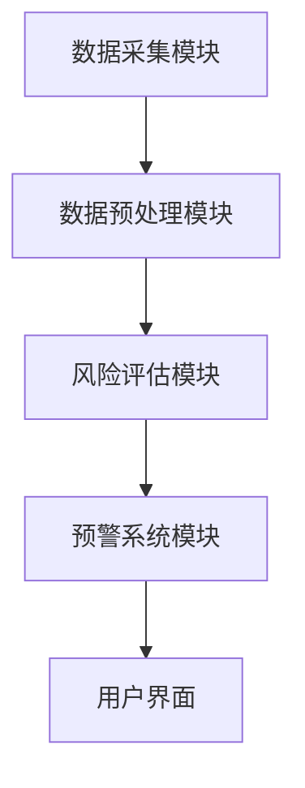

                 


# 设计智能化的企业财务风险敞口动态管理模型

> 关键词：企业财务风险敞口，动态管理，智能化模型，时间序列预测，风险评估，机器学习

> 摘要：本文深入探讨了如何设计一个智能化的企业财务风险敞口动态管理模型。通过结合时间序列分析、机器学习算法和系统架构设计，我们提出了一种高效、准确的财务风险评估方法，能够实时监控和预测企业的财务风险敞口，从而为企业制定有效的风险管理策略提供支持。

---

## 第一部分: 背景与基础

### 第1章: 企业财务风险敞口管理概述

#### 1.1 财务风险敞口的基本概念
- **定义与分类**: 财务风险敞口是指企业在财务活动中可能面临的损失或收益波动。常见的类型包括市场风险、信用风险、流动性风险等。
- **内涵与外延**: 风险敞口不仅涉及企业的财务状况，还与市场环境、经济政策等因素密切相关。
- **重要性**: 有效的风险管理能够帮助企业规避潜在损失，优化资本配置，提升整体竞争力。

#### 1.2 动态管理的必要性
- **动态变化特征**: 风险敞口会随着市场波动、企业经营状况等因素变化而变化，静态管理无法适应这种变化。
- **传统静态管理模式的局限性**: 传统方法难以捕捉动态变化，导致管理效果不佳。
- **动态管理的核心价值**: 实时监控和调整管理策略，能够显著降低风险敞口带来的负面影响。

#### 1.3 智能化管理的背景与意义
- **技术背景**: 随着人工智能和大数据技术的发展，智能化管理成为可能。
- **意义**: 提高风险管理的效率和准确性，为企业提供更精准的决策支持。

### 第2章: 核心概念与定义

#### 2.1 核心概念
- **风险敞口的数学定义**: 用向量表示企业各方面的财务风险敞口。
- **动态管理模型**: 通过时间序列分析预测未来风险敞口的变化。
- **智能化模型**: 利用机器学习算法对风险敞口进行智能预测和管理。

#### 2.2 核心要素与关系
- **风险敞口的影响因素**: 包括市场波动、企业经营状况、经济政策等。
- **动态管理模型的组成要素**: 数据采集、预测模型、预警系统等。
- **相互关系**: 各要素之间相互作用，共同构成动态管理模型。

### 第3章: 数学基础

#### 3.1 风险敞口的数学表示
- **向量表示**: 将风险敞口的不同方面用向量表示，便于数学分析。
- **变化率模型**: 通过变化率模型分析风险敞口的变化趋势。

#### 3.2 动态管理模型的数学框架
- **时间序列分析模型**: 用于预测风险敞口的变化趋势。
- **状态空间模型**: 描述风险敞口的状态及其变化过程。

#### 3.3 智能化模型的算法基础
- **机器学习算法**: 在风险敞口管理中的应用，如随机森林、支持向量机等。
- **深度学习算法**: 适用于复杂的风险预测场景。

---

## 第二部分: 算法与实现

### 第4章: 算法原理

#### 4.1 时间序列预测算法
- **ARIMA模型**: 用于预测风险敞口的变化趋势。
  - **原理**: 通过历史数据拟合模型，预测未来值。
  - **实现步骤**: 数据预处理、模型参数估计、模型验证。

#### 4.2 机器学习算法
- **随机森林**: 用于分类和回归任务，适用于复杂的风险评估。
  - **实现步骤**: 数据特征选择、模型训练、评估。

#### 4.3 深度学习算法
- **LSTM网络**: 适用于时间序列数据的预测。
  - **原理**: 利用循环神经网络捕捉时间依赖性。

### 第5章: 算法实现

#### 5.1 时间序列预测的Python代码
```python
from statsmodels.tsa.arima_model import ARIMA
import pandas as pd

# 加载数据
data = pd.read_csv('risk_exposure.csv')

# 拟合ARIMA模型
model = ARIMA(data, order=(5, 1, 0))
model_fit = model.fit()

# 预测未来值
forecast = model_fit.forecast(steps=5)
print(forecast)
```

#### 5.2 机器学习模型的实现
```python
from sklearn.ensemble import RandomForestRegressor
from sklearn.metrics import mean_squared_error

# 数据分割
X_train, X_test, y_train, y_test = train_test_split(X, y)

# 训练模型
model = RandomForestRegressor(n_estimators=100)
model.fit(X_train, y_train)

# 评估模型
y_pred = model.predict(X_test)
print(mean_squared_error(y_test, y_pred))
```

---

## 第三部分: 系统架构设计

### 第6章: 系统设计

#### 6.1 功能模块设计
- **数据采集模块**: 采集企业财务数据。
- **风险评估模块**: 应用算法模型进行风险评估。
- **预警系统模块**: 设置预警阈值，实时监控风险敞口。

#### 6.2 系统架构图


#### 6.3 接口设计
- **数据接口**: 与企业财务系统对接，获取实时数据。
- **API接口**: 提供给其他系统调用风险评估结果。

---

## 第四部分: 项目实战

### 第7章: 项目实现

#### 7.1 环境安装
- 安装Python和必要的库（如Pandas、Scikit-learn、statsmodels）。

#### 7.2 核心代码实现
```python
import pandas as pd
from sklearn.ensemble import RandomForestRegressor
from statsmodels.tsa.arima_model import ARIMA

# 数据加载
data = pd.read_csv('risk_exposure.csv')

# 时间序列预测
model_arima = ARIMA(data, order=(5, 1, 0))
model_arima_fit = model_arima.fit()

# 机器学习预测
X = data[['factor1', 'factor2']]
y = data['target']
model_rfr = RandomForestRegressor(n_estimators=100)
model_rfr.fit(X, y)

# 预测结果
forecast_arima = model_arima_fit.forecast(steps=5)
forecast_rfr = model_rfr.predict(X[-5:])
```

#### 7.3 实际案例分析
- 使用真实企业的财务数据，应用上述模型进行风险评估，展示预测结果和实际值的对比。

---

## 第五部分: 总结与展望

### 第8章: 总结

#### 8.1 核心内容回顾
- 文章介绍了企业财务风险敞口动态管理模型的设计方法，结合时间序列分析和机器学习算法，提出了一种智能化的管理方案。

#### 8.2 注意事项
- 数据质量对模型效果影响重大，需确保数据的准确性和完整性。
- 模型需要定期更新，以适应市场环境的变化。

### 第9章: 未来展望

#### 9.1 模型优化
- 结合更多数据源，提高预测精度。
- 引入实时数据流处理技术，提升模型的实时性。

#### 9.2 应用场景扩展
- 将模型应用于更多行业，如金融、制造等。
- 结合区块链技术，提升数据安全性和可信度。

---

通过以上内容，本文详细介绍了如何设计智能化的企业财务风险敞口动态管理模型，结合数学模型、算法实现和系统架构设计，为企业提供了一套高效、准确的风险管理方案。

