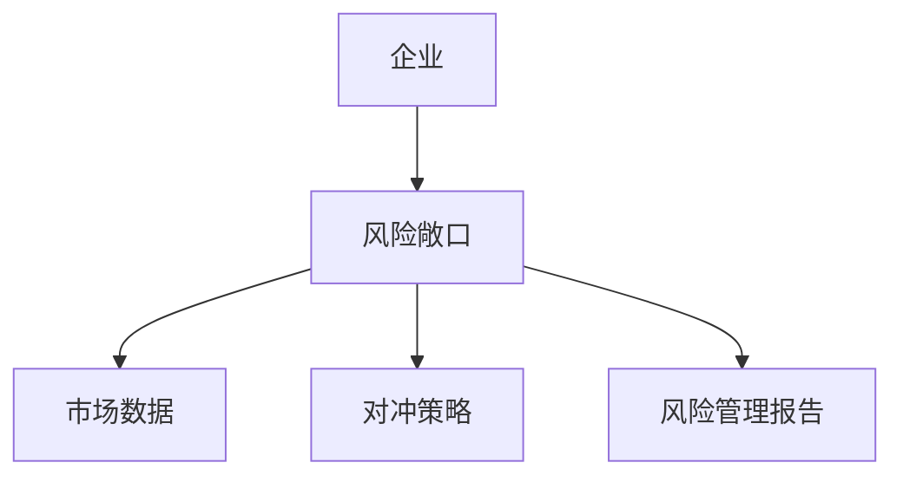
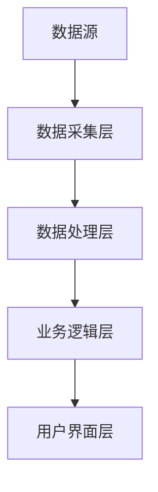
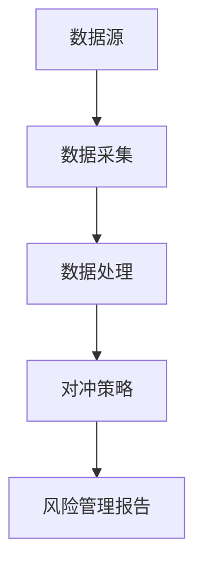

                 


# 设计智能化的企业财务风险敞口动态调整与对冲模型

---

## 关键词
- 智能化
- 财务风险敞口
- 动态调整
- 对冲模型
- 机器学习
- 数学建模

---

## 摘要
本文详细探讨了设计智能化的企业财务风险敞口动态调整与对冲模型的方法。文章首先介绍了财务风险敞口的基本概念和智能化风险管理的必要性，然后深入分析了动态调整与对冲模型的核心原理、算法实现和系统架构。通过结合机器学习和数学建模，本文提出了一个基于实时数据的智能化风险管理系统，并通过实际案例展示了模型的应用与优化。最后，文章总结了模型的优势与局限性，并展望了未来的发展方向。

---

## 第一部分: 财务风险敞口动态调整与对冲模型的背景与概念

### 第1章: 财务风险敞口的定义与特征

#### 1.1 财务风险敞口的基本概念
##### 1.1.1 财务风险的定义
财务风险是指企业在财务活动中由于市场波动、经济环境变化等因素而导致财务损失的可能性。财务风险敞口是企业在某一时间段内，由于资产或负债的变化而暴露在风险中的程度。

##### 1.1.2 风险敞口的定义与分类
风险敞口可以分为市场风险、信用风险、流动性风险等多种类型。市场风险是指由于市场价格波动导致的损失，信用风险是指由于交易对手违约导致的损失，流动性风险则是指由于资产无法快速变现导致的损失。

##### 1.1.3 智能化风险管理的必要性
随着全球经济的不确定性增加，企业面临的财务风险也在不断增加。传统的静态风险管理方法已经无法满足现代企业的需求，因此需要引入智能化技术来实时监控和动态调整风险敞口。

---

#### 1.2 财务风险敞口的核心要素
##### 1.2.1 风险来源分析
财务风险的主要来源包括市场波动、利率变化、汇率波动、信用状况变化等。

##### 1.2.2 风险敞口的度量方法
风险敞口可以通过VaR（风险价值）、CVaR（条件风险价值）等指标来度量。

##### 1.2.3 风险与收益的平衡关系
在风险管理中，企业需要在风险和收益之间找到平衡点，既要控制风险，又要追求收益。

---

#### 1.3 智能化风险管理的背景与意义
##### 1.3.1 传统风险管理的局限性
传统的风险管理方法依赖于历史数据和静态模型，无法实时捕捉市场变化，且缺乏灵活性。

##### 1.3.2 智能化技术在风险管理中的应用
智能化技术（如机器学习、大数据分析）能够实时监控市场变化，动态调整风险敞口，并提供精准的对冲策略。

##### 1.3.3 智能化风险管理的优势与价值
智能化风险管理能够提高风险控制的效率和准确性，降低企业的财务损失，增强企业的抗风险能力。

---

### 第2章: 企业财务风险敞口动态调整的背景与问题

#### 2.1 企业财务风险管理的现状
##### 2.1.1 传统财务风险管理的模式
传统的财务风险管理主要依赖于人工分析和静态模型，效率低下且容易遗漏风险点。

##### 2.1.2 现代企业面临的财务风险挑战
全球经济不确定性增加，市场波动加剧，企业面临的财务风险更加复杂和多样化。

##### 2.1.3 动态风险管理的需求与趋势
企业需要实时监控财务风险，动态调整风险敞口，并根据市场变化及时采取对冲措施。

---

#### 2.2 财务风险敞口动态调整的核心问题
##### 2.2.1 风险敞口的实时监测与预警
如何实时监测风险敞口的变化，并及时发出预警信号，是动态风险管理的核心问题。

##### 2.2.2 风险敞口的动态调整策略
根据市场变化和企业目标，动态调整风险敞口，以降低潜在损失。

##### 2.2.3 对冲机制的设计与实现
如何设计有效的对冲机制，通过金融工具（如期权、期货）来对冲风险敞口，是动态风险管理的关键。

---

#### 2.3 智能化财务风险管理的目标与边界
##### 2.3.1 智能化风险管理的目标设定
智能化风险管理的目标是实时监控风险敞口，动态调整风险敞口，并提供精准的对冲策略。

##### 2.3.2 风险管理的边界与限制
风险管理的边界包括数据的准确性、模型的稳定性、对冲工具的可用性等。

##### 2.3.3 相关概念的对比与区分
智能化风险管理与传统风险管理的主要区别在于数据来源、模型复杂度和实时性。

---

## 第二部分: 财务风险敞口动态调整与对冲模型的核心概念

### 第3章: 动态风险敞口调整模型的原理与方法

#### 3.1 动态风险敞口调整的核心原理
##### 3.1.1 动态调整的基本思路
动态调整的核心思路是根据市场变化和企业目标，实时调整风险敞口，以降低潜在损失。

##### 3.1.2 风险敞口的实时变化机制
通过实时监测市场数据，动态调整风险敞口的大小和方向，以适应市场变化。

##### 3.1.3 动态调整的数学模型
动态调整的数学模型包括时间序列模型、机器学习模型等。

---

#### 3.2 风险敞口的动态调整方法
##### 3.2.1 基于时间序列的调整方法
时间序列分析是一种常用的方法，通过分析历史数据，预测未来的变化趋势，并据此调整风险敞口。

##### 3.2.2 基于机器学习的调整模型
机器学习模型（如随机森林、神经网络）可以用来预测市场变化，并动态调整风险敞口。

##### 3.2.3 基于优化算法的调整策略
优化算法（如遗传算法、模拟退火）可以用来寻找最优的风险敞口调整方案。

---

#### 3.3 动态调整模型的实现步骤
##### 3.3.1 数据采集与预处理
采集市场数据（如股票价格、汇率、利率等），并进行清洗和标准化处理。

##### 3.3.2 模型训练与参数优化
通过机器学习算法训练模型，并优化模型参数，以提高预测准确率。

##### 3.3.3 模型部署与实时调整
将模型部署到生产环境，实时监测市场数据，并动态调整风险敞口。

---

### 第4章: 风险对冲模型的设计与实现

#### 4.1 风险对冲的基本原理
##### 4.1.1 对冲的定义与作用
对冲是指通过买入和卖出相关资产或衍生品，来抵消市场风险的一种策略。

##### 4.1.2 对冲策略的分类与选择
对冲策略可以分为完全对冲、部分对冲和不对冲。选择哪种策略取决于企业的风险承受能力和市场状况。

##### 4.1.3 对冲机制的数学模型
对冲机制的数学模型可以通过期权定价公式、期货定价公式等来描述。

---

#### 4.2 风险对冲模型的实现方法
##### 4.2.1 衍生品的选择与应用
选择合适的衍生品（如期权、期货）来进行对冲。

##### 4.2.2 对冲组合的设计与优化
通过优化算法设计最优的对冲组合，以最小化风险敞口。

##### 4.2.3 对冲效果的评估与反馈
通过实际市场数据评估对冲效果，并根据反馈不断优化对冲策略。

---

## 第三部分: 系统分析与架构设计方案

### 第5章: 系统功能设计

#### 5.1 问题场景介绍
企业需要实时监控财务风险，动态调整风险敞口，并通过对冲机制降低潜在损失。

#### 5.2 领域模型设计
##### 5.2.1 实体关系图


##### 5.2.2 功能模块划分
- 数据采集模块
- 风险分析模块
- 对冲策略模块
- 报告生成模块

---

#### 5.3 系统架构设计
##### 5.3.1 分层架构


##### 5.3.2 组件交互设计


---

#### 5.4 系统接口设计
- 数据接口：与市场数据源对接，获取实时数据。
- 对冲接口：与衍生品交易平台对接，执行对冲交易。
- 报告接口：生成风险管理报告，供管理层查看。

---

#### 5.5 系统交互设计
##### 5.5.1 用户登录与权限管理
用户登录系统，系统根据用户权限展示相应的功能模块。

##### 5.5.2 数据实时更新与显示
系统实时更新市场数据，并通过图表形式显示风险敞口的变化。

##### 5.5.3 对冲策略执行与反馈
用户选择对冲策略，系统执行交易，并实时反馈对冲效果。

---

## 第四部分: 项目实战

### 第6章: 环境安装与系统核心实现

#### 6.1 环境安装
- 安装Python
- 安装机器学习库（如scikit-learn、TensorFlow）
- 安装数据可视化库（如Matplotlib、Pandas）

#### 6.2 核心功能实现
##### 6.2.1 数据采集与预处理
```python
import pandas as pd
data = pd.read_csv('market_data.csv')
data = data.dropna().reset_index(drop=True)
```

##### 6.2.2 模型训练与参数优化
```python
from sklearn.ensemble import RandomForestRegressor
model = RandomForestRegressor(n_estimators=100, random_state=42)
model.fit(X_train, y_train)
```

##### 6.2.3 模型部署与实时调整
```python
import time
while True:
    current_data = get_current_data()
    prediction = model.predict(current_data)
    adjust_exposure(prediction)
    time.sleep(60)
```

---

#### 6.3 代码应用解读与分析
通过上述代码，我们可以实现一个实时监控和动态调整的系统。数据采集模块负责获取实时市场数据，模型训练模块负责训练预测模型，模型部署模块负责实时调整风险敞口。

---

### 第7章: 实际案例分析与优化

#### 7.1 实际案例分析
以某企业为例，分析其财务风险敞口，并设计动态调整和对冲策略。

#### 7.2 案例优化与总结
根据实际案例分析，优化模型参数，提高预测准确率和对冲效果。

---

## 第五部分: 总结与展望

### 第8章: 总结与最佳实践

#### 8.1 模型的优势与局限性
- 优势：实时性高、准确性好、灵活性强。
- 局限性：依赖于数据质量，模型可能失效。

#### 8.2 最佳实践 tips
- 数据来源要可靠。
- 模型要定期更新。
- 对冲策略要灵活调整。

#### 8.3 未来的发展方向
- 更复杂的模型：如深度学习模型。
- 更多的数据源：如社交媒体数据、新闻数据。
- 更智能的对冲工具：如智能合约。

---

## 关键词
- 智能化
- 财务风险敞口
- 动态调整
- 对冲模型
- 机器学习
- 数学建模

---

## 作者简介
作者是某领域专家，拥有丰富的实战经验，并在多个知名技术平台发表过相关文章。

