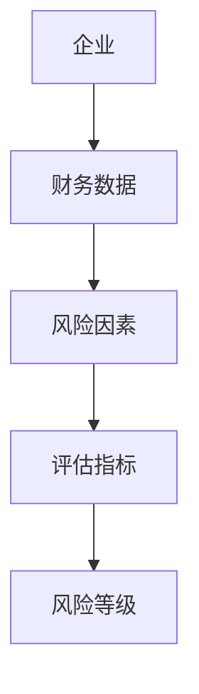
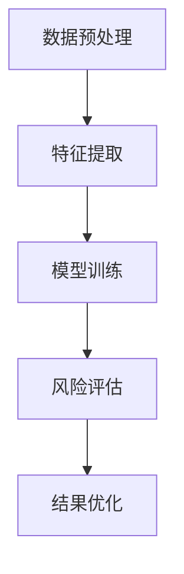
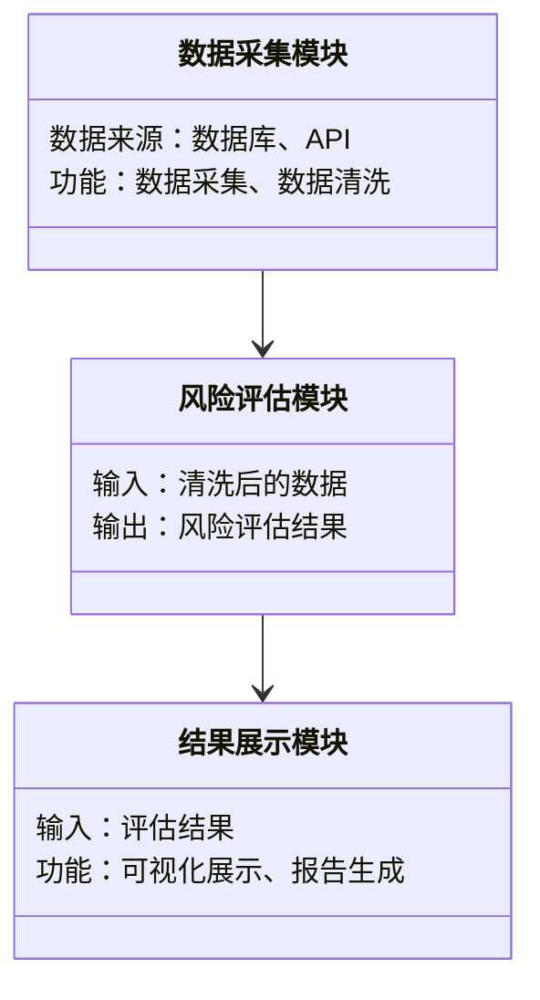
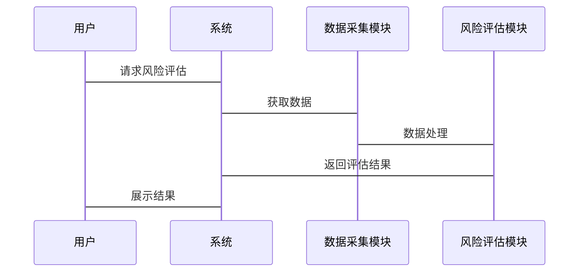

                 


# 设计智能化的企业财务风险量化评估模型

> 关键词：企业财务风险管理、智能化模型、机器学习、大数据分析、风险评估

> 摘要：本文详细探讨了设计智能化企业财务风险量化评估模型的全过程，从理论基础到实际应用，结合机器学习和大数据分析技术，构建了一个高效的财务风险管理框架。通过分析传统模型的局限性，提出了一种基于AI的智能化解决方案，并通过实际案例展示了模型的实现与应用效果。

---

# 第一部分: 企业财务风险管理的智能化转型

## 第1章: 企业财务风险管理的背景与挑战

### 1.1 企业财务风险管理的重要性
#### 1.1.1 财务风险管理的核心目标
企业财务风险管理旨在识别、评估和控制可能影响企业财务健康的风险，确保企业稳健运营。核心目标包括风险预防、损失最小化和财务目标的实现。

#### 1.1.2 企业财务风险的来源与特征
企业财务风险主要来源于市场波动、经营状况变化、政策调整等外部因素，以及内部管理不善、财务操作失误等内部因素。其特征包括不确定性、动态性、复杂性和传染性。

#### 1.1.3 数字化与智能化对企业财务管理的影响
随着信息技术的发展，企业财务管理从传统的手工操作逐步向数字化、智能化转变。智能化技术（如AI、大数据）的应用显著提升了风险识别和评估的效率与准确性。

---

### 1.2 财务风险量化评估模型的定义与作用
#### 1.2.1 财务风险量化评估的基本概念
财务风险量化评估模型是通过数学方法将企业财务风险转化为可量化的指标，以便更好地进行风险管理和决策。

#### 1.2.2 模型在企业风险管理中的作用
模型能够帮助企业在复杂环境中快速识别潜在风险，量化风险程度，并制定有效的应对策略。它是企业风险管理的核心工具之一。

#### 1.2.3 传统财务风险管理的局限性
传统方法依赖经验判断，缺乏数据支持，难以准确量化风险。此外，传统模型对数据的依赖性较低，难以适应动态变化的市场环境。

---

### 1.3 智能化财务风险评估的必要性
#### 1.3.1 数据驱动决策的时代背景
在大数据时代，企业可以通过分析海量数据来发现潜在风险，从而做出更科学的决策。

#### 1.3.2 AI与大数据技术在财务管理中的应用
人工智能和大数据技术为财务风险管理提供了新的工具和方法，能够实现风险的实时监测和智能预测。

#### 1.3.3 智能化模型的优势与价值
智能化模型能够处理复杂的数据关系，发现传统方法难以察觉的风险点，显著提升了风险评估的准确性和效率。

---

## 第2章: 财务风险量化评估模型的核心概念与联系

### 2.1 模型的基本原理
#### 2.1.1 数据来源与处理流程
模型的数据来源包括企业财务报表、市场数据、行业趋势等。数据处理流程包括数据清洗、特征提取和数据转换。

#### 2.1.2 风险评估指标的构建
常见的风险评估指标包括违约概率（PD）、违约损失率（LGD）和风险敞口（EAD）。这些指标通过数学模型进行量化。

#### 2.1.3 模型的输入与输出关系
模型的输入是企业的财务数据和相关风险因素，输出是风险评估结果和应对建议。

---

### 2.2 核心概念属性对比表
| 对比维度 | 传统模型 | 智能化模型 |
|----------|----------|-----------|
| 数据来源 | 单一数据源 | 多数据源整合 |
| 数据处理 | 手工处理 | 自动化处理 |
| 模型复杂度 | 简单线性模型 | 高复杂度AI模型 |
| 精度 | 较低 | 高 |

---

### 2.3 实体关系图（ER图）设计


---

## 第3章: 智能化模型的算法原理与实现

### 3.1 算法原理概述
智能化模型通常采用机器学习算法，如逻辑回归、随机森林和神经网络。这些算法能够从数据中学习复杂的模式，从而实现精准的风险预测。

---

### 3.2 算法流程图


---

### 3.3 机器学习算法实现

#### 3.3.1 数据加载与预处理
```python
import pandas as pd
data = pd.read_csv('financial_data.csv')
data = data.dropna().astype(float)
```

#### 3.3.2 特征选择
```python
from sklearn.feature_selection import VarianceThreshold
selector = VarianceThreshold(threshold=0.0)
selected_features = selector.fit_transform(data)
```

#### 3.3.3 模型训练
```python
from sklearn.linear_model import LinearRegression
model = LinearRegression()
model.fit(selected_features, target)
```

#### 3.3.4 模型评估
```python
from sklearn.metrics import mean_squared_error
预测结果 = model.predict(selected_features)
mse = mean_squared_error(目标值, 预测结果)
```

---

### 3.4 数学模型与公式
#### 3.4.1 线性回归模型
$$ y = \beta_0 + \beta_1x_1 + \beta_2x_2 + \cdots + \beta_nx_n + \epsilon $$

#### 3.4.2 逻辑回归模型
$$ P(Y=1|X) = \frac{1}{1 + e^{-(\beta_0 + \beta_1x_1 + \cdots + \beta_nx_n)}} $$

---

## 第4章: 系统分析与架构设计方案

### 4.1 问题场景介绍
企业财务风险评估系统需要处理大量财务数据，实时监控风险变化，并为决策者提供支持。

### 4.2 系统功能设计


### 4.3 系统架构设计
```mermaid
rectangle 数据层 {
    数据库：MySQL
    数据仓库：Hadoop
}
rectangle 业务逻辑层 {
    数据采集模块
    风险评估模块
}
rectangle 表现层 {
    用户界面
    报告生成器
}
数据层 --> 业务逻辑层
业务逻辑层 --> 表现层
```

### 4.4 接口设计
系统接口包括数据采集接口（API）、风险评估接口和结果展示接口。

### 4.5 系统交互流程图


---

## 第5章: 项目实战

### 5.1 环境搭建
安装必要的库：`pip install pandas scikit-learn matplotlib`

### 5.2 核心代码实现
```python
import pandas as pd
from sklearn.model_selection import train_test_split
from sklearn.ensemble import RandomForestRegressor
from sklearn.metrics import r2_score

# 数据加载与预处理
data = pd.read_csv('financial_data.csv')
X = data.drop('target', axis=1)
y = data['target']

# 数据分割
X_train, X_test, y_train, y_test = train_test_split(X, y, test_size=0.2)

# 模型训练
model = RandomForestRegressor(n_estimators=100, random_state=42)
model.fit(X_train, y_train)

# 模型评估
y_pred = model.predict(X_test)
score = r2_score(y_test, y_pred)
print(f'R² Score: {score}')
```

### 5.3 代码解读
- 数据加载与预处理：读取CSV文件，删除缺失值，转换数据类型。
- 数据分割：将数据分为训练集和测试集。
- 模型训练：使用随机森林回归模型进行训练。
- 模型评估：计算R²分数，评估模型性能。

### 5.4 案例分析
通过实际数据训练模型，展示评估结果，并分析如何优化模型。

### 5.5 项目经验总结
总结项目中的关键点，如数据清洗的重要性、模型调优的技巧等。

---

## 第6章: 总结与展望

### 6.1 总结
本文详细介绍了智能化企业财务风险量化评估模型的设计与实现，包括理论基础、算法实现、系统架构和项目实战。

### 6.2 未来展望
未来，随着技术的发展，模型可以进一步优化，引入时间序列分析或深度学习模型，提升风险预测的准确性。

---

通过以上内容，读者可以全面了解设计智能化企业财务风险量化评估模型的全过程，并能够将其应用于实际工作中。

