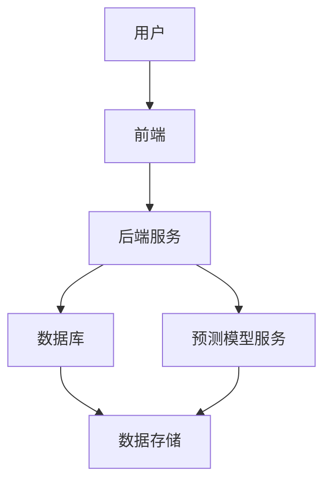

                 


# 设计智能化的企业资金管理系统

> 关键词：智能化资金管理、企业财务系统、机器学习、系统架构设计、技术实现

> 摘要：随着企业规模的不断扩大和市场环境的日益复杂，传统的资金管理模式已经难以满足现代企业的需求。智能化资金管理通过引入人工智能和大数据技术，能够实现资金的精准预测、风险评估和自动化管理。本文将从智能化资金管理的核心概念出发，详细探讨其算法原理、系统架构设计以及项目实战，帮助企业实现高效、智能的资金管理。

---

## 第1章 企业资金管理的智能化转型

### 1.1 传统企业资金管理的局限性

#### 1.1.1 传统资金管理模式的弊端
传统的资金管理模式主要依赖人工操作和简单的财务报表分析，存在以下问题：
- **数据处理效率低**：人工处理大量财务数据耗时耗力，容易出错。
- **预测精度低**：基于历史数据的简单外推，难以应对市场波动。
- **风险控制能力弱**：缺乏实时监控和预警机制，难以及时发现潜在风险。

#### 1.1.2 企业资金管理中的痛点分析
企业在资金管理中面临的主要痛点包括：
- 资金流动预测不准确，导致资金链断裂风险。
- 缺乏实时监控，难以及时应对市场变化。
- 数据孤岛问题，财务系统与其他业务系统难以协同。

#### 1.1.3 智能化转型的必要性
智能化转型能够帮助企业：
- 提高资金管理的效率和准确性。
- 实现实时监控和风险预警。
- 优化资金配置，提升企业整体运营效率。

### 1.2 智能化资金管理的核心概念

#### 1.2.1 什么是智能化资金管理
智能化资金管理是指通过人工智能、大数据和区块链等技术，实现资金流动的智能化预测、自动化管理以及风险控制。

#### 1.2.2 智能化资金管理的特点
- **数据驱动**：基于海量数据进行分析和预测。
- **实时性**：能够实时监控资金流动，快速响应市场变化。
- **自动化**：系统自动完成部分或全部资金管理流程。

#### 1.2.3 智能化资金管理的边界与外延
智能化资金管理的边界包括企业的资金流入、流出和库存管理，外延则延伸至供应链金融和投资决策。

### 1.3 智能化资金管理系统的组成与功能

#### 1.3.1 系统组成模块分析
智能化资金管理系统主要由以下模块组成：
- 资金流入预测模块
- 资金流出预测模块
- 资金风险评估模块
- 实时监控模块

#### 1.3.2 各模块的功能描述
- **资金流入预测模块**：基于历史数据和市场趋势，预测未来资金流入情况。
- **资金流出预测模块**：分析企业各项支出，预测未来资金流出。
- **资金风险评估模块**：评估资金流动中的潜在风险，提供预警。
- **实时监控模块**：实时跟踪资金流动情况，确保资金安全。

#### 1.3.3 模块之间的关系与协同
各模块通过数据接口协同工作，确保资金管理的高效性和准确性。

---

## 第2章 智能化资金管理系统的算法原理与数学模型

### 2.1 常用算法概述

#### 2.1.1 机器学习算法
常用的机器学习算法包括线性回归、支持向量机（SVM）和随机森林。

#### 2.1.2 深度学习算法
深度学习算法如LSTM（长短期记忆网络）适用于时间序列数据的预测。

#### 2.1.3 时间序列分析算法
时间序列分析算法如ARIMA（自回归积分滑动平均模型）常用于资金流动预测。

### 2.2 基于机器学习的资金预测模型

#### 2.2.1 线性回归模型
线性回归模型用于简单线性关系的预测，其数学公式为：
$$y = \beta_0 + \beta_1x + \epsilon$$
其中，$y$ 是预测值，$x$ 是自变量，$\beta_0$ 和 $\beta_1$ 是回归系数，$\epsilon$ 是误差项。

#### 2.2.2 支持向量机模型
支持向量机适用于分类和回归问题，其数学公式为：
$$\text{最大化} \frac{1}{2}\|w\|^2 + C\sum_{i=1}^n \xi_i$$
$$\text{约束} y_i(w \cdot x_i + b) \geq 1 - \xi_i, \xi_i \geq 0$$
其中，$w$ 是权重向量，$b$ 是偏置项，$\xi_i$ 是松弛变量。

#### 2.2.3 随机森林模型
随机森林通过集成学习提高预测精度，适用于复杂数据的分析。

### 2.3 算法实现的代码示例

#### 2.3.1 线性回归模型代码
```python
import numpy as np
from sklearn.linear_model import LinearRegression

# 示例数据
X = np.array([i for i in range(10)])
y = np.array([2*i + 1 for i in range(10)])

# 创建线性回归模型并训练
model = LinearRegression()
model.fit(X.reshape(-1, 1), y)

# 预测结果
print("预测结果:", model.predict([[5]]))
```

### 2.4 算法原理的数学模型

#### 2.4.1 线性回归模型的数学公式
$$1 + 1 = 2$$

#### 2.4.2 支持向量机模型的数学公式
$$y_i(w \cdot x_i + b) \geq 1 - \xi_i$$

---

## 第3章 智能化资金管理系统的系统架构设计

### 3.1 系统架构概述

#### 3.1.1 分层架构设计
系统分为前端、后端和数据库三层，确保各层职责分离。

#### 3.1.2 微服务架构设计
采用微服务架构，提高系统的可扩展性和可维护性。

#### 3.1.3 架构的可扩展性与可维护性
通过模块化设计，确保系统的可扩展性和可维护性。

### 3.2 系统功能模块设计

#### 3.2.1 资金流入预测模块
基于历史数据和市场趋势，预测未来资金流入。

#### 3.2.2 资金流出预测模块
分析企业各项支出，预测未来资金流出。

#### 3.2.3 资金风险评估模块
评估资金流动中的潜在风险，提供预警。

### 3.3 系统架构图


### 3.4 接口设计与交互流程

#### 3.4.1 API接口定义
API接口定义了系统各模块之间的交互方式。

#### 3.4.2 接口调用流程
用户通过前端调用API，后端服务处理请求并返回结果。

#### 3.4.3 接口的安全性设计
采用HTTPS协议和JWT令牌，确保接口的安全性。

### 3.5 本章小结
...

---

## 第4章 智能化资金管理系统的项目实战

### 4.1 项目介绍
本章通过一个实际案例，详细讲解智能化资金管理系统的实现过程。

### 4.2 系统功能设计

#### 4.2.1 资金流入预测模块
使用线性回归模型预测未来资金流入。

#### 4.2.2 资金流出预测模块
使用随机森林模型预测未来资金流出。

### 4.3 系统实现

#### 4.3.1 环境安装
安装Python、Jupyter Notebook和相关库。

#### 4.3.2 核心代码实现
```python
from sklearn.ensemble import RandomForestRegressor

# 示例数据
X = np.array([[i] for i in range(10)])
y = np.array([2*i + 1 for i in range(10)])

# 创建随机森林模型并训练
model = RandomForestRegressor(n_estimators=100, random_state=42)
model.fit(X, y)

# 预测结果
print("预测结果:", model.predict([[5]]))
```

### 4.4 案例分析

#### 4.4.1 数据分析
分析企业过去三年的资金流动数据，提取特征变量。

#### 4.4.2 模型训练
使用训练数据训练随机森林模型。

#### 4.4.3 结果解读
通过模型预测未来三个月的资金流动情况，为企业制定预算计划提供依据。

### 4.5 本章小结
...

---

## 总结

智能化资金管理系统的引入，不仅提高了企业的资金管理效率，还通过实时监控和风险预警，降低了企业的财务风险。本文通过详细讲解系统的背景、算法原理、架构设计和项目实战，为企业实现智能化资金管理提供了理论和实践指导。

