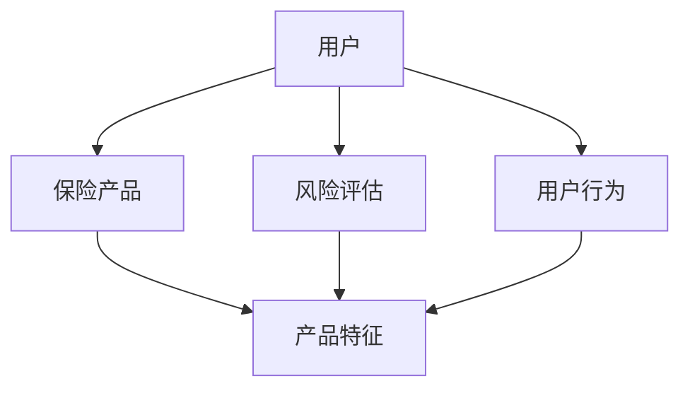
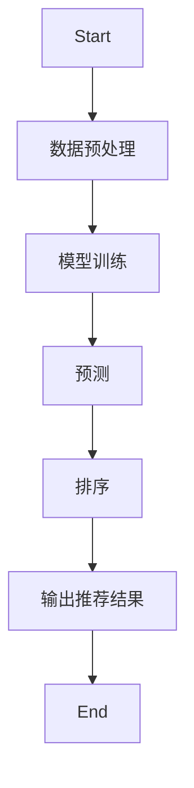
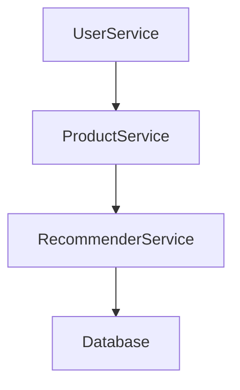
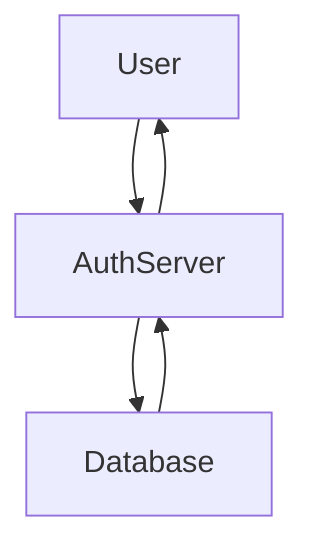
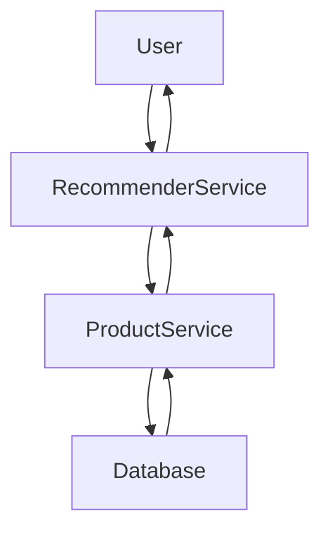

                 


# 设计智能化的保险产品推荐系统

> 关键词：智能化保险、推荐系统、机器学习、深度学习、自然语言处理、系统架构设计

> 摘要：本文旨在探讨如何设计智能化的保险产品推荐系统，结合人工智能和大数据分析技术，通过机器学习、深度学习和自然语言处理等方法，构建高效、精准的保险推荐系统。文章从背景与基础出发，深入分析推荐系统的算法原理、数学模型和系统架构，最后通过实战案例展示如何实现智能化的保险推荐系统。

---

# 第一部分: 智能化保险产品推荐系统的背景与基础

# 第1章: 智能化保险产品推荐系统概述

## 1.1 保险行业的数字化转型
### 1.1.1 保险行业的现状与挑战
- 保险行业的传统模式与数字化转型的必要性
- 数据爆炸与用户需求多样化对保险推荐系统的挑战
- 数字化转型的核心：智能化推荐系统

### 1.1.2 数字化转型的必要性
- 传统保险销售模式的局限性
- 用户需求的个性化与多样化
- 数字化转型如何提升用户体验与企业效率

### 1.1.3 智能化推荐系统在保险中的作用
- 提高客户满意度与购买转化率
- 降低销售成本
- 提升保险产品的覆盖率与市场渗透率

## 1.2 推荐系统的基本概念
### 1.2.1 推荐系统的定义
- 推荐系统的定义与分类（基于内容、协同过滤、混合推荐等）
- 推荐系统的应用场景（电商、视频、保险等）

### 1.2.2 保险推荐系统的独特性
- 保险产品的复杂性与专业性
- 用户需求的多样性与风险评估的特殊性
- 数据隐私与合规性要求

## 1.3 智能化保险推荐系统的特点与优势
### 1.3.1 智能化推荐的核心要素
- 数据驱动：利用用户行为数据、历史数据、实时数据
- 机器学习：基于特征提取与模型训练
- 自然语言处理：解析保险产品描述与用户需求
- 多模态数据融合：整合结构化数据与非结构化数据

### 1.3.2 保险推荐系统的独特优势
- 精准匹配：根据用户需求与风险评估提供个性化推荐
- 动态更新：实时调整推荐策略以适应市场变化
- 数据驱动的透明性：通过数据分析优化推荐效果

### 1.3.3 与传统推荐系统的区别
- 数据维度：保险推荐系统的数据更复杂（包含健康数据、保单条款等）
- 推荐目标：注重风险匹配与合规性
- 用户隐私：更高的数据隐私保护要求

## 1.4 本章小结
- 介绍了保险行业的数字化转型背景
- 阐述了推荐系统的基本概念与保险推荐系统的独特性
- 总结了智能化保险推荐系统的特点与优势

---

# 第二部分: 智能化保险推荐系统的核心概念与联系

# 第2章: 机器学习与深度学习在保险推荐中的应用

## 2.1 机器学习的基本原理
### 2.1.1 机器学习的定义与分类
- 监督学习、无监督学习、半监督学习与强化学习的对比

### 2.1.2 机器学习在保险推荐中的应用
- 用户画像构建：基于历史购买数据、行为数据进行用户分群
- 风险评估：预测用户可能的理赔风险
- 产品推荐：基于用户特征与产品特征的相似性进行推荐

## 2.2 深度学习的核心原理
### 2.2.1 深度学习的定义与特点
- 多层神经网络（CNN、RNN、Transformer等）
- 自动特征提取与非线性关系建模

### 2.2.2 深度学习在保险推荐中的应用
- 保险产品描述的语义分析
- 用户行为的深度建模
- 复杂特征交互的建模

## 2.3 自然语言处理（NLP）在保险推荐中的应用
### 2.3.1 NLP的基本概念
- 词袋模型（Bag-of-Words）、词嵌入（Word2Vec）与上下文无关向量
- 上下文相关向量（BERT、GPT等）

### 2.3.2 NLP在保险推荐中的应用
- 保险产品描述的自动分类与标签提取
- 用户需求的语义理解与匹配
- 保险条款的自动解析与风险提示

## 2.4 核心概念对比表
| 技术 | 定义 | 应用 | 优势 |
|------|------|------|------|
| 机器学习 | 数据驱动的模式识别 | 用户画像、风险评估 | 高准确性 |
| 深度学习 | 多层神经网络 | 语义分析、复杂特征建模 | 强大学习能力 |
| NLP | 文本处理与理解 | 保险条款解析、用户需求匹配 | 提高推荐精准度 |

## 2.5 ER实体关系图


## 2.6 本章小结
- 介绍了机器学习、深度学习与NLP的基本原理
- 阐述了这些技术在保险推荐中的具体应用
- 总结了不同技术的优势与适用场景

---

# 第三部分: 智能化保险推荐系统的算法原理

# 第3章: 推荐系统的算法原理

## 3.1 协同过滤算法
### 3.1.1 协同过滤的基本原理
- 基于用户的协同过滤（UBCF）与基于物品的协同过滤（IBCF）
- 相似性度量（余弦相似度、杰卡德系数等）

### 3.1.2 协同过滤的实现步骤
1. 数据预处理：缺失值处理、数据标准化
2. 用户或物品相似度计算
3. 基于相似度的推荐生成

### 3.1.3 协同过滤的优缺点
- 优点：简单易实现，适合数据稀疏性问题
- 缺点：冷启动问题、计算复杂度高

## 3.2 基于内容的推荐算法
### 3.2.1 基于内容的推荐原理
- 基于产品特征的相似度计算
- 通过特征权重生成推荐列表

### 3.2.2 基于内容的推荐实现
1. 特征提取：TF-IDF、Word2Vec等
2. 相似度计算与排序
3. 推荐生成

## 3.3 深度学习推荐算法
### 3.3.1 基于神经网络的推荐模型
- 多层感知机（MLP）、卷积神经网络（CNN）、循环神经网络（RNN）
- Transformer架构在推荐系统中的应用

### 3.3.2 基于深度学习的推荐实现
1. 数据预处理：文本向量化、数值归一化
2. 模型训练：损失函数优化、反向传播
3. 推荐生成：基于模型预测值的排序

## 3.4 混合推荐算法
### 3.4.1 混合推荐的定义
- 组合不同推荐算法的结果，提升推荐的准确性和多样性

### 3.4.2 混合推荐的实现
1. 多模型集成：投票法、加权平均法
2. 动态权重调整：基于实时数据优化推荐策略

## 3.5 算法流程图


## 3.6 本章小结
- 介绍了协同过滤、基于内容的推荐与深度学习推荐算法
- 展示了混合推荐算法的优势
- 绘制了推荐系统的整体流程图

---

# 第四部分: 智能化保险推荐系统的数学模型与公式

# 第4章: 推荐系统的数学模型

## 4.1 协同过滤的数学模型
### 4.1.1 基于用户的协同过滤公式
$$ sim(u, v) = \frac{\sum_{i} (r_{u,i} - \bar{r}_u)(r_{v,i} - \bar{r}_v)}{\sqrt{\sum_{i} (r_{u,i} - \bar{r}_u)^2} \cdot \sqrt{\sum_{i} (r_{v,i} - \bar{r}_v)^2}} $$
- 公式解释：余弦相似度计算用户的相似性

### 4.1.2 基于物品的协同过滤公式
$$ sim(i, j) = \frac{\sum_{u} (r_{u,i} - \bar{r}_i)(r_{u,j} - \bar{r}_j)}{\sqrt{\sum_{u} (r_{u,i} - \bar{r}_i)^2} \cdot \sqrt{\sum_{u} (r_{u,j} - \bar{r}_j)^2}} $$
- 公式解释：计算物品之间的相似性

## 4.2 基于矩阵分解的推荐模型
### 4.2.1 矩阵分解的基本原理
- 将用户-产品矩阵分解为用户特征矩阵与产品特征矩阵

### 4.2.2 矩阵分解的数学表达
$$ R = U \cdot V^T $$
- $R$：用户-产品评分矩阵
- $U$：用户特征矩阵
- $V$：产品特征矩阵

### 4.2.3 矩阵分解的优化目标
$$ \min_{U, V} \| R - U V^T \|_F^2 + \lambda (\|U\|_F^2 + \|V\|_F^2) $$
- $\lambda$：正则化系数

## 4.3 基于深度学习的推荐模型
### 4.3.1 基于神经网络的推荐公式
$$ p(u, i) = \sigma(W_u u + W_i i + b) $$
- $u$：用户嵌入向量
- $i$：产品嵌入向量
- $\sigma$：激活函数

### 4.3.2 基于Transformer的推荐公式
$$ \text{Attention}(Q, K, V) = \text{softmax}(\frac{QK^T}{\sqrt{d}})V $$
- $Q$：查询向量
- $K$：键向量
- $V$：值向量
- $d$：向量维度

## 4.4 本章小结
- 推荐系统的数学模型是理解算法原理的基础
- 协同过滤、矩阵分解与深度学习模型各有优劣
- 结合具体场景选择合适的数学模型

---

# 第五部分: 智能化保险推荐系统的系统架构设计

# 第5章: 系统分析与架构设计方案

## 5.1 系统需求分析
### 5.1.1 保险推荐系统的核心需求
- 用户画像构建
- 产品特征提取
- 推荐结果生成
- 实时反馈与优化

### 5.1.2 非功能需求
- 性能需求：高并发处理能力
- 数据需求：数据清洗与特征工程
- 安全需求：数据隐私保护

## 5.2 系统功能设计
### 5.2.1 用户模块
- 用户信息采集与存储
- 用户画像构建与更新
- 用户推荐结果展示

### 5.2.2 产品模块
- 产品信息采集与存储
- 产品特征提取与标签化
- 产品推荐结果生成

### 5.2.3 推荐模块
- 推荐策略配置
- 推荐算法实现
- 推荐结果排序与输出

## 5.3 系统架构设计
### 5.3.1 分层架构
```mermaid
graph TD
    Client[用户] --> API Gateway[网关]
    API Gateway --> Service Layer[服务层]
    Service Layer --> Data Layer[数据层]
    Data Layer --> Database[数据库]
```

### 5.3.2 微服务架构


## 5.4 系统接口设计
### 5.4.1 API接口定义
- GET /users/{id}：获取用户信息
- POST /products/recommend：生成产品推荐列表
- PUT /recommend/models：更新推荐模型

### 5.4.2 接口交互流程图
```mermaid
graph TD
    Client --> API Gateway
    API Gateway --> RecommenderService
    RecommenderService --> Database
    Database --> RecommenderService
    RecommenderService --> API Gateway
    API Gateway --> Client
```

## 5.5 系统交互流程图
### 5.5.1 用户登录与授权


### 5.5.2 产品推荐请求


## 5.6 本章小结
- 系统架构设计是实现智能化保险推荐系统的关键
- 分层架构与微服务架构各有优劣，需结合场景选择
- 接口设计与系统交互流程图帮助清晰理解系统结构

---

# 第六部分: 智能化保险推荐系统的项目实战

# 第6章: 项目实战——基于机器学习的保险推荐系统

## 6.1 项目环境搭建
### 6.1.1 开发工具安装
- Python、Jupyter Notebook、Pip
- 安装依赖库：pandas、numpy、scikit-learn、xgboost

### 6.1.2 数据集准备
- 数据来源：公开数据集（如Kaggle）或自建数据集
- 数据清洗与特征工程

## 6.2 系统核心实现
### 6.2.1 用户画像构建
- 数据预处理：处理缺失值、异常值
- 特征工程：提取用户特征（年龄、性别、保费等）
- 用户分群：基于聚类算法（K-means）进行用户分群

### 6.2.2 产品特征提取
- 保险产品属性提取（保费、保额、保险期限等）
- 产品描述文本的向量化（TF-IDF、Word2Vec）
- 产品标签化：基于NLP技术提取关键词

### 6.2.3 推荐算法实现
- 基于协同过滤的推荐系统实现
- 基于内容的推荐系统实现
- 混合推荐算法实现

## 6.3 代码实现与解读
### 6.3.1 协同过滤算法实现
```python
from sklearn.metrics.pairwise import cosine_similarity

def user_based_recommender(train_data, user_id, top_n=5):
    # 计算用户相似度
    user_similarity = cosine_similarity(train_data.T)
    # 排除自身相似度
    user_similarity[user_id] = 0
    # 找出相似度最高的top_n用户
    similar_users = [i for i in range(len(user_similarity[user_id])) if user_similarity[user_id][i] > 0.5]
    similar_users.sort(key=lambda x: -user_similarity[user_id][x])
    # 获取推荐产品
    recommended_products = []
    for u in similar_users[:top_n]:
        recommended_products.extend(train_data.columns[ train_data.iloc[u] > 0 ])
    return recommended_products
```

### 6.3.2 深度学习模型实现
```python
import tensorflow as tf
from tensorflow.keras import layers

def build_model(input_dim):
    model = tf.keras.Sequential()
    model.add(layers.Dense(64, activation='relu', input_dim=input_dim))
    model.add(layers.Dense(32, activation='relu'))
    model.add(layers.Dense(1, activation='sigmoid'))
    model.compile(optimizer='adam', loss='binary_crossentropy', metrics=['accuracy'])
    return model
```

## 6.4 实际案例分析
### 6.4.1 数据分析与结果展示
- 可视化推荐结果：基于用户分群的推荐效果对比
- 推荐准确率与召回率分析

### 6.4.2 优化与调优
- 超参数调整（学习率、批次大小）
- 模型评估与迭代优化

## 6.5 本章小结
- 通过项目实战理解智能化保险推荐系统的实现过程
- 掌握基于机器学习的推荐算法实现
- 学会数据清洗、特征提取与模型调优

---

# 第七部分: 智能化保险推荐系统的总结与扩展

# 第7章: 总结与扩展

## 7.1 项目总结
### 7.1.1 核心成果
- 成功实现基于机器学习的保险推荐系统
- 掌握协同过滤、深度学习等推荐算法
- 理解系统架构设计与数据处理流程

### 7.1.2 经验与教训
- 数据质量对推荐效果的影响
- 模型调优的复杂性与必要性
- 系统架构设计的灵活性与可扩展性

## 7.2 未来扩展方向
### 7.2.1 技术扩展
- 引入边缘计算优化推荐性能
- 结合区块链技术提升数据隐私与可信度
- 利用图神经网络建模用户与产品的关系

### 7.2.2 业务扩展
- 实时推荐与动态优化
- 多语言支持与国际化扩展
- 结合健康数据进行精准保险推荐

## 7.3 最佳实践 tips
- 数据预处理是推荐系统的基础
- 选择合适的算法与模型
- 注重系统架构的灵活性与可扩展性
- 定期优化与迭代推荐策略

## 7.4 本章小结
- 总结了项目的核心成果与经验教训
- 展望了智能化保险推荐系统的未来发展方向
- 提供了实践中的注意事项与优化建议

---

# 附录

## 附录 A: 常用工具与库
- Python库：pandas、numpy、scikit-learn、xgboost、tensorflow
- 开发工具：Jupyter Notebook、VS Code
- 数据存储：MySQL、MongoDB

## 附录 B: 推荐系统评价指标
| 指标 | 定义 | 计算公式 |
|------|------|----------|
| 准确率 | 正确推荐的比例 | Precision = TP / (TP + FP) |
| 召回率 | 推荐的正确项比例 | Recall = TP / (TP + FN) |
| F1分数 | 准确率与召回率的调和平均数 | F1 = 2 * (Precision * Recall) / (Precision + Recall) |
| AUC | 排序性能指标 | AUC = (TP/(TP+FP)) + (TN/(TN+FN)) - 1 |

## 附录 C: 参考文献
- 本文参考了以下文献：
  1. 李航. 《机器学习实战》
  2. Goodfellow, Ian, Bengio Yoshua, and Aaron Courville. *Deep Learning*.
  3. Kaggle保险推荐系统相关数据集

---

# 结束语

通过本文的系统介绍，读者可以全面理解智能化保险推荐系统的背景、核心概念、算法原理、系统架构与项目实战。希望本文能够为保险行业的技术从业者与研究人员提供有价值的参考与启示。

