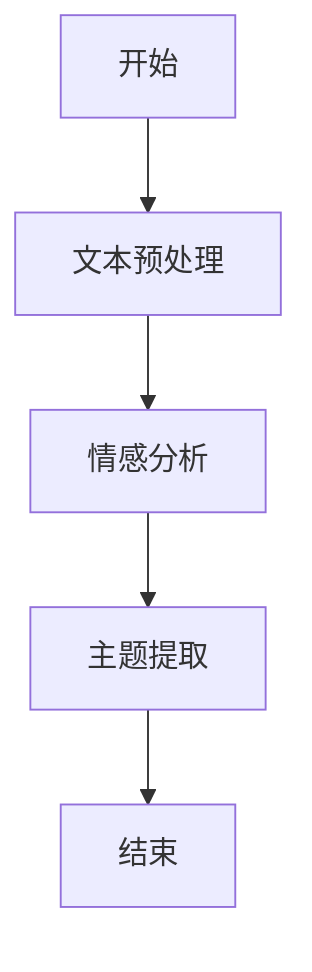
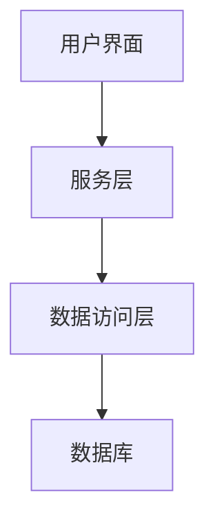
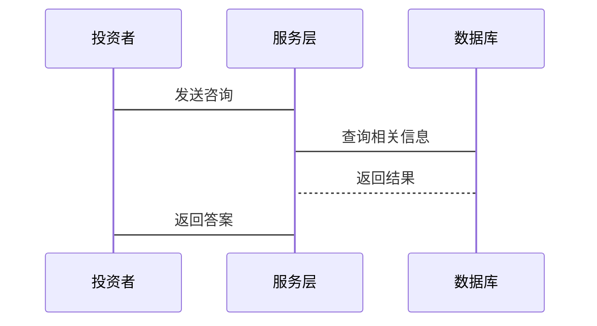

                 


# 设计智能化的投资者关系管理系统

## 关键词：投资者关系管理，智能化，自然语言处理，机器学习，系统架构设计

## 摘要：  
随着科技的不断进步，投资者关系管理（Investor Relations Management，IRM）逐渐从传统的人工管理方式向智能化方向转变。本文将从投资者关系管理的核心概念、智能化算法的原理、系统架构设计、项目实战等多个方面进行详细阐述，帮助读者全面理解如何设计一个智能化的投资者关系管理系统。

---

# 第1章: 投资者关系管理概述

## 1.1 投资者关系管理的定义与核心要素  
投资者关系管理是指企业与其投资者之间建立、维护和优化关系的过程。其核心要素包括信息传递、沟通渠道、投资者行为分析、企业形象管理等。  

### 1.1.1 投资者关系管理的定义  
投资者关系管理（IRM）是企业与投资者之间的桥梁，通过有效传递企业信息、管理投资者期望，提升投资者对企业价值的认可和信任。  

### 1.1.2 核心要素与功能模块  
1. **信息传递**：通过财报、公告等方式向投资者传递企业信息。  
2. **沟通渠道**：包括电话、邮件、会议等多种沟通方式。  
3. **投资者行为分析**：通过数据分析了解投资者需求和偏好。  
4. **企业形象管理**：塑造和维护企业在投资者心中的形象。  

### 1.1.3 投资者关系管理的重要性  
良好的投资者关系管理能够提升企业市值、增强投资者信心，并帮助企业吸引更多的投资。

## 1.2 投资者关系管理的智能化需求  
随着投资者数量的增加和信息量的爆炸式增长，传统的IR管理方式已难以满足需求，智能化成为必然选择。  

### 1.2.1 传统投资者关系管理的局限性  
1. **信息处理效率低**：人工处理大量投资者咨询和反馈耗时耗力。  
2. **数据分析能力弱**：难以从海量数据中提取有价值的信息。  
3. **个性化服务不足**：难以满足不同投资者的个性化需求。  

### 1.2.2 智能化管理的必要性  
1. **提高效率**：通过自动化处理投资者咨询和反馈，节省时间。  
2. **增强精准性**：利用AI技术精准分析投资者需求和情感。  
3. **提供个性化服务**：根据投资者行为和偏好，提供定制化信息。  

### 1.2.3 智能化管理的目标与价值  
目标是通过智能化技术优化投资者关系管理流程，提升投资者满意度和企业价值。其价值体现在提高效率、降低成本、增强决策能力等方面。

---

# 第2章: 投资者关系管理的核心概念与联系

## 2.1 投资者关系管理的核心概念  
投资者关系管理的核心概念包括投资者、企业、信息和沟通渠道。  

### 2.1.1 企业与投资者的关系  
企业通过传递信息和提供服务与投资者建立信任关系，投资者则通过持有企业股票或提供反馈影响企业决策。  

### 2.1.2 信息传递与沟通机制  
信息传递是IR管理的核心，包括定期财报发布、股东大会通知、重大事件公告等。沟通机制则包括电话、邮件、在线会议等形式。  

### 2.1.3 智能化工具的应用场景  
智能化工具如聊天机器人、情感分析系统等，能够高效处理投资者咨询、分析投资者情绪，并提供个性化服务。

## 2.2 核心概念的属性对比  
通过对比传统IR管理和智能化IR管理的属性，可以看出智能化管理在效率、精准性和个性化方面的显著优势。

### 2.2.1 传统与智能化的对比表格  

| **属性**         | **传统IR管理**                     | **智能化IR管理**                     |
|-------------------|------------------------------------|--------------------------------------|
| **信息处理效率**   | 低，依赖人工处理                  | 高，自动化处理                      |
| **数据分析能力**   | 弱，难以从海量数据中提取价值      | 强，利用AI技术进行深度分析          |
| **个性化服务**     | 有限，难以满足个性化需求        | 丰富，提供定制化信息和服务          |

## 2.3 实体关系图（ER图）  
以下是投资者关系管理的核心概念的实体关系图：  

```mermaid
erDiagram
    actor 投资者
    actor 企业
    actor 信息
    actor 沟通渠道
    投资者 --> 信息: 提供反馈
    信息 <---> 企业: 发布财报
    沟通渠道 --> 企业: 发送公告
```

---

# 第3章: 智能化投资者关系管理的算法原理

## 3.1 自然语言处理在投资者关系中的应用  
自然语言处理（NLP）技术可以帮助企业更好地理解和处理投资者的反馈和咨询。  

### 3.1.1 文本分析流程  
1. **文本预处理**：包括分词、去除停用词等。  
2. **情感分析**：判断投资者情绪是正面、负面还是中性。  
3. **主题提取**：识别投资者反馈的主要主题。  

### 3.1.2 关键算法的mermaid流程图  



## 3.2 机器学习模型的构建  
机器学习模型可以用于预测投资者的行为和情感。  

### 3.2.1 数据预处理步骤  
1. 数据清洗：去除噪声数据。  
2. 特征提取：提取文本中的关键词和情感特征。  

### 3.2.2 模型训练流程  
1. 选择算法：如朴素贝叶斯、支持向量机等。  
2. 训练模型：使用训练数据进行模型训练。  
3. 模型评估：通过测试数据评估模型性能。  

### 3.2.3 示例与解释  
假设我们有一个投资者的反馈：“我对公司的业绩非常满意。” 情感分析模型可以识别出这是正面情绪。

## 3.3 数学模型与公式  
以下是朴素贝叶斯分类的公式：  

$$ P(y|x) = \frac{P(x|y)P(y)}{P(x)} $$  

其中，$P(y|x)$ 是在给定$x$的条件下，类别$y$的概率。

---

# 第4章: 系统分析与架构设计

## 4.1 问题场景介绍  
系统需要解决投资者咨询自动化处理、投资者情感分析等问题。  

### 4.1.1 系统目标  
1. 提供7x24小时的投资者咨询服务。  
2. 自动分析投资者情感并分类。  
3. 提供个性化投资建议。  

## 4.2 系统功能设计  
### 4.2.1 领域模型mermaid类图  

```mermaid
classDiagram
    class 投资者
    class 企业
    class 信息
    class 沟通渠道
    投资者 --> 信息: 提供反馈
    信息 <---> 企业: 发布财报
    沟通渠道 --> 企业: 发送公告
```

## 4.3 系统架构设计  
### 4.3.1 分层架构图  



## 4.4 接口与交互设计  
### 4.4.1 接口定义  
1. 获取投资者咨询接口：`GET /investor/questions`  
2. 提供投资建议接口：`POST /investor/advice`  

### 4.4.2 序列图展示  



---

# 第5章: 项目实战

## 5.1 环境安装与配置  
1. 安装Python和必要的库（如NLTK、Scikit-learn）。  
2. 配置开发环境（如Jupyter Notebook）。  

## 5.2 核心代码实现  
### 5.2.1 数据处理代码  

```python
import nltk
from sklearn.feature_extraction.text import TfidfVectorizer
from sklearn.naive_bayes import MultinomialNB

# 示例数据
data = ["我对公司业绩非常满意", "我对公司的前景感到担忧"]
labels = [1, 0]  # 1表示正面，0表示负面

# 特征提取
vectorizer = TfidfVectorizer()
X = vectorizer.fit_transform(data)

# 模型训练
model = MultinomialNB()
model.fit(X, labels)
```

### 5.2.2 模型训练代码  

```python
# 预测新数据
test_data = ["我对公司的未来充满信心"]
test_X = vectorizer.transform(test_data)
predicted = model.predict(test_X)
print(predicted)
```

## 5.3 案例分析与解读  
假设我们有一个投资者的反馈：“我对公司的未来充满信心。” 模型预测其情感为正面。

## 5.4 项目小结  
通过本章的实战，我们了解了如何使用Python和机器学习技术实现投资者关系管理的智能化。

---

# 第6章: 最佳实践

## 6.1 小结  
智能化投资者关系管理系统能够显著提升企业的IR管理效率和精准度。  

## 6.2 注意事项  
1. 数据安全：确保投资者数据的安全性。  
2. 模型优化：持续优化算法以提高准确率。  
3. 用户体验：确保系统界面友好，操作简便。  

## 6.3 拓展阅读  
1. 《机器学习实战》  
2. 《自然语言处理入门》  
3. 《系统架构设计精要》  

---

通过以上章节的详细讲解，我们能够全面理解并掌握设计智能化投资者关系管理系统的相关技术和方法。

