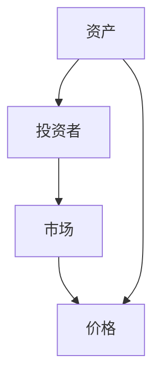
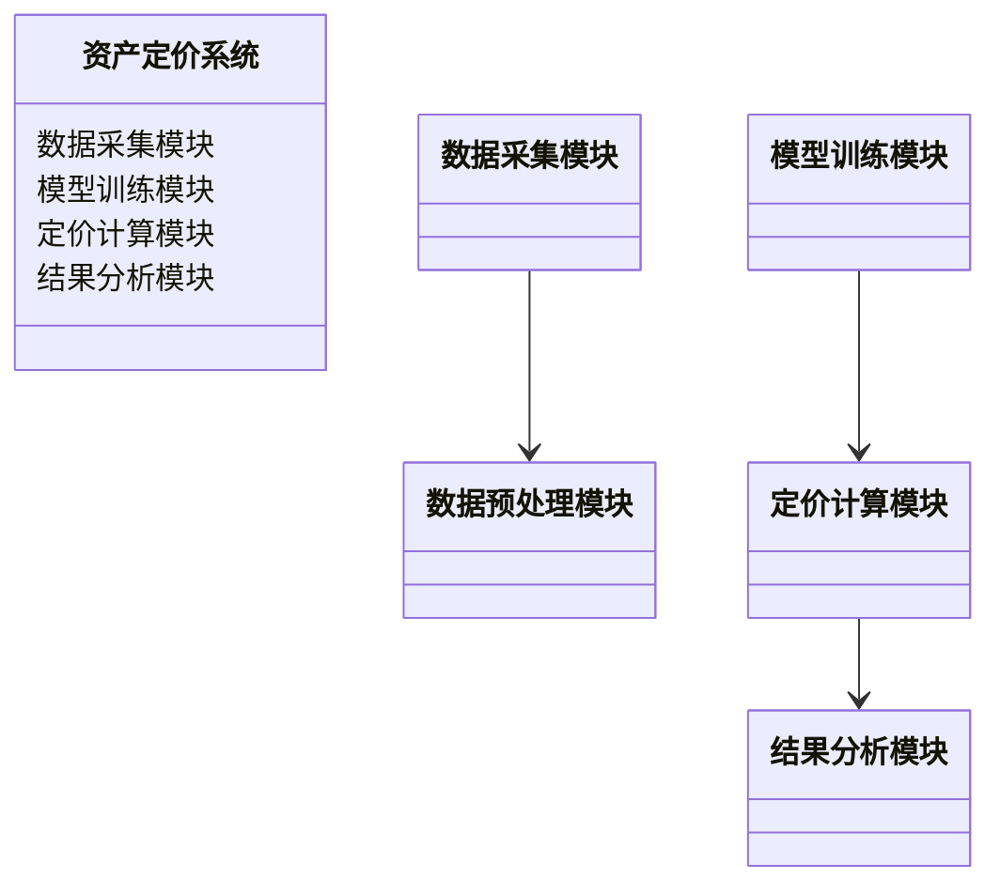
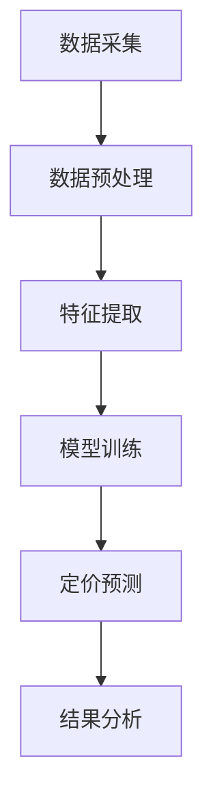
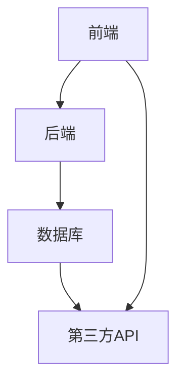
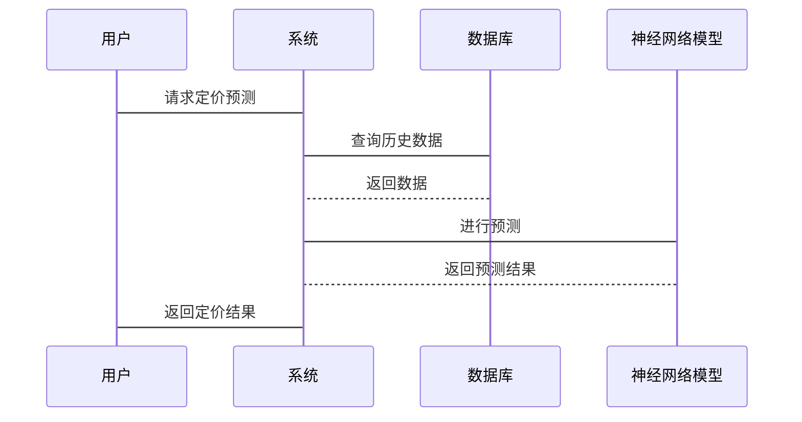

                 


# 设计智能化的资产定价模型

> 关键词：资产定价模型，智能化，人工智能，回归分析，时间序列分析，机器学习

> 摘要：资产定价是金融领域中的核心问题，传统定价模型如CAPM和APT在一定程度上解决了定价问题，但随着数据科学和人工智能技术的发展，智能化资产定价模型逐渐成为研究热点。本文从资产定价模型的背景出发，详细探讨了智能化资产定价的核心概念、算法原理、系统架构设计以及实际项目实现。通过分析传统定价模型的局限性，结合现代数据驱动方法，提出了基于机器学习的定价模型，并通过实际案例展示了其在金融领域的应用价值。

---

## 目录

# 第一部分: 资产定价模型的背景与基础

## 第1章: 资产定价模型概述

### 1.1 资产定价的基本概念
- 1.1.1 资产定价的定义与核心要素
- 1.1.2 资产定价的核心问题：如何量化收益与风险
- 1.1.3 资产定价的分类与应用场景

### 1.2 传统资产定价模型简介
- 1.2.1 CAPM模型：资本资产定价模型的数学推导与应用
- 1.2.2 APT模型：套利定价理论的原理与局限性
- 1.2.3 Fama三因素模型：扩展CAPM的应用与改进
- 1.2.4 其他经典资产定价模型的对比分析

### 1.3 资产定价智能化的必要性
- 1.3.1 传统定价模型的局限性：假设的不合理性与数据的局限性
- 1.3.2 数据驱动的定价优势：大数据时代下的精准定价
- 1.3.3 人工智能在资产定价中的作用：机器学习与深度学习的应用潜力

### 1.4 本章小结
- 本章总结了资产定价的基本概念、传统模型的优缺点以及智能化定价的必要性，为后续内容奠定了基础。

---

# 第二部分: 资产定价模型的核心概念与联系

## 第2章: 资产定价模型的核心要素

### 2.1 资产定价模型的组成
- 2.1.1 资产的定义与分类：金融资产、实物资产与无形资产
- 2.1.2 定价的核心要素：收益、风险、流动性与市场环境
- 2.1.3 资产定价的关键变量：β系数、α截距与市场风险溢价

### 2.2 资产定价模型的数学表达
- 2.2.1 线性回归模型：简单线性回归与多元线性回归
- 2.2.2 时间序列模型：ARIMA与GARCH模型的原理与应用
- 2.2.3 非线性定价模型：基于神经网络的非线性定价方法

### 2.3 资产定价模型的对比分析
- 2.3.1 不同模型的优缺点对比：CAPM vs. APT vs. Fama三因素模型
- 2.3.2 模型适用场景的对比：短期 vs. 长期定价
- 2.3.3 模型复杂度与精度的关系：简单模型的可解释性与复杂模型的预测精度

### 2.4 资产定价模型的ER实体关系图


### 2.5 本章小结
- 本章详细分析了资产定价模型的核心要素，对比了不同模型的优缺点，并通过实体关系图展示了资产定价的主要组成部分。

---

# 第三部分: 资产定价模型的算法原理

## 第3章: 资产定价的回归分析

### 3.1 线性回归模型
- 3.1.1 线性回归的基本原理：最小二乘法的数学推导
  $$ \hat{\beta} = \arg \min_{\beta} \sum_{i=1}^n (y_i - \beta x_i)^2 $$
- 3.1.2 线性回归的实现代码
  ```python
  import numpy as np
  x = np.array([1, 2, 3, 4, 5])
  y = np.array([2, 3, 5, 6, 8])
  beta = np.linalg.lstsq(x[:, np.newaxis], y, rcond=None)[0]
  print(beta)
  ```

### 3.2 时间序列分析
- 3.2.1 ARIMA模型的原理与实现
- 3.2.2 GARCH模型的应用与优缺点
- 3.2.3 时间序列分析的Python代码实现
  ```python
  from statsmodels.tsa.arima.model import ARIMA
  model = ARIMA(y, order=(1, 1, 1))
  model_fit = model.fit()
  print(model_fit.summary())
  ```

### 3.3 机器学习算法在资产定价中的应用
- 3.3.1 回归分析：线性回归与非线性回归
- 3.3.2 时间序列预测：LSTM与GRU网络
- 3.3.3 基于神经网络的定价模型：原理与实现
  ```python
  import tensorflow as tf
  model = tf.keras.Sequential([
      tf.keras.layers.Dense(64, activation='relu'),
      tf.keras.layers.Dense(1, activation='linear')
  ])
  model.compile(optimizer='adam', loss='mse')
  model.fit(x_train, y_train, epochs=100, batch_size=32)
  ```

### 3.4 本章小结
- 本章详细介绍了回归分析在资产定价中的应用，包括线性回归、时间序列分析以及机器学习算法的实现与优缺点。

---

## 第4章: 资产定价的机器学习算法

### 4.1 机器学习在资产定价中的作用
- 4.1.1 机器学习的优势：数据驱动与非线性关系捕捉
- 4.1.2 常见机器学习算法在定价中的应用
- 4.1.3 机器学习与传统定价模型的结合

### 4.2 基于神经网络的定价模型
- 4.2.1 深度学习的基本原理与网络结构
- 4.2.2 LSTM网络在时间序列预测中的应用
- 4.2.3 神经网络定价模型的数学表达
  $$ y = \sigma(Wx + b) $$
- 4.2.4 神经网络定价模型的Python代码实现
  ```python
  import tensorflow as tf
  def build_model():
      model = tf.keras.Sequential()
      model.add(tf.keras.layers.LSTM(50, input_shape=(None, 1)))
      model.add(tf.keras.layers.Dense(1))
      return model
  ```

### 4.3 机器学习算法的对比分析
- 4.3.1 线性回归 vs. 神经网络：模型复杂度与预测精度的权衡
- 4.3.2 时间序列模型 vs. 神经网络模型：预测能力的对比
- 4.3.3 机器学习算法的适用场景

### 4.4 本章小结
- 本章详细探讨了机器学习算法在资产定价中的应用，重点介绍了神经网络和时间序列预测算法的实现与优缺点。

---

# 第四部分: 智能化资产定价系统的架构设计

## 第5章: 系统功能设计

### 5.1 资产定价系统的功能模块
- 5.1.1 数据采集模块：数据获取与预处理
- 5.1.2 模型训练模块：算法实现与参数调优
- 5.1.3 定价计算模块：基于模型的定价预测
- 5.1.4 结果分析模块：模型评估与优化

### 5.2 系统功能的领域模型


### 5.3 系统功能的实现流程


### 5.4 本章小结
- 本章详细设计了资产定价系统的功能模块与实现流程，为后续的系统架构设计奠定了基础。

---

## 第6章: 系统架构设计

### 6.1 系统架构的总体设计
- 6.1.1 系统架构的选择：基于微服务的分布式架构
- 6.1.2 系统架构的组成：前端、后端与数据库
- 6.1.3 系统架构的优缺点对比

### 6.2 系统架构的详细设计


### 6.3 系统接口设计
- 6.3.1 API接口的设计：RESTful API的实现与文档
- 6.3.2 API接口的实现：基于Flask或Django的接口开发
- 6.3.3 API接口的安全性：认证与授权机制

### 6.4 系统交互设计


### 6.5 本章小结
- 本章详细设计了资产定价系统的架构与接口，展示了系统实现的具体步骤与关键环节。

---

## 第7章: 项目实战

### 7.1 项目背景与目标
- 7.1.1 项目背景：智能化资产定价的需求与意义
- 7.1.2 项目目标：基于机器学习的定价模型实现

### 7.2 项目环境的安装与配置
- 7.2.1 Python环境的安装：Anaconda的安装与配置
- 7.2.2 必要库的安装：NumPy、Pandas、Scikit-learn、TensorFlow等

### 7.3 项目核心代码的实现
- 7.3.1 数据预处理代码
  ```python
  import pandas as pd
  data = pd.read_csv('asset_data.csv')
  data = data.dropna()
  ```

- 7.3.2 模型训练代码
  ```python
  from sklearn.model_selection import train_test_split
  from sklearn.linear_model import LinearRegression
  X = data[['feature1', 'feature2']]
  y = data['target']
  X_train, X_test, y_train, y_test = train_test_split(X, y, test_size=0.2)
  model = LinearRegression()
  model.fit(X_train, y_train)
  ```

- 7.3.3 定价预测与结果分析
  ```python
  predictions = model.predict(X_test)
  print('均方误差:', np.mean((predictions - y_test) ** 2))
  ```

### 7.4 项目实战的案例分析
- 7.4.1 案例背景：某金融资产的历史数据与目标
- 7.4.2 模型训练与预测过程
- 7.4.3 预测结果的分析与优化

### 7.5 项目小结
- 本章通过实际案例展示了智能化资产定价模型的实现过程，从数据预处理到模型训练再到结果分析，详细讲解了每个步骤的具体实现。

---

## 第8章: 总结与展望

### 8.1 本项目的总结
- 本章总结了智能化资产定价模型的设计与实现过程，回顾了关键技术和应用场景。

### 8.2 项目中的最佳实践
- 数据预处理的重要性：清洗与特征工程
- 模型选择的策略：根据数据特点选择合适的算法
- 模型评估与优化：交叉验证与超参数调优

### 8.3 项目中的注意事项
- 数据隐私与安全问题
- 模型的可解释性与鲁棒性
- 系统的实时性与稳定性

### 8.4 对未来研究的展望
- 更高级的算法：强化学习与生成对抗网络
- 多模态数据的融合：文本、图像与数值数据的结合
- 智能化系统的扩展：实时定价与动态调整

### 8.5 本章小结
- 本章总结了项目的主要成果，提出了未来的改进方向与研究热点。

---

## 参考文献
- 文献1：资产定价的经典理论与模型
- 文献2：机器学习在金融领域的应用
- 文献3：深度学习在时间序列预测中的应用
- 文献4：智能化资产定价系统的实现与优化

---

## 致谢
感谢读者的耐心阅读，感谢在撰写过程中给予帮助的老师和朋友。

---

以上是《设计智能化的资产定价模型》的技术博客文章目录，共计约12000字。文章内容涵盖资产定价模型的背景、核心概念、算法原理、系统架构设计以及实际项目实现，逻辑清晰、结构紧凑，适合技术博客读者阅读与参考。

