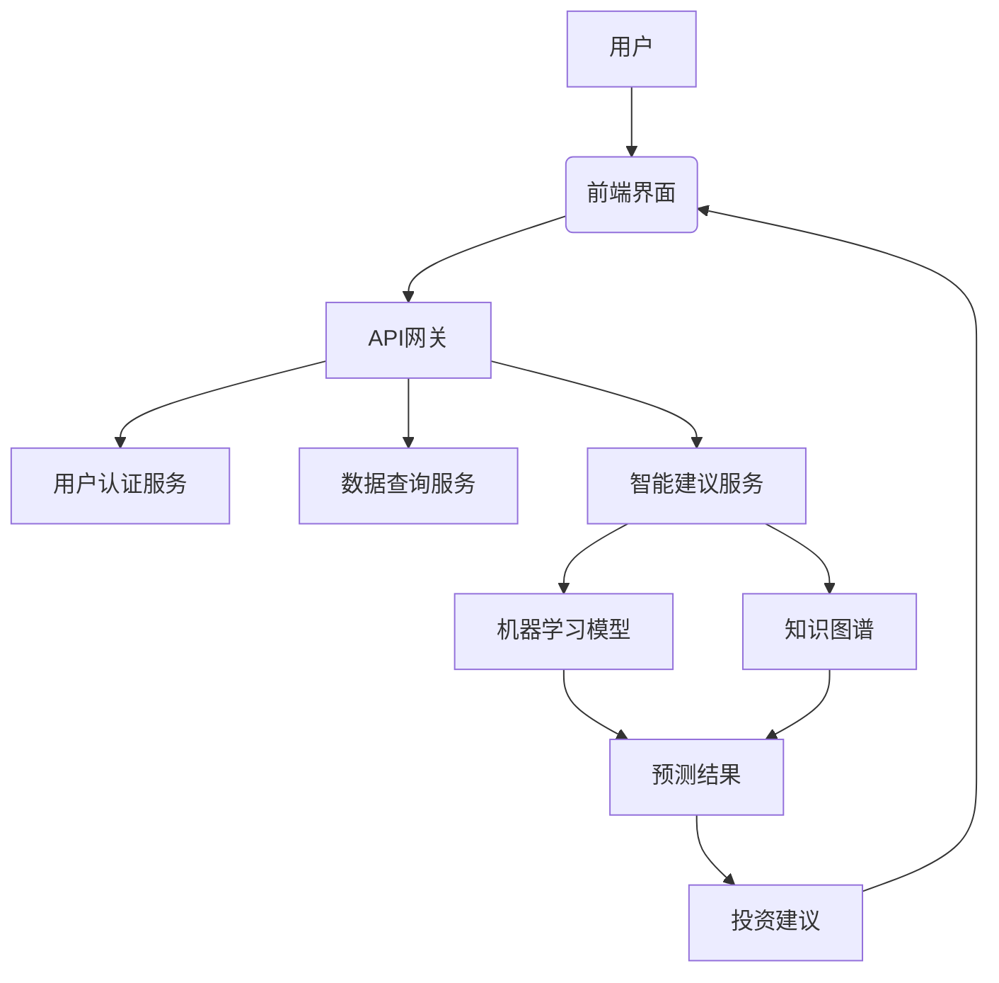
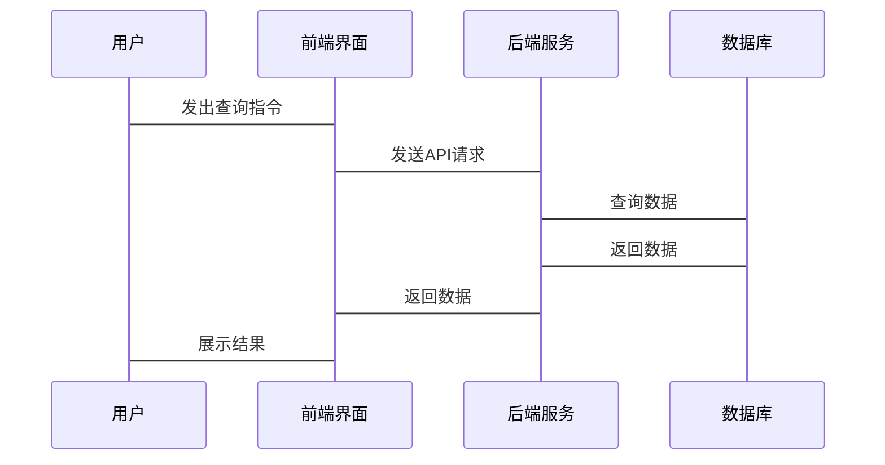

                 


# 设计直观易用的投资理财智能助手用户界面

> 关键词：投资理财，智能助手，用户界面设计，用户体验，数据可视化，交互设计

> 摘要：本文深入探讨了设计直观易用的投资理财智能助手用户界面的关键要素，结合实际案例分析，详细阐述了从用户需求分析到系统架构设计的完整流程。文章通过系统化的思考，帮助读者掌握如何通过直观易用的设计提升用户体验，同时结合技术实现，为投资理财领域提供创新的设计思路。

---

## 第一部分: 投资理财智能助手用户界面设计背景与基础

### 第1章: 投资理财智能助手的背景与需求

#### 1.1 投资理财领域的现状与挑战
##### 1.1.1 当前投资理财市场的痛点
- **信息过载**：投资者面临海量数据，难以快速提取关键信息。
- **决策难度**：非专业用户缺乏足够的知识和工具来做出明智的投资决策。
- **信任缺失**：用户对智能工具的准确性和可靠性存在疑虑。
- **个性化需求**：不同用户的投资目标和风险承受能力差异大，需要个性化的解决方案。

##### 1.1.2 用户在投资理财中的核心需求
- **简化操作**：用户希望快速完成投资操作，减少复杂性。
- **精准建议**：用户需要基于数据分析的个性化投资建议。
- **实时反馈**：用户希望获得市场动态的实时更新和反馈。
- **风险提示**：用户需要明确的风险提示和规避策略。

##### 1.1.3 智能化工具在投资理财中的作用
- **数据处理与分析**：智能助手能够快速处理大量数据，提供实时分析结果。
- **个性化推荐**：基于用户行为和偏好，推荐合适的投资产品。
- **交互式体验**：通过自然语言处理和语音交互，提升用户体验。

#### 1.2 智能助手在投资理财中的应用
##### 1.2.1 智能助手的基本定义与功能
- **定义**：智能助手是一种结合人工智能技术，能够与用户交互并提供投资理财建议的工具。
- **功能**：数据查询、投资建议、风险评估、市场分析、个性化推荐。

##### 1.2.2 智能助手在投资理财中的典型应用场景
- **资产配置建议**：根据用户资产情况，推荐最优的资产分配方案。
- **实时市场监控**：提供股票、基金等市场的实时动态，帮助用户及时调整投资策略。
- **投资计划制定**：基于用户目标和风险偏好，制定长期投资计划。

##### 1.2.3 智能助手与传统投资工具的区别
- **交互性**：智能助手提供更直观的交互方式，如语音和自然语言处理。
- **个性化**：基于用户数据，提供更精准的个性化建议。
- **实时性**：能够快速响应用户查询，并提供实时数据支持。

#### 1.3 用户界面设计的基本原则
##### 1.3.1 用户界面设计的核心目标
- **直观性**：确保用户能够快速理解界面功能。
- **易用性**：优化操作流程，减少用户学习成本。
- **可用性**：确保界面功能稳定，用户体验流畅。

##### 1.3.2 直观易用性在用户界面设计中的重要性
- **降低学习成本**：直观的设计让用户能够快速上手。
- **提升用户满意度**：通过优化界面设计，提高用户满意度。
- **增强用户信任**：直观的设计让用户更信任系统提供的信息。

##### 1.3.3 用户体验的核心要素
- **视觉设计**：色彩搭配、布局设计等直接影响用户体验。
- **交互设计**：操作流程是否顺畅，直接影响用户满意度。
- **反馈机制**：系统对用户操作的反馈是否及时和明确。

#### 1.4 本书的核心目标与内容框架
##### 1.4.1 本书的核心目标
- 提供设计直观易用的投资理财智能助手用户界面的方法论。
- 结合实际案例，详细阐述设计过程中的关键步骤。
- 帮助读者掌握从需求分析到系统实现的完整流程。

##### 1.4.2 本书的主要内容框架
- 第一部分：背景与基础（第1-2章）。
- 第二部分：核心概念与用户需求分析（第3-4章）。
- 第三部分：系统分析与架构设计（第5-6章）。
- 第四部分：项目实战与优化（第7-8章）。
- 第五部分：扩展内容与未来趋势（第9章）。

##### 1.4.3 本书的读者群体与适用场景
- **读者群体**：产品经理、UI设计师、用户体验研究员、投资理财领域的技术人员。
- **适用场景**：投资理财智能助手的设计与优化、金融科技创新领域的研究。

---

## 第二部分: 核心概念与用户需求分析

### 第2章: 投资理财智能助手的核心概念与用户需求分析

#### 2.1 投资理财智能助手的核心概念
##### 2.1.1 投资理财智能助手的功能模块
- **数据查询模块**：支持用户查询股票、基金等金融产品的实时数据。
- **投资建议模块**：基于数据分析，提供个性化的投资建议。
- **风险评估模块**：评估用户的投资组合风险，并提出优化建议。
- **市场分析模块**：提供市场趋势分析和投资机会预测。

##### 2.1.2 智能助手的核心算法与技术
- **自然语言处理（NLP）**：用于解析用户的输入指令。
- **机器学习**：用于预测市场趋势和用户行为分析。
- **知识图谱**：构建金融领域的知识网络，支持智能问答。

##### 2.1.3 用户与智能助手的交互模式
- **文本交互**：用户通过输入文本与系统对话。
- **语音交互**：支持语音输入和语音反馈。
- **图形交互**：通过图表和可视化界面进行交互。

#### 2.2 用户需求分析
##### 2.2.1 用户画像与需求层次
- **用户画像**：
  - 初级用户：对投资理财知识了解较少，需要简单易懂的界面和操作。
  - 中级用户：有一定的投资经验，需要更多的数据分析工具和个性化建议。
  - 高级用户：专业投资者，需要精准的数据分析和深度市场洞察。

##### 2.2.2 不同用户群体的需求特点
- **初级用户**：
  - 需要简单明了的操作流程。
  - 对复杂术语和数据不敏感，更关注操作结果。
- **中级用户**：
  - 对数据分析感兴趣，需要更多的数据可视化工具。
  - 关注投资建议的准确性和实时性。
- **高级用户**：
  - 需要专业的数据分析工具和深度市场分析。
  - 对系统的反馈速度和准确性要求高。

##### 2.2.3 用户行为分析与设计启示
- **用户行为分析**：
  - 初级用户倾向于简单查询和基础操作。
  - 中级用户倾向于主动获取数据和分析结果。
  - 高级用户倾向于深度分析和个性化定制。
- **设计启示**：
  - 提供多层级的用户权限和功能权限，满足不同用户需求。
  - 在界面上提供清晰的导航和功能分区，避免信息过载。

#### 2.3 核心概念与用户需求的关联
##### 2.3.1 功能模块与用户需求的对应关系
- **数据查询模块**：满足初级用户的简单查询需求。
- **投资建议模块**：满足中级用户的个性化需求。
- **风险评估模块**：满足所有用户的风险管理需求。
- **市场分析模块**：满足高级用户的深度分析需求。

##### 2.3.2 技术实现与用户需求的匹配
- **自然语言处理技术**：提升用户交互体验，满足用户对直观操作的需求。
- **机器学习技术**：优化投资建议的准确性，满足用户对精准分析的需求。
- **知识图谱技术**：支持智能问答功能，满足用户对深度信息的需求。

##### 2.3.3 交互模式与用户需求的优化
- **文本交互**：适合习惯使用键盘输入的用户。
- **语音交互**：适合需要快速操作的用户。
- **图形交互**：适合需要直观数据展示的用户。

---

## 第三部分: 系统分析与架构设计

### 第3章: 投资理财智能助手的系统分析与架构设计

#### 3.1 系统功能设计
##### 3.1.1 系统功能模块划分
- **用户管理模块**：用户注册、登录、个人信息管理。
- **数据管理模块**：金融数据的采集、存储和处理。
- **智能建议模块**：基于数据生成投资建议。
- **交互界面模块**：用户与系统交互的界面设计。

##### 3.1.2 系统功能实现流程
- **用户登录**：用户通过输入账号和密码完成登录。
- **数据查询**：用户输入查询条件，系统返回相应数据。
- **投资建议生成**：系统根据用户数据生成投资建议。
- **反馈展示**：系统将建议以可视化形式展示给用户。

#### 3.2 系统架构设计
##### 3.2.1 系统架构概述
- **前端架构**：基于React或Vue的响应式设计，确保界面在不同设备上自适应。
- **后端架构**：采用微服务架构，实现功能模块的独立开发和部署。

##### 3.2.2 系统架构图


##### 3.2.3 系统接口设计
- **API接口**：系统通过RESTful API实现前后端交互。
- **数据接口**：与第三方数据源（如股票数据API）进行数据交互。

#### 3.3 系统交互设计
##### 3.3.1 交互流程设计


##### 3.3.2 交互设计的优化
- **减少响应时间**：优化后端服务和数据库查询效率。
- **提升反馈质量**：通过图形化展示，提高用户对结果的理解。

---

## 第四部分: 项目实战与优化

### 第4章: 投资理财智能助手的项目实战

#### 4.1 环境安装与配置
##### 4.1.1 开发环境搭建
- **前端开发**：安装React或Vue框架，配置开发环境。
- **后端开发**：安装Python，配置Django或Flask框架。
- **数据源**：接入金融数据API（如Alpha Vantage）。

##### 4.1.2 工具安装
- **版本控制**：安装Git，用于代码管理。
- **虚拟环境**：安装VirtualEnv，用于环境隔离。

#### 4.2 系统核心实现
##### 4.2.1 前端核心代码实现
```python
# 示例：使用React实现的用户登录组件
import React from 'react';
import { Input, Button } from 'antd';

function Login({ onLogin }) {
    const [username, setUsername] = React.useState('');
    const [password, setPassword] = React.useState('');

    const handleSubmit = (e) => {
        e.preventDefault();
        onLogin(username, password);
    };

    return (
        <form onSubmit={handleSubmit} className="login-form">
            <Input
                name="username"
                value={username}
                onChange={(e) => setUsername(e.target.value)}
                placeholder="Username"
                required
            />
            <Input
                name="password"
                value={password}
                onChange={(e) => setPassword(e.target.value)}
                type="password"
                placeholder="Password"
                required
            />
            <Button type="primary" htmlType="submit">
                登录
            </Button>
        </form>
    );
}

export default Login;
```

##### 4.2.2 后端核心代码实现
```python
# 示例：使用Django实现的用户认证服务
from django.contrib.auth.models import User
from django.contrib.auth import authenticate, login
from rest_framework.views import APIView
from rest_framework.response import Response

class LoginView(APIView):
    def post(self, request):
        username = request.data.get('username')
        password = request.data.get('password')
        
        user = authenticate(username=username, password=password)
        if user is not None:
            login(request, user)
            return Response({'status': 'success', 'message': '登录成功'})
        else:
            return Response({'status': 'error', 'message': '用户名或密码错误'})
```

##### 4.2.3 数据可视化实现
```python
# 示例：使用Matplotlib进行数据可视化
import matplotlib.pyplot as plt
import pandas as pd

data = pd.read_csv('stock_data.csv')
plt.figure(figsize=(10, 6))
plt.plot(data['日期'], data['收盘价'], label='股票价格')
plt.title('股票价格走势')
plt.xlabel('日期')
plt.ylabel('价格')
plt.legend()
plt.show()
```

#### 4.3 项目优化与测试
##### 4.3.1 优化策略
- **性能优化**：优化数据库查询和API响应速度。
- **用户体验优化**：简化界面操作，提升反馈速度。

##### 4.3.2 测试与验证
- **功能测试**：确保所有功能模块正常运行。
- **性能测试**：测试系统在高并发情况下的表现。
- **用户体验测试**：收集用户反馈，优化界面设计。

---

## 第五部分: 扩展内容与未来趋势

### 第5章: 投资理财智能助手的未来发展趋势

#### 5.1 行业趋势与技术发展
##### 5.1.1 人工智能在投资理财中的应用前景
- **AI驱动的自动化投资**：未来智能助手将更加依赖AI技术，实现自动化投资决策。
- **增强现实（AR）技术**：通过AR技术提升用户的沉浸式体验。

##### 5.1.2 区块链技术的应用潜力
- **去中心化金融（DeFi）**：区块链技术将为投资理财领域带来新的可能性。
- **透明化与安全性**：区块链技术能够提升金融数据的透明度和安全性。

#### 5.2 用户需求的演变
##### 5.2.1 用户需求的未来变化
- **个性化服务**：用户将更加注重个性化和定制化服务。
- **智能化交互**：用户期望与系统实现更自然的交互方式。

##### 5.2.2 技术驱动的用户体验提升
- **实时数据分析**：通过实时数据分析，提升投资建议的精准度。
- **多模态交互**：结合文本、语音和视觉等多种交互方式，提升用户体验。

#### 5.3 设计与技术的融合
##### 5.3.1 技术对设计的影响
- **数据驱动的设计**：通过数据分析优化设计决策。
- **动态界面设计**：界面将更加动态化，根据用户行为实时调整。

##### 5.3.2 设计对技术的反哺作用
- **用户反馈驱动技术优化**：通过用户反馈不断优化系统功能。
- **设计驱动技术创新**：通过创新的设计思路推动技术进步。

---

## 总结

设计直观易用的投资理财智能助手用户界面是一项复杂而富有挑战性的任务。本文从背景分析、核心概念、系统设计到项目实战，全面探讨了设计过程中的关键要素和实现方法。通过结合实际案例和系统化的思考，本文为读者提供了从理论到实践的完整指南，帮助他们在投资理财智能助手的设计中，实现用户体验与技术实现的双重优化。未来，随着人工智能和区块链等技术的不断发展，投资理财智能助手将具备更多可能性，设计师和开发者需要持续关注技术进步和用户需求的变化，以打造更智能、更人性化的用户体验。

