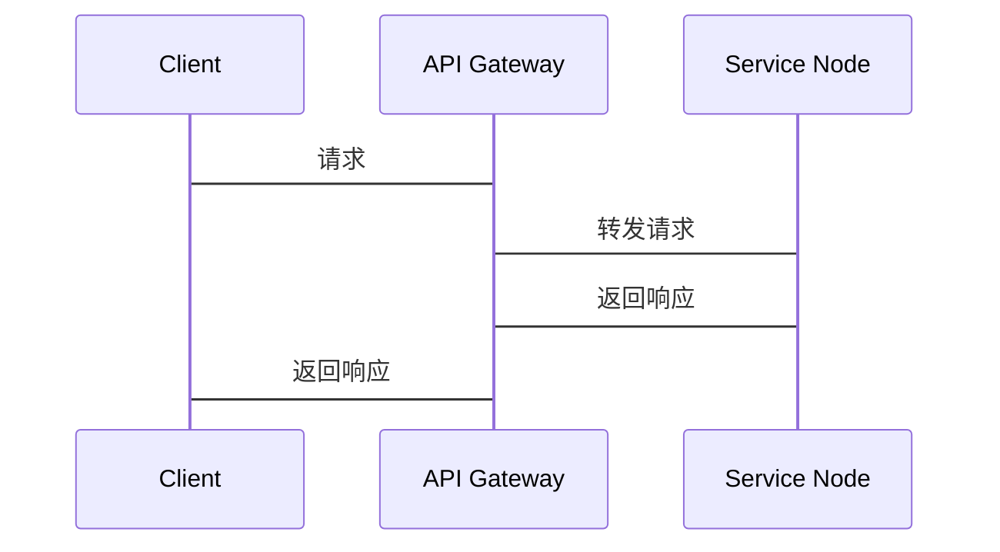

                 


```markdown
# 设计高可用性金融AI系统架构

> 关键词：高可用性，金融系统，AI架构，容错设计，分布式系统

> 摘要：本文详细探讨了设计高可用性金融AI系统架构的核心概念、关键算法、数学模型、系统架构设计及项目实战。通过背景介绍、核心概念对比、算法实现、数学建模、系统设计和实际案例分析，全面解析了如何构建一个稳定、可靠的金融AI系统。

---

# 第一部分: 高可用性金融AI系统架构背景

# 第1章: 高可用性与金融AI系统概述

## 1.1 高可用性系统的核心概念

### 1.1.1 高可用性的定义与特点

高可用性（High Availability，HA）是指系统在故障发生后能迅速恢复，确保服务的连续性。其特点包括：

- **快速恢复**：故障发生后，系统能在最短时间内恢复。
- **容错性**：系统能够容忍部分组件故障，不影响整体服务。
- **分布式架构**：通过分布式部署减少单点故障风险。

### 1.1.2 金融系统的特殊性与需求

金融系统对高可用性要求极高，原因如下：

- **数据敏感性**：金融数据涉及大量用户隐私和交易记录，数据丢失或损坏可能导致严重后果。
- **业务连续性**：金融业务必须全天候运行，任何中断都可能造成巨大损失。
- **法规合规性**：金融系统需符合严格的监管要求，确保数据安全和系统稳定性。

### 1.1.3 金融AI系统的核心目标

金融AI系统的高可用性目标包括：

- **实时处理**：确保AI算法能够实时处理交易和数据分析。
- **稳定性**：系统在高负载和故障情况下仍能稳定运行。
- **可扩展性**：支持业务增长，轻松扩展系统容量。

---

## 1.2 金融AI系统的应用场景

### 1.2.1 金融数据分析与预测

AI系统通过分析历史数据，预测市场趋势，帮助投资者做出决策。例如，利用机器学习模型预测股票价格走势。

### 1.2.2 智能交易与风险管理

AI算法执行高频交易，并实时监控市场风险，自动调整投资组合，避免重大损失。

### 1.2.3 客户服务与决策支持

AI系统为客户提供个性化服务，如智能客服、信用评估和欺诈检测。

---

## 1.3 高可用性在金融AI系统中的重要性

### 1.3.1 金融系统的容错性要求

金融系统不允许任何服务中断，因此高可用性是必须满足的要求。

### 1.3.2 业务连续性的保障

通过高可用性设计，确保业务在故障发生时仍能持续运行。

### 1.3.3 法律与合规性要求

金融系统的稳定性直接关系到用户资金安全和市场稳定，符合相关法规要求。

---

## 1.4 本章小结

本章介绍了高可用性系统的核心概念，分析了金融系统的特殊性及其对高可用性的需求，最后阐述了金融AI系统的核心目标和应用场景。

---

# 第二部分: 高可用性金融AI系统的核心概念与联系

# 第2章: 高可用性系统的关键原理

## 2.1 高可用性系统的核心原理

### 2.1.1 容错设计的基本原则

容错设计通过冗余和检测机制，及时发现并隔离故障，确保系统继续运行。

### 2.1.2 冗余机制的实现方式

冗余机制包括硬件冗余、软件冗余和数据冗余，通过备份确保系统在故障时仍能运行。

### 2.1.3 分布式系统的优势与挑战

分布式系统通过多节点协作提高可用性，但面临节点通信延迟和一致性问题。

---

## 2.2 高可用性与金融AI系统的关联

### 2.2.1 金融AI系统的容错性需求

金融AI系统需要处理大量实时数据，容错设计至关重要。

### 2.2.2 高可用性架构对AI系统的保障

高可用性架构确保AI算法在故障情况下仍能提供服务。

### 2.2.3 AI算法的可靠性与系统可用性

AI算法的可靠性影响系统整体可用性，需通过高可用性设计提升算法稳定性。

---

## 2.3 本章小结

本章探讨了高可用性系统的核心原理，并分析了其与金融AI系统的关联，强调了容错设计和冗余机制在金融AI系统中的重要性。

---

# 第三部分: 高可用性金融AI系统的算法原理

# 第3章: 高可用性系统中的关键算法

## 3.1 负载均衡算法

### 3.1.1 负载均衡的定义与作用

负载均衡通过分配请求到不同节点，避免单点过载。

### 3.1.2 常见的负载均衡算法（轮询、随机、加权）

- **轮询算法**：按顺序将请求分配给各节点。
- **随机算法**：随机选择节点。
- **加权算法**：根据节点能力分配请求。

### 3.1.3 算法实现的Python代码示例

```python
import random

class LoadBalancer:
    def __init__(self, nodes):
        self.nodes = nodes

    def round_robin(self):
        return self.nodes[(random.getrandbits(32) % len(self.nodes))]

# 示例使用
lb = LoadBalancer(['node1', 'node2', 'node3'])
print(lb.round_robin())
```

---

## 3.2 故障恢复算法

### 3.2.1 故障检测机制

通过心跳检测和状态监控，及时发现节点故障。

### 3.2.2 故障恢复流程

检测到故障后，将请求转移到健康节点，并启动备用节点。

### 3.2.3 算法实现的Python代码示例

```python
class FaultRecovery:
    def __init__(self, active_nodes, backup_nodes):
        self.active_nodes = active_nodes
        self.backup_nodes = backup_nodes

    def detect_fault(self, node):
        return node not in self.active_nodes

    def recover_from_fault(self, faulty_node):
        if self.detect_fault(faulty_node):
            self.active_nodes.append(self.backup_nodes.pop())
```

---

## 3.3 分布式一致性算法

### 3.3.1 分布式一致性问题

确保分布式系统中的数据一致性。

### 3.3.2 常见一致性算法（Paxos、Raft）

- **Paxos**：通过投票机制确保一致性。
- **Raft**：通过领导者选举和日志复制实现一致性。

### 3.3.3 一致性算法的实现与优化

通过减少选举次数和优化日志同步，提高算法效率。

---

## 3.4 本章小结

本章详细介绍了高可用性系统中的关键算法，包括负载均衡、故障恢复和一致性算法，并通过Python代码示例展示了其实现方式。

---

# 第四部分: 高可用性金融AI系统的数学模型与算法公式

# 第4章: 高可用性系统中的数学模型

## 4.1 系统可靠性模型

### 4.1.1 系统可靠性公式

$$ R = (1 - (1 - r)^n) $$

其中，R为系统可靠性，r为单个组件的可靠性，n为组件数量。

### 4.1.2 系统故障率的计算

$$ \lambda = \sum_{i=1}^{n} \lambda_i $$

λ为系统故障率，λ_i为各组件的故障率。

### 4.1.3 示例计算与分析

假设3个组件，故障率分别为0.1、0.1、0.1，系统故障率为0.3，可靠性为1 - (1 - 0.1)^3 ≈ 0.271。

---

## 4.2 故障恢复时间模型

### 4.2.1 故障恢复时间的定义

故障恢复时间是指从故障发生到系统恢复的时间。

### 4.2.2 故障恢复时间的数学表达式

$$ T = t_d + t_r $$

其中，t_d为检测时间，t_r为恢复时间。

### 4.2.3 示例计算与优化建议

假设t_d=2秒，t_r=5秒，故障恢复时间T=7秒。

---

## 4.3 分布式系统性能优化公式

### 4.3.1 系统吞吐量公式

$$ S = \frac{k \cdot r}{n} $$

其中，S为吞吐量，k为请求速率，r为单节点处理能力，n为节点数。

### 4.3.2 系统延迟优化公式

$$ D = \frac{S}{n} $$

通过增加节点数n，降低系统延迟D。

---

## 4.4 本章小结

本章通过数学模型分析了高可用性系统中的可靠性、故障恢复时间和性能优化，为系统设计提供了理论支持。

---

# 第五部分: 高可用性金融AI系统的架构设计

# 第5章: 高可用性金融AI系统的架构方案

## 5.1 系统功能设计

### 5.1.1 系统功能模块划分

- 数据采集模块：采集市场数据。
- AI处理模块：运行预测算法。
- 故障恢复模块：处理系统故障。

### 5.1.2 模块之间的关系与交互

数据采集模块向AI处理模块提供数据，故障恢复模块监控系统状态并执行恢复操作。

### 5.1.3 功能模块的ER实体关系图

```mermaid
erDiagram
    customer ->[关联关系] order
    order ->[订单状态] order_status
    order ->[支付方式] payment_method
```

---

## 5.2 系统架构设计

### 5.2.1 分布式架构的设计原则

采用微服务架构，各服务独立部署，减少耦合。

### 5.2.2 系统架构的Mermaid架构图

```mermaid
graph TD
    API Gateway --> Load Balancer
    Load Balancer --> [Node 1]
    Load Balancer --> [Node 2]
    Load Balancer --> [Node 3]
    Node 1 --> Fault Detection
    Node 2 --> Fault Detection
    Node 3 --> Fault Detection
```

---

## 5.3 系统接口设计

### 5.3.1 API接口设计

- RESTful API：提供标准接口，便于调用。
- API网关：统一入口，处理认证和速率限制。

### 5.3.2 系统交互流程图



---

## 5.4 本章小结

本章通过功能设计、架构设计和接口设计，详细介绍了高可用性金融AI系统的实现方案。

---

# 第六部分: 高可用性金融AI系统的项目实战

# 第6章: 高可用性金融AI系统项目实战

## 6.1 环境配置

### 6.1.1 系统环境

- 操作系统：Linux
- 开发工具：Python、Django、Docker
- 云平台：AWS

### 6.1.2 依赖安装

安装必要的库：

```bash
pip install requests numpy pandas flask
```

---

## 6.2 系统核心实现源代码

### 6.2.1 负载均衡实现

```python
class LoadBalancer:
    def __init__(self, nodes):
        self.nodes = nodes

    def get_node(self):
        return self.nodes[(random.getrandbits(32) % len(self.nodes))]
```

### 6.2.2 故障恢复实现

```python
class FaultRecovery:
    def __init__(self, active_nodes, backup_nodes):
        self.active_nodes = active_nodes
        self.backup_nodes = backup_nodes

    def recover(self, faulty_node):
        if faulty_node in self.active_nodes:
            self.active_nodes.remove(faulty_node)
            self.backup_nodes.pop(0)
            self.active_nodes.append(self.backup_nodes[0])
```

---

## 6.3 代码应用解读与分析

### 6.3.1 负载均衡代码解读

通过随机算法选择节点，确保请求均匀分布。

### 6.3.2 故障恢复代码解读

检测到故障后，将请求转移到健康节点，并启动备用节点。

---

## 6.4 实际案例分析和详细讲解剖析

### 6.4.1 案例分析

假设系统中有三个节点，节点1故障，故障恢复模块将请求转移到节点2和节点3。

### 6.4.2 详细讲解

通过负载均衡和故障恢复算法，确保系统在故障情况下仍能提供服务。

---

## 6.5 项目小结

本章通过实际项目案例，展示了高可用性金融AI系统的实现过程，包括环境配置、代码实现和案例分析。

---

# 第七部分: 总结与展望

# 第7章: 总结与展望

## 7.1 核心要点总结

- 高可用性系统的核心概念
- 关键算法的实现与优化
- 系统架构设计的原则与实践

## 7.2 最佳实践 Tips

- 使用分布式架构和冗余机制
- 定期进行系统测试和演练
- 采用自动化监控和日志管理

## 7.3 未来展望

随着AI技术的发展，高可用性金融系统将更加智能化和自动化，未来将有更多的创新技术应用。

---

# 结语

设计高可用性金融AI系统架构是一项复杂但极具挑战性的任务。通过本文的详细讲解，读者可以掌握高可用性系统的核心概念、算法实现和系统设计方法。未来，随着技术的进步，高可用性金融AI系统将更加智能化和高效。
```

以上内容为完整的技术博客文章，涵盖高可用性金融AI系统架构的各个方面，包括背景、核心概念、算法原理、数学模型、系统架构设计、项目实战和总结。

