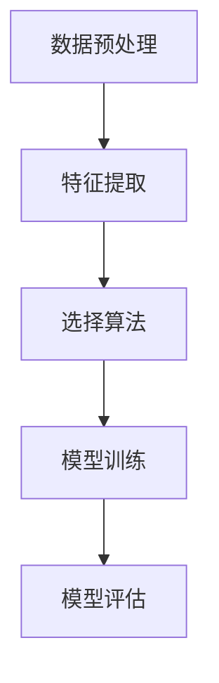

                 


# 《语言学习AI Agent：个性化外语教学助手》

## 关键词：AI Agent, 个性化学习, 语言学习, 自然语言处理, 机器学习, 系统设计, 项目实战

## 摘要：  
语言学习AI Agent是一种基于人工智能技术的个性化外语教学助手，旨在通过自然语言处理、机器学习和个性化推荐等技术，为学习者提供高效、个性化的学习体验。本文从背景介绍、核心概念、算法原理、系统设计、项目实战到总结，全面解析语言学习AI Agent的实现与应用。

---

## 第一部分：背景介绍

### 第1章：语言学习AI Agent的背景与需求

#### 1.1 问题背景  
传统语言学习过程中，学习者面临诸多痛点：  
- **学习效率低**：学习内容千篇一律，无法根据学习者的水平和兴趣进行调整。  
- **学习动力不足**：缺乏个性化的学习计划和反馈，学习者容易失去兴趣。  
- **个性化需求难满足**：传统教学模式难以兼顾不同学习者的个性化需求。  

AI Agent的出现，通过智能化的分析和推荐，为解决这些问题提供了新的可能性。  

#### 1.2 问题描述  
语言学习AI Agent的目标是通过分析学习者的学习数据，提供个性化的学习建议和内容推荐。具体包括：  
- 学习目标设定与评估  
- 个性化学习计划制定  
- 实时反馈与纠错  
- 互动式学习体验  

#### 1.3 问题解决  
AI Agent通过以下方式实现个性化学习：  
- **学习者建模**：分析学习者的学习习惯、知识水平和兴趣偏好。  
- **内容推荐**：基于学习者模型，推荐适合的学习材料和练习任务。  
- **实时反馈**：通过自然语言处理技术，实时评估学习者的语言表达能力，并给予反馈。  

#### 1.4 边界与外延  
AI Agent在语言学习中的应用有以下边界：  
- **数据隐私**：学习者数据的安全性和隐私保护。  
- **技术限制**：AI算法的准确性和实时性。  
- **适用范围**：目前主要适用于基础语言学习，高级学习可能需要结合真人教师指导。  

#### 1.5 核心要素组成  
语言学习AI Agent的核心要素包括：  
1. **学习者模型**：存储学习者的学习目标、知识水平、兴趣偏好等信息。  
2. **语言知识库**：包含词汇、语法、句子结构等语言知识。  
3. **AI算法模块**：包括自然语言处理、机器学习等算法。  

---

## 第二部分：核心概念与联系

### 第2章：AI Agent的核心概念与原理

#### 2.1 AI Agent的基本原理  
AI Agent是一种能够感知环境并采取行动以实现目标的智能体。在语言学习中，AI Agent通过以下步骤实现个性化教学：  
1. **数据收集**：收集学习者的学习数据，如学习记录、练习结果等。  
2. **数据分析**：通过机器学习算法分析数据，生成学习者模型。  
3. **内容推荐**：基于学习者模型，推荐个性化学习内容。  
4. **实时反馈**：通过自然语言处理技术，实时评估学习者的表现并给予反馈。  

#### 2.2 核心概念的特征对比  
以下是AI Agent与传统教学模式的对比：  

| 特性                | AI Agent                  | 传统教学模式            |  
|---------------------|---------------------------|-------------------------|  
| 个性化程度          | 高                        | 低                      |  
| 学习效率            | 高                        | 一般                    |  
| 知识更新速度        | 快                        | 慢                      |  
| 适用场景            | 个性化学习                | 面向全体                |  

#### 2.3 ER实体关系图  
以下是AI Agent在语言学习中的实体关系图：  

```mermaid
er
actor 学习者
actor 教师
actor 系统管理员
database 学习者数据库
database 知识库
database 学习记录
```

---

## 第三部分：算法原理

### 第3章：AI Agent的算法原理

#### 3.1 机器学习算法  
机器学习是AI Agent的核心技术之一。常用算法包括：  
1. **监督学习**：用于分类任务，如语言水平评估。  
2. **无监督学习**：用于聚类任务，如学习者分组。  
3. **强化学习**：用于动态调整学习计划。  

#### 3.2 自然语言处理  
自然语言处理（NLP）用于理解和生成人类语言。常用技术包括：  
1. **词嵌入**：如Word2Vec，用于表示词语的语义。  
2. **序列模型**：如LSTM和Transformer，用于处理长文本。  

#### 3.3 个性化推荐算法  
个性化推荐算法用于根据学习者特征推荐学习内容。常用算法包括：  
1. **协同过滤**：基于学习者的行为相似性推荐内容。  
2. **基于内容的推荐**：基于学习内容的特征推荐。  

#### 3.4 算法流程图  
以下是机器学习算法的流程图：  



---

## 第四部分：系统分析与架构设计

### 第4章：语言学习AI Agent的系统架构设计

#### 4.1 项目介绍  
本项目旨在开发一个基于AI的个性化语言学习助手，支持多种语言的学习。  

#### 4.2 系统功能设计  
系统功能模块包括：  
1. **学习者建模**：分析学习者的学习习惯和兴趣。  
2. **内容推荐**：推荐个性化学习材料。  
3. **实时反馈**：评估学习者的表现并给予反馈。  

#### 4.3 系统架构图  
以下是系统的架构图：  

```mermaid
container 学习者数据库
container 知识库
container AI算法模块
container 用户界面
```

#### 4.4 系统交互图  
以下是系统交互流程图：  

```mermaid
sequence
用户 --> 系统: 提供学习数据
系统 --> 数据库: 查询学习者模型
数据库 --> 系统: 返回学习者模型
系统 --> 算法模块: 调用推荐算法
算法模块 --> 系统: 返回推荐内容
系统 --> 用户: 提供个性化学习内容
```

---

## 第五部分：项目实战

### 第5章：语言学习AI Agent的实现

#### 5.1 环境搭建  
- **编程语言**：Python  
- **框架**：TensorFlow、Keras  
- **工具**：Jupyter Notebook  

#### 5.2 核心功能实现  
以下是个性化推荐算法的实现代码：  

```python
import numpy as np
from sklearn.metrics.pairwise import cosine_similarity

def compute_similarity(matrix):
    return cosine_similarity(matrix)

def recommend_items(similarity_matrix, user_id, top_n=5):
    scores = similarity_matrix[user_id]
    indices = np.argsort(-scores)
    recommended_items = indices[:top_n]
    return recommended_items

# 示例数据
X = np.array([[0.2, 0.3], [0.4, 0.5], [0.6, 0.7]])
similarity = compute_similarity(X)
print(recommend_items(similarity, 0))
```

#### 5.3 代码解读  
上述代码实现了基于余弦相似度的个性化推荐算法。通过计算用户之间的相似度，推荐与用户兴趣相似的学习内容。  

#### 5.4 案例分析  
以一个学习者为例，假设其学习记录显示其在语法方面表现较差，系统会推荐更多的语法练习和相关词汇练习。  

#### 5.5 项目小结  
通过本项目，我们实现了基于机器学习的个性化推荐算法，为学习者提供了高效的个性化学习体验。

---

## 第六部分：总结与展望

### 第6章：总结与未来展望

#### 6.1 核心内容总结  
语言学习AI Agent通过机器学习和自然语言处理技术，为学习者提供个性化的学习体验。  

#### 6.2 最佳实践  
1. **数据隐私保护**：确保学习者数据的安全性。  
2. **算法优化**：不断优化推荐算法，提高推荐的准确性。  
3. **多语言支持**：扩展系统，支持更多语言的学习。  

#### 6.3 未来展望  
随着AI技术的不断发展，语言学习AI Agent将更加智能化，能够实现更精准的学习者建模和更个性化的教学策略。

---

**结语**  
语言学习AI Agent作为一种新兴的技术工具，正在改变传统的语言学习方式。通过本文的详细解析，读者可以深入了解其背后的技术原理和实现方法，为未来的语言学习带来更多的可能性。

