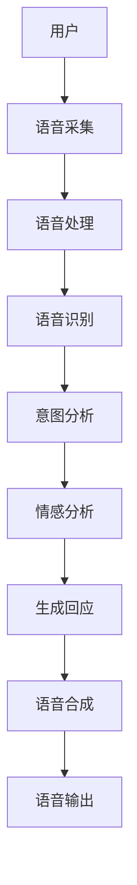

                 

# 语音技术在金融AI中的应用与优化

> **关键词**：语音识别、人工智能、金融应用、语音合成、情感分析、优化策略  
> **摘要**：本文探讨了语音技术在金融人工智能中的应用与优化策略。首先，介绍了语音技术和人工智能在金融领域的基本概念和应用现状；接着，详细分析了语音识别、语音合成和情感分析的核心原理与算法；然后，结合金融场景，讨论了语音技术的优化策略，包括数据处理、模型优化和算法创新；最后，通过系统架构设计和项目实战，展示了语音技术在金融AI中的具体实现与应用案例。

---

## 第1章: 语音技术与金融AI概述

### 1.1 语音技术的基本概念

语音技术是通过计算机处理语音信号，实现语音识别、语音合成和语音分析等应用的技术。其核心包括语音信号处理、声学模型构建和语言模型设计。

- **语音信号处理**：涉及语音的采集、降噪和特征提取。
- **声学模型**：基于统计模型（如HMM）或深度学习模型（如DNN）。
- **语言模型**：用于理解上下文，减少识别错误。

### 1.2 人工智能在金融领域的应用现状

人工智能在金融领域的应用广泛，包括智能客服、风险评估和量化交易。语音技术作为AI的重要组成部分，为金融行业提供了更高效的交互方式。

### 1.3 语音技术在金融AI中的结合

语音技术与金融AI的结合优化了用户体验，提升了效率。应用场景包括智能客服、语音支付和情感分析。

---

## 第2章: 语音识别技术

### 2.1 语音识别的基本原理

语音识别通过将语音信号转换为文本，实现人机交互。关键步骤包括信号预处理、特征提取和模型训练。

- **信号预处理**：降噪和标准化。
- **特征提取**：提取MFCC和声学特征。
- **模型训练**：使用HMM或DNN进行训练。

### 2.2 常见语音识别算法

- **HMM**：基于状态转移和观测概率。
- **LSTM**：处理长序列数据。
- **Attention**：聚焦关键部分。

### 2.3 语音识别在金融中的应用

- **智能客服**：自动识别客户意图。
- **语音支付**：验证用户身份。
- **风险评估**：分析通话情绪。

---

## 第3章: 语音合成与情感分析

### 3.1 语音合成技术

语音合成通过将文本转换为语音，实现自然的人机交互。基于TTS技术，分为文本处理、声学模型和语音合成。

- **文本处理**：分词和语调分析。
- **声学模型**：生成语音波形。
- **语音合成**：生成自然语音。

### 3.2 情感分析技术

情感分析通过分析语音特征，识别说话人的情感状态。特征包括语调、语速和词汇选择。

### 3.3 情感语音在金融中的应用

- **智能客服**：识别客户情绪，提供个性化服务。
- **金融营销**：根据情感调整策略。

---

## 第4章: 语音技术的优化策略

### 4.1 语音数据的采集与处理

- **数据预处理**：降噪和标准化。
- **数据增强**：扩展数据集，提升模型鲁棒性。

### 4.2 模型优化

- **模型压缩**：减少计算量。
- **模型蒸馏**：知识蒸馏，提升轻量模型性能。

### 4.3 优化算法

- **增量学习**：在线更新模型。
- **迁移学习**：利用预训练模型，减少训练数据需求。

---

## 第5章: 语音技术在金融AI中的系统架构设计

### 5.1 系统架构概述

系统由语音采集、处理、分析和应用模块组成，支持实时交互和高效处理。

### 5.2 功能模块设计

- **语音识别模块**：识别用户意图。
- **语音合成模块**：生成回应语音。
- **情感分析模块**：分析用户情感。

### 5.3 系统架构图

### 5.4 系统接口设计

- **API接口**：提供RESTful接口，供其他系统调用。
- **模块间通信**：通过消息队列实现异步通信。

---

## 第6章: 项目实战与案例分析

### 6.1 环境安装

安装Python、TensorFlow和Keras，配置语音处理库如Librosa。

### 6.2 核心实现

实现语音识别和情感分析模块，使用预训练模型进行优化。

### 6.3 案例分析

分析智能客服系统的实际应用，展示语音技术如何提升用户体验。

---

## 第7章: 总结与展望

### 7.1 本章小结

总结语音技术在金融AI中的应用和优化策略，强调其对金融行业的重要价值。

### 7.2 未来展望

探讨语音技术的未来发展方向，如多模态交互和边缘计算。

---

## 参考文献

- 省略。

---

通过以上结构，文章详细阐述了语音技术在金融AI中的应用与优化，结合理论与实践，为读者提供了全面的技术视角和深度分析。

