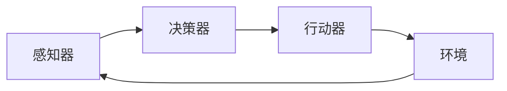
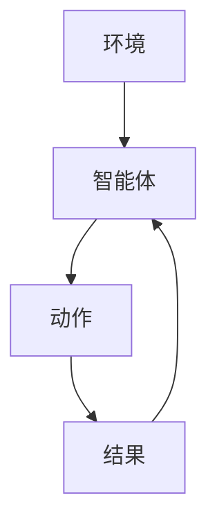
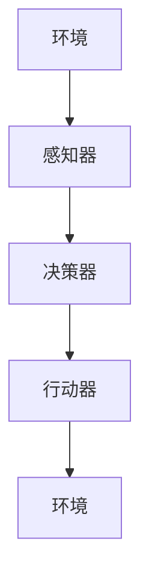
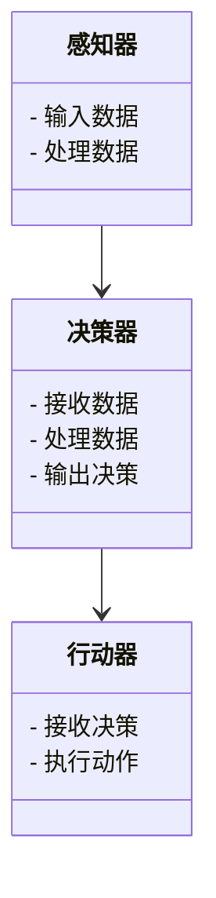
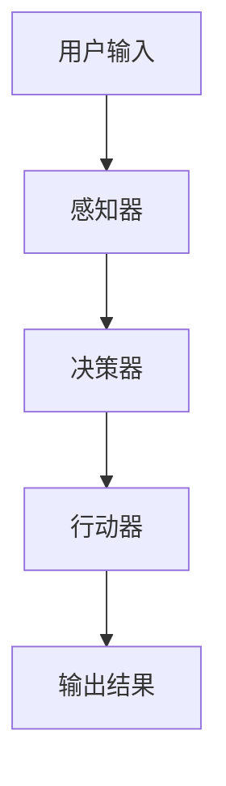
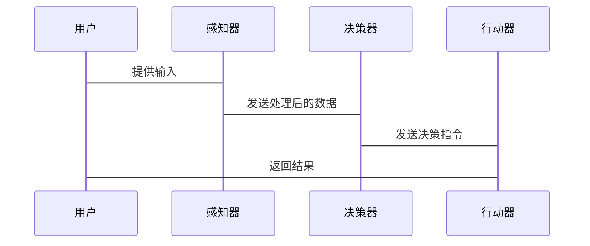

                 


# 课程学习：设计AI Agent的最优学习路径

---

## 关键词：AI Agent，学习路径，人工智能，强化学习，系统架构，项目实战

---

## 摘要：  
设计AI Agent是一个复杂而有趣的过程，需要结合人工智能、机器学习、自然语言处理、系统架构等多个领域的知识。本文将从AI Agent的基本概念出发，逐步分析其核心原理、算法实现、系统架构，并通过实战项目帮助读者构建完整的知识体系。文章旨在为学习者提供一条系统化、结构化的学习路径，从理论到实践，全面掌握AI Agent的设计方法。

---

# 第一部分：AI Agent的背景与基础

## 第1章：AI Agent的基本概念与背景

### 1.1 AI Agent的定义与特点

AI Agent（人工智能代理）是指能够感知环境、做出决策并执行动作的智能实体。与传统程序不同，AI Agent具有以下特点：

- **自主性**：能够在没有外部干预的情况下自主运行。
- **反应性**：能够实时感知环境并做出反应。
- **目标导向性**：具有明确的目标，能够为实现目标而行动。
- **学习能力**：能够通过经验改进自身的性能。

#### 1.1.1 什么是AI Agent

AI Agent是一个能够执行任务的智能实体，它可以是一个软件程序，也可以是一个物理机器人。AI Agent的核心目标是通过感知环境、分析信息并采取行动来实现特定任务。

#### 1.1.2 AI Agent的核心特点

- **智能性**：AI Agent能够理解、推理和学习。
- **适应性**：能够根据环境的变化调整自身的行为。
- **交互性**：能够与人类或其他智能体进行交互。

#### 1.1.3 AI Agent与传统程序的区别

传统程序是基于规则的，只能按照预设的逻辑执行任务。而AI Agent能够根据环境动态调整行为，具有更强的适应性和灵活性。

### 1.2 AI Agent的发展背景

人工智能技术的快速发展为AI Agent的研究提供了坚实的基础。特别是大模型技术的突破，使得AI Agent在自然语言处理、视觉感知等领域取得了显著进展。

#### 1.2.1 人工智能技术的演进

人工智能技术的发展经历了多个阶段，从早期的符号逻辑推理到现在的深度学习，技术的进步推动了AI Agent的智能化。

#### 1.2.2 大模型技术对AI Agent的影响

大模型技术（如GPT、BERT）的出现，使得AI Agent能够更自然地理解和生成语言，极大地提升了其交互能力。

#### 1.2.3 当前AI Agent的应用场景

AI Agent目前广泛应用于自动驾驶、智能助手、机器人控制等领域，未来还将在更多领域发挥作用。

### 1.3 AI Agent的学习路径规划

学习AI Agent需要系统地掌握相关知识，从基础到进阶逐步深入。

#### 1.3.1 初级学习者的学习目标

- 掌握AI Agent的基本概念和原理。
- 理解强化学习、监督学习等核心算法。

#### 1.3.2 中级学习者的核心能力

- 能够设计和实现简单的AI Agent系统。
- 熟悉多模态感知和自然语言处理技术。

#### 1.3.3 高级学习者的发展方向

- 开发复杂的AI Agent系统。
- 探索AI Agent在新兴领域的应用。

### 1.4 本章小结

本章介绍了AI Agent的基本概念、特点、发展背景以及学习路径规划，为后续章节的学习奠定了基础。

---

## 第2章：AI Agent的智能体结构

### 2.1 智能体的基本结构

AI Agent的结构由感知器、决策器和行动器三部分组成。

#### 2.1.1 感知器的作用与实现

感知器负责接收环境中的信息，例如图像、文本、语音等。常见的感知器包括摄像头、麦克风、传感器等。

#### 2.1.2 决策器的原理与功能

决策器负责根据感知器获取的信息，结合预设的目标和算法，做出决策。常见的决策算法包括强化学习、监督学习等。

#### 2.1.3 行动器的实现方式

行动器负责执行决策器的指令，例如移动机器人、输出文本等。行动器可以是电机、扬声器等物理设备，也可以是软件程序。

#### 2.1.4 智能体结构的Mermaid图



### 2.2 智能体的决策机制

决策机制是AI Agent的核心部分，决定了其行为方式。

#### 2.2.1 基于规则的决策系统

基于规则的决策系统通过预设的规则进行决策，例如“如果温度大于30度，则开启空调”。

#### 2.2.2 基于学习的决策模型

基于学习的决策模型通过机器学习算法（如神经网络）进行决策。

#### 2.2.3 基于强化学习的决策过程

强化学习是一种通过奖励机制优化决策的算法。以下是一个强化学习的简单流程：



#### 2.2.4 决策机制的对比分析

以下是基于规则的决策系统和基于学习的决策模型的对比表格：

| 特性               | 基于规则的决策系统 | 基于学习的决策模型 |
|--------------------|--------------------|--------------------|
| 知识表示方式         | 预设规则           | 数据驱动           |
| 适应性             | 低                 | 高                 |
| 需要人工干预         | 高                 | 低                 |

### 2.3 智能体的感知与交互

#### 2.3.1 多模态感知的实现

多模态感知是指同时利用多种感知方式（如视觉、听觉、触觉）进行感知。例如，自动驾驶汽车同时利用摄像头、雷达和激光雷达进行感知。

#### 2.3.2 自然语言处理在交互中的应用

自然语言处理技术使得AI Agent能够理解和生成人类语言，例如智能助手（如Siri、Alexa）能够通过语音交互与用户沟通。

#### 2.3.3 视觉感知的实现方式

视觉感知通过摄像头捕捉图像信息，并利用计算机视觉技术（如目标检测、图像分割）进行处理。

#### 2.3.4 感知与交互的流程图



### 2.4 本章小结

本章详细介绍了AI Agent的基本结构、决策机制以及感知与交互方式，为后续章节的学习奠定了基础。

---

## 第3章：AI Agent的算法原理

### 3.1 强化学习算法

强化学习是一种通过奖励机制优化决策的算法。以下是一个强化学习的简单流程：


#### 3.1.1 Q-learning算法的实现

Q-learning是一种经典的强化学习算法，其核心公式如下：

$$ Q(s, a) = r + \gamma \max_{a'} Q(s', a') $$

其中：
- \( Q(s, a) \) 表示在状态 \( s \) 下采取动作 \( a \) 的价值。
- \( r \) 表示奖励。
- \( \gamma \) 表示折扣因子。
- \( s' \) 表示下一个状态。

#### 3.1.2 算法实现的伪代码

```python
def q_learning():
    while True:
        state = get_current_state()
        action = choose_action(state)
        next_state, reward = step(action)
        update_Q(state, action, reward, next_state)
```

### 3.2 监督学习算法

监督学习是一种通过标注数据训练模型的算法。以下是一个简单的线性回归实现：

$$ y = \theta x + b $$

其中：
- \( y \) 表示输出。
- \( \theta \) 表示权重。
- \( x \) 表示输入。
- \( b \) 表示偏置。

#### 3.2.1 算法实现的伪代码

```python
def linear_regression():
    X = np.array([[1, 2], [3, 4]])
    y = np.array([5, 6])
    theta = np.linalg.lstsq(X, y, rcond=None)[0]
    print(theta)
```

### 3.3 生成模型

生成模型是一种能够生成新数据的模型，例如生成图片、文本等。以下是一个简单的生成模型实现：

$$ p(x) = \prod_{i=1}^{n} p(x_i | x_{i-1}) $$

其中：
- \( p(x_i | x_{i-1}) \) 表示在已知前一状态的条件下，当前状态的概率。

#### 3.3.1 算法实现的伪代码

```python
def generate_sequence():
    sequence = []
    for _ in range(length):
        next_token = sample(p(x))
        sequence.append(next_token)
    return sequence
```

### 3.4 本章小结

本章介绍了AI Agent的核心算法原理，包括强化学习、监督学习和生成模型，并通过伪代码和数学公式进行了详细讲解。

---

## 第4章：AI Agent的系统架构与设计

### 4.1 系统架构设计

AI Agent的系统架构通常包括感知模块、决策模块和执行模块。

#### 4.1.1 系统架构的类图



### 4.2 系统功能设计

系统功能设计需要根据具体场景进行定制。

#### 4.2.1 系统功能设计的流程图



### 4.3 系统接口设计

系统接口设计需要明确各模块之间的接口。

#### 4.3.1 系统接口的时序图



### 4.4 本章小结

本章详细介绍了AI Agent的系统架构设计，包括类图、流程图和时序图，帮助读者更好地理解系统结构。

---

## 第5章：AI Agent的项目实战

### 5.1 环境搭建

#### 5.1.1 安装必要的依赖

```bash
pip install numpy matplotlib
```

#### 5.1.2 配置开发环境

- 安装Python和相关库。
- 配置IDE（如PyCharm、VS Code）。

### 5.2 系统核心实现

#### 5.2.1 强化学习算法的实现

```python
import numpy as np

def q_learning():
    Q = np.zeros([state_space, action_space])
    for episode in range(episodes):
        state = initial_state()
        while not terminal_state(state):
            action = choose_action(state)
            next_state, reward = step(action)
            Q[state, action] += reward + gamma * np.max(Q[next_state])
            state = next_state
    return Q
```

#### 5.2.2 自然语言处理模块的实现

```python
import nltk

def process_text(text):
    tokens = nltk.word_tokenize(text)
    return tokens
```

### 5.3 案例分析与总结

#### 5.3.1 项目案例分析

- **案例1**：智能助手的设计与实现。
- **案例2**：自动驾驶系统的实现。

#### 5.3.2 项目总结

通过项目实战，读者能够将理论知识应用到实际中，提升自己的实践能力。

### 5.4 本章小结

本章通过具体的项目实战，帮助读者巩固所学知识，提升实践能力。

---

## 第6章：AI Agent的最佳实践与总结

### 6.1 学习中的注意事项

- **理论与实践结合**：既要理解理论知识，又要通过实践加深理解。
- **持续学习**：AI技术发展迅速，需要持续关注新技术。

### 6.2 进阶方向

- **研究前沿技术**：如大模型、多智能体系统等。
- **参与开源项目**：通过开源项目积累经验。

### 6.3 工具推荐

- **Python**：AI开发的首选语言。
- **TensorFlow/PyTorch**：深度学习框架。
- **OpenCV**：计算机视觉库。

### 6.4 本章小结

本章总结了学习AI Agent的最佳实践，为读者提供了进一步学习的方向和建议。

---

## 附录：数学公式汇总

### 强化学习公式

$$ Q(s, a) = r + \gamma \max_{a'} Q(s', a') $$

### 监督学习公式

$$ y = \theta x + b $$

### 生成模型公式

$$ p(x) = \prod_{i=1}^{n} p(x_i | x_{i-1}) $$

---

# 结语

设计AI Agent是一项复杂而有趣的任务，需要系统地学习和实践。通过本文的引导，读者可以逐步掌握AI Agent的设计方法，并将其应用到实际场景中。未来，随着人工智能技术的不断发展，AI Agent将发挥越来越重要的作用。

---

以上是《课程学习：设计AI Agent的最优学习路径》的技术博客文章的完整目录和内容概要。

