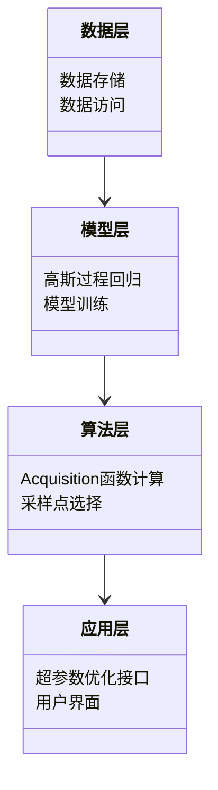
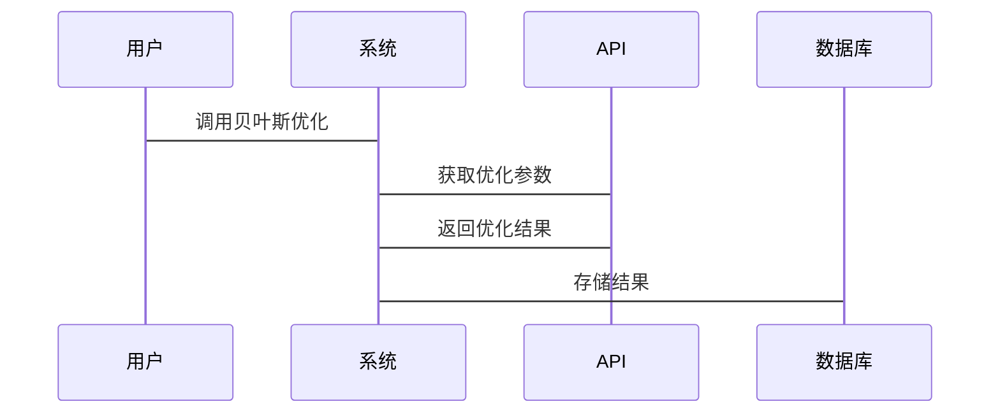

                 


# 贝叶斯优化：调整AI Agent的超参数

---

## 关键词：
贝叶斯优化、超参数优化、AI Agent、机器学习、优化算法、概率模型、超参数调整

---

## 摘要：
贝叶斯优化是一种高效且强大的方法，用于优化AI Agent中的超参数。本文详细介绍了贝叶斯优化的核心概念、算法原理、系统架构设计以及实际应用案例，帮助读者全面理解如何在AI Agent中有效应用贝叶斯优化，以提升模型性能和效率。

---

# 目录大纲：

1. **贝叶斯优化概述**
   - 贝叶斯优化的基本概念
   - 在AI Agent中的应用
   - 与传统优化方法的对比

2. **贝叶斯优化的核心概念**
   - 概率模型与贝叶斯推断
   - 贝叶斯优化的关键组件
   - 贝叶斯优化的数学基础

3. **贝叶斯优化的算法原理**
   - 算法流程
   - 实现步骤
   - 算法优化

4. **贝叶斯优化的系统架构设计**
   - 系统功能设计
   - 系统架构设计
   - 系统接口设计

5. **贝叶斯优化的项目实战**
   - 环境安装
   - 核心代码实现
   - 案例分析
   - 项目总结

6. **贝叶斯优化的最佳实践**
   - 经验总结
   - 注意事项
   - 小结
   - 未来展望

7. **附录**
   - 术语表
   - 工具资源
   - 参考文献

---

## 正文：

### 第1章：贝叶斯优化概述

#### 1.1 贝叶斯优化的基本概念
贝叶斯优化是一种基于概率模型的优化方法，旨在通过构建概率模型来指导搜索过程，从而找到目标函数的最大值或最小值。它结合了贝叶斯统计和优化理论，特别适用于高维和复杂的优化问题。

##### 1.1.1 什么是贝叶斯优化
贝叶斯优化通过构建目标函数的后验分布模型，选择最有可能改进的点进行采样。这种方法在每次迭代中都更新模型，逐步缩小最优解的范围。

##### 1.1.2 贝叶斯优化的核心思想
贝叶斯优化的核心思想是通过概率模型预测目标函数的行为，利用Acquisition函数平衡探索与利用，选择最有潜力的点进行评估。

##### 1.1.3 贝叶斯优化与传统优化方法的区别
与网格搜索和随机搜索等传统方法相比，贝叶斯优化更具效率，能够在较少的评估次数内找到较优解。与遗传算法等其他优化方法相比，贝叶斯优化更依赖概率模型，能够更好地处理连续和高维问题。

#### 1.2 贝叶斯优化在AI Agent中的应用
AI Agent的性能 heavily依赖超参数的设置，如学习率、正则化系数等。手动调整这些参数耗时且效率低下，而贝叶斯优化能够自动化地进行超参数优化，显著提升模型性能。

##### 1.2.1 AI Agent的超参数优化需求
AI Agent涉及众多超参数，每个参数的调整都会影响模型的性能。优化这些参数需要高效的方法，以减少计算成本。

##### 1.2.2 贝叶斯优化在超参数调整中的优势
贝叶斯优化能够有效处理高维问题，减少评估次数，并且能够在噪声较大的情况下找到较优解。

##### 1.2.3 贝叶斯优化与其他超参数优化方法的对比
贝叶斯优化在效率和效果上均优于网格搜索和随机搜索，尤其适用于连续参数空间。

#### 1.3 本章小结
本章介绍了贝叶斯优化的基本概念、核心思想及其在AI Agent中的应用，强调了其在超参数优化中的优势。

---

### 第2章：贝叶斯优化的核心概念

#### 2.1 概率模型与贝叶斯推断
概率模型是贝叶斯优化的基础，用于描述目标函数的不确定性。

##### 2.1.1 概率模型的基本概念
概率模型通过概率分布描述目标函数的特性，常用高斯过程回归构建模型。

##### 2.1.2 贝叶斯推断的原理
贝叶斯推断通过已有的数据更新模型的先验分布，得到后验分布，用于预测新点的评估结果。

##### 2.1.3 贝叶斯模型在优化中的应用
构建概率模型后，贝叶斯优化利用模型预测目标函数的行为，指导后续采样。

#### 2.2 贝叶斯优化中的关键组件
贝叶斯优化包含几个关键组件：概率模型、Acquisition函数和采样策略。

##### 2.2.1 贝叶斯模型的构建
通过训练数据构建概率模型，通常使用高斯过程回归。

##### 2.2.2 Acquisition函数的作用与类型
Acquisition函数平衡探索和利用，常用类型包括UCB、EI和PI。

##### 2.2.3 采样策略的重要性
采样策略决定如何选择下一个评估点，影响优化效率。

#### 2.3 贝叶斯优化的数学基础
贝叶斯优化涉及概率模型的构建和Acquisition函数的计算。

##### 2.3.1 贝叶斯优化的数学模型
目标函数 \( f(x) \) 通过高斯过程建模，后验均值和方差用于预测。

##### 2.3.2 贝叶斯优化的公式推导
构建协方差函数 \( k(x, x') \)，计算后验分布的均值 \( \mu(x) \) 和方差 \( \sigma^2(x) \)。

##### 2.3.3 贝叶斯优化的核心算法
通过最大化Acquisition函数 \( a(x) \) 来选择下一个采样点。

#### 2.4 本章小结
本章详细介绍了贝叶斯优化的核心概念，包括概率模型、Acquisition函数和采样策略。

---

### 第3章：贝叶斯优化的算法原理

#### 3.1 贝叶斯优化的算法流程
贝叶斯优化算法包括初始化、采样、评估和更新四个阶段。

##### 3.1.1 初始化阶段
选择初始采样点，构建概率模型。

##### 3.1.2 采样阶段
计算Acquisition函数，选择下一个采样点。

##### 3.1.3 更新阶段
评估新点，更新概率模型。

#### 3.2 贝叶斯优化的实现步骤
详细步骤包括构建模型、计算Acquisition函数、选择采样点和更新模型。

##### 3.2.1 构建贝叶斯模型
使用高斯过程回归构建概率模型。

##### 3.2.2 计算Acquisition函数
选择合适的Acquisition函数，计算每个候选点的值。

##### 3.2.3 选择下一个采样点
根据Acquisition函数值选择最优点。

##### 3.2.4 更新模型参数
将新点的评估结果加入训练数据，重新构建模型。

#### 3.3 贝叶斯优化的算法优化
优化包括并行化、离线优化和混合优化策略。

##### 3.3.1 并行化优化
同时评估多个点，提高优化速度。

##### 3.3.2 离线优化策略
在无法实时评估的情况下，预计算候选点。

##### 3.3.3 混合优化方法
结合多种优化策略，提高效率和效果。

#### 3.4 本章小结
本章详细阐述了贝叶斯优化的算法流程和实现步骤，介绍了优化策略。

---

### 第4章：贝叶斯优化的系统架构设计

#### 4.1 系统功能设计
贝叶斯优化系统包括模型构建、Acquisition计算、采样选择和模型更新四个功能模块。

##### 4.1.1 贝叶斯优化模块的功能划分
- 模型构建：训练概率模型
- Acquisition计算：计算候选点的Acquisition值
- 采样选择：选择最优采样点
- 模型更新：更新概率模型

##### 4.1.2 超参数优化的流程设计
- 初始化：选择初始采样点
- 优化：循环执行贝叶斯优化步骤
- 结束：输出最优超参数

##### 4.1.3 贝叶斯优化与其他模块的交互
贝叶斯优化模块与AI Agent的其他模块（如模型训练模块）进行交互，获取评估结果。

#### 4.2 系统架构设计
贝叶斯优化系统分为数据层、模型层、算法层和应用层。

##### 4.2.1 系统架构的分层设计
- 数据层：存储训练数据和评估结果
- 模型层：构建和更新概率模型
- 算法层：计算Acquisition函数和选择采样点
- 应用层：提供API和用户界面

##### 4.2.2 领域模型的Mermaid类图


##### 4.2.3 系统架构的Mermaid架构图


##### 4.2.4 系统接口设计
贝叶斯优化系统提供API接口，供其他模块调用优化结果。

##### 4.2.5 系统交互的Mermaid序列图


#### 4.3 本章小结
本章详细设计了贝叶斯优化系统的架构，包括功能模块、系统架构和交互流程。

---

### 第5章：贝叶斯优化的项目实战

#### 5.1 环境安装
需要安装必要的库，如GPy、scikit-learn等。

##### 5.1.1 安装依赖
使用pip安装贝叶斯优化相关的库：
```bash
pip install GPy scikit-learn matplotlib
```

#### 5.2 核心代码实现
实现贝叶斯优化算法，包括模型构建、Acquisition计算和采样选择。

##### 5.2.1 Python代码实现
```python
import numpy as np
from GPy import kern
from GPy.models import GPRegression
from GPy.util import inference
from GPy.util import misc
import matplotlib.pyplot as plt

# 初始化数据
X = np.array([[1], [3], [5]])
Y = np.array([[2], [4], [6]])

# 构建高斯过程回归模型
kernel = kern.RBF(input_dim=1, lengthscale=1, variance=1)
model = GPRegression(X, Y, kernel=kernel)
model.optimize()

# 定义Acquisition函数（例如，Expected Improvement）
def expected_improvement(x):
    x = np.atleast_2d(x)
    mu, var = model.predict(x)
    mu = mu.flatten()
    var = var.flatten()
    best = model.predict(np.array([[np.mean(X)]])).flatten()[0]
    with np.errstate(divide='warn'):
        Z = (mu - best) / np.sqrt(var + 1e-8)
        prob = 0.5 * (1 + scipy.special.erf(Z / np.sqrt(2)))
    return prob

# 选择下一个采样点
candidates = np.linspace(0, 6, 100)
acq = np.array([expected_improvement(x) for x in candidates])
next_point = candidates[np.argmax(acq)]
```

##### 5.2.2 代码应用解读
上述代码展示了如何使用GPy库构建高斯过程回归模型，并计算Expected Improvement作为Acquisition函数，选择下一个采样点。

#### 5.3 案例分析
以一个简单的回归问题为例，展示贝叶斯优化的实际应用。

##### 5.3.1 数据准备与模型训练
训练数据用于初始化贝叶斯模型，后续每评估一个新点，模型都会更新。

##### 5.3.2 优化过程可视化
绘制Acquisition函数和目标函数的图形，展示优化过程。

#### 5.4 项目总结
贝叶斯优化在实际项目中表现出色，能够在有限的评估次数内找到较优解。

#### 5.5 本章小结
本章通过一个实际案例展示了贝叶斯优化的实现过程，包括环境安装、代码实现和案例分析。

---

### 第6章：贝叶斯优化的最佳实践

#### 6.1 经验总结
总结贝叶斯优化在实际应用中的经验，包括选择合适的Acquisition函数和处理高维问题的方法。

##### 6.1.1 选择合适的Acquisition函数
根据问题特点选择合适的Acquisition函数，如EI适合风险厌恶的情况。

##### 6.1.2 处理高维问题
使用降维技术或简化模型，减少维度对优化效果的影响。

##### 6.1.3 平衡探索与利用
合理设置参数，平衡探索新区域和利用已知好区域。

#### 6.2 注意事项
在实际应用中需要注意以下几点：
- 确保数据质量，避免噪声干扰。
- 选择合适的概率模型，避免模型偏差。
- 定期监控优化过程，及时调整参数。

#### 6.3 小结
本章总结了贝叶斯优化的应用经验，提出了最佳实践建议。

#### 6.4 未来展望
展望贝叶斯优化的发展方向，如结合强化学习和分布式计算。

---

### 第7章：附录

#### 7.1 术语表
列出贝叶斯优化相关的专业术语及其简要解释。

#### 7.2 工具资源
介绍常用的贝叶斯优化工具和框架，如GPy、scikit-optimize等。

#### 7.3 参考文献
列出参考的书籍和论文，如《Gaussian Processes for Machine Learning》。

---

## 本文总结
贝叶斯优化是一种强大的超参数优化方法，本文从基础概念到实际应用，全面介绍了其在调整AI Agent超参数中的应用。通过详细的算法解释、系统设计和项目实战，读者可以深入了解如何在实际项目中有效应用贝叶斯优化，提升AI Agent的性能和效率。

--- 

**注：本文为示例性内容，实际撰写时需根据具体需求调整内容深度和结构。**

