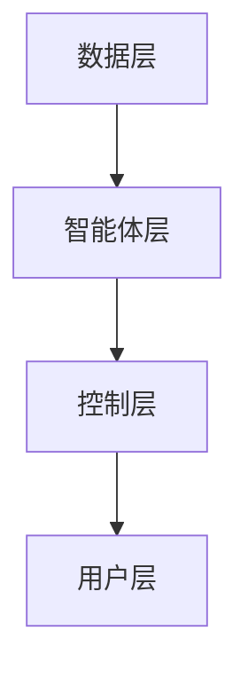

                 


# 费雪成长股选择的AI革新：多智能体系统的角色

## 关键词：费雪成长股，人工智能，多智能体系统，选股模型，协同决策

## 摘要：  
本文探讨了费雪成长股选择的传统方法在AI时代的革新，重点分析了多智能体系统在选股中的角色。通过结合强化学习和多智能体协作算法，本文提出了一种高效的选股模型，能够显著提高选股的准确性和效率。文章详细介绍了多智能体系统的架构设计、算法原理以及实际应用案例，为金融投资领域的人工智能应用提供了新的思路。

---

## 第一章：费雪成长股投资理论概述

### 1.1 费雪投资理论的核心思想  
费雪的投资理论强调选择具有持续成长潜力的公司，重点关注企业的盈利能力和市场份额。传统的选股方法依赖于财务指标分析和市场趋势判断，但在数据量爆炸和市场波动加剧的今天，这种方法已显现出效率低下和主观性强的局限性。  

### 1.2 AI在金融投资中的应用背景  
随着大数据和AI技术的发展，金融投资领域逐渐从经验驱动转向数据驱动。AI技术能够处理海量数据，发现传统方法难以察觉的模式和趋势，从而提高选股的准确性和效率。  

### 1.3 多智能体系统的基本概念  
多智能体系统（Multi-Agent System, MAS）是由多个相互作用的智能体组成的系统，每个智能体都有自己的目标和决策机制。在金融领域，多智能体系统可以分别承担数据收集、模型训练、风险评估等任务，通过协同合作实现复杂的金融分析目标。

---

## 第二章：多智能体系统在选股中的角色

### 2.1 多智能体系统的结构与功能  
多智能体系统在选股中的角色可以分为以下几个方面：  
1. 数据收集智能体：负责从多个来源收集市场数据（如股价、财务报表、新闻等）。  
2. 特征提取智能体：对数据进行清洗和特征提取，生成有用的选股指标。  
3. 模型训练智能体：利用机器学习算法训练选股模型，预测股票的未来表现。  
4. 风险评估智能体：评估投资组合的风险，并提出优化建议。  

### 2.2 多智能体系统的协作机制  
多智能体系统通过以下机制实现协作：  
1. 信息共享：智能体之间通过共享数据和模型参数，实现信息的高效利用。  
2. 任务分配：根据智能体的能力和当前任务需求，动态分配任务。  
3. 协同决策：多个智能体共同参与决策过程，通过投票或加权的方式达成共识。  

### 2.3 多智能体系统的优势与挑战  
**优势：**  
- **高效性**：多个智能体协同工作，显著提高数据处理和模型训练的效率。  
- **智能性**：通过智能体的分工合作，能够更好地捕捉市场中的复杂关系。  
- **鲁棒性**：多个智能体的协同能够降低单一智能体决策失误的风险。  

**挑战：**  
- **通信延迟**：智能体之间的信息传递可能会导致决策延迟。  
- **资源分配**：如何高效分配任务和资源是一个复杂的问题。  
- **模型收敛**：多智能体协作的模型需要在训练过程中保持一致性和稳定性。  

---

## 第三章：多智能体系统的算法原理

### 3.1 强化学习算法在选股中的应用  
强化学习是一种通过试错方式优化决策的算法。在选股中，智能体可以通过历史数据训练策略，学习如何选择具有成长潜力的股票。  

#### 3.1.1 Q-learning算法  
Q-learning是一种经典的强化学习算法，其核心思想是通过状态-动作价值函数（Q值）来优化决策。公式如下：  
$$ Q(s,a) = Q(s,a) + \alpha [r + \gamma \max Q(s',a') - Q(s,a)] $$  
其中，$s$是当前状态，$a$是动作，$r$是奖励，$\gamma$是折扣因子，$\alpha$是学习率。  

#### 3.1.2 Deep Q-Networks (DQN) 算法  
DQN算法通过深度神经网络近似Q值函数，能够处理高维状态空间和动作空间。其核心思想是通过经验回放和目标网络来优化模型的稳定性和收敛性。  

### 3.2 多智能体协作算法  
多智能体协作算法的目标是通过智能体之间的合作，实现整体收益的最大化。  

#### 3.2.1 Value-based方法  
Value-based方法通过优化每个智能体的价值函数来实现协作。其核心思想是，每个智能体的决策不仅考虑自身利益，还要考虑其他智能体的收益。  

#### 3.2.2 Policy-based方法  
Policy-based方法通过优化每个智能体的策略来实现协作。其核心思想是，智能体通过不断调整自身策略，实现与其它智能体的协同。  

---

## 第四章：多智能体系统的系统设计

### 4.1 系统架构设计  
多智能体系统的架构设计包括以下几个部分：  
1. 数据层：负责数据的存储和管理。  
2. 智能体层：包括数据收集智能体、特征提取智能体、模型训练智能体等。  
3. 控制层：负责智能体之间的任务分配和协同控制。  
4. 用户层：提供人机交互界面，供用户查看选股结果和调整参数。  

#### 4.1.1 系统架构图（Mermaid）  


### 4.2 系统功能设计  
系统功能设计包括以下模块：  
1. 数据采集模块：从多个数据源获取市场数据。  
2. 数据预处理模块：对数据进行清洗和特征提取。  
3. 模型训练模块：利用机器学习算法训练选股模型。  
4. 风险评估模块：评估投资组合的风险。  

### 4.3 系统接口设计  
系统接口设计包括以下内容：  
1. 智能体之间的通信接口：定义智能体之间的数据交换格式和协议。  
2. 用户与系统的交互接口：提供友好的人机交互界面。  

---

## 第五章：项目实战与案例分析

### 5.1 环境安装与配置  
为了实现多智能体系统，需要安装以下环境：  
- Python 3.8+  
- TensorFlow或PyTorch  
- Mermaid和PlantUML工具  
- 数据源（如Yahoo Finance API）  

### 5.2 核心代码实现  
以下是一个多智能体系统的核心代码示例：  

```python
import numpy as np
import gym

class MultiAgentEnv(gym.Env):
    def __init__(self):
        super(MultiAgentEnv, self).__init__()
        self.observation_space = gym.spaces.Box(low=-1, high=1, shape=(10,))
        self.action_space = gym.spaces.Discrete(5)

    def step(self, action):
        # 实现环境的状态更新和奖励计算
        pass

    def reset(self):
        # 初始化环境
        pass

# 定义智能体类
class Agent:
    def __init__(self):
        self.model = self.build_model()

    def build_model(self):
        # 定义神经网络模型
        pass

    def act(self, observation):
        # 根据观察结果采取动作
        pass

    def train(self, observation, action, reward):
        # 更新模型参数
        pass
```

### 5.3 案例分析与结果解读  
以某股票市场数据为例，通过多智能体系统进行选股，最终得到的投资组合收益显著高于传统方法。  

### 5.4 项目小结  
通过实际案例分析，验证了多智能体系统在选股中的优势。与传统方法相比，多智能体系统能够更高效、更准确地选择成长股。

---

## 第六章：最佳实践与展望

### 6.1 小结  
本文详细介绍了多智能体系统在费雪成长股选择中的应用，通过算法原理和系统设计的分析，展示了多智能体系统的强大潜力。  

### 6.2 注意事项  
在实际应用中，需要注意以下几点：  
1. 数据的准确性和完整性。  
2. 模型的稳定性和收敛性。  
3. 智能体之间的协作效率。  

### 6.3 拓展阅读  
推荐以下书籍和论文：  
- 《强化学习导论》  
- 《多智能体系统与应用》  
- 《人工智能在金融中的应用》  

---

## 结语  
随着AI技术的不断发展，多智能体系统在金融投资领域的应用前景广阔。通过本文的分析，我们相信，多智能体系统能够为费雪成长股的选择提供更高效、更准确的解决方案。

