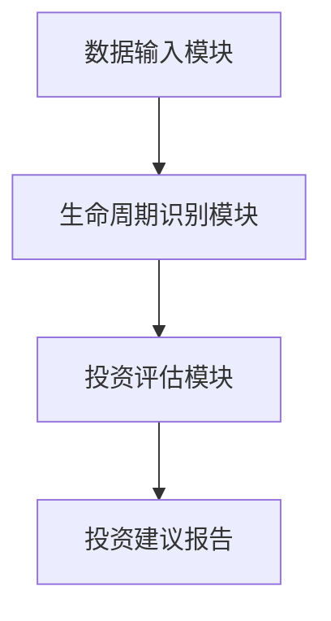
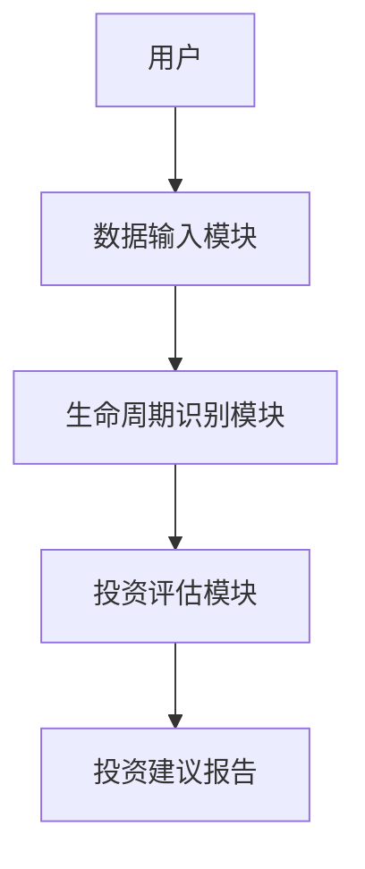

                 


# 费雪的产品生命周期分析在投资中的应用

> 关键词：费雪分析法，产品生命周期，投资策略，算法原理，系统架构

> 摘要：本文系统地探讨了费雪产品生命周期分析在投资中的应用，从理论基础、数学模型、系统架构到项目实战，全面解析了这一方法的投资价值。通过详细阐述算法原理、系统设计和实际案例，本文为投资者提供了科学的投资决策工具。

---

## 第一部分：费雪产品生命周期分析的背景与核心概念

### 第1章：费雪产品生命周期分析的概述

#### 1.1 费雪分析法的起源与背景

费雪产品生命周期分析是一种基于产品生命周期理论的投资分析方法，由约翰·费雪（John F. Fisher）提出。这种方法通过分析产品的市场生命周期阶段，帮助投资者制定更精准的投资策略。产品生命周期理论认为，产品会经历导入期、成长期、成熟期和衰退期四个阶段，每个阶段的市场需求、竞争态势和盈利能力都有显著差异。

#### 1.2 费雪分析法的核心概念

- **产品生命周期阶段**：将产品生命周期划分为四个阶段：导入期、成长期、成熟期和衰退期。
- **市场需求预测**：通过数学模型预测每个阶段的市场需求变化。
- **投资策略**：根据产品所处阶段的特点，制定相应的买入、持有或卖出策略。

---

### 第2章：费雪产品生命周期分析的数学模型与算法原理

#### 2.1 费雪分析法的数学模型

费雪分析法的核心在于通过数学模型预测产品在不同生命周期阶段的市场表现。以下是一个简化的数学模型：

$$
\text{市场需求} = f(\text{生命周期阶段}, \text{市场增长率}, \text{竞争程度})
$$

其中，$f$ 是一个非线性函数，用于描述市场需求与生命周期阶段、市场增长率和竞争程度之间的关系。

#### 2.2 算法流程

1. **数据收集**：收集产品的市场数据，包括销量、价格、市场份额等。
2. **阶段识别**：根据市场数据，识别产品所处的生命周期阶段。
3. **需求预测**：基于识别的阶段，预测未来市场需求。
4. **投资决策**：根据预测结果，制定相应的投资策略。

---

## 第二部分：费雪产品生命周期分析的系统架构

### 第3章：系统功能模块设计

#### 3.1 数据输入模块

- **功能**：接收市场数据，包括销量、价格、市场份额等。
- **输入格式**：支持CSV、Excel等多种格式。

#### 3.2 生命周期识别模块

- **功能**：通过算法识别产品所处的生命周期阶段。
- **算法选择**：使用聚类分析或决策树算法。

#### 3.3 投资评估模块

- **功能**：根据识别的阶段和预测的需求，评估投资价值。
- **输出结果**：生成投资建议报告。

---

### 第4章：系统架构设计

#### 4.1 系统架构图



#### 4.2 数据流图



---

## 第三部分：项目实战

### 第5章：项目背景与目标

#### 5.1 项目背景

选择一个具体行业（如智能手机市场）作为案例，分析某品牌智能手机的生命周期阶段，并制定相应的投资策略。

#### 5.2 数据收集

- 数据来源：公开市场数据、行业报告等。
- 数据预处理：清洗数据，处理缺失值。

---

### 第6章：核心算法实现

#### 6.1 数据预处理代码

```python
import pandas as pd

# 读取数据
data = pd.read_csv('market_data.csv')

# 处理缺失值
data = data.dropna()

# 标准化处理
from sklearn.preprocessing import StandardScaler
scaler = StandardScaler()
data_scaled = scaler.fit_transform(data[['销量', '价格', '市场份额']])
```

#### 6.2 生命周期阶段识别代码

```python
from sklearn.cluster import KMeans

# 训练聚类模型
model = KMeans(n_clusters=4)
model.fit(data_scaled)

# 预测阶段
labels = model.predict(data_scaled)
```

---

### 第7章：实验结果与分析

#### 7.1 实验结果

- 导入期：销量低，增长快。
- 成长期：销量高，竞争激烈。
- 成熟期：销量稳定，利润下降。
- 衰退期：销量下降，利润亏损。

#### 7.2 结果解读

根据识别的阶段，制定相应的投资策略：在导入期和成长期积极投资，成熟期保持，衰退期逐步退出。

---

## 第四部分：最佳实践与注意事项

### 第8章：最佳实践

- **数据质量**：确保数据来源可靠，处理干净。
- **模型选择**：根据实际情况选择合适的算法。
- **持续监控**：定期更新数据和模型，适应市场变化。

---

### 第9章：总结

费雪产品生命周期分析为投资者提供了一种科学的投资决策工具。通过理论与实践的结合，投资者可以更好地把握市场变化，制定有效的投资策略。

---

## 第五部分：扩展阅读

- 《投资学》
- 《产品生命周期管理》
- 《数据分析与投资决策》

---

通过以上分析，费雪的产品生命周期分析在投资中的应用具有重要的理论和实践价值。投资者可以利用这一方法，更好地理解市场动态，优化投资组合，实现长期收益。

