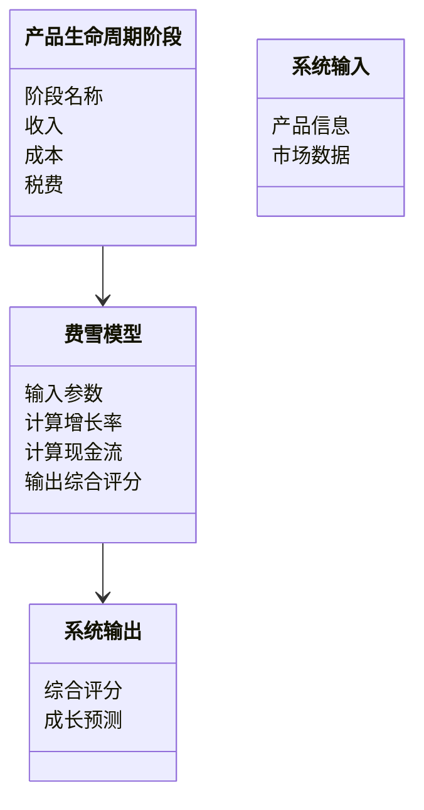
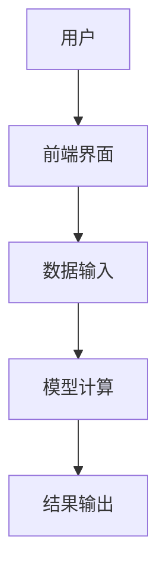
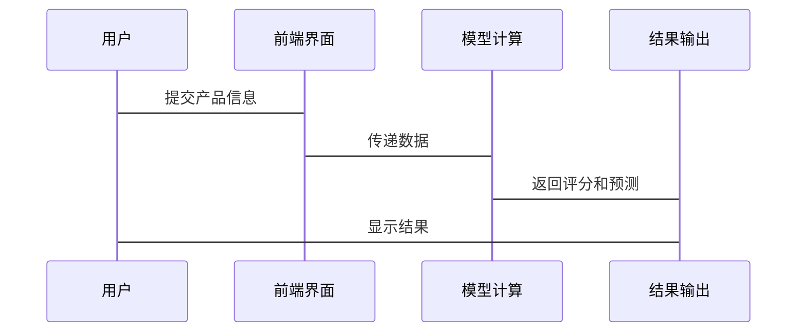

                 


# 费雪的产品生命周期分析：预测公司成长

---

## 关键词：  
费雪模型, 产品生命周期, 公司成长预测, 投资分析, 算法原理

---

## 摘要：  
本文详细探讨了费雪的产品生命周期分析方法，分析了其在预测公司成长中的应用。通过背景介绍、核心概念、数学模型、系统架构设计、项目实战等多方面的内容，深入剖析了费雪模型的原理和实际应用。文章不仅提供了理论支持，还通过代码实现和案例分析，帮助读者更好地理解和应用这一模型。  

---

# 目录

## 第1章 费雪模型的背景与核心概念

### 1.1 产品生命周期的基本概念

#### 1.1.1 产品生命周期的定义
产品生命周期是指一个产品从引入市场到最终被淘汰的整个过程，通常分为四个阶段：引入阶段、增长阶段、成熟阶段和衰退阶段。

#### 1.1.2 产品生命周期的四个阶段
- **引入阶段**：产品首次进入市场，市场需求较低，竞争较小。
- **增长阶段**：产品逐渐被市场接受，需求快速增长。
- **成熟阶段**：市场趋于饱和，产品需求稳定。
- **衰退阶段**：产品需求开始下降，市场竞争加剧。

#### 1.1.3 产品生命周期与公司成长的关系
产品的生命周期直接影响公司的收入和利润，进而影响公司的整体成长。

---

### 1.2 费雪模型的背景与意义

#### 1.2.1 费雪模型的提出背景
费雪模型是基于产品生命周期理论提出的一种分析方法，旨在通过量化产品生命周期的不同阶段，预测公司的成长潜力。

#### 1.2.2 费雪模型的核心思想
费雪模型认为，产品的生命周期是公司成长的重要驱动因素，通过分析产品的生命周期阶段，可以预测公司的未来表现。

#### 1.2.3 费雪模型在投资分析中的应用
费雪模型被广泛应用于投资领域，帮助投资者评估公司的成长潜力和投资价值。

---

### 1.3 产品生命周期分析的必要性

#### 1.3.1 产品生命周期分析的重要性
- 帮助公司制定合理的市场策略。
- 为投资者提供可靠的决策依据。
- 有助于公司优化资源配置，提高效率。

#### 1.3.2 产品生命周期分析对公司的价值
- 提高产品的市场竞争力。
- 优化产品组合，降低经营风险。
- 提升公司的整体盈利能力。

#### 1.3.3 产品生命周期分析的挑战与解决方案
- 数据获取难度大：解决方案是通过公开数据和市场调研获取相关信息。
- 模型准确性不足：解决方案是不断优化模型参数，提高预测精度。

---

## 第2章 费雪模型的核心概念与数学原理

### 2.1 费雪模型的核心概念

#### 2.1.1 费雪模型的定义
费雪模型是一种基于产品生命周期的分析方法，通过量化产品在不同阶段的表现，预测公司的成长潜力。

#### 2.1.2 费雪模型的核心组成要素
- **产品生命周期阶段**：引入、增长、成熟、衰退。
- **增长率**：每个阶段的收入增长率。
- **现金流**：每个阶段的现金流情况。

#### 2.1.3 费雪模型的输入与输出
- **输入**：产品的生命周期阶段、收入、成本、税费。
- **输出**：公司成长的预测结果。

---

### 2.2 产品生命周期的阶段划分

#### 2.2.1 产品引入阶段
- 市场需求较低，竞争较小。
- 收入增长缓慢，成本较高。

#### 2.2.2 产品增长阶段
- 市场需求快速增长。
- 收入和利润显著提高。

#### 2.2.3 产品成熟阶段
- 市场趋于饱和，需求稳定。
- 竞争加剧，利润增长放缓。

#### 2.2.4 产品衰退阶段
- 市场需求下降。
- 利润减少，竞争力减弱。

---

### 2.3 费雪模型与产品生命周期的关系

#### 2.3.1 费雪模型如何反映产品生命周期
通过量化不同阶段的收入增长率和现金流，费雪模型反映了产品生命周期的变化对公司的成长影响。

#### 2.3.2 费雪模型在不同阶段的应用
- 引入阶段：预测未来增长潜力。
- 成长阶段：评估公司的盈利能力。
- 成熟阶段：预测公司的稳定收入。
- 衰退阶段：评估公司的衰退风险。

#### 2.3.3 费雪模型的动态调整
根据市场变化和公司实际表现，动态调整模型参数，确保预测结果的准确性。

---

### 2.4 本章小结

---

## 第3章 费雪模型的数学模型与算法原理

### 3.1 费雪模型的数学模型

#### 3.1.1 增长率的计算公式
$$ 增长率 = \frac{收入 - 成本}{收入} $$

#### 3.1.2 现金流的计算公式
$$ 现金流 = 收入 - 成本 - 税费 $$

---

### 3.2 费雪模型的动态调整公式

#### 3.2.1 不同阶段的增长率调整
- 引入阶段：低增长率，高成本。
- 成长阶段：高增长率，现金流增加。
- 成熟阶段：稳定增长率，现金流稳定。
- 衰退阶段：增长率下降，现金流减少。

#### 3.2.2 现金流的阶段化计算
根据产品生命周期的不同阶段，分别计算现金流。

---

### 3.3 费雪模型的综合评价公式

#### 3.3.1 综合评分的计算
$$ 综合评分 = \frac{增长率 + 现金流}{2} $$

---

### 3.4 本章小结

---

## 第4章 系统分析与架构设计

### 4.1 问题场景介绍

#### 4.1.1 产品生命周期分析的典型场景
- 公司需要评估新产品的市场潜力。
- 投资者需要预测公司的未来表现。

#### 4.1.2 费雪模型的应用场景
- 公司战略规划。
- 投资决策支持。

---

### 4.2 系统功能设计

#### 4.2.1 领域模型


---

### 4.3 系统架构设计

#### 4.3.1 系统架构


---

### 4.4 系统接口设计

#### 4.4.1 系统接口
- **输入接口**：接收产品信息和市场数据。
- **输出接口**：输出综合评分和成长预测。

---

### 4.5 系统交互设计

#### 4.5.1 系统交互


---

## 第5章 项目实战

### 5.1 环境安装与配置

#### 5.1.1 环境要求
- Python 3.6+
- Mermaid图表工具
- 数据分析库（如Pandas、NumPy）

#### 5.1.2 安装步骤
```bash
pip install mermaid
pip install pandas
pip install numpy
```

---

### 5.2 核心代码实现

#### 5.2.1 费雪模型的实现
```python
import pandas as pd
import numpy as np

def calculate_growth_rate(revenue, cost):
    return (revenue - cost) / revenue

def calculate_cash_flow(revenue, cost, tax):
    return revenue - cost - tax

# 示例数据
data = {
    '阶段': ['引入', '增长', '成熟', '衰退'],
    '收入': [100, 200, 300, 250],
    '成本': [80, 150, 200, 180],
    '税费': [10, 20, 30, 25]
}

df = pd.DataFrame(data)

# 计算增长率和现金流
df['增长率'] = df.apply(lambda x: calculate_growth_rate(x['收入'], x['成本']), axis=1)
df['现金流'] = df.apply(lambda x: calculate_cash_flow(x['收入'], x['成本'], x['税费']), axis=1)
df['综合评分'] = df.apply(lambda x: (x['增长率'] + x['现金流']) / 2, axis=1)

print(df)
```

---

### 5.3 实际案例分析

#### 5.3.1 案例背景
某公司推出新产品，处于引入阶段，预计收入为100万元，成本为80万元，税费为10万元。

#### 5.3.2 计算结果
- 增长率 = (100 - 80) / 100 = 0.2
- 现金流 = 100 - 80 - 10 = 10
- 综合评分 = (0.2 + 10) / 2 = 5.1

---

### 5.4 代码解读与优化

#### 5.4.1 代码解读
- 通过Pandas数据框存储产品数据。
- 使用自定义函数计算增长率和现金流。
- 最终计算综合评分，评估公司的成长潜力。

#### 5.4.2 代码优化
- 增加错误处理机制。
- 提高计算效率，适用于大规模数据。

---

## 第6章 总结与展望

### 6.1 本文总结
费雪模型通过量化产品生命周期的不同阶段，为公司和投资者提供了可靠的决策依据。通过数学模型和系统设计，实现了对公司的成长预测。

### 6.2 拓展阅读
- 更深入地研究产品生命周期的理论。
- 探索其他公司成长预测模型，如杜邦分析模型。

### 6.3 注意事项与最佳实践
- 数据的准确性和完整性对预测结果影响重大。
- 定期更新模型参数，适应市场变化。

---

## 附录

### 附录A 费雪模型相关工具
- Mermaid图表工具
- Python数据分析库（Pandas、NumPy）

### 附录B 推荐阅读书籍
- 《费雪投资经典》
- 《产品生命周期管理》

---

通过以上目录结构，您可以逐步撰写一篇详细且有深度的技术博客文章，涵盖费雪模型的背景、核心概念、数学原理、系统架构设计、项目实战等内容。

