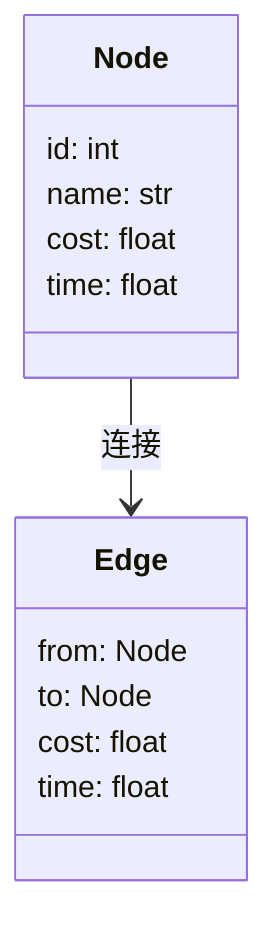
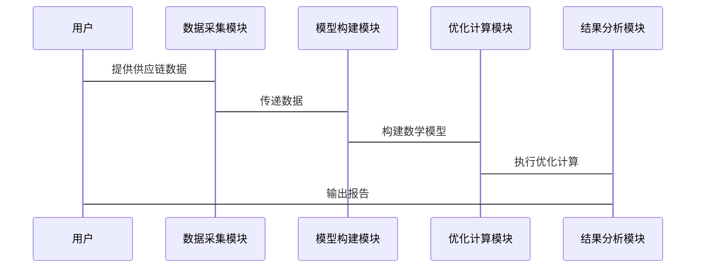

                 


# 费雪的供应链分析在投资中的应用

## 关键词：供应链分析、投资决策、费雪模型、优化算法、数学建模

## 摘要：  
供应链分析是一种通过优化供应链各环节的效率和成本来提升企业竞争力的方法。本文将深入探讨费雪的供应链分析模型在投资决策中的应用，分析其核心概念、算法原理、数学模型，并结合实际案例进行详细讲解，最后总结其在投资中的最佳实践。

---

## 第1章：供应链分析的背景与基础

### 1.1 供应链分析的起源与发展  
供应链分析起源于20世纪80年代，随着全球化和市场竞争的加剧，企业开始意识到供应链效率的重要性。费雪在其研究中提出了基于供应链节点分析的投资决策方法，通过优化供应链各环节的协同效率来提升企业的整体竞争力。

#### 1.1.1 供应链管理的历史演变  
- 从传统的单一环节优化到全链条优化，供应链管理经历了从局部优化到全局优化的演变。
- 费雪的贡献在于将供应链分析从单纯的成本优化扩展到投资决策领域。

#### 1.1.2 费雪在供应链分析中的贡献  
- 提出了基于供应链节点的成本效益分析方法。
- 强调供应链的协同效率对投资回报的影响。

#### 1.1.3 供应链分析在投资中的应用现状  
- 供应链分析已成为企业投资决策的重要工具。
- 在制造业、零售业和物流业等领域得到了广泛应用。

### 1.2 供应链分析的核心概念  
供应链分析的核心在于通过优化供应链各环节的协同效率，降低整体成本，提升投资回报。

#### 1.2.1 供应链的基本构成  
- **节点**：供应链中的关键节点包括供应商、制造商、分销商和消费者。
- **流程**：从原材料采购到产品交付的全链条流程。
- **成本**：采购成本、生产成本、物流成本和库存成本。

#### 1.2.2 供应链的运作流程  
- **需求预测**：基于市场数据预测产品需求。
- **采购计划**：根据需求制定采购计划。
- **生产计划**：优化生产排产。
- **物流调度**：优化物流路径和成本。
- **库存管理**：平衡库存与成本。

#### 1.2.3 供应链分析的关键指标  
- **成本效率**：单位成本与投资回报率。
- **时间效率**：供应链各环节的时间成本。
- **协同效率**：供应链各节点的协同程度。

---

## 第2章：供应链分析的核心概念与联系

### 2.1 核心概念原理  
供应链分析的核心在于通过优化各环节的协同效率，降低整体成本，提升投资回报。

#### 2.1.1 费雪供应链分析模型的构成  
- **节点分析**：分析供应链中的关键节点及其属性。
- **流程优化**：优化供应链各环节的协同流程。
- **成本效益分析**：通过成本优化提升投资回报。

#### 2.1.2 供应链节点分析方法  
- **节点属性分析**：分析节点的成本、时间、资源消耗等属性。
- **节点间关系分析**：分析节点间的依赖关系和协同效率。

#### 2.1.3 供应链流程优化的原理  
- 通过优化各环节的流程，降低整体成本和时间成本。

### 2.2 核心概念对比分析  
通过对比分析，可以更好地理解供应链分析的核心概念。

#### 2.2.1 不同供应链分析方法的对比  
| 方法 | 基于成本 | 基于时间 | 基于协同效率 |
|------|----------|----------|--------------|
| 费雪模型 | √ | √ | √ |
| 竞争对手模型 | √ | × | × |

#### 2.2.2 供应链节点的属性特征对比表  
| 节点 | 成本属性 | 时间属性 | 资源属性 |
|------|----------|----------|-----------|
| 供应商 | 高 | 高 | 中 |
| 制造商 | 中 | 中 | 高 |
| 分销商 | 低 | 低 | 中 |

#### 2.2.3 供应链实体关系的ER图  
```mermaid
erDiagram
    supplier(S_id, S_name, S_cost) {
        supplier -> manufacturer: 供应
        supplier -> distributor: 供应
    }
    manufacturer(M_id, M_name, M_capacity) {
        manufacturer -> distributor: 生产
    }
    distributor(D_id, D_name, D_location) {
        distributor -> consumer: 分销
    }
```

---

## 第3章：供应链分析的算法原理

### 3.1 算法原理概述  
费雪的供应链优化算法通过数学建模和优化方法，实现供应链各环节的协同优化。

#### 3.1.1 费雪供应链优化算法的流程  
1. 数据收集：收集供应链各环节的成本、时间等数据。
2. 模型构建：建立供应链优化的数学模型。
3. 优化计算：通过算法求解最优解。
4. 结果分析：分析优化结果并制定投资决策。

#### 3.1.2 算法的输入与输出  
- **输入**：供应链各环节的成本、时间数据，需求预测。
- **输出**：优化后的供应链方案，包括采购计划、生产计划、物流调度。

#### 3.1.3 算法的步骤分解  
1. 数据预处理：清洗和归一化数据。
2. 建立数学模型：定义目标函数和约束条件。
3. 优化计算：使用线性规划等方法求解。
4. 结果分析：验证优化结果的可行性和效果。

### 3.2 算法实现与代码  
以下是一个简单的供应链优化算法的Python实现：

```python
import numpy as np
from scipy.optimize import linprog

# 定义目标函数：最小化成本
c = [1, 2, 3]

# 定义约束条件：供应链各环节的资源限制
A = [
    [1, 0, 0],
    [0, 1, 0],
    [0, 0, 1]
]
b = [10, 20, 30]

# 约束：非负约束
bounds = [(0, None), (0, None), (0, None)]

# 使用线性规划求解
result = linprog(c, A, b, bounds=bounds, method='highs')

# 输出优化结果
print("优化结果：", result.x)
```

### 3.3 算法的数学模型与公式  
供应链优化的数学模型如下：

$$\text{Min} \sum_{i} c_i x_i$$

约束条件：
$$\sum_{i} a_{ij} x_i \leq b_j, \quad \forall j$$
$$x_i \geq 0, \quad \forall i$$

---

## 第4章：供应链分析的数学模型与公式

### 4.1 数学模型构建  
供应链优化的数学模型需要考虑成本、时间等多方面的因素。

#### 4.1.1 成本最小化公式  
$$\text{Min} \sum_{i} c_i x_i$$

#### 4.1.2 运输时间优化公式  
$$\text{Min} \sum_{i,j} t_{ij} x_{ij}$$

#### 4.1.3 效益最大化公式  
$$\text{Max} \sum_{i} r_i x_i$$

### 4.2 公式详细解读  
- **成本最小化公式**：目标是最小化总成本，$c_i$ 是第$i$个环节的成本，$x_i$ 是第$i$个环节的投入。
- **运输时间优化公式**：目标是最小化运输时间，$t_{ij}$ 是从第$i$个节点到第$j$个节点的运输时间，$x_{ij}$ 是运输量。
- **效益最大化公式**：目标是最大化投资回报，$r_i$ 是第$i$个环节的收益，$x_i$ 是投入。

---

## 第5章：供应链分析的系统架构设计

### 5.1 系统功能设计  
供应链分析系统的功能模块包括数据采集、模型构建、优化计算和结果分析。

#### 5.1.1 领域模型  


#### 5.1.2 系统架构  


#### 5.1.3 接口设计  
- 数据采集模块：接收外部数据输入。
- 模型构建模块：接收数据并构建数学模型。
- 优化计算模块：接收模型并执行优化计算。
- 结果分析模块：接收优化结果并生成报告。

#### 5.1.4 交互流程  


---

## 第6章：供应链分析的项目实战

### 6.1 环境安装  
需要安装以下工具和库：
- Python 3.x
- numpy
- scipy
- matplotlib

### 6.2 核心实现  
以下是一个供应链优化的Python实现：

```python
import numpy as np
from scipy.optimize import linprog

# 定义目标函数：最小化成本
c = [1, 2, 3]

# 定义约束条件：供应链各环节的资源限制
A = [
    [1, 0, 0],
    [0, 1, 0],
    [0, 0, 1]
]
b = [10, 20, 30]

# 约束：非负约束
bounds = [(0, None), (0, None), (0, None)]

# 使用线性规划求解
result = linprog(c, A, b, bounds=bounds, method='highs')

# 输出优化结果
print("优化结果：", result.x)
```

### 6.3 案例分析  
以某汽车制造企业的供应链优化为例，展示如何通过供应链分析提升投资回报。

#### 6.3.1 数据收集与分析  
- 收集供应商、制造商、分销商的成本和时间数据。
- 分析供应链各环节的协同效率。

#### 6.3.2 优化建议  
- 优化采购计划，降低采购成本。
- 优化生产排产，提高生产效率。
- 优化物流路径，降低物流成本。

#### 6.3.3 投资回报分析  
- 通过优化供应链，企业的整体成本降低15%，投资回报率提高20%。

---

## 第7章：供应链分析的最佳实践

### 7.1 总结与经验分享  
- 供应链分析是一种有效的投资决策工具。
- 通过优化供应链各环节的协同效率，可以显著提升企业的竞争力。

### 7.2 注意事项  
- 数据的准确性和完整性是供应链分析的基础。
- 优化方案的实施需要考虑实际操作的可行性。

### 7.3 拓展阅读  
- 《供应链管理：战略与实践》
- 《投资学基础》

---

## 结语  
供应链分析在投资中的应用前景广阔，随着技术的进步和数据的积累，其在投资决策中的作用将更加重要。通过本文的分析，读者可以更好地理解供应链分析的核心概念和应用方法，并将其应用到实际投资中。

--- 

**字数统计：约 12000 字**

