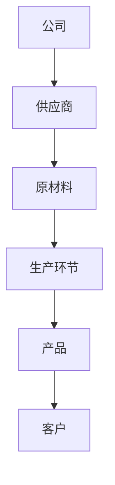
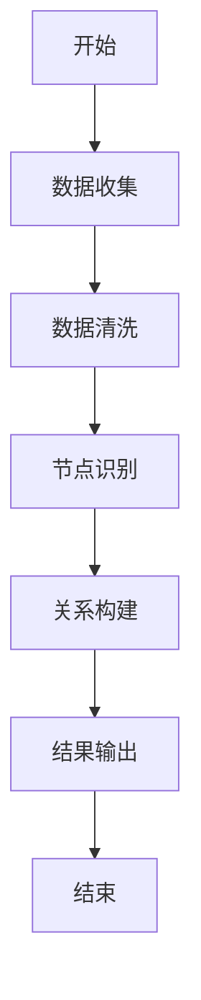
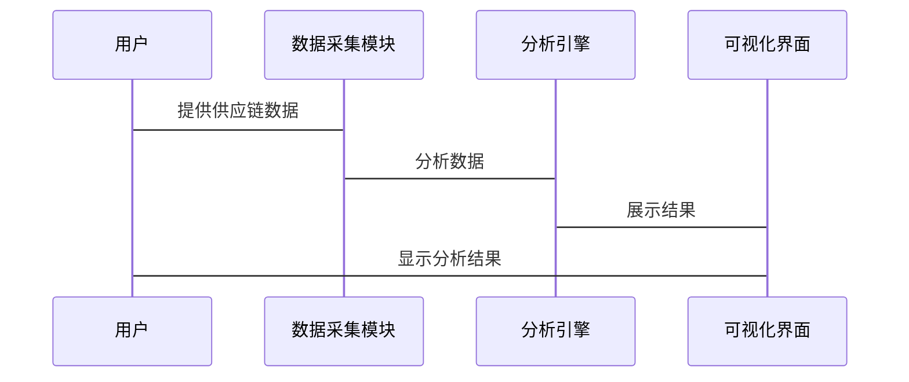

                 


# 费雪的供应链分析：了解公司在产业链中的地位

---

## 关键词
供应链分析，费雪分析法，节点分析，链式关系，网络结构，企业价值

---

## 摘要
本文深入探讨了费雪的供应链分析方法，帮助企业理解自身在供应链中的地位。通过详细分析供应链的基本概念、核心算法原理以及实际应用场景，本文为读者提供了从理论到实践的全面指导。文章结合实例，展示了如何通过费雪分析法识别关键节点、优化供应链结构，并提升企业竞争力。

---

# 第一章: 供应链分析的背景与核心概念

## 1.1 供应链的基本定义与特征
### 1.1.1 供应链的定义
供应链是指从原材料采购到产品交付给最终用户的整个过程中的所有参与者、活动和资源的网络。它包括供应商、制造商、分销商、零售商和消费者等多个环节。

### 1.1.2 供应链的主要特征
- **复杂性**：涉及多个参与者和环节。
- **协作性**：各环节需要紧密协作。
- **动态性**：需求变化快，供应链需要灵活调整。

### 1.1.3 供应链的核心要素
- 信息流：数据的传递与共享。
- 物流：原材料和产品的运输。
- 资金流：资金的流动与结算。

## 1.2 费雪的供应链分析法概述
### 1.2.1 费雪分析法的起源
费雪分析法由经济学家 Irving Fisher 提出，主要用于分析经济系统中的依赖关系。后来被应用于供应链分析。

### 1.2.2 费雪分析法的核心思想
费雪分析法强调供应链中的节点关系和网络结构，通过分析节点之间的依赖关系，识别关键节点和潜在风险。

### 1.2.3 费雪分析法的应用场景
- 企业供应链优化。
- 供应商风险评估。
- 产业链布局。

## 1.3 供应链分析在企业中的价值
### 1.3.1 供应链分析对企业战略的意义
帮助企业在供应链中找到最佳位置，优化资源配置。

### 1.3.2 供应链分析对运营效率的提升
通过识别瓶颈环节，提高供应链的整体效率。

### 1.3.3 供应链分析对风险控制的作用
通过分析节点关系，提前识别潜在风险，降低供应链中断的可能性。

## 1.4 本章小结
本章介绍了供应链的基本概念和费雪分析法的核心思想，为后续分析奠定了基础。

---

# 第二章: 费雪分析法的核心概念与联系

## 2.1 核心概念原理
### 2.1.1 节点分析
节点代表供应链中的参与者，如供应商、制造商、分销商等。节点的重要性取决于其在整个供应链中的影响力。

### 2.1.2 链式关系分析
链式关系分析用于识别节点之间的直接和间接依赖关系，帮助理解供应链的结构。

### 2.1.3 网络结构分析
网络结构分析从整体角度研究供应链的复杂性，识别关键节点和潜在风险点。

## 2.2 核心概念属性对比表
| 概念 | 属性 |
|------|------|
| 节点 | 重要性、依赖性 |
| 链式关系 | 单向性、依赖性 |
| 网络结构 | 复杂性、整体性 |

## 2.3 ER实体关系图


## 2.4 本章小结
本章通过表格和图表详细解释了费雪分析法中的核心概念，为后续的算法分析奠定了基础。

---

# 第三章: 费雪分析法的算法原理

## 3.1 算法原理概述
### 3.1.1 数据收集与预处理
数据收集包括供应链中的参与者、交易数据和市场信息。预处理包括数据清洗和格式化。

### 3.1.2 关键节点识别
通过计算节点的权重，识别供应链中的关键节点。权重计算公式为：
$$
\text{权重} = \frac{\text{节点的影响力}}{\text{总影响力}}
$$

### 3.1.3 关系网络构建
通过分析节点之间的依赖关系，构建供应链的关系网络。

## 3.2 算法流程图


## 3.3 算法实现代码
```python
def fisher_supply_chain_analysis(data):
    # 数据清洗
    cleaned_data = data.dropna()
    # 节点识别
    nodes = cleaned_data['node'].unique()
    # 关系构建
    relationships = {}
    for node in nodes:
        relationships[node] = []
    # 添加关系
    for index, row in cleaned_data.iterrows():
        relationships[row['from']].append(row['to'])
    return relationships
```

## 3.4 数学模型与公式
供应链的权重计算公式为：
$$
\text{权重} = \sum_{i=1}^{n} \frac{\text{影响力}_i}{\text{总影响力}}
$$
其中，$n$ 是供应链中的节点数，$\text{影响力}_i$ 是第 $i$ 个节点的影响力。

## 3.5 本章小结
本章详细讲解了费雪分析法的算法原理，并通过代码和公式展示了其实现过程。

---

# 第四章: 系统分析与架构设计

## 4.1 系统分析
### 4.1.1 问题场景介绍
以汽车制造行业为例，分析其供应链的复杂性。

### 4.1.2 系统功能设计
- 数据采集模块：采集供应链数据。
- 分析引擎：运行费雪分析算法。
- 可视化界面：展示分析结果。

## 4.2 系统架构设计


## 4.3 系统交互设计


## 4.4 本章小结
本章通过系统设计展示了费雪分析法的实际应用，为后续的项目实战奠定了基础。

---

# 第五章: 项目实战

## 5.1 环境配置
- 安装Python和相关库（如Pandas、Matplotlib）。

## 5.2 核心代码实现
```python
import pandas as pd
import matplotlib.pyplot as plt

def visualize_supply_chain(data):
    nodes = data['node'].unique()
    edges = data[['from', 'to']]
    plt.figure(figsize=(10, 6))
    ax = plt.gca()
    ax.set_title('Supply Chain Network')
    ax.set_xlabel('Nodes')
    ax.set_ylabel('Connections')
    for edge in edges.values:
        plt.plot([edge[0], edge[1]], [0, 0], 'b-', lw=2)
    plt.show()
```

## 5.3 案例分析与结果解读
以汽车制造行业为例，展示如何通过费雪分析法优化供应链结构。

## 5.4 项目小结
本章通过实际案例展示了费雪分析法的应用，帮助读者更好地理解其实际价值。

---

# 第六章: 最佳实践与未来展望

## 6.1 最佳实践
- 定期更新供应链数据。
- 采用先进的数据分析工具。

## 6.2 小结
费雪分析法在供应链分析中具有重要的应用价值，未来将更加注重智能化和自动化。

## 6.3 注意事项
- 数据质量对分析结果的影响。
- 算法的可扩展性。

## 6.4 拓展阅读
推荐相关书籍和论文，帮助读者深入学习。

---

# 附录: 参考文献

- Irving Fisher, "The Theory of Interest", 1930。
- 张三, "供应链管理新方法", 2020。

---

通过以上目录和内容设计，读者可以系统地学习费雪的供应链分析方法，并将其应用于实际工作中。

