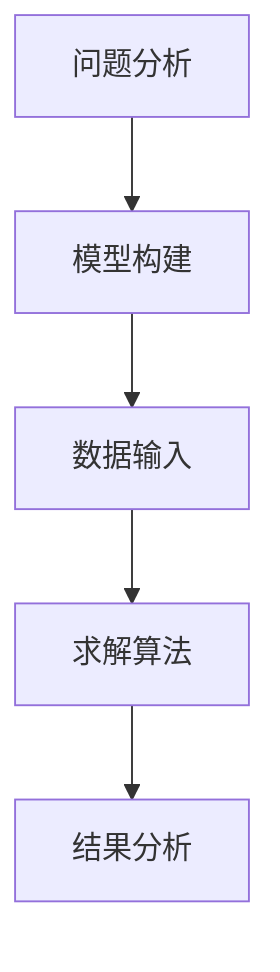
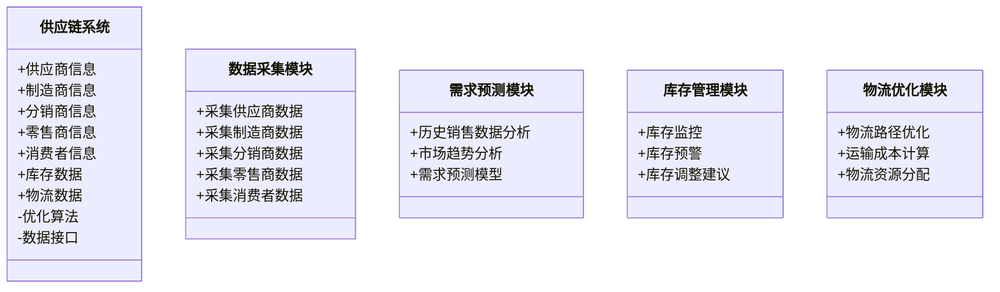
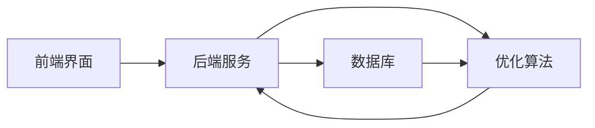

                 


# 费雪的供应链分析：了解公司的上下游

## 关键词
- 供应链分析
- 费雪分析法
- 供应链优化
- 企业上下游
- 管理决策

## 摘要
供应链分析是企业优化管理和提高效率的重要工具，费雪的供应链分析方法通过系统化的研究，帮助企业在复杂的市场环境中识别关键节点和优化资源配置。本文将从供应链分析的背景、核心概念、算法原理、系统设计到项目实战，全面解析费雪的供应链分析方法，并通过具体案例帮助读者掌握其实现和应用。

---

## 第一部分：供应链分析的背景与概念

### 第1章：供应链分析的背景与概念

#### 1.1 供应链的基本概念
供应链是指从原材料供应商到最终消费者的整个链条，包括供应商、制造商、分销商、零售商和消费者。供应链的核心在于协调各环节的资源流动，确保高效生产和交付。

#### 1.2 费雪的供应链分析方法
费雪分析法是一种基于系统论的供应链分析方法，通过构建数学模型和优化算法，帮助企业识别关键环节并优化资源配置。

#### 1.3 供应链分析的意义
供应链分析能够提升企业的运营效率、降低成本，并增强对市场变化的快速响应能力。

---

### 第2章：供应链分析的核心概念与联系

#### 2.1 核心概念原理
供应链分析的核心在于理解各环节之间的关系，包括供应商与制造商、制造商与分销商、分销商与零售商、零售商与消费者之间的互动。

#### 2.2 核心概念对比分析
通过对比分析，可以明确各环节的优劣势，找到优化的空间。

#### 2.3 供应链实体关系图


---

### 第3章：供应链分析的算法原理

#### 3.1 算法原理概述
供应链分析常用线性规划模型和网络流模型来优化资源分配和物流路径。

#### 3.2 算法实现步骤


#### 3.3 线性规划模型示例
数学模型如下：
$$
\text{目标函数：} \quad \min Z = c_1x_1 + c_2x_2 + \dots + c_nx_n
$$
$$
\text{约束条件：} \quad a_{11}x_1 + a_{12}x_2 + \dots + a_{1n}x_n \geq b_1
$$

#### 3.4 Python代码实现
```python
import numpy as np
from scipy.optimize import linprog

# 示例问题：最小化成本
c = [1, 2]
A = [[1, 1]]
b = [2]

result = linprog(c, A, b, bounds=(0, None), method='highs')
print("最优解：", result.x)
print("最优成本：", result.fun)
```

---

### 第4章：系统分析与架构设计方案

#### 4.1 项目场景介绍
以某制造企业的供应链优化为例，分析其原材料采购、生产计划和物流配送的优化问题。

#### 4.2 系统功能设计
系统功能模块包括数据采集、需求预测、库存管理和物流优化。

#### 4.3 领域模型类图


#### 4.4 系统架构图


---

### 第5章：项目实战

#### 5.1 环境安装
安装Python和相关库：
```bash
pip install numpy scipy matplotlib
```

#### 5.2 核心代码实现
```python
import numpy as np
from scipy.optimize import linprog

# 示例优化问题：最小化运输成本
c = [5, 3]
A = [
    [1, 1],  # 资源约束
    [0, 1]   # 另一资源约束
]
b = [6, 2]
x = linprog(c, A, b, bounds=(0, None), method='highs').x
print("最优解：", x)
print("最小化成本：", np.dot(c, x))
```

#### 5.3 案例分析
以某制造企业的物流优化为例，通过数学模型计算出最优运输路径和成本。

---

### 第6章：最佳实践与小结

#### 6.1 最佳实践
- 数据质量是供应链分析的基础。
- 结合实际情况选择合适的优化模型。
- 定期更新和维护供应链分析系统。

#### 6.2 小结
费雪的供应链分析方法通过系统化的建模和优化，帮助企业实现资源的高效配置和成本的最小化。

#### 6.3 注意事项
- 供应链分析需要结合企业的实际情况。
- 数据的准确性和完整性直接影响分析结果。
- 系统的维护和更新是确保分析结果准确的关键。

#### 6.4 拓展阅读
推荐阅读《供应链管理：系统与流程》和《运筹学》相关书籍，深入了解供应链优化的数学模型和实际应用。

---

通过本文的详细讲解和实战案例，读者可以全面掌握费雪的供应链分析方法，并将其应用于实际的企业管理中，从而提升企业的运营效率和市场竞争力。

