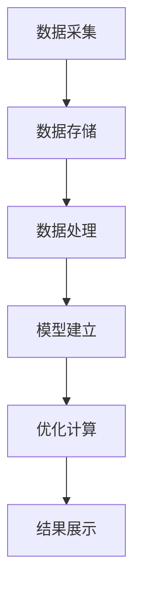
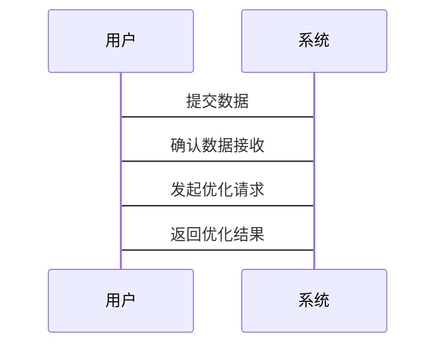

                 


# 费雪的供应链分析：全球化重构下的新思路

## 关键词：
- 供应链分析
- 全球化重构
- 费雪分析法
- 数字化供应链
- 供应链优化

## 摘要：
本文深入探讨了费雪的供应链分析方法及其在全球化重构背景下的新思路。通过分析供应链的核心概念、算法原理、系统设计和实际案例，本文为供应链管理领域的专业人士提供了理论与实践相结合的指导。文章从供应链的基本原理出发，逐步解析费雪分析法的独特优势，结合实际案例和系统设计，展现了如何在数字化时代优化供应链管理。

---

## 第一部分: 引言

### 第1章: 费雪的供应链分析概述

#### 1.1 供应链分析的背景与意义
##### 1.1.1 供应链的基本概念与定义
供应链是指从原材料采购到最终产品交付给客户的一系列过程，包括供应商、制造商、分销商、零售商和消费者等环节。供应链管理的目标是优化流程、降低成本、提高效率和增强灵活性。

##### 1.1.2 全球化重构下的供应链挑战
全球化使得供应链更加复杂，跨国运营、文化差异和政策变化增加了供应链的不确定性和风险。同时，数字化和智能化技术的应用为供应链优化提供了新的机遇。

##### 1.1.3 费雪供应链分析的核心思路
费雪供应链分析是一种以数据驱动的分析方法，通过建立数学模型和优化算法，帮助企业在复杂环境中找到最优的供应链策略。

#### 1.2 费雪供应链分析的方法论
##### 1.2.1 费雪供应链分析的理论基础
费雪供应链分析基于运筹学、系统工程和数据科学的理论，结合实际业务需求，构建数学模型和优化算法。

##### 1.2.2 费雪分析法与传统供应链分析的对比
传统供应链分析更多关注流程优化和成本控制，而费雪分析法则强调数据驱动的预测和动态优化，能够更好地应对全球化重构下的复杂挑战。

##### 1.2.3 费雪分析法的应用场景
费雪分析法适用于跨国企业、复杂制造行业和电子商务等领域，尤其在应对供应链中断和优化库存管理方面表现出色。

#### 1.3 全球化重构下的供应链新趋势
##### 1.3.1 全球化供应链的特点
全球化供应链具有长链条、跨区域和高度依赖的特点，但也面临更高的风险和不确定性。

##### 1.3.2 数字化与智能化对供应链的影响
数字化技术（如物联网、大数据和人工智能）的应用使得供应链更加透明、高效和智能，能够实时监控和调整供应链策略。

##### 1.3.3 新兴技术在供应链分析中的应用
区块链、5G和工业互联网等新兴技术正在改变供应链的运作方式，提升供应链的透明度和可信度。

#### 1.4 本书的核心内容与结构
##### 1.4.1 本书的主要内容
本书从供应链的基本概念出发，深入解析费雪供应链分析的方法论，结合算法原理和实际案例，探讨如何在全球化重构下优化供应链管理。

##### 1.4.2 本书的逻辑框架
- 引言：介绍供应链分析的重要性和费雪分析法的核心思想。
- 核心概念：讲解供应链分析的基本原理和费雪分析法的关键要素。
- 算法原理：分析费雪供应链分析的数学模型和优化算法。
- 系统设计：探讨供应链分析系统的架构和实现方案。
- 实战案例：通过实际案例展示费雪分析法的应用效果。
- 总结：总结全书内容并展望未来发展方向。

##### 1.4.3 本书的阅读方法与建议
读者可以按照章节顺序阅读，结合实际案例和代码实现，逐步掌握费雪供应链分析的核心思想和实践技巧。

---

## 第二部分: 供应链分析的核心概念与联系

### 第2章: 供应链分析的核心概念

#### 2.1 供应链分析的基本原理
##### 2.1.1 供应链的构成要素
供应链由供应商、制造商、分销商、零售商和消费者组成，每个环节都通过信息流、物流和资金流连接。

##### 2.1.2 供应链的运作流程
供应链的运作流程包括采购、生产、库存管理、物流配送和销售，每个环节都需要高效协同。

##### 2.1.3 供应链的优化目标
供应链的优化目标是降低成本、提高效率、增强灵活性和提升客户满意度。

#### 2.2 费雪供应链分析的核心要素
##### 2.2.1 费雪分析法的核心概念
费雪分析法基于数学建模和优化算法，通过分析供应链的各个环节，找到最优的供应链策略。

##### 2.2.2 费雪分析法的关键指标
关键指标包括库存周转率、供应链成本占比、交付时间和服务水平。

##### 2.2.3 费雪分析法的数学模型
费雪分析法的数学模型包括线性规划、整数规划和动态规划，用于优化供应链的各个环节。

#### 2.3 供应链分析中的关键问题
##### 2.3.1 供应链的效率与成本平衡
供应链的效率和成本之间需要找到平衡点，既要保证高效运作，又要控制成本。

##### 2.3.2 供应链的灵活性与稳定性
供应链需要在变化的市场环境中保持灵活性，同时确保核心环节的稳定性。

##### 2.3.3 供应链的可持续性与社会责任
供应链的可持续性包括资源的合理利用和环境保护，同时需要关注社会责任和伦理问题。

#### 2.4 核心概念的对比分析
##### 2.4.1 费雪分析法与其他供应链分析方法的对比
费雪分析法与传统供应链分析方法相比，更加注重数据驱动和动态优化。

##### 2.4.2 不同供应链分析方法的优缺点
- 优点：费雪分析法能够提供精确的优化方案，适应复杂环境。
- 缺点：费雪分析法需要大量的数据和计算资源，实施成本较高。

##### 2.4.3 供应链分析方法的适用场景
费雪分析法适用于复杂供应链优化，而传统方法适用于简单供应链优化。

---

## 第三部分: 供应链分析的算法原理

### 第3章: 供应链分析的基本算法

#### 3.1 供应链分析的基本算法原理
##### 3.1.1 线性规划模型在供应链分析中的应用
线性规划模型用于优化供应链的各个环节，如生产计划和库存管理。

##### 3.1.2 动态规划模型在供应链分析中的应用
动态规划模型用于处理供应链中的不确定性问题，如需求波动和供应链中断。

##### 3.1.3 图论模型在供应链网络中的应用
图论模型用于分析供应链的网络结构，识别关键节点和优化路径。

#### 3.2 费雪供应链分析算法的实现
##### 3.2.1 费雪分析法的算法流程
1. 数据收集与清洗
2. 建立数学模型
3. 优化算法求解
4. 结果分析与调整

##### 3.2.2 费雪分析法的代码实现
以下是费雪供应链分析算法的Python代码示例：

```python
import numpy as np
from scipy.optimize import linprog

# 定义目标函数
c = [-2, -3]  # 利润最大化

# 定义约束条件
A = [[1, 1], [0, 1]]
b = [4, 2]

# 使用线性规划求解
result = linprog(c, A_ub=A, b_ub=b, bounds=(0, None), method='highs')

# 输出结果
print("最优解为：", result.x)
print("最大利润为：", -result.fun)
```

##### 3.2.3 费雪分析法的数学模型
费雪分析法的数学模型可以表示为：

$$ \text{最大化} \quad c^T x $$

$$ \text{约束} \quad A x \leq b $$

$$ x \geq 0 $$

其中，\( c \) 是目标函数的系数，\( A \) 是约束矩阵，\( b \) 是约束向量，\( x \) 是决策变量。

#### 3.3 算法实现的案例分析
##### 3.3.1 某制造企业的供应链优化案例
通过费雪分析法优化某制造企业的生产计划和库存管理，降低了库存成本，提高了生产效率。

##### 3.3.2 某零售企业的供应链分析案例
通过费雪分析法优化某零售企业的供应链网络，提高了订单处理速度和客户满意度。

##### 3.3.3 某物流企业的供应链改进案例
通过费雪分析法优化某物流企业的运输路径和配送时间，降低了物流成本，提高了服务质量。

---

## 第四部分: 供应链分析的系统设计与实现

### 第4章: 供应链分析的系统设计

#### 4.1 系统分析与功能设计
##### 4.1.1 问题场景介绍
以某制造企业的供应链优化为例，分析其面临的库存积压、交货延迟和成本过高等问题。

##### 4.1.2 系统功能设计
系统功能包括数据采集、模型建立、优化计算和结果分析。

##### 4.1.3 系统架构设计
系统架构包括数据层、计算层、展示层和用户界面层。

#### 4.2 系统架构设计
##### 4.2.1 系统架构图
以下是系统架构的mermaid图：



##### 4.2.2 系统接口设计
系统接口包括数据接口、计算接口和展示接口。

##### 4.2.3 系统交互流程
以下是系统交互的mermaid图：



#### 4.3 系统实现与优化
##### 4.3.1 系统实现方案
系统基于Python和数据分析框架（如Pandas和NumPy）实现，结合优化算法（如线性规划和动态规划）进行供应链优化。

##### 4.3.2 系统优化建议
通过并行计算和分布式处理提高系统的计算效率，同时优化算法模型以适应更大的数据规模。

---

## 第五部分: 供应链分析的项目实战

### 第5章: 项目实战

#### 5.1 环境安装与配置
##### 5.1.1 环境要求
- Python 3.8 或更高版本
- 安装必要的库：numpy、pandas、scipy

##### 5.1.2 安装步骤
```bash
pip install numpy pandas scipy
```

#### 5.2 系统核心实现源代码
以下是供应链优化算法的Python代码示例：

```python
import numpy as np
from scipy.optimize import linprog

# 定义目标函数
c = [-2, -3]  # 利润最大化

# 定义约束条件
A = [[1, 1], [0, 1]]
b = [4, 2]

# 使用线性规划求解
result = linprog(c, A_ub=A, b_ub=b, bounds=(0, None), method='highs')

# 输出结果
print("最优解为：", result.x)
print("最大利润为：", -result.fun)
```

#### 5.3 代码应用解读与分析
代码通过线性规划模型优化供应链的生产计划和库存管理，帮助企业在有限资源下实现利润最大化。

#### 5.4 实际案例分析
以某制造企业为例，通过费雪分析法优化供应链，降低了库存成本，提高了生产效率。

#### 5.5 项目小结
通过项目实战，验证了费雪分析法的有效性和实用性，同时也发现了系统优化的空间。

---

## 第六部分: 总结与展望

### 第6章: 总结与展望

#### 6.1 全书总结
本文系统介绍了费雪的供应链分析方法，从理论到实践，详细讲解了供应链分析的核心概念、算法原理和系统设计，展示了如何在全球化重构下优化供应链管理。

#### 6.2 未来展望
随着人工智能和大数据技术的不断发展，供应链分析将更加智能化和自动化。费雪分析法也将不断优化和创新，为企业应对全球化重构下的挑战提供更强大的支持。

---

## 最佳实践 Tips

1. 在实际应用中，建议结合企业的具体需求和数据，灵活调整分析模型和算法。
2. 系统设计时，注意数据安全和隐私保护，确保供应链数据的保密性。
3. 项目实施过程中，注重团队协作和跨部门沟通，确保供应链优化方案的有效落地。

---

通过本文的系统讲解和实战案例，读者可以全面掌握费雪的供应链分析方法，为应对全球化重构下的供应链挑战提供有力的理论和实践指导。

