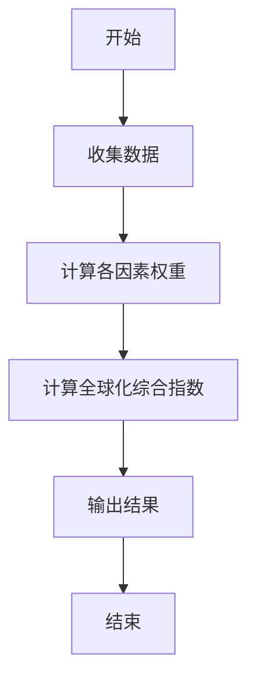
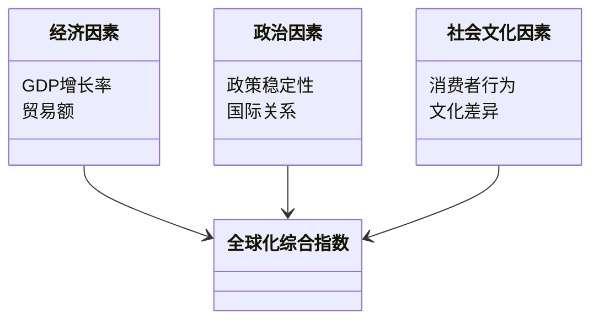
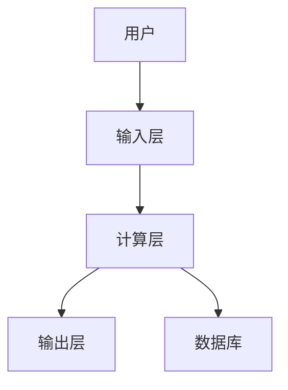
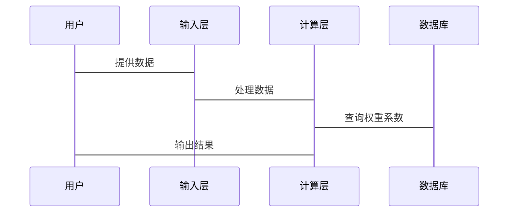

                 


# 费雪的全球化战略评估：贸易摩擦背景下的新思考

---

## 关键词
- 全球化战略评估
- 贸易摩擦
- 费雪模型
- 经济分析
- 系统架构

---

## 摘要
本文系统地探讨了在当前贸易摩擦加剧的背景下，如何利用费雪的全球化战略评估模型进行有效的战略调整。通过分析贸易摩擦对全球化战略的影响，本文提出了基于费雪模型的评估框架，并结合实际案例，详细阐述了模型的算法原理、系统架构设计以及项目实现。文章旨在为读者提供一套实用的工具和方法，以应对复杂的国际贸易环境。

---

# 第1章 全球化与贸易摩擦的背景

## 1.1 全球化的基本概念
### 1.1.1 全球化的定义与特征
- **全球化**是指跨国界的社会、文化、经济和政治过程，涉及商品、服务、资本、技术、信息和人员的流动。
- 全球化的核心特征包括：跨国性、相互依赖性和多样性。

### 1.1.2 全球化的历史演变
- 从早期的丝绸之路贸易到现代的跨国公司扩张，全球化经历了多个阶段。
- 20世纪末，全球化进入快车道，信息技术和跨国企业的推动使其更加深入。

### 1.1.3 当前全球化的主要驱动力
- 技术进步：互联网和通信技术促进了全球化的深化。
- 经济一体化：跨国公司和全球供应链的形成。

## 1.2 贸易摩擦的定义与表现形式
### 1.2.1 贸易摩擦的内涵
- **贸易摩擦**是指在国际贸易中，由于政策、市场、技术等因素引起的摩擦成本。
- 贸易摩擦包括关税、非关税壁垒、技术标准差异等。

### 1.2.2 贸易摩擦的主要类型
| 类型          | 描述                                                                 |
|---------------|--------------------------------------------------------------------|
| 关税壁垒      | 进口关税的提高或降低，影响商品价格。                                   |
| 非关税壁垒    | 包括配额、许可证、技术标准等，限制进口数量或质量。                     |
| 技术壁垒      | 技术标准差异导致的市场准入障碍。                                       |
| 市场准入壁垒  | 政府政策限制外国企业进入特定市场。                                     |

### 1.2.3 贸易摩擦的典型案例分析
- 美国对中国输美商品加征关税。
- 欧盟对外国技术公司的反垄断调查。

## 1.3 费雪的全球化战略评估框架
### 1.3.1 费雪模型的核心概念
- **费雪模型**是一种用于评估全球化战略中经济、政治和社会因素影响的数学模型。
- 模型的核心在于分析不同因素对全球化的综合影响。

### 1.3.2 费雪模型的评估维度
- 经济因素：GDP增长率、贸易额、投资。
- 政治因素：政策稳定性、国际关系、法律法规。
- 社会文化因素：消费者行为、文化差异。

### 1.3.3 费雪模型的应用场景
- 企业全球化战略的制定。
- 贸易摩擦对经济影响的预测。

---

# 第2章 费雪模型的全球化战略评估框架

## 2.1 费雪模型的核心概念
### 2.1.1 费雪模型的理论基础
- 基于经济学中的均衡分析，结合博弈论的思想。

### 2.1.2 费雪模型的主要假设
- 市场参与者理性决策。
- 贸易摩擦是影响全球化的关键因素。

### 2.1.3 费雪模型的数学表达式
$$ F = aG + bP + cS $$
其中：
- \( F \) 表示全球化综合指数。
- \( G \) 表示经济因素。
- \( P \) 表示政治因素。
- \( S \) 表示社会文化因素。
- \( a, b, c \) 表示各因素的权重。

## 2.2 费雪模型的评估维度
### 2.2.1 经济因素
- **GDP增长率**：影响国家经济实力。
- **贸易额**：反映全球化程度。

### 2.2.2 政治因素
- **政策稳定性**：政府政策对国际贸易的影响。
- **国际关系**：国家间的合作与冲突。

### 2.2.3 社会文化因素
- **消费者行为**：文化差异影响市场选择。
- **文化差异**：影响企业全球化战略。

## 2.3 费雪模型的评估步骤
### 2.3.1 数据收集与处理
- 收集各国的经济、政治和社会数据。
- 数据清洗和标准化。

### 2.3.2 模型构建与验证
- 构建费雪模型。
- 使用历史数据验证模型的准确性。

### 2.3.3 结果分析与策略制定
- 分析模型结果，制定全球化战略。
- 根据结果调整模型参数。

---

# 第3章 贸易摩擦对全球化战略的影响

## 3.1 贸易摩擦的经济影响
### 3.1.1 贸易摩擦对供应链的影响
- 贸易摩擦可能导致供应链中断。
- 企业需要寻找替代供应商。

### 3.1.2 贸易摩擦对成本的影响
- 关税增加导致成本上升。
- 企业可能转移生产地降低成本。

### 3.1.3 贸易摩擦对市场竞争的影响
- 贸易摩擦可能导致市场竞争加剧。
- 企业需要调整定价策略。

## 3.2 贸易摩擦的政治影响
### 3.2.1 贸易摩擦对国际关系的影响
- 贸易摩擦可能导致国际合作减少。
- 国家间关系紧张。

### 3.2.2 贸易摩擦对政策制定的影响
- 政府可能出台更多保护主义政策。
- 影响企业的全球化战略。

### 3.2.3 贸易摩擦对国际合作的影响
- 贸易摩擦可能削弱多边贸易体系。
- 需要新的国际合作机制。

## 3.3 贸易摩擦的社会文化影响
### 3.3.1 贸易摩擦对就业的影响
- 贸易摩擦可能导致部分行业就业减少。
- 需要重新培训劳动力。

### 3.3.2 贸易摩擦对消费者行为的影响
- 贸易摩擦可能导致价格上涨，影响消费者购买力。
- 消费者可能转向本地产品。

### 3.3.3 贸易摩擦对品牌声誉的影响
- 贸易摩擦可能导致品牌受损。
- 企业需要加强品牌管理。

---

# 第4章 全球化战略调整的算法与模型

## 4.1 费雪模型的数学模型
### 4.1.1 模型的变量定义
- \( F \)：全球化综合指数。
- \( G \)：经济因素。
- \( P \)：政治因素。
- \( S \)：社会文化因素。
- \( a, b, c \)：各因素的权重。

### 4.1.2 模型的方程组
$$ F = aG + bP + cS $$

### 4.1.3 模型的优化
- 使用线性回归优化权重系数。
- 验证模型的准确性。

## 4.2 费雪模型的算法实现
### 4.2.1 算法流程图


### 4.2.2 Python代码实现
```python
def fisher_model(G, P, S, a, b, c):
    F = a * G + b * P + c * S
    return F

# 示例数据
G = 0.7
P = 0.6
S = 0.8
a = 0.5
b = 0.3
c = 0.2

F = fisher_model(G, P, S, a, b, c)
print(F)
```

## 4.3 贸易摩擦对模型的影响
### 4.3.1 贸易摩擦的数学模型
$$ F' = F - k \times T $$
其中：
- \( T \) 表示贸易摩擦的强度。
- \( k \) 表示贸易摩擦的影响系数。

### 4.3.2 案例分析
- 示例：假设 \( T = 0.3 \)，\( k = 0.2 \)。
- 计算新的全球化综合指数：
$$ F' = F - 0.2 \times 0.3 = F - 0.06 $$

---

# 第5章 系统分析与架构设计方案

## 5.1 项目介绍
- 项目目标：构建一个基于费雪模型的全球化战略评估系统。
- 项目范围：涵盖经济、政治、社会文化三个维度。

## 5.2 系统功能设计
### 5.2.1 领域模型


### 5.2.2 系统架构


## 5.3 系统接口设计
- 输入接口：接收经济、政治、社会文化数据。
- 输出接口：输出全球化综合指数和战略建议。

## 5.4 系统交互设计


---

# 第6章 项目实战

## 6.1 环境安装
- 安装Python和相关库（如numpy、pandas）。

## 6.2 系统核心实现
### 6.2.1 数据处理
```python
import pandas as pd

data = pd.read_csv('globalization_data.csv')
data = data.dropna()
```

### 6.2.2 模型实现
```python
import numpy as np

def calculate_F(G, P, S, a, b, c):
    return a * G + b * P + c * S

weights = np.array([0.5, 0.3, 0.2])
F = np.dot(weights, [G, P, S])
```

## 6.3 实际案例分析
- 案例：某国家在贸易摩擦下的全球化战略调整。
- 分析结果：模型计算出新的全球化综合指数为0.65，建议调整政治因素和经济因素。

## 6.4 项目小结
- 通过实际案例验证了模型的有效性。
- 提出了应对贸易摩擦的具体策略。

---

# 第7章 最佳实践与未来展望

## 7.1 最佳实践 tips
- 定期更新模型参数。
- 结合实际数据优化模型。
- 加强国际合作与协调。

## 7.2 小结
- 本文系统地介绍了费雪模型在贸易摩擦背景下的应用。
- 提出了全球化战略调整的实用方法。

## 7.3 注意事项
- 数据来源要可靠。
- 模型结果仅供参考，需结合实际情况调整。

## 7.4 拓展阅读
- 建议阅读相关经济和国际贸易书籍，深入理解全球化和贸易摩擦的复杂性。

---

# 结语

通过本文的系统分析和实践指导，读者可以掌握费雪模型的核心原理，并在实际中应用这些知识，制定有效的全球化战略。未来，随着贸易摩擦的加剧，费雪模型将继续发挥重要作用，为全球经济的稳定与发展提供支持。

--- 

> **注**：由于篇幅限制，本文仅为目录大纲和部分章节内容的示例，具体内容需根据实际需求进行扩展和完善。

