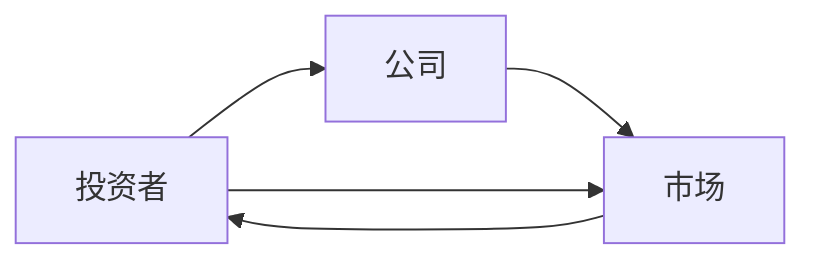

                 


# {{费雪的全球化投资视角}}

> 关键词：{{费雪, 投资理论, 全球化, 价值投资, 投资模型}}

> 摘要：{{本文深入探讨了费雪的全球化投资视角，从其投资理论的背景到核心概念，再到算法原理和系统设计，最后通过项目实战和最佳实践，全面剖析了费雪投资理论在现代全球化投资环境中的应用。}}

## 第一章: 费雪投资理论的背景与核心观点

### 1.1 费雪投资理论的起源与发展

#### 1.1.1 价值投资的起源
费雪的投资理论起源于20世纪初，其核心是寻找那些具有持续增长潜力的公司进行投资。费雪强调长期投资和基本面分析，认为市场先生是价格的提供者，而非价值的决定者。

#### 1.1.2 费雪投资理论的核心思想
- **价值投资**：寻找那些具有优秀管理和强大竞争优势的公司，长期持有，等待价值实现。
- **成长股投资**：关注那些收入和利润持续增长的公司，而不是仅仅关注低市盈率的股票。
- **安全边际**：在投资时，确保买入价格低于内在价值，以降低风险。

#### 1.1.3 全球化对投资的影响
随着全球经济一体化的深入，投资者可以跨越国界进行投资，全球化为投资者提供了更多的机会和挑战。费雪的投资理论在这一背景下，需要结合全球经济环境进行调整和优化。

### 1.2 费雪投资理论的核心观点

#### 1.2.1 投资的本质与目标
投资的本质是通过购买资产，获得未来的现金流。投资的目标是通过长期持有的优质资产，实现财富的增值。

#### 1.2.2 费雪的成长股投资策略
费雪认为，投资应该关注那些具有持续增长潜力的公司。他提出了“十倍股”的概念，即找到那些能够在未来几年内收入和利润增长十倍以上的公司。

#### 1.2.3 费雪投资理论的现代应用
在全球化背景下，费雪的投资理论需要结合全球经济环境进行调整。例如，在选择投资标的时，需要考虑全球经济周期、国际贸易政策、汇率波动等因素。

### 1.3 全球化投资视角的引入

#### 1.3.1 全球化对投资的影响
全球化使得投资者可以投资于全球范围内的资产，这为投资者提供了更多的机会，同时也增加了复杂性。例如，投资者需要考虑不同国家的经济政策、法律法规、市场环境等因素。

#### 1.3.2 全球化投资视角的核心特点
- **多元化**：通过投资于不同的国家和行业，降低风险。
- **全球化视角**：关注全球经济趋势，寻找具有全球竞争优势的公司。
- **跨国投资**：在不同的国家寻找投资机会，优化资产配置。

#### 1.3.3 费雪理论与全球化投资的结合
将费雪的价值投资和成长股投资策略应用到全球化的投资环境中，需要结合全球经济趋势、行业周期、公司基本面等因素，寻找具有全球竞争优势的公司。

### 1.4 本章小结

## 第二章: 费雪投资理论的核心概念与联系

### 2.1 费雪投资理论的核心概念

#### 2.1.1 投资的定义与分类
- **投资**：将资金投入某种资产，期望在未来获得收益。
- **分类**：根据资产类型可以分为股票、债券、房地产等；根据投资期限可以分为短期投资和长期投资。

#### 2.1.2 费雪的成长股投资策略
费雪的成长股投资策略强调投资于那些具有持续增长潜力的公司，重点关注公司的收入和利润增长率。

#### 2.1.3 费雪的安全边际概念
安全边际是指买入价格低于公司的内在价值，以确保即使在市场波动的情况下，投资仍然能够获得正收益。

### 2.2 费雪投资理论与全球化投资的联系

#### 2.2.1 全球化视角下的投资机会
- **跨国公司**：投资于具有全球竞争优势的公司，这些公司能够在全球经济中获得更高的增长。
- **全球化产业**：关注那些在全球范围内具有增长潜力的行业，如科技、医疗、绿色能源等。

#### 2.2.2 费雪理论在跨国投资中的应用
- **跨国公司分析**：分析跨国公司的基本面，包括收入、利润、管理团队等。
- **全球化视角下的行业分析**：关注那些在全球范围内具有竞争优势的行业和公司。

#### 2.2.3 全球化对投资风险的影响
- **汇率风险**：不同国家的货币波动会影响投资收益。
- **政治风险**：不同国家的政治环境和政策变化会影响投资。
- **经济周期**：全球经济周期会影响不同国家和行业的投资表现。

### 2.3 费雪投资理论的实体关系图

#### 2.3.1 实体关系图


## 第三章: 费雪投资理论的算法原理

### 3.1 费雪投资模型的数学模型

#### 3.1.1 费雪模型的基本公式
$$ V = \frac{E}{k} $$
其中，V是公司的内在价值，E是公司未来产生的现金流，k是折现率。

#### 3.1.2 现金流的计算
现金流的计算需要考虑公司的收入、成本、税收等因素。例如，公司的自由现金流可以表示为：
$$ FCFF = EBIT(1 - t) + D(1 - t) - CapEx $$
其中，EBIT是息税前利润，t是税率，D是折旧，CapEx是资本 expenditures。

### 3.2 费雪模型的算法流程

#### 3.2.1 算法流程图


#### 3.2.2 Python代码实现
```python
def fisher_value_estimation(earnings, discount_rate):
    # 计算
    pass
```

### 3.3 费雪模型的Python实现

#### 3.3.1 代码示例
```python
def fisher_value_estimation(earnings, discount_rate):
    # 计算
    return value
```

#### 3.3.2 代码解读
- `fisher_value_estimation`函数接受两个参数：`earnings`（收益）和 `discount_rate`（折现率）。
- 函数内部需要计算公司的内在价值，使用费雪模型的公式。
- 返回计算出的内在价值。

## 第四章: 费雪投资理论的系统分析与架构设计

### 4.1 系统功能设计

#### 4.1.1 系统功能模块
- **数据采集**：收集公司的财务数据和市场数据。
- **模型计算**：使用费雪模型计算公司的内在价值。
- **风险评估**：评估投资的风险，包括市场风险、汇率风险等。
- **投资决策**：根据计算结果和风险评估，做出投资决策。

#### 4.1.2 系统功能模块图


### 4.2 系统架构设计

#### 4.2.1 系统架构图


#### 4.2.2 系统交互流程


## 第五章: 费雪投资理论的项目实战

### 5.1 环境安装

#### 5.1.1 Python安装
- 下载并安装Python。
- 安装必要的库，如pandas、numpy、matplotlib等。

#### 5.1.2 数据源获取
- 获取公司财务数据，可以从Yahoo Finance等网站获取。

### 5.2 系统核心实现

#### 5.2.1 数据采集
```python
import pandas as pd
import requests

def get_financial_data(ticker):
    # 获取数据
    pass
```

#### 5.2.2 模型计算
```python
def fisher_value_estimation(earnings, discount_rate):
    # 计算
    pass
```

#### 5.2.3 风险评估
```python
def risk_assessment(value, risk_free_rate):
    # 计算
    pass
```

### 5.3 项目小结

## 第六章: 费雪投资理论的最佳实践

### 6.1 小结

### 6.2 注意事项

### 6.3 拓展阅读

---

## 附录

### 附录A: 全球化投资中的风险管理

### 附录B: 费雪投资模型的详细计算

---

## 参考文献

---

通过以上章节的内容，我们可以全面了解费雪的全球化投资视角，并将其应用于实际的投资决策中。

