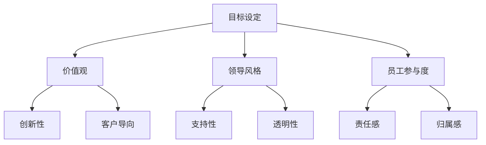
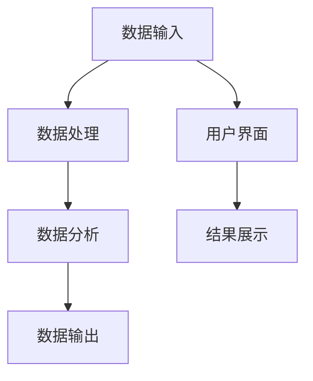

                 

# 《费雪的公司文化评估：优秀企业的隐形资产》

---

## 关键词

- 费雪公司文化评估
- 无形资产
- 组织文化
- 企业绩效
- 管理模型

---

## 摘要

本书深入探讨了公司文化作为企业隐形资产的重要性，重点介绍了费雪的公司文化评估方法。通过系统化的理论框架、数学模型和实际案例，详细阐述了如何评估和优化企业文化，以提升企业绩效和竞争力。书中结合理论与实践，为管理者提供了实用的工具和策略。

---

## 第1章 公司文化的定义与价值

### 1.1 公司文化的定义与内涵

公司文化是指企业在长期发展过程中形成的一套核心价值观、行为准则、管理风格和企业精神。它涵盖了企业的物质层、制度层和精神层，是企业的灵魂和凝聚力所在。

- **物质层**：包括企业标识、办公环境、员工福利等。
- **制度层**：涉及企业制度、管理流程、组织结构。
- **精神层**：体现企业愿景、使命、核心价值观。

### 1.2 公司文化作为隐形资产的核心价值

- **对企业绩效的影响**：文化决定了员工的行为方式，影响企业战略执行和创新能力。
- **竞争优势**：优秀的企业文化能够吸引和留住人才，增强企业的市场竞争力。
- **可持续发展**：健康的企业文化是企业长期发展的基础。

### 1.3 费雪公司文化评估的背景与意义

- **背景**：随着市场竞争加剧，企业文化的重要性日益凸显，传统的评估方法已无法满足需求。
- **意义**：费雪评估方法通过系统化的模型，帮助企业识别和优化文化问题，提升整体竞争力。

---

## 第2章 费雪文化评估模型的理论基础

### 2.1 费雪评估模型的理论基础

- **理论基础**：结合组织行为学、管理学和战略管理，构建了多维度的评估体系。
- **模型特点**：系统性、科学性、可操作性。

### 2.2 费雪评估模型的维度分解

- **核心维度**：目标设定、价值观、领导风格、员工参与度。
- **各维度定义与测量指标**：
  - **目标设定**：明确性、挑战性。
  - **价值观**：创新性、客户导向。
  - **领导风格**：支持性、透明性。
  - **员工参与度**：责任感、归属感。

### 2.3 费雪评估模型的数学表达

使用 Mermaid 绘制的文化评估维度关系图：

---

## 第3章 费雪文化评估的数学模型

### 3.1 评估模型的构建逻辑

- **权重确定**：基于行业特点和企业需求，确定各维度的权重。
- **数据收集**：通过问卷、访谈、数据分析等方法收集数据。

### 3.2 评估模型的数学公式

- **综合评分公式**：
  $$ C = \sum_{i=1}^{n} w_i \cdot s_i $$
  其中，\( w_i \) 是第 \( i \) 个维度的权重，\( s_i \) 是评分。

---

## 第4章 费雪公司文化评估的系统分析与架构设计

### 4.1 系统分析

- **问题场景**：企业面临文化问题，如员工士气低、创新不足。
- **系统功能设计**：构建文化评估系统，提供数据采集、分析和反馈功能。

### 4.2 系统架构设计

使用 Mermaid 绘制的系统架构图：

---

## 第5章 费雪公司文化评估的项目实战

### 5.1 环境安装

- **工具选择**：使用问卷星进行数据收集，Excel或Python进行数据分析。

### 5.2 核心实现

- **数据收集**：设计问卷，涵盖目标设定、价值观等维度。
- **数据分析**：使用Python进行数据清洗和评分计算。

### 5.3 案例分析

- **案例背景**：某科技公司面临创新不足的问题。
- **评估过程**：收集数据，分析各维度评分，找出瓶颈。
- **结果解读**：发现领导风格不够支持创新，提出改进建议。

---

## 第6章 总结与展望

### 6.1 总结

- **核心观点**：公司文化是隐形资产，费雪评估方法提供了科学的评估工具。
- **最佳实践**：持续优化文化，领导层发挥关键作用。

### 6.2 未来展望

- **研究方向**：动态文化评估模型、多因素评估模型。
- **应用扩展**：将文化评估与企业社会责任、ESG指标结合。

---

## 参考文献

- [1] 费雪, 《公司文化评估方法》
- [2] 约翰逊, 《组织行为学》
- [3] 斯特克, 《战略管理》

---

**注意**：以上内容为书籍目录大纲，实际写作时需要根据每个章节添加详细内容，包括理论、公式、图表和案例分析。

