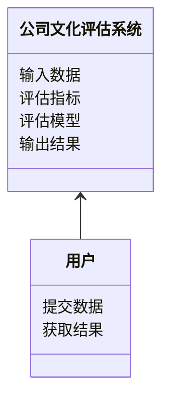
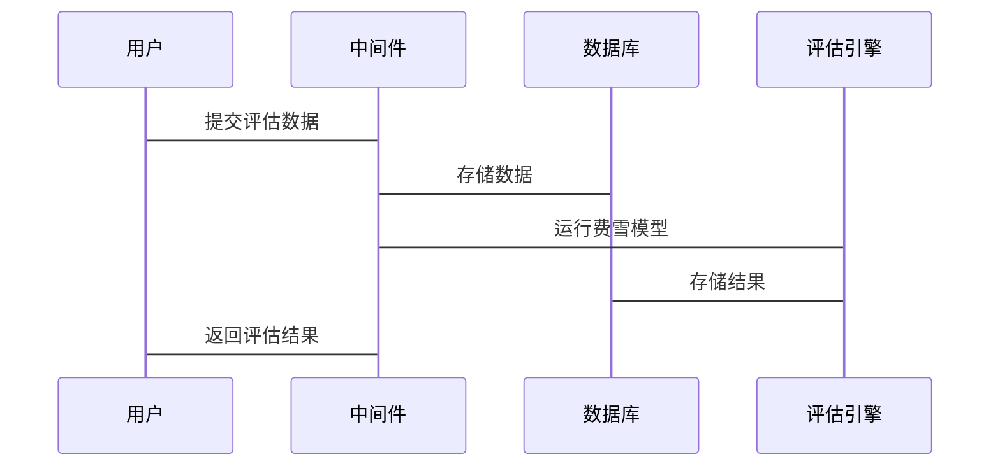

                 


# 费雪的公司文化评估：长期成功的基石

## 关键词：
- 公司文化评估
- 费雪评估方法
- 企业文化管理
- 企业长期成功
- 企业文化建设

## 摘要：
公司文化是企业成功的关键因素之一，而有效的文化评估是改善和优化文化的基石。费雪的公司文化评估方法以其系统性和科学性著称，为企业提供了从理论到实践的全面指导。本文将深入探讨费雪的评估方法，分析其核心理论、系统架构、实际应用案例，并总结其对企业长期成功的意义。

---

## 第1章: 公司文化评估的背景与重要性

### 1.1 公司文化评估的定义与核心概念

#### 1.1.1 公司文化的定义
公司文化是指企业在长期的经营活动中形成的，由价值观、信念、行为规范和工作方式构成的独特氛围。它是企业的灵魂，影响着员工的行为、决策和整体绩效。

#### 1.1.2 公司文化评估的定义
公司文化评估是对企业文化的现状进行全面分析的过程，旨在识别文化中的优势和问题，并为改进提供数据支持。

#### 1.1.3 公司文化评估的核心要素
- 价值观与使命：企业的核心价值观和长期使命。
- 领导风格：领导者的管理方式和决策风格。
- 员工关系：员工之间的互动和团队协作。
- 沟通机制：信息传递和反馈的效率。
- 绩效文化：对目标和成果的重视程度。

### 1.2 费雪的公司文化评估方法

#### 1.2.1 费雪评估方法的特点
费雪的评估方法注重数据驱动和系统性分析，通过定量和定性相结合的方式，全面评估公司的文化健康状况。

#### 1.2.2 费雪评估方法的应用场景
- 新公司成立：帮助塑造良好的初始文化。
- 并购后整合：评估和整合不同企业文化。
- 文化冲突解决：诊断和解决内部文化矛盾。

### 1.3 公司文化评估的背景与重要性

#### 1.3.1 当前企业面临的文化挑战
- 价值观冲突：员工对公司目标和价值观的认同不足。
- 领导力问题：管理者风格影响团队氛围。
- 沟通不畅：信息传递不畅导致效率低下。

#### 1.3.2 公司文化评估对企业长期成功的影响
- 提升员工满意度和忠诚度。
- 优化决策过程，提高企业绩效。
- 增强企业的凝聚力和竞争力。

#### 1.3.3 费雪评估方法的行业影响
费雪的评估方法被广泛应用于跨国公司和大型企业，成为企业文化管理的重要工具。

---

## 第2章: 费雪公司文化评估的核心理论

### 2.1 费雪的公司文化评估模型

#### 2.1.1 费雪模型的构成
费雪模型由以下几个核心部分组成：
1. **文化价值观评估**：分析企业核心价值观的认同度和实践情况。
2. **领导风格分析**：评估领导者的决策风格和管理方式。
3. **员工关系评估**：考察员工之间的互动和团队协作。
4. **沟通机制评估**：评估信息传递的效率和透明度。
5. **绩效文化评估**：分析企业对目标和成果的重视程度。

#### 2.1.2 费雪模型的逻辑框架
通过费雪模型，企业可以系统地分析文化中的各个要素，找出潜在的问题，并制定改进策略。

#### 2.1.3 费雪模型的核心假设
- 公司文化的各个要素相互关联，共同影响企业绩效。
- 领导风格和员工关系是文化健康的关键因素。

### 2.2 费雪评估方法的关键步骤

#### 2.2.1 问题背景分析
在进行文化评估之前，需要明确评估的目的和范围，确保评估的针对性。

#### 2.2.2 数据收集与分析
- **定量数据**：通过员工调查和绩效数据分析，获取客观数据。
- **定性数据**：通过访谈和观察，获取主观感受和具体案例。

#### 2.2.3 评估结果解读
将收集到的数据进行整理和分析，识别文化中的优势和问题，制定改进计划。

### 2.3 费雪评估方法的数学模型

#### 2.3.1 评估指标的权重分配
每个评估指标都有一个权重，表示其对整体文化健康的重要程度。例如：

| 指标       | 权重 |
|------------|------|
| 领导风格   | 30%  |
| 员工关系   | 25%  |
| 沟通机制   | 20%  |
| 绩效文化   | 25%  |

#### 2.3.2 数学公式与模型
费雪评估方法的综合指数计算公式如下：

$$
\text{文化评估指数} = \sum_{i=1}^{n} w_i \cdot x_i
$$

其中，$w_i$ 是第 $i$ 个指标的权重，$x_i$ 是第 $i$ 个指标的评估值。

---

## 第3章: 公司文化评估的系统分析与架构设计

### 3.1 系统分析

#### 3.1.1 问题场景介绍
假设某公司面临员工士气低落、团队协作不佳的问题，希望通过文化评估找到问题的根源。

#### 3.1.2 领域模型（Mermaid 类图）



### 3.2 系统架构设计

#### 3.2.1 系统架构（Mermaid 架构图）


### 3.3 系统接口设计

#### 3.3.1 输入接口
- 接收员工调查数据和绩效数据。
- 接收领导风格评估数据。

#### 3.3.2 输出接口
- 提供文化评估指数和问题诊断报告。
- 提供改进建议和行动计划。

#### 3.3.3 系统交互（Mermaid 序列图）



---

## 第4章: 费雪文化评估方法的实际应用

### 4.1 项目实战

#### 4.1.1 环境安装
- 安装数据分析工具（如Python、R）。
- 配置数据库和中间件。

#### 4.1.2 系统核心实现源代码
以下是一个简单的费雪评估模型的Python代码示例：

```python
def fisher_culture_assessment(data, weights):
    # 计算每个指标的加权值
    weighted_scores = {}
    for i in range(len(data)):
        weighted_scores[i] = data[i] * weights[i]
    # 计算总指数
    total_index = sum(weighted_scores.values())
    return total_index

# 示例数据
data = [8, 7, 6, 9]
weights = [0.3, 0.25, 0.2, 0.25]

# 调用函数
result = fisher_culture_assessment(data, weights)
print("文化评估指数:", result)
```

#### 4.1.3 代码应用解读与分析
- **输入数据**：员工调查结果和绩效数据。
- **权重分配**：根据每个指标的重要性分配权重。
- **计算过程**：对每个指标进行加权计算，求和得到总指数。
- **结果输出**：提供文化评估指数和问题诊断报告。

---

## 第5章: 案例分析与最佳实践

### 5.1 案例分析

#### 5.1.1 案例背景
某高科技公司面临员工流失率高、团队协作效率低的问题。

#### 5.1.2 评估过程
- 进行员工满意度调查。
- 分析领导风格和沟通机制。
- 评估绩效文化。

#### 5.1.3 改进措施
- 提高领导透明度和员工参与度。
- 优化沟通机制，建立定期反馈渠道。
- 强化绩效文化，设立明确的目标和奖励机制。

### 5.2 最佳实践 tips

#### 5.2.1 定期评估
建议企业每年进行一次文化评估，及时发现问题并进行调整。

#### 5.2.2 员工参与
鼓励员工积极参与评估过程，增强他们的主人翁意识。

#### 5.2.3 持续改进
文化评估不是终点，而是持续改进的起点。企业应根据评估结果，制定并实施改进计划。

---

## 第6章: 总结与展望

### 6.1 本章小结
费雪的公司文化评估方法为企业提供了系统化、科学化的评估工具，帮助企业识别文化问题并制定改进策略，从而提升企业的长期成功能力。

### 6.2 未来展望
随着企业面临的挑战日益复杂，文化评估方法也将不断进化。未来的研究可能会更加注重动态评估和实时反馈，以适应快速变化的商业环境。

---

## 结语
公司文化是企业的灵魂，而费雪的评估方法为我们提供了一种系统化、科学化的工具，帮助我们更好地理解和优化企业文化。通过定期评估和持续改进，企业可以构建积极、健康的文化氛围，为长期成功奠定坚实的基础。

