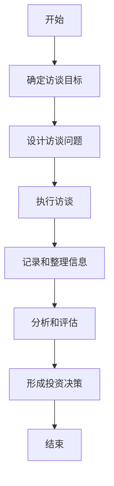
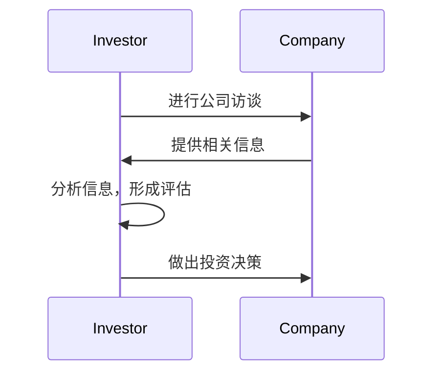
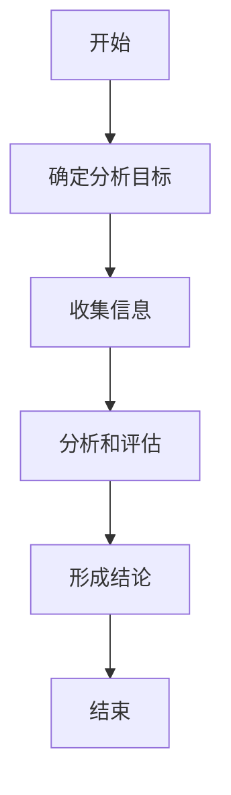
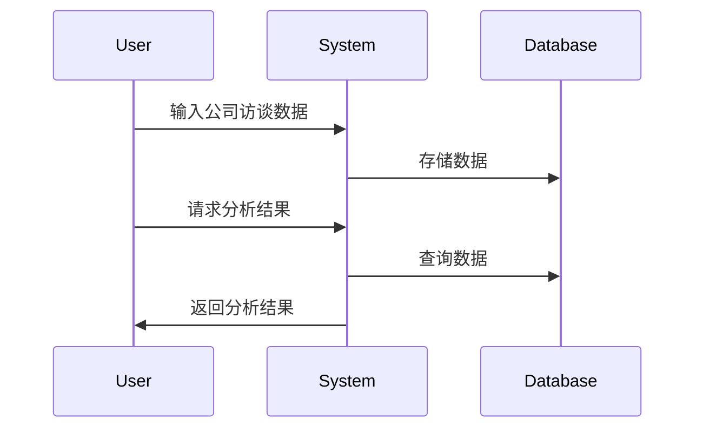

                 


# 《费雪的公司访谈技巧》正文

## 第一部分: 公司访谈的背景与重要性

### 第1章: 公司访谈的定义与背景

#### 1.1 公司访谈的定义

公司访谈是指投资者与公司管理层、员工、客户或其他相关方进行的面对面交流，以获取关于公司业务、财务状况、市场地位、竞争优势等关键信息的过程。这种交流有助于投资者全面评估公司的投资价值和潜在风险。

##### 1.1.1 访谈的定义与分类

- **定义**：公司访谈是一种信息收集和评估方法，通过直接对话获取公司内部和外部信息，帮助投资者做出更明智的投资决策。
- **分类**：
  - **管理层访谈**：与公司高层讨论战略、财务和经营状况。
  - **员工访谈**：了解公司文化和内部管理情况。
  - **客户访谈**：获取市场反馈和竞争信息。
  - **供应商访谈**：评估供应链稳定性和成本结构。

##### 1.1.2 公司访谈的背景与作用

随着全球经济的发展，投资者面临的市场环境日益复杂。公司访谈作为一种重要的信息获取手段，在投资决策中扮演着关键角色。通过访谈，投资者可以更深入地了解公司的经营状况、管理团队的素质以及未来的发展潜力。

##### 1.1.3 公司访谈与投资决策的关系

公司访谈是投资决策的重要组成部分。通过访谈，投资者能够验证财务报表中的数据，评估管理层的诚信和能力，了解公司的市场地位和竞争优势。这些信息有助于投资者做出更准确的估值和投资决策。

#### 1.2 公司访谈的核心概念

##### 1.2.1 投资者与被投公司的关系

投资者与被投公司之间是基于利益的互动关系。投资者通过访谈了解公司的情况，而公司则希望通过良好的表现吸引投资者的关注和资金支持。

##### 1.2.2 公司访谈的类型与场景

- **类型**：
  - **初步访谈**：用于初步了解公司情况，筛选潜在投资目标。
  - **深入访谈**：针对特定问题进行详细探讨，验证关键信息。
  - **后续访谈**：在投资后跟踪公司进展，评估投资效果。
- **场景**：
  - 初次接触：投资者与公司初步交流，了解基本情况。
  - 尽职调查：在投资前对目标公司进行详细调查。
  - 投资后管理：监控投资公司的发展，及时调整策略。

##### 1.2.3 公司访谈的边界与外延

- **边界**：公司访谈的范围通常限于公司内部信息，如财务数据、业务模式、管理团队等。
- **外延**：通过访谈获取的信息可能扩展到外部环境，如市场需求、行业趋势、竞争状况等。

#### 1.3 公司访谈的背景介绍

##### 1.3.1 投资环境的变化与公司访谈的需求

随着市场的波动和经济环境的变化，投资者需要更灵活和高效的信息获取方式。公司访谈作为一种动态的信息收集手段，能够帮助投资者及时适应市场变化。

##### 1.3.2 公司访谈在投资决策中的地位

公司访谈是投资决策的核心环节之一。通过访谈，投资者可以验证财务数据的真实性，评估管理层的诚信和能力，了解公司的市场地位和竞争优势。

##### 1.3.3 公司访谈与基本面分析的关系

基本面分析主要依赖财务数据和市场数据，而公司访谈可以提供额外的定性信息，如管理层的战略规划、公司文化等，从而丰富分析内容。

#### 1.4 本章小结

本章介绍了公司访谈的定义、类型、背景和作用，强调了其在投资决策中的重要性。通过公司访谈，投资者可以更全面地了解公司的情况，做出更明智的投资决策。

---

## 第二部分: 公司访谈的核心概念与联系

### 第2章: 公司访谈的核心概念

#### 2.1 公司访谈的核心要素

##### 2.1.1 公司访谈的核心要素组成

- **核心要素**：
  - 信息获取：通过访谈获取公司内部和外部信息。
  - 信息验证：通过多源信息交叉验证，确保信息的准确性。
  - 战略分析：分析公司的战略规划和执行能力。
  - 风险评估：识别和评估公司的潜在风险。

##### 2.1.2 核心要素的属性特征对比

| 核心要素       | 属性特征 |
|----------------|----------|
| 信息获取       | 直接性、真实性 |
| 信息验证       | 全面性、交叉性 |
| 战略分析       | 系统性、前瞻性 |
| 风险评估       | 综合性、动态性 |

##### 2.1.3 核心要素的ER实体关系图

```mermaid
erd
  company(C_name, C_id, C_sector)
  interviewee(I_name, I_role, I_id)
  interview(I_id, C_id, I_date, I_findings)
  foreign key(I_id) references interviewee(I_id)
  foreign key(C_id) references company(C_id)
```

---

#### 2.2 公司访谈的核心概念原理

##### 2.2.1 核心概念的原理分析

公司访谈通过系统化的信息收集和分析，帮助投资者全面评估公司的投资价值。其原理包括信息的多源验证、管理层的战略分析和风险评估。

##### 2.2.2 核心概念的数学模型与公式

公司访谈的价值评估可以表示为：

$$
\text{投资价值} = \sum (\text{财务数据} \times \text{权重}) + \sum (\text{定性因素} \times \text{权重})
$$

其中，定性因素包括管理层能力、公司文化和市场地位等。

##### 2.2.3 核心概念的流程图分析



---

#### 2.3 公司访谈的核心概念联系

##### 2.3.1 核心概念之间的关系

公司访谈的核心概念包括信息获取、信息验证、战略分析和风险评估。这些概念相互关联，共同构成了完整的评估体系。

##### 2.3.2 核心概念的系统架构图


##### 2.3.3 核心概念的交互图分析



#### 2.4 本章小结

本章深入探讨了公司访谈的核心要素及其关系，分析了其在投资决策中的作用和原理。通过系统化的信息收集和分析，投资者可以更准确地评估公司的投资价值。

---

## 第三部分: 公司访谈的系统分析与架构设计

### 第3章: 公司访谈的系统分析

#### 3.1 公司访谈的系统分析框架

##### 3.1.1 系统分析的定义与作用

系统分析是通过系统的方法对问题进行研究，以找到最优解决方案。在公司访谈中，系统分析可以帮助投资者全面评估公司的情况。

##### 3.1.2 公司访谈的系统分析方法

- **步骤**：
  1. 确定分析目标。
  2. 收集相关信息。
  3. 分析和评估。
  4. 形成结论。

##### 3.1.3 系统分析的流程与步骤



#### 3.2 公司访谈的系统功能设计

##### 3.2.1 项目介绍

公司访谈系统旨在帮助投资者系统化地收集和分析公司信息，提高投资决策的效率和准确性。

##### 3.2.2 系统功能设计

- **功能模块**：
  - 信息收集模块：收集公司访谈数据。
  - 数据分析模块：对收集的信息进行分析和评估。
  - 投资决策模块：基于分析结果形成投资决策。

##### 3.2.3 系统架构设计


##### 3.2.4 系统接口设计

- **接口**：
  - 用户输入接口：收集访谈数据。
  - 数据处理接口：分析和评估数据。
  - 输出接口：展示分析结果。

##### 3.2.5 系统交互图分析



#### 3.3 本章小结

本章通过系统分析的方法，设计了公司访谈的系统架构和功能模块，为投资者提供了高效的工具和方法。

---

## 第四部分: 公司访谈的项目实战

### 第4章: 公司访谈的项目实战

#### 4.1 项目介绍

本章通过实际案例，展示公司访谈在投资决策中的应用。

#### 4.2 项目核心实现

##### 4.2.1 环境安装

- **工具**：使用Python进行数据分析，使用Mermaid进行图表绘制。

##### 4.2.2 核心代码实现

```python
# 数据收集函数
def collect_data():
    # 模拟公司访谈数据
    data = {
        '公司名称': ['公司A', '公司B'],
        '财务状况': [100, 200],
        '市场地位': ['领先', '竞争']
    }
    return data

# 数据分析函数
def analyze_data(data):
    for company in data['公司名称']:
        print(f"{company} 的财务状况是 {data['财务状况'][data['公司名称'].index(company)]}")

# 主函数
def main():
    data = collect_data()
    analyze_data(data)

if __name__ == "__main__":
    main()
```

##### 4.2.3 代码应用解读与分析

- **代码解读**：
  - `collect_data()`函数用于收集公司访谈数据。
  - `analyze_data()`函数对数据进行分析和展示。
  - `main()`函数调用上述函数，完成数据分析。

##### 4.2.4 系统功能展示

- **功能**：
  - 数据收集：从公司访谈中获取数据。
  - 数据分析：对数据进行整理和分析。
  - 结果展示：输出分析结果。

#### 4.3 项目小结

本章通过实际案例展示了公司访谈的系统化应用，验证了其在投资决策中的有效性。

---

## 第五部分: 公司访谈的最佳实践

### 第5章: 公司访谈的最佳实践

#### 5.1 最佳实践

##### 5.1.1 访谈前的准备

- **目标明确**：明确访谈的目的和问题。
- **资料收集**：收集公司的背景资料，制定访谈提纲。

##### 5.1.2 访谈中的技巧

- **倾听为主**：多听少说，获取更多信息。
- **追问细节**：针对关键问题进行深入探讨。

##### 5.1.3 访谈后的总结

- **整理记录**：及时整理访谈记录，分析和总结。

#### 5.2 小结

公司访谈是一项需要精心准备和技巧的工作。通过充分的准备和有效的沟通，投资者可以更准确地评估公司的投资价值。

#### 5.3 注意事项

- **时间管理**：合理安排访谈时间，避免信息遗漏。
- **对象选择**：选择合适的访谈对象，确保信息的全面性。

#### 5.4 拓展阅读

建议阅读《费雪的投资哲学》和《公司治理与风险管理》，以进一步了解公司访谈的深入应用。

---

## 附录

### 附录A: 访谈问题示例

- 管理层访谈问题：
  - 公司的市场定位和战略目标是什么？
  - 公司的核心竞争力体现在哪些方面？

- 员工访谈问题：
  - 公司的文化氛围如何？
  - 员工对公司的满意度如何？

### 附录B: 访谈记录模板

| 访谈日期 | 访谈对象 | 访谈内容 | 记录人 |
|----------|----------|----------|--------|
|          |          |          |        |

### 附录C: 指数和公式

- 投资价值公式：

$$
\text{投资价值} = \sum (\text{财务指标} \times \text{权重}) + \sum (\text{非财务因素} \times \text{权重})
$$

### 附录D: 访谈技巧

- **建立信任**：通过友好交流建立信任关系。
- **主动倾听**：认真倾听并理解对方的观点。
- **清晰表达**：明确表达自己的问题和观点。

### 附录E: 术语表

- **公司访谈**：投资者与公司相关人员进行的面对面交流，以获取公司信息。
- **核心要素**：公司访谈中关键的评估因素，如财务状况、管理层能力等。

---

## 参考文献

1. 费雪.《成长股投资》
2. 彼得·林奇.《投资的成功公式》
3. 约翰·坦布尔.《公司治理与风险管理》

---

**全文小结**

《费雪的公司访谈技巧》系统地介绍了公司访谈的定义、核心概念、系统分析、项目实战和最佳实践。通过丰富的案例和详细的分析，本书为投资者提供了高效的信息收集和评估方法，帮助他们在复杂多变的市场环境中做出更明智的投资决策。

