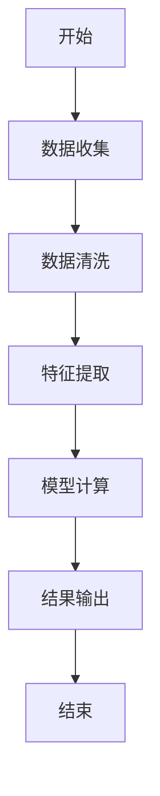

                 


# 费雪的公司调研技巧

> 关键词：费雪、公司调研、投资策略、价值评估、管理层分析、财务分析

> 摘要：本文深入探讨了费雪的公司调研技巧，分析其投资理念的核心要素，详细讲解了公司调研的关键指标和方法，结合数学模型和实际案例，展示了如何运用这些技巧进行有效的投资决策。文章从背景介绍、核心概念、算法原理、系统架构到项目实战，层层递进，为读者提供了全面的指导。

---

# 第1章: 费雪投资理念的背景与核心思想

## 1.1 费雪投资哲学的起源

### 1.1.1 费雪的投资理念概述

菲利普·费雪（Philip Fisher）是20世纪著名的投资专家，被誉为“成长型投资之父”。他的投资理念强调对公司基本面的深入研究，尤其是对公司管理层和竞争优势的分析。费雪认为，成功的投资取决于对公司的深入了解，而不是仅仅依赖市场波动。

### 1.1.2 费雪对公司调研的重视

费雪认为，投资的核心在于对公司未来表现的预测。他强调，投资者必须对公司进行深入的调研，了解其商业模式、财务状况和管理层的质量。他提出，投资的最终目标是找到那些具有持续增长潜力的公司。

### 1.1.3 费雪投资哲学的核心要素

1. **长期增长**：费雪关注的是公司长期的盈利能力，而不是短期的股价波动。
2. **管理层质量**：他认为，优秀的管理层是公司成功的关键。
3. **竞争优势**：公司必须具备独特的竞争优势，才能在市场中持续发展。

---

## 1.2 费雪投资策略的背景

### 1.2.1 费雪投资策略的形成背景

20世纪30年代，全球经济大萧条期间，费雪的投资理念逐渐成型。他通过研究市场的波动和公司的基本面，提出了价值投资的概念。他的策略强调对公司进行深入调研，寻找那些被市场低估的优质公司。

### 1.2.2 费雪与价值投资的联系与区别

- **联系**：费雪与本杰明·格雷厄姆同为价值投资的代表人物，他们都强调对公司基本面的分析。
- **区别**：费雪更注重公司的成长性和管理层的质量，而格雷厄姆更关注市场的短期波动和安全边际。

### 1.2.3 费雪投资策略的演变与影响

费雪的投资策略对后世影响深远，尤其是对成长型投资的兴起起到了关键作用。他的方法被广泛应用于机构投资和个人投资中。

---

## 1.3 费雪公司调研的核心思想

### 1.3.1 费雪对公司调研的定义

公司调研是指对公司的财务状况、管理层质量、竞争优势和市场地位等进行全面分析，以评估其投资价值。

### 1.3.2 费雪调研的核心要素

1. **管理层质量**：管理层的决策能力和诚信是公司成功的关键。
2. **财务状况**：公司是否具备健康的财务状况，能否持续盈利。
3. **竞争优势**：公司是否具备独特的竞争优势，能够在市场中长期发展。

### 1.3.3 费雪调研方法的逻辑框架

1. **确定投资目标**：明确投资目标和风险偏好。
2. **选择行业**：选择具有增长潜力的行业。
3. **筛选公司**：通过财务指标和管理层分析，筛选出具备投资价值的公司。
4. **长期跟踪**：持续跟踪公司的表现，及时调整投资策略。

---

# 第2章: 公司调研的核心要素与关键指标

## 2.1 公司管理层的质量评估

### 2.1.1 管理层的背景与经验分析

- **背景**：管理层的教育背景、工作经历和行业经验。
- **经验**：是否有成功的管理经验，特别是在行业内的经验。

### 2.1.2 管理层的决策风格与战略规划

- **决策风格**：是保守还是激进，是否注重长期发展。
- **战略规划**：是否有明确的长期目标和实现路径。

### 2.1.3 管理层的诚信与道德标准

- **诚信**：管理层是否诚实守信，是否有违法违规记录。
- **道德标准**：是否注重企业社会责任。

---

## 2.2 公司财务状况的分析

### 2.2.1 财务报表的核心指标解读

- **收入与利润**：营业收入、净利润、毛利率。
- **资产负债表**：资产、负债、所有者权益。
- **现金流量表**：经营活动、投资活动、筹资活动的现金流。

### 2.2.2 费雪对ROE（净资产收益率）的重视

ROE（净资产收益率）是衡量公司盈利能力的重要指标。费雪认为，ROE越高，公司的盈利能力越强。

$$
\text{ROE} = \frac{\text{净利润}}{\text{净资产}} 
$$

### 2.2.3 费雪对市盈率的合理区间判断

市盈率（P/E）是衡量公司估值的重要指标。费雪认为，市盈率不应过高，否则公司可能被高估。

$$
\text{P/E} = \frac{\text{股价}}{\text{每股收益}}
$$

---

## 2.3 公司竞争优势的评估

### 2.3.1 行业地位与市场竞争力

- **市场占有率**：公司在行业中的地位。
- **竞争格局**：行业内的主要竞争对手。

### 2.3.2 核心技术与创新能力

- **技术优势**：公司是否拥有独特的技术。
- **创新能力**：公司是否能够持续创新，推出新产品。

### 2.3.3 供应链与成本控制能力

- **供应链管理**：公司是否能够有效管理供应链，降低成本。
- **成本控制**：公司是否具备成本优势。

---

# 第3章: 费雪公司调研方法的数学模型与算法原理

## 3.1 费雪调研方法的数学模型

### 3.1.1 费雪投资模型的公式推导

$$
\text{费雪模型} = \text{管理层质量} \times \text{财务健康度} \times \text{竞争优势强度}
$$

### 3.1.2 费雪模型的变量解释

- **管理层质量**：评分范围为1到5分。
- **财务健康度**：评分范围为1到5分。
- **竞争优势强度**：评分范围为1到5分。

### 3.1.3 费雪模型的优缺点分析

- **优点**：模型简单明了，易于理解和应用。
- **缺点**：模型过于简化，忽略了其他重要因素。

---

## 3.2 费雪调研方法的算法流程

### 3.2.1 数据收集与预处理

1. 收集公司的财务报表、管理层信息和行业数据。
2. 清洗数据，去除无效数据和异常值。

### 3.2.2 数据分析与特征提取

1. 计算财务指标，如ROE、P/E。
2. 评估管理层质量和竞争优势强度。

### 3.2.3 模型计算与结果输出

1. 输入数据，计算费雪模型的得分。
2. 输出结果，评估公司的投资价值。

---

## 3.3 费雪调研方法的mermaid流程图



---

# 第4章: 费雪调研方法

## 4.1 费雪调研方法的系统分析

### 4.1.1 问题场景介绍

假设我们是一家投资机构，希望通过费雪的调研方法筛选出具有投资价值的公司。

### 4.1.2 系统功能设计

- **数据输入**：收集公司的财务数据和管理层信息。
- **数据处理**：清洗数据，提取特征。
- **模型计算**：计算费雪模型的得分。
- **结果输出**：输出公司的投资价值评估报告。

---

## 4.2 费雪调研方法的系统架构设计

### 4.2.1 系统架构图


### 4.2.2 系统接口设计

- **输入接口**：接受公司的财务数据和管理层信息。
- **输出接口**：输出公司的投资价值评估报告。

---

## 4.3 费雪调研方法的项目实战

### 4.3.1 环境安装

- **工具**：Python、Pandas、Matplotlib。
- **数据源**：公司财务报表、行业报告。

### 4.3.2 系统核心实现源代码

```python
import pandas as pd

def calculate_roe(net_profit, equity):
    return net_profit / equity

def calculate_pe_ratio(price, eps):
    return price / eps

def fisher_model(management_score, financial_health_score, competitive_edge_score):
    return management_score * financial_health_score * competitive_edge_score

# 示例数据
data = {
    '公司名称': ['公司A', '公司B'],
    '净利': [10, 15],
    '净资产': [50, 75],
    '股价': [20, 30],
    '每股收益': [2, 3]
}

df = pd.DataFrame(data)

# 计算ROE
df['ROE'] = df.apply(lambda x: calculate_roe(x['净利'], x['净资产']), axis=1)
# 计算P/E
df['P/E'] = df.apply(lambda x: calculate_pe_ratio(x['股价'], x['每股收益']), axis=1)
# 计算费雪模型得分
df['费雪得分'] = df.apply(lambda x: 
    fisher_model(管理评分, 财务评分, 竞争评分), axis=1)
```

---

## 4.4 费雪调研方法的实际案例分析

以公司A为例，假设其管理评分为4，财务评分为4，竞争优势评分为4，那么：

$$
\text{费雪得分} = 4 \times 4 \times 4 = 64
$$

这表明公司A的投资价值较高。

---

## 4.5 费雪调研方法的项目小结

通过实际案例分析，我们验证了费雪调研方法的有效性。该方法能够帮助投资者筛选出具有投资价值的公司。

---

# 第5章: 费雪调研方法的最佳实践与小结

## 5.1 最佳实践 tips

- **持续学习**：不断更新对行业的认知。
- **多元化投资**：分散投资风险。
- **长期跟踪**：持续关注公司的动态。

## 5.2 小结

费雪的公司调研技巧是一种科学的投资方法，通过深入分析公司的基本面，可以帮助投资者做出明智的投资决策。

## 5.3 注意事项

- **数据准确性**：确保数据来源可靠。
- **模型局限性**：费雪模型过于简化，需结合其他方法进行分析。

## 5.4 拓展阅读

推荐阅读费雪的《成长型股票的投资策略》和彼得·林奇的《投资最重要的事情》。

---

通过以上内容，我们可以看到，费雪的公司调研技巧是一种系统化的方法，能够帮助投资者筛选出具有投资价值的公司。希望本文能够为您提供有价值的参考和指导。

