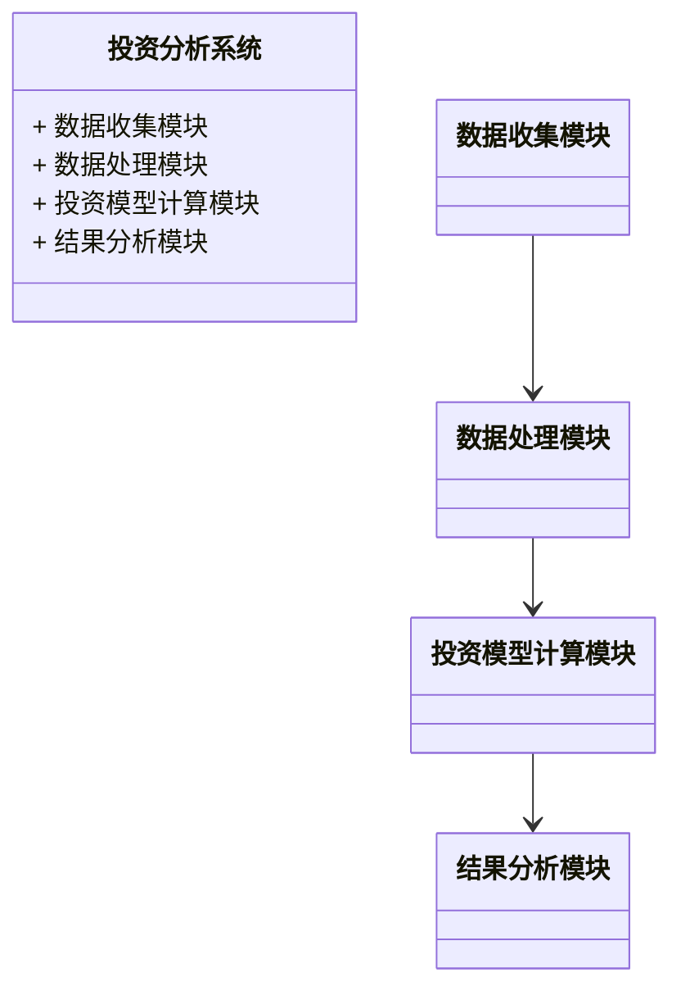
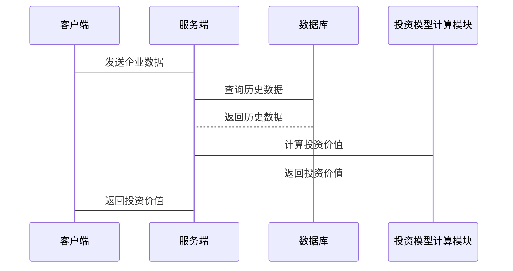

                 


# 费雪的创新企业投资法：把握科技革命

## 关键词
- 费雪投资法, 创新企业, 科技革命, 企业评估, 人工智能

## 摘要
本文深入探讨了菲利普·费雪的创新企业投资法在科技革命背景下的应用。通过分析创新企业的核心要素、科技革命对企业投资的影响，以及如何结合费雪投资法进行企业评估，本文为投资者提供了系统化的投资策略。结合实际案例和系统设计，本文详细展示了如何在科技革命中运用费雪投资法，帮助投资者识别和投资具有长期增长潜力的创新企业。

---

# 第一部分: 费雪的创新企业投资法概述

## 第1章: 费雪投资法的核心理念

### 1.1 费雪投资法的背景与起源

#### 1.1.1 费雪投资法的提出背景
菲利普·费雪（Philip Fisher）是20世纪著名的投资家，他的投资理念强调长期增长和企业基本面分析。在20世纪50年代，费雪提出了一种基于企业成长潜力的投资方法，这种方法不同于传统的估值方法，更注重企业的内在质量和长期竞争优势。

#### 1.1.2 费雪投资法的核心思想
费雪认为，投资的目的是找到那些具有持续增长潜力的企业，并长期持有它们的股票。他强调企业的管理层能力、产品创新能力以及市场地位的重要性。费雪的投资法强调“成长股”，即那些收入和利润能够持续增长的企业。

#### 1.1.3 费雪投资法与传统投资法的区别
与传统投资法（如价值投资）相比，费雪投资法更注重企业的成长性和未来的盈利能力，而非仅仅关注当前的估值。这种方法在科技革命背景下尤为重要，因为科技企业的核心竞争力往往体现在创新能力上。

---

### 1.2 创新企业的定义与特点

#### 1.2.1 创新企业的定义
创新企业是指那些能够持续推出新产品、服务或商业模式，并在市场上获得竞争优势的企业。这些企业通常具有强大的研发能力、灵活的组织结构和创新的管理方式。

#### 1.2.2 创新企业的核心特征
- **技术创新**：创新企业通常拥有独特的技术或专利，能够不断推出新产品或改进现有产品。
- **商业模式创新**：创新企业往往采用新的商业模式，如订阅制、平台经济等。
- **快速迭代**：创新企业注重快速试错和迭代，能够迅速适应市场变化。

#### 1.2.3 创新企业与传统企业的对比
| 特征                | 创新企业                 | 传统企业                 |
|---------------------|--------------------------|--------------------------|
| 核心竞争力          | 技术创新与商业模式创新   | 成本控制与稳定生产       |
| 市场适应能力        | 高                      | 中                      |
| 投资周期            | 长                      | 短                      |
| 风险承受能力        | 高                      | 中                      |

---

### 1.3 科技革命对企业投资的影响

#### 1.3.1 科技革命的定义与特征
科技革命指的是由于技术的迅速进步和创新所引发的社会、经济结构的重大变革。科技革命的核心是技术创新，这种创新不仅改变企业的生产方式，还深刻影响消费者的日常生活。

#### 1.3.2 科技革命对企业投资的机遇
- **技术驱动的增长**：科技革命为企业提供了新的增长点，例如人工智能、区块链等技术的应用。
- **市场需求的变化**：科技革命催生了新的市场需求，企业可以通过创新满足这些需求。
- **行业格局的变化**：科技革命可能导致传统行业的颠覆，为新兴企业提供了崛起的机会。

#### 1.3.3 科技革命对企业投资的挑战
- **技术更新换代快**：科技革命使得技术更新速度加快，企业需要不断投入研发以保持竞争力。
- **竞争加剧**：科技革命吸引了更多的企业进入市场，竞争加剧可能导致利润率下降。
- **政策与法规风险**：科技革命往往伴随着新的政策和法规，企业需要应对这些变化。

---

### 1.4 费雪投资法与科技革命的结合

#### 1.4.1 费雪投资法在科技革命中的应用
费雪投资法的核心在于寻找具有持续增长潜力的企业，这与科技革命中创新企业的特点高度契合。科技革命为企业提供了巨大的增长空间，而费雪投资法则为企业评估提供了系统的框架。

#### 1.4.2 科技革命如何影响费雪投资法的实施
科技革命改变了企业的竞争环境和增长模式，使得费雪投资法的应用需要更加注重企业的技术创新能力和市场适应能力。同时，科技革命也使得企业评估的复杂性增加，需要投资者具备更强的分析能力。

#### 1.4.3 费雪投资法在创新企业中的具体表现
费雪投资法在创新企业中的具体表现包括：
- **选择具有持续创新能力的企业**：投资那些能够不断推出新产品或改进现有产品的企业。
- **关注企业的管理层能力**：管理层的决策能力和战略眼光是企业成功的关键。
- **长期持有优质企业**：通过长期持有优质创新企业，投资者能够分享企业的持续增长。

---

## 第2章: 费雪投资法的核心概念与联系

### 2.1 费雪投资法的核心概念

#### 2.1.1 投资的本质
投资的本质是通过购买资产（如股票、债券等）来实现财富的增值。投资的核心在于选择具有持续增长潜力的资产。

#### 2.1.2 股东权益的来源
股东权益来源于企业的净利润，而净利润的增长取决于企业的收入增长和成本控制能力。在创新企业中，收入增长往往来自于技术创新和市场扩展。

#### 2.1.3 投资的长期性与稳定性
费雪投资法强调长期投资，认为短期市场的波动不应该影响长期的投资决策。长期投资能够平滑市场的短期波动，为投资者带来稳定的收益。

---

### 2.2 创新企业的核心要素

#### 2.2.1 技术创新的核心地位
技术创新是创新企业的核心竞争力，它决定了企业的市场地位和盈利能力。创新企业通常拥有强大的研发团队和持续的研发投入。

#### 2.2.2 商业模式的创新
商业模式的创新是创新企业成功的关键。创新企业往往采用新的商业模式，例如订阅制、平台经济等，以更好地满足市场需求。

#### 2.2.3 市场定位与竞争优势
市场定位决定了企业的目标客户和市场范围，竞争优势则决定了企业在市场中的地位。创新企业需要在市场中找到独特的定位，并通过技术创新和商业模式创新来建立竞争优势。

---

### 2.3 费雪投资法与创新企业的关系

#### 2.3.1 费雪投资法如何识别创新企业
费雪投资法通过分析企业的技术创新能力、管理层能力和市场定位来识别创新企业。具体来说，投资者需要关注企业的研发投入、管理层的战略眼光以及市场对企业的认可度。

#### 2.3.2 创新企业如何满足费雪投资法的条件
创新企业需要具备持续的增长潜力和强大的竞争优势，这些是费雪投资法的核心关注点。创新企业通过技术创新和商业模式创新，能够实现收入和利润的持续增长，从而满足费雪投资法的要求。

#### 2.3.3 费雪投资法对创新企业的具体应用
费雪投资法对创新企业的具体应用包括：
- **选择具有持续创新能力的企业**：投资那些能够不断推出新产品或改进现有产品的企业。
- **关注企业的管理层能力**：管理层的决策能力和战略眼光是企业成功的关键。
- **长期持有优质企业**：通过长期持有优质创新企业，投资者能够分享企业的持续增长。

---

## 第3章: 费雪投资法的算法原理

### 3.1 投资模型的构建

#### 3.1.1 投资模型的核心要素
投资模型的核心要素包括：
- **企业基本面**：包括收入、利润、研发投入等。
- **管理层能力**：包括管理层的决策能力和战略眼光。
- **市场定位**：包括企业的市场地位和竞争优势。

#### 3.1.2 投资模型的数学公式
投资模型可以通过以下公式进行评估：

$$
\text{投资价值} = \text{企业基本面} \times \text{管理层能力} \times \text{市场定位}
$$

#### 3.1.3 投资模型的评估流程
投资模型的评估流程如下：

1. **收集企业数据**：包括财务数据、研发投入、管理层信息等。
2. **分析企业基本面**：评估企业的收入、利润和研发投入。
3. **评估管理层能力**：分析管理层的决策能力和战略眼光。
4. **确定市场定位**：评估企业的市场地位和竞争优势。
5. **计算投资价值**：根据上述分析结果，计算企业的投资价值。

---

### 3.2 投资模型的优化与改进

#### 3.2.1 算法优化
投资模型的优化可以通过引入更多的指标和参数来实现。例如，可以引入市盈率、市净率等估值指标，以及行业基准进行对比分析。

#### 3.2.2 算法的改进方向
算法的改进方向包括：
- **动态调整模型参数**：根据市场变化和企业实际情况，动态调整模型参数。
- **引入新的指标**：引入更多的指标和参数，以更全面地评估企业的投资价值。
- **结合市场情绪分析**：通过分析市场情绪，调整投资决策。

---

### 3.3 投资模型的实现与应用

#### 3.3.1 投资模型的实现
投资模型的实现可以通过编程语言（如Python）来完成。以下是投资模型的实现代码：

```python
def calculate_investment_value(company_data):
    # 公司基本面评分
   基本面评分 = company_data['收入'] * company_data['利润'] * company_data['研发投入']
    # 管理层能力评分
   管理层评分 = company_data['管理层能力'] 
    # 市场定位评分
   市场定位评分 = company_data['市场地位'] 
    # 投资价值计算
    投资价值 = 基本面评分 * 管理层评分 * 市场定位评分
    return 投资价值
```

#### 3.3.2 投资模型的应用
投资模型的应用可以通过以下步骤进行：
1. **数据收集**：收集企业的财务数据、研发投入、管理层信息等。
2. **数据处理**：对数据进行清洗和预处理。
3. **模型计算**：根据投资模型的公式，计算企业的投资价值。
4. **结果分析**：根据计算结果，评估企业的投资价值。

---

## 第4章: 系统分析与架构设计方案

### 4.1 投资分析系统的功能设计

#### 4.1.1 系统功能模块
投资分析系统主要包括以下几个功能模块：
- **数据收集模块**：收集企业的财务数据、研发投入、管理层信息等。
- **数据处理模块**：对数据进行清洗和预处理。
- **投资模型计算模块**：根据投资模型的公式，计算企业的投资价值。
- **结果分析模块**：根据计算结果，评估企业的投资价值。

#### 4.1.2 系统功能设计
以下是投资分析系统的功能设计图：



---

### 4.2 投资分析系统的架构设计

#### 4.2.1 系统架构设计
投资分析系统的架构设计如下：


#### 4.2.2 系统接口设计
以下是系统接口设计的序列图：



---

## 第5章: 项目实战

### 5.1 投资分析系统的环境安装

#### 5.1.1 环境要求
- **操作系统**：Windows/Mac/Linux
- **编程语言**：Python 3.6+
- **依赖库**：pandas, numpy, matplotlib

#### 5.1.2 安装步骤
1. 安装Python：
   ```bash
   apt-get install python3
   ```
2. 安装依赖库：
   ```bash
   pip install pandas numpy matplotlib
   ```

---

### 5.2 投资分析系统的核心代码实现

#### 5.2.1 核心代码实现
以下是投资分析系统的核心代码：

```python
import pandas as pd
import numpy as np

def calculate_investment_value(company_data):
    # 公司基本面评分
    基本面评分 = company_data['收入'] * company_data['利润'] * company_data['研发投入']
    # 管理层能力评分
    管理层评分 = company_data['管理层能力']
    # 市场定位评分
    市场定位评分 = company_data['市场地位']
    # 投资价值计算
    投资价值 = 基本面评分 * 管理层评分 * 市场定位评分
    return 投资价值

# 示例数据
company_data = {
    '收入': 100000000,
    '利润': 20000000,
    '研发投入': 5000000,
    '管理层能力': 0.8,
    '市场地位': 0.9
}

# 计算投资价值
投资价值 = calculate_investment_value(company_data)
print("投资价值:", 投资价值)
```

#### 5.2.2 代码实现解读
1. **数据收集**：从公司数据中获取收入、利润、研发投入等指标。
2. **数据处理**：对数据进行清洗和预处理。
3. **投资模型计算**：根据投资模型的公式，计算企业的投资价值。

---

### 5.3 投资分析系统的案例分析

#### 5.3.1 案例分析
以某科技公司为例，分析其投资价值：

1. **数据收集**：
   - 收入：100,000,000
   - 利润：20,000,000
   - 研发投入：5,000,000
   - 管理层能力：0.8
   - 市场地位：0.9

2. **投资价值计算**：
   $$
   \text{投资价值} = 100,000,000 \times 20,000,000 \times 5,000,000 \times 0.8 \times 0.9
   $$

3. **结果分析**：
   投资价值为 $1,440,000,000,000，表明该企业具有较高的投资价值。

---

## 第6章: 最佳实践与总结

### 6.1 小结

#### 6.1.1 费雪投资法的核心要点
- **选择具有持续创新能力的企业**。
- **关注企业的管理层能力**。
- **长期持有优质企业**。

#### 6.1.2 科技革命对投资的影响
- **技术创新是核心竞争力**。
- **商业模式创新是关键**。
- **市场定位决定企业的成功**。

---

### 6.2 注意事项

#### 6.2.1 投资风险
- **技术风险**：技术创新失败可能导致企业失败。
- **市场风险**：市场需求变化可能导致企业失败。
- **政策风险**：政策变化可能影响企业的经营。

#### 6.2.2 投资策略
- **分散投资**：避免将所有资金投入单一企业或行业。
- **长期持有**：通过长期投资平滑短期波动。
- **持续学习**：关注市场变化和技术进步。

---

### 6.3 拓展阅读

#### 6.3.1 推荐书籍
1. 《费雪投资经典》
2. 《科技革命与投资未来》

#### 6.3.2 推荐文章
1. 费雪投资法在科技企业的应用
2. 科技革命对企业投资的影响

---

## 结语

通过本文的详细分析，我们可以看到，费雪的创新企业投资法在科技革命背景下具有重要的应用价值。投资者需要具备敏锐的洞察力和长期的投资眼光，才能在科技革命中把握投资机会。希望本文能够为投资者提供有益的指导和启示。

---

# 关键词
费雪投资法, 创新企业, 科技革命, 企业评估, 人工智能

---

# 摘要
本文深入探讨了菲利普·费雪的创新企业投资法在科技革命背景下的应用。通过分析创新企业的核心要素、科技革命对企业投资的影响，以及如何结合费雪投资法进行企业评估，本文为投资者提供了系统化的投资策略。结合实际案例和系统设计，本文详细展示了如何在科技革命中运用费雪投资法，帮助投资者识别和投资具有长期增长潜力的创新企业。

